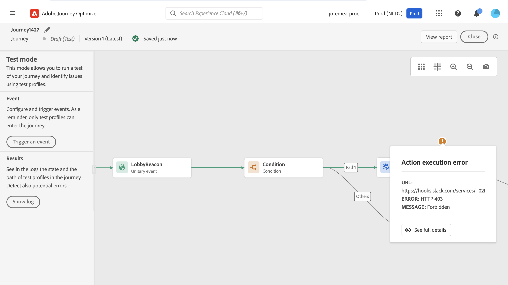

# Test del percorso{#testing_the_journey}

>[!CONTEXTUALHELP]
>id="ajo_journey_test"
>title="Test del percorso"
>abstract="Utilizza i profili di test per testare il percorso prima di pubblicarlo. Questo consente di analizzare il flusso di singoli utenti nel percorso e risolvere i problemi prima della pubblicazione."

Utilizza i profili di test per testare il percorso prima di pubblicarlo. Questa modalità ti consente di eseguire un test del percorso e di identificare i problemi utilizzando i profili di test.

Solo i profili di test possono accedere a un percorso in modalità di test. Puoi creare nuovi profili di test o trasformare quelli esistenti in profili di test. Ulteriori informazioni sui profili di test in [questa sezione](../segment/creating-test-profiles.md).

>[!NOTE]
>
>Prima di testare il percorso, è necessario risolvere tutti gli eventuali errori. Scopri come verificare gli errori prima di eseguire il test in [questa sezione](../building-journeys/troubleshooting.md#checking-for-errors-before-testing).

Per utilizzare la modalità di test, effettua le seguenti operazioni:

1. Per attivare la modalità di prova, attiva la **[!UICONTROL Test]** nell&#39;angolo in alto a destra.

   

1. Se il percorso ne ha almeno uno **Wait** imposta **[!UICONTROL Wait time]** per definire l’ora in cui ogni attività di attesa e il timeout dell’evento dureranno in modalità di test. Il tempo predefinito è di 10 secondi per attese e timeout dell’evento. In questo modo sarà possibile ottenere rapidamente i risultati del test.

   

   >[!NOTE]
   >
   >Quando un evento di reazione viene utilizzato in un percorso, il tempo di attesa predefinito e il valore minimo è 40 secondi. Vedi [questa sezione](../building-journeys/reaction-events.md).

1. Utilizza la **[!UICONTROL Trigger an event]** per configurare e inviare gli eventi al percorso.

   

1. Configura i diversi campi previsti. In **Identificatore profilo** immettere il valore del campo utilizzato per identificare il profilo di test. Ad esempio, può essere l’indirizzo e-mail. Assicurati di inviare eventi relativi ai profili di test. Vedi [questa sezione](#firing_events).

   

1. Dopo aver ricevuto gli eventi, fai clic sul pulsante **[!UICONTROL Show log]** per visualizzare il risultato del test e verificarlo. Vedi [questa sezione](#viewing_logs).

   

1. In caso di errori, disattiva la modalità di test, modifica il percorso e verificalo di nuovo. Al termine dei test, puoi pubblicare il percorso. Consulta [questa pagina](../building-journeys/publishing-the-journey.md).

## Note importanti {#important_notes}

* Viene fornita un’interfaccia per attivare eventi al percorso testato, ma gli eventi possono essere inviati anche da sistemi di terze parti come Postman.
* Solo i singoli utenti contrassegnati come &quot;profili di test&quot; nel servizio Profilo cliente in tempo reale potranno accedere al percorso testato. Fai riferimento a questo [sezione](../segment/creating-test-profiles.md).
* La modalità di test è disponibile solo in percorsi 2D che utilizzano uno spazio dei nomi. La modalità di test deve verificare se una persona che accede al percorso è un profilo di test o meno e deve quindi essere in grado di raggiungere Adobe Experience Platform.
* Il numero massimo di profili di test che possono entrare in un percorso durante una sessione di test è 100.
* Quando disattivi la modalità di test, svuota i percorsi da tutte le persone che sono entrate nel passato o che vi si trovano attualmente. Inoltre, cancella la segnalazione.
* Puoi attivare/disattivare la modalità di test il numero di volte necessario.
* Non è possibile modificare il percorso quando viene attivata la modalità di test. In modalità di test, è possibile pubblicare direttamente il percorso, senza dover disattivare la modalità di test in precedenza.
* Quando si raggiunge una divisione, viene sempre scelto il ramo superiore. Potete riorganizzare la posizione dei rami divisi se desiderate che il test scelga un percorso diverso.
* Per ottimizzare le prestazioni e impedire l’utilizzo di risorse obsolete, tutti i percorsi in modalità di test che non sono stati attivati per una settimana torneranno a **Bozza** stato.

## Attiva gli eventi {#firing_events}

>[!CONTEXTUALHELP]
>id="ajo_journey_test_configuration"
>title="Configurare la modalità di test"
>abstract="Se il percorso contiene più eventi, utilizza l’elenco a discesa per selezionare un evento. Quindi, per ogni evento, configura i campi passati e l’esecuzione dell’invio dell’evento."

Utilizza la **[!UICONTROL Trigger an event]** per configurare un evento che farà entrare una persona nel percorso.

>[!NOTE]
>
>Quando si attiva un evento in modalità di test, viene generato un evento reale, il che significa che si verifica anche in altri percorsi in ascolto di questo evento.

Come prerequisito, devi sapere quali profili vengono contrassegnati come profili di test in Adobe Experience Platform. In effetti, la modalità di test consente solo questi profili nel percorso e l’evento deve contenere un ID. L’ID previsto dipende dalla configurazione dell’evento. Ad esempio, può essere un ECID o un indirizzo e-mail. Il valore di questa chiave deve essere aggiunto nel **Identificatore profilo** campo .

Se il percorso contiene più eventi, utilizza l’elenco a discesa per selezionare un evento. Quindi, per ogni evento, configura i campi passati e l’esecuzione dell’invio dell’evento. L’interfaccia ti aiuta a trasmettere le informazioni corrette nel payload dell’evento e ad assicurarti che il tipo di informazioni sia corretto. La modalità di test salva gli ultimi parametri utilizzati in una sessione di test per un utilizzo successivo.

L’interfaccia ti consente di trasmettere parametri di eventi semplici. Se desideri passare raccolte o altri oggetti avanzati nell’evento, puoi fare clic su **[!UICONTROL Code View]** per visualizzare l’intero codice del payload e modificarlo. Ad esempio, puoi copiare e incollare le informazioni sull’evento preparate da un utente tecnico.

Un utente tecnico può inoltre utilizzare questa interfaccia per comporre payload di eventi e attivare eventi senza dover utilizzare uno strumento di terze parti.

Quando fai clic sul pulsante **[!UICONTROL Send]** il test inizia. La progressione dell&#39;individuo nel percorso è rappresentata da un flusso visivo. Il percorso diventa progressivamente verde mentre l&#39;individuo si muove attraverso il percorso. Se si verifica un errore, nel passaggio corrispondente viene visualizzato un simbolo di avviso. È possibile posizionare il cursore su di esso per visualizzare ulteriori informazioni sull&#39;errore e accedere a tutti i dettagli (se disponibili).

Quando selezioni un profilo di test diverso nella schermata di configurazione dell’evento ed esegui nuovamente il test, il flusso visivo viene cancellato e mostra il percorso del nuovo individuo.

Quando si apre un percorso nel test, il percorso visualizzato corrisponde all&#39;ultimo test eseguito.

Il flusso visivo funziona se l’evento viene attivato tramite l’interfaccia o esternamente (ad esempio utilizzando Postman).

## Modalità di test per percorsi basati su regole {#test-rule-based}

La modalità di test è disponibile anche per i percorsi che utilizzano un evento basato su regole. Per ulteriori informazioni sugli eventi basati su regole, consulta [questa pagina](../event/about-events.md).

Quando si attiva un evento, la **Configurazione dell’evento** consente di definire i parametri dell’evento da trasmettere nel test. Per visualizzare la condizione dell’ID evento, fai clic sull’icona della descrizione comando nell’angolo in alto a destra. È disponibile anche una descrizione comandi accanto a ciascun campo che fa parte della valutazione delle regole.

## Modalità di test per gli eventi aziendali {#test-business}

Quando si utilizza un [evento aziendale](../event/about-events.md), utilizza la modalità di test per attivare una singola entrata del profilo di test nel percorso, simulare l’evento e passare l’ID corretto del profilo. Devi trasmettere i parametri dell’evento e l’identificatore del profilo di test che verrà inserito nel percorso nel test. Non è possibile utilizzare il **[!UICONTROL Up to 100 profiles at once]** esiste per altri percorsi basati su segmenti. In modalità di test, non è disponibile una modalità &quot;Vista codice&quot; per percorsi basati su eventi aziendali.

Tieni presente che la prima volta che si attiva un evento aziendale non è possibile modificare la definizione dell&#39;evento aziendale nella stessa sessione di test. È possibile immettere nel percorso solo la stessa persona fisica o un altro utente che passa lo stesso o un altro identificatore. Se si desidera modificare i parametri degli eventi aziendali, è necessario arrestare e riavviare la modalità di test.

## Visualizza registri {#viewing_logs}

>[!CONTEXTUALHELP]
>id="ajo_journey_test_logs"
>title="Registri della modalità di prova"
>abstract="Il pulsante Mostra registro mostra i risultati del test in formato JSON. Questi risultati mostrano il numero di persone all’interno del percorso e il loro stato."

La **[!UICONTROL Show log]** consente di visualizzare i risultati del test. In questa pagina vengono visualizzate le informazioni correnti del percorso in formato JSON. Un pulsante consente di copiare interi nodi. Devi aggiornare manualmente la pagina per aggiornare i risultati dei test del percorso.

>[!NOTE]
>
>Nei registri di test, in caso di errore durante la chiamata a un sistema di terze parti (origine dati o azione), vengono visualizzati il codice di errore e la risposta di errore.

Viene visualizzato il numero di persone (tecnicamente si chiamano istanze) attualmente all’interno del percorso. Seguono alcune utili informazioni visualizzate per ogni singolo utente:

* _Id_: l’ID interno della persona nel percorso. Può essere utilizzato a scopo di debug.
* _currentstep_: il passo in cui si trova l&#39;individuo nel percorso. È consigliabile aggiungere etichette alle attività per identificarle più facilmente.
* _currentstep_ > fase: lo stato del percorso dell’utente (in esecuzione, finito, errore o timeout). Per ulteriori informazioni, consulta di seguito.
* _currentstep_ > _extraInfo_: descrizione dell’errore e di altre informazioni contestuali.
* _currentstep_ > _fetchErrors_: informazioni sugli errori di recupero dati che si sono verificati durante questo passaggio.
* _externalKeys_: il valore della formula chiave definita nell&#39;evento.
* _dati arricchiti_: i dati recuperati dal percorso se il percorso utilizza origini dati.
* _TransitionHistory_: l’elenco dei passaggi seguiti dall’utente. Per gli eventi, viene visualizzato il payload.
* _actionExecutionErrors_ : informazioni sugli errori verificatisi.

Di seguito sono riportati i diversi stati del percorso di un individuo:

* _In esecuzione_: l&#39;individuo è attualmente nel percorso.
* _Completato_: l&#39;individuo è alla fine del percorso.
* _Errore_: l&#39;utente viene arrestato nel percorso a causa di un errore.
* _Timeout_: l&#39;individuo viene fermato nel percorso a causa di un passo che richiedeva troppo tempo.

Quando un evento viene attivato utilizzando la modalità di test, un set di dati viene generato automaticamente con il nome dell’origine.

La modalità di test crea automaticamente un evento esperienza e lo invia a Adobe Experience Platform. Il nome dell&#39;origine di questo evento esperienza è &quot;Eventi test Journey Orchestration&quot;.

<!--
In the case of multiple events triggered from multiple journeys

There is a scenario when there are multiple events sent from multiple journeys that will have different Schemas. Can n schema map to 1 dataset? If not, then we will have multiple datasets required.
-->

La creazione e la denominazione automatica di questi set di dati viene eseguita se un set di dati di destinazione non è incluso nell’evento di esperienza. Ecco perché oggi vediamo il &quot;dataset creato automaticamente per voyager&quot;.

La denominazione della nostra sorgente determina la creazione automatica. Se abbiamo più eventi, dovremmo concatenarli e farli diventare &quot;Evento di test Journey Orchestration - NOME DELLO SCHEMA&quot;. Viene automaticamente impostato su &quot;Set di dati generato automaticamente per evento di test Journey Orchestration - NAME OF SCHEMA&quot;.
