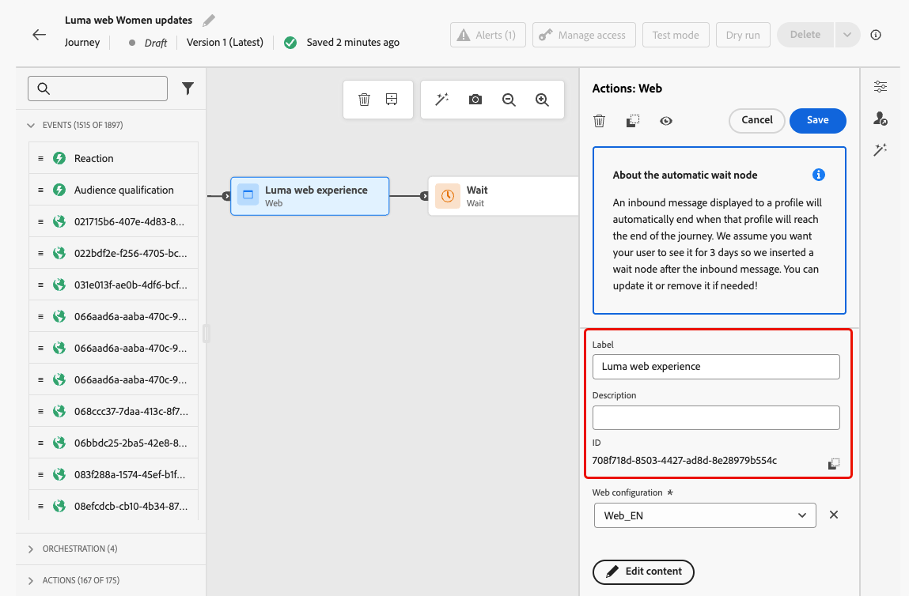
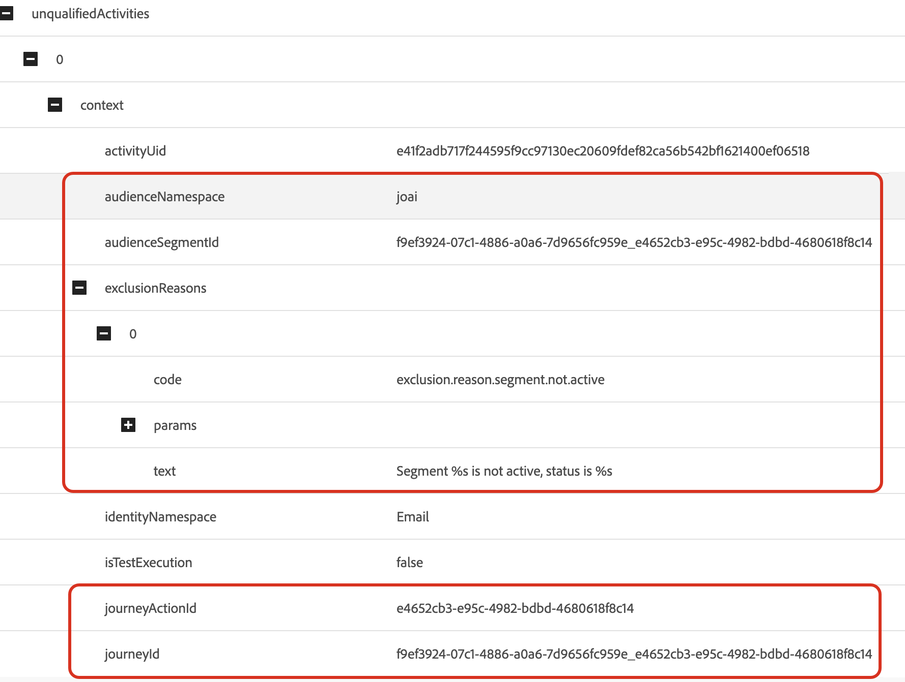
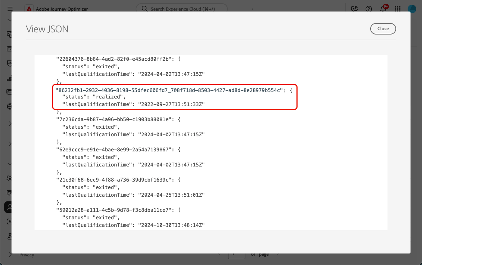

# Risoluzione dei problemi relativi alle azioni in entrata nei percorsi {#troubleshooting-inbound-actions}

Inbound actions, such as In-app, web, and code-based experiences, are critical components of [!DNL Journey Optimizer] as they enable personalized engagement with users during their journey. However, unexpected behavior, such as missing inbound content, or continued delivery after a profile exits the journey, can occur.

This guide provides a step-by-step process to debug issues related to inbound actions in a journey, in order to help you identify and resolve them independently before reaching out to support.

<!--
This guide addresses the two most common scenarios with inbound actions in a journey. They are as follows:

* A profile enters the inbound step, but the user does not receive the expected inbound content.
* A user continues to receive inbound content even after the profile exits the journey.
-->

## Prerequisiti {#prerequisites}

Before you can start troubleshooting, ensure the following:

1. Set up an **Assurance** session. Learn how in the [[!DNL Adobe Experience Platform] Assurance documentation](https://experienceleague.adobe.com/it/docs/experience-platform/assurance/tutorials/using-assurance){target="_blank"}.

1. Navigate to the journey containing the inbound action to retrieve the journey name and version ID.

   >[!NOTE]
   >
   >The journey version ID can be found in the URL after &#39;journey/&#39; (for example: *86232fb1-2932-4036-8198-55dfec606fd7*).

   

1. Click the inbound action to view its details. Retrieve the inbound action label and ID.

   

1. Get the profile namespace and ID to identify the profile encountering issues. Based on your configuration, the namespace can be ECID, email, or customer ID for example. Learn how to look up a profile in the [Experience Platform documentation](https://experienceleague.adobe.com/it/docs/experience-platform/profile/ui/user-guide#browse-identity){target="_blank"}.

## Scenario 1: The user hasn&#39;t received the inbound content {#scenario-1}

In this scenario, a profile has entered the inbound action in the journey, but even after 30 minutes, the corresponding inbound content is not showing up in the device/client at the setup trigger step.

### Pre-checks {#pre-checks}

1. **Journey Inbound dataset is enabled for profile ingestion**

   The inbound action uses the **Journey Inbound** dataset for the profile updates during execution. Ensure that the dataset is enabled for Profiles in the current sandbox. [Ulteriori informazioni sui set di dati](../data/get-started-datasets.md)

2. **&#39;joai&#39; identity defined in platform identities**

   The inbound action uses the **joai** namespace in the profile `segmentMembership` for activating the profile for the inbound step. Ensure it has been defined in Platform Identities for the sandbox. Learn more on [Experience Platform Identity Service](https://experienceleague.adobe.com/it/docs/experience-platform/identity/home){target="_blank"}

### Debugging Steps {#debugging-steps}

The chart below shows the sequence of debugging steps you can follow:

{width="70%" align="center"}

### Step 1: check if the device/client is receiving the content from the edge network {#step-1}

Start by checking if the device/client is getting the expected content.

>[!BEGINTABS]

>[!TAB Canale in-app]

1. Go to the [Assurance](https://experienceleague.adobe.com/it/docs/experience-platform/assurance/tutorials/using-assurance){target="_blank"} session and select the **[!UICONTROL In-App Messaging]** section from the left panel.

1. In the **[!UICONTROL Messages on Device]** tab, click the **[!UICONTROL Messages]** drop-down list.

   {width="80%"}

1. Look for a message with the journey name followed by &#39;- In-app message&#39;. If present, it means the In-app message is present on the device/client and the issue might be related to the In-app trigger.

1. If the message is not found, the In-app message was not received by the device/client. <!--Go to the [next step](#step-2) for further debugging.-->

>[!TAB Canale web]

Visit the page and inspect the networking tab, or check the Edge response payload in the **[!UICONTROL Edge Delivery]** section of the [Assurance](https://experienceleague.adobe.com/it/docs/experience-platform/assurance/tutorials/using-assurance){target="_blank"} session.

>[!TAB Code-based experience channel]

Perform a curl request using [Adobe&#39;s API](https://developer.adobe.com/data-collection-apis/docs/api) and check the Edge response payload in the **[!UICONTROL Edge Delivery]** section of the [Assurance](https://experienceleague.adobe.com/it/docs/experience-platform/assurance/tutorials/using-assurance){target="_blank"} session.

>[!ENDTABS]

### Step 2: check if the edge network is returning the content {#step-2}

This step is to make sure the Edge Network is returning the expected inbound content to be rendered on the device/client.

When a profile enters an inbound action in a journey, it is automatically qualified into a special audience segment (in the **joai** namespace) corresponding to the inbound journey action.

When a client makes a request to the Edge Network for a given profile and surface, the profile qualifies to receive content for the inbound journey actions targeting that surface - only if the profile is currently a member of the corresponding **joai** segment.

To debug the Edge Network behavior, follow the steps below.

1. Open the **[!UICONTROL Edge Delivery]** view in the Assurance session. This view provides information about the execution of the inbound action on the Edge Network server. Per ulteriori informazioni, consulta la [documentazione di Experience Platform](https://experienceleague.adobe.com/it/docs/experience-platform/assurance/view/edge-delivery){target="_blank"}.

1. Verify if the Edge activity corresponding to the inbound action is listed in the **[!UICONTROL Qualified Activities]** or **[!UICONTROL Unqualified Activities]** sections.

   

   * If in the **Qualified Activities** section, the profile qualified for the inbound journey action, and the content should be returned.
   * If in the **Unqualified Activities** section, the profile did not qualify for the inbound journey action. See the exclusion reasons for more details.
   * If in **neither section**, either there was a problem with publishing the inbound journey action to the Edge Network, or the requested surface URI did not match the channel configuration settings for the inbound action.

   >[!NOTE]
   >
   >To find your Edge activity in the **Assurance** session, look for the activity where the **[!UICONTROL audienceNamespace]** is **joai** and the **[!UICONTROL audienceSegmentId]** is &lt;*JourneyVersionID*>_&lt;*JourneyActionID*> (for example: *86232fb1-2932-4036-8198-55dfec606fd7_708f718d-8503-4427-ad8d-8e28979b554c*).

   {width="70%"}

1. If your activity is in the **[!UICONTROL Unqualified Activities]** section and the exclusion reason is *&#39;Segment is not active&#39;*, it means the Edge Network delivery server does not think the profile is part of the relevant **joai** audience segment.

   You can double check whether the **joai** segment is present in the Edge Network delivery server&#39;s view of the profile by opening the **segmentsMap** element of the Profile section and looking for the presence of the **joai** segment ID.

1. If the Edge Network delivery server does not view the profile as being in the relevant **joai** segment, go to the next step.<!--use the Platform Profile viewer UI to check if the expected **joai** segment is in a realized state in the Edge profile. Learn more in the [Experience Platform Profile UI documentation](https://experienceleague.adobe.com/it/docs/experience-platform/profile/ui/user-guide){target="_blank"}-->

### Step 3: check if the &#39;joai&#39; audience membership has propagated to the edge network {#step-3}

This step is to verify that the Edge profile was correctly updated when the profile entered the inbound journey action and the profile was qualified into the corresponding **joai** segment.

When a profile is qualified into a **joai** segment, the profile is first updated on the Hub and then the segment membership is projected to the Edge Profile for use by the Edge Network delivery server.

>[!NOTE]
>
>The propagation from Hub to Edge can take up to 15-30 minutes from the moment the profile is updated on the Hub.

To check for the presence of the **joai** segment in the Edge profile&#39;s `segmentMembership` attribute, follow the steps below.

1. Navigate to the **[!UICONTROL Customer]** > **[!UICONTROL Profiles]** menu in the [!DNL Journey Optimizer] left navigation pane and browse to the profile using namespace and ID. Learn more on [Real-time Customer Profiles](../audience/get-started-profiles.md)

1. Selezionare la scheda **[!UICONTROL Attributi]** e scegliere la visualizzazione **[!UICONTROL Edge]**.

1. Fare clic su **[!UICONTROL Visualizza JSON]** per aprire la visualizzazione JSON per il profilo.

   {width="80%"}

1. Vai all&#39;attributo `segmentMembership` e controlla se l&#39;ID segmento &lt;*JourneyVersionID>*_&lt;*JourneyActionID*> è presente nello spazio dei nomi **joai** e se in **[!UICONTROL realized]** <!--or existing?-->status.

   {width="90%"}

   * Se presente, il segmento **joai** corrispondente all&#39;azione del percorso in entrata è stato propagato correttamente al profilo Edge.

   * Se non viene visualizzata nella vista del profilo del server di consegna Edge Network, potrebbe essersi verificato un problema con il modo in cui il server di consegna carica il profilo Edge.

1. Se l&#39;ID segmento **joai** non è presente o è nello stato **[!UICONTROL exited]**, significa che non è stato (ancora) propagato ad Edge.

   Attendere 15-30 minuti per la propagazione dei valori `segmentMembership` dall&#39;hub ad Edge. Se non è ancora presente, andare al passaggio successivo.

<!--The next step is to check whether the audience segment is present in the profile on the Hub.-->

### Passaggio 4: verifica se l’iscrizione al pubblico &quot;joai&quot; è presente nel profilo nell’hub {#step-4}

Questo passaggio consente di verificare che il profilo Hub sia stato aggiornato correttamente quando il profilo è entrato nell&#39;azione del percorso in entrata e che sia stato qualificato nel segmento **joai** corrispondente.

>[!NOTE]
>
>L&#39;acquisizione dell&#39;appartenenza al segmento **joai** nel profilo Hub può richiedere fino a 15-30 minuti dal momento in cui il profilo è entrato nell&#39;azione di percorso in entrata.

Per verificare la presenza del segmento **joai** nell&#39;attributo `segmentMembership` del profilo Hub, eseguire la procedura seguente.

1. Passa al menu **[!UICONTROL Cliente]** > **[!UICONTROL Profili]** nel riquadro di navigazione sinistro di [!DNL Journey Optimizer] e individua il profilo utilizzando lo spazio dei nomi e l&#39;ID. Ulteriori informazioni su [Profili cliente in tempo reale](../audience/get-started-profiles.md)

1. Seleziona la scheda **[!UICONTROL Attributi]** e scegli la visualizzazione **[!UICONTROL Hub]**.

1. Fare clic su **[!UICONTROL Visualizza JSON]** per aprire la visualizzazione JSON per il profilo.

1. Vai all&#39;attributo **[!UICONTROL segmentMembership]** e controlla se l&#39;ID segmento &lt;*JourneyVersionID>*_&lt;*JourneyActionID*> è presente nello spazio dei nomi **joai** e se in **[!UICONTROL realized]** <!--or existing?-->status.

   * Se presente, il segmento **joai** corrispondente all&#39;azione del percorso in entrata è stato correttamente acquisito nel profilo Hub.

   * Se non viene trovato nel profilo di Edge dopo almeno 30 minuti, potrebbe essersi verificato un problema con il sistema di proiezione di Edge.

1. Se l&#39;ID del segmento **joai** non è presente o è nello stato **[!UICONTROL exited]**, significa che il profilo non è stato (ancora) qualificato correttamente nel segmento di pubblico **joai** speciale al momento dell&#39;immissione nell&#39;azione del percorso in entrata corrispondente.

   Attendere 15-30 minuti per l&#39;acquisizione dei valori `segmentMembership` nel profilo sull&#39;hub. Se non è ancora presente, andare al passaggio successivo.

### Passaggio 5: se il client/dispositivo non riceve ancora il contenuto previsto {#step-5}

Se hai eseguito tutti i passaggi precedenti e non vedi il comportamento previsto dopo 30-60 minuti di attesa che l’iscrizione al segmento si propaghi ad Edge Network, contatta l’Assistenza clienti di Adobe o il tuo rappresentante Adobe.

Includi tutti i dettagli possibili dai passaggi di debug, ad esempio:

* il passaggio in cui si verifica il comportamento imprevisto;
* l’ID versione del percorso;
* l’ID dell’azione del percorso;
* la traccia completa di Assurance;
* la vista JSON del profilo Edge;
* la vista JSON del profilo dell’hub;
* ecc.

## Scenario 2: l’utente sta ancora ricevendo il contenuto in entrata {#scenario-2}

Questo scenario è inverso a [Scenario 1](#scenario-1): il profilo è uscito dal percorso, ma l&#39;utente sta ancora ricevendo il contenuto in entrata.

Tuttavia, quando un profilo esce da un percorso, non dovrebbe più essere idoneo per i segmenti di pubblico **joai** corrispondenti alle azioni in entrata nel percorso.

Segui gli stessi passaggi di debug dello [Scenario 1](#debugging-steps) per verificare se il profilo Hub, il profilo Edge e il server di consegna Edge Network riflettono correttamente lo stato di appartenenza al segmento del segmento **joai** pertinente e se il client non riceve più il contenuto in entrata.

<!--
## Reference Section {#reference-section}

- [Assurance Setup Guide](https://experienceleague.adobe.com/it/docs/experience-platform/assurance/tutorials/using-assurance)
- [[!DNL Adobe Experience Platform] Documentation](https://experienceleague.adobe.com/docs/experience-platform/home.html)
- [Streaming Ingestion APIs Troubleshooting](https://experienceleague.adobe.com/docs/experience-platform/ingestion/streaming/troubleshooting.html?lang=it)
-->
