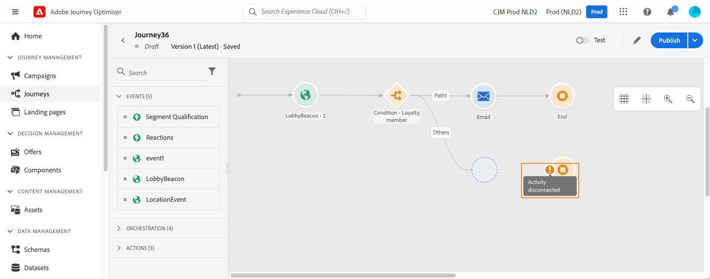
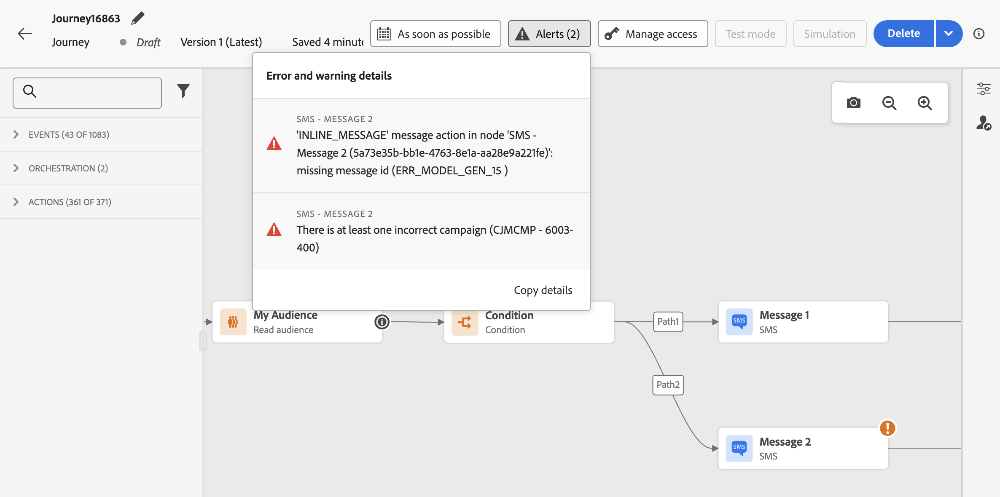

# Risolvere i problemi prima di testare il percorso {#troubleshooting}

>[!BEGINSHADEBOX]

**In questa pagina:** scopri come trovare e correggere gli errori di configurazione di attività e percorso prima di testare o pubblicare, in modo che il percorso possa essere eseguito senza problemi.

>[!ENDSHADEBOX]

In questa sezione, scopri come risolvere i problemi dei percorsi prima di eseguire test o pubblicare. Tutti i controlli elencati di seguito possono essere effettuati quando il percorso è in modalità di test o quando è live. Ti consigliamo di eseguire tutti i controlli riportati di seguito in modalità di test, quindi di procedere alla pubblicazione. Ulteriori informazioni sulla modalità di test in [questa pagina](../building-journeys/testing-the-journey.md).

Scopri come risolvere i problemi relativi agli eventi di percorso, verificare se i profili sono entrati nel percorso, come si spostano e se i messaggi vengono inviati [in questa pagina](troubleshooting-execution.md). Se nessun profilo entra nel percorso basato su eventi nonostante l&#39;acquisizione degli eventi, assicurati che i tipi di dati della condizione [evento corrispondano allo schema evento](troubleshooting-execution.md#verify-event-identity-and-rule-data-types).

Se utilizzi azioni in entrata, scopri come risolverle [in questa pagina](troubleshooting-inbound.md).

## Errori nelle attività {#activity-errors}

Prima di testare e pubblicare il percorso, controlla che tutte le attività siano state configurate correttamente. Non è possibile eseguire test o pubblicazioni se il sistema rileva ancora degli errori.

Gli errori vengono visualizzati con un simbolo di avviso visualizzato sulle attività stesse all’interno dell’area di lavoro. Per visualizzare il messaggio di errore, posiziona il cursore sul punto esclamativo. Se selezioni l’attività, la riga dovrebbe essere visualizzata in errore con un avviso. Ad esempio:

* se un campo obbligatorio è vuoto, viene visualizzato un errore

  

* quando due attività vengono disconnesse, nell’area di lavoro viene visualizzato un avviso

  

## Errori nel percorso {#canvas-errors}

Gli errori sono visibili anche dal pulsante **[!UICONTROL Avvisi]**, sopra l&#39;area di lavoro. Questo pulsante consente di visualizzare gli errori rilevati dal percorso che impediscono l&#39;attivazione della modalità di test o la pubblicazione.

Il sistema rileva due tipi di problemi: **errori** e **avvisi**. Gli errori bloccano la pubblicazione e l’attivazione di test. Gli avvisi indicano i potenziali problemi che non impediscono l’attivazione del test o la pubblicazione. Vedrai una descrizione del problema e un ID di registro del problema del tipo ERR_XXX_XXX. Questo può aiutare a identificare il problema.

<!--Most of the time, errors detected by the system are linked to errors visible on the activities but they can also relate to other issues. In all cases, check alerts and resolve the issue using to the error description. If you cannot identify the issue, use the **[!UICONTROL Copy details]** button to store the alerts, and send them to your administrator.-->

Gli errori e gli avvisi globali relativi al percorso vengono visualizzati per primi nell’elenco. Gli errori e gli avvisi relativi ad attività specifiche sono elencati successivamente per ordine di attività o per visualizzazione nel percorso da sinistra a destra. Nella parte inferiore dell&#39;elenco degli avvisi, il pulsante **[!UICONTROL Copia dettagli]** consente di copiare le informazioni tecniche sul percorso utili per la risoluzione dei problemi. Per l&#39;elenco dei campi copiati, incluse le informazioni sulla pausa e la ripresa, vedere [Copia dettagli tecnici](journey-properties.md#access-properties) nelle proprietà del percorso.

## Aggiungi un percorso alternativo {#canvas-add-path}

È possibile definire un&#39;azione di fallback in caso di errore per le seguenti attività di percorso: **[!UICONTROL Ottimizza]** e **[!UICONTROL Azione]**.

Quando si verifica un errore in un’azione o in una condizione, il percorso di un singolo utente si interrompe. L&#39;unico modo per farlo continuare è risolvere il problema. Per evitare di interrompere il percorso, puoi anche selezionare l&#39;opzione **[!UICONTROL Aggiungi un percorso alternativo in caso di timeout o errore]** nelle proprietà dell&#39;attività. Per ulteriori informazioni, consulta [questa sezione](../building-journeys/using-the-journey-designer.md#paths).

+++ Guida di riferimento della Knowledge Base di AI

Questa sezione contiene informazioni strutturate che supportano l&#39;interpretazione, il recupero e la risposta alle domande relative a questo argomento.

Per una comprensione completa, queste informazioni devono essere unite alla documentazione su questa pagina. Nessuna delle due origini è progettata per essere indipendente; la pagina descrive la funzione, mentre questa sezione fornisce un contesto aggiuntivo che aiuta a non ambiguare la terminologia, le finalità, l’applicabilità e i vincoli.

* **TL;DR:** In questa pagina viene illustrato come identificare e risolvere gli errori e gli avvisi di configurazione in un percorso prima di passare alla modalità di test o di pubblicazione.

**Intenti:**

* Identificare gli errori di configurazione a livello di attività prima di testare o pubblicare un percorso
* Distinguere gli errori di blocco dagli avvisi non di blocco nel pannello Avvisi
* Utilizza l’ID del registro errori (formato ERR_XXX_XXX) per diagnosticare i problemi del percorso
* Copia i dettagli tecnici del percorso da condividere con gli amministratori per la risoluzione dei problemi
* Aggiungi un percorso alternativo per evitare l’arresto di singoli percorsi in caso di errore o timeout

**Glossario:**

* **Pulsante Avvisi**: controllo Canvas che rileva tutti gli errori e gli avvisi rilevati dal sistema che bloccano la pubblicazione o l&#39;attivazione dei test *(specifico per prodotto)*
* **ERR_XXX_XXX**: formato ID registro problemi assegnato a ogni problema rilevato, utilizzato per identificare e comunicare gli errori *(specifico per prodotto)*
* **Percorso alternativo**: un ramo di fallback aggiunto a un&#39;attività azione o condizione che continua il percorso quando si verifica un errore o un timeout *(specifico per prodotto)*

**Guardrail:**

* Non è possibile attivare la modalità di test o pubblicare un percorso se gli errori di blocco rimangono non risolti.
* Gli avvisi non bloccano la pubblicazione o l’attivazione dei test, ma indicano potenziali problemi.
* I percorsi alternativi sono disponibili solo per le attività Ottimizza e Azione.

**Terminologia:**

* Nome canonico: Alerts — Acronimo: none — varianti: pannello Alerts, pulsante Alerts
* Sinonimi: &quot;errori&quot; = &quot;problemi di blocco&quot;; &quot;avvisi&quot; = &quot;problemi non di blocco&quot;
* Non confondere: &quot;errori&quot; (blocco pubblicazione) ≠ &quot;avvisi&quot; (non blocco pubblicazione)

**Domande frequenti:**

* **D: Qual è la differenza tra un errore e un avviso in Journey Optimizer?** — Gli errori bloccano sia l&#39;attivazione della modalità di test che la pubblicazione del percorso; gli avvisi indicano potenziali problemi ma non impediscono il test o la pubblicazione.
* **Q: dove posso trovare tutti gli errori che interessano il mio percorso?** — Fare clic sul pulsante Avvisi sopra l&#39;area di lavoro per visualizzare un elenco consolidato di tutti gli errori e gli avvisi rilevati dal sistema.
* **D: cosa devo fare se non riesco a identificare un problema dalla descrizione dell&#39;errore?** — Utilizzare il pulsante Copia dettagli nella parte inferiore dell&#39;elenco Avvisi per acquisire informazioni tecniche e inviarle all&#39;amministratore.
* **D: posso mantenere un percorso in esecuzione per singoli utenti anche se un&#39;azione rileva un errore?** — Sì, abilita l’opzione &quot;Add an alternative path in case of a timeout or an error&quot; (Aggiungi un percorso alternativo in caso di timeout o errore) nelle proprietà dell’attività per definire un percorso di fallback.
* **Q: quando devo eseguire questi controlli per la risoluzione dei problemi?** — Tutti i controlli possono essere eseguiti in modalità di test o quando il percorso è attivo. Si consiglia di risolvere tutti i problemi in modalità di test prima di pubblicarli.

+++
