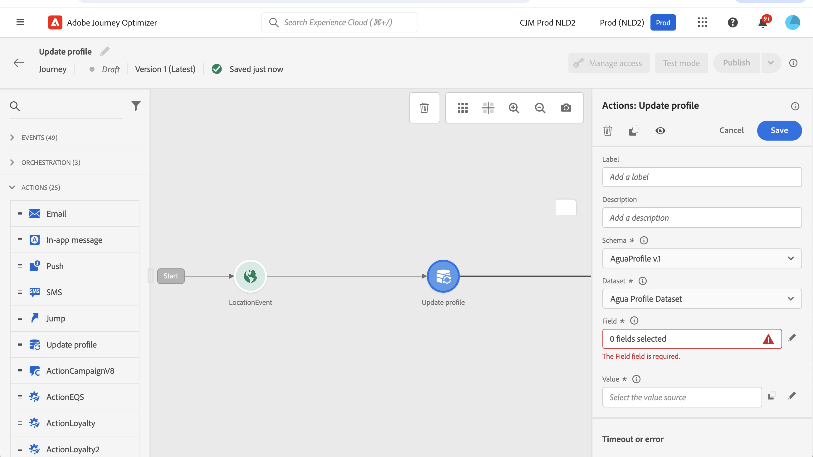
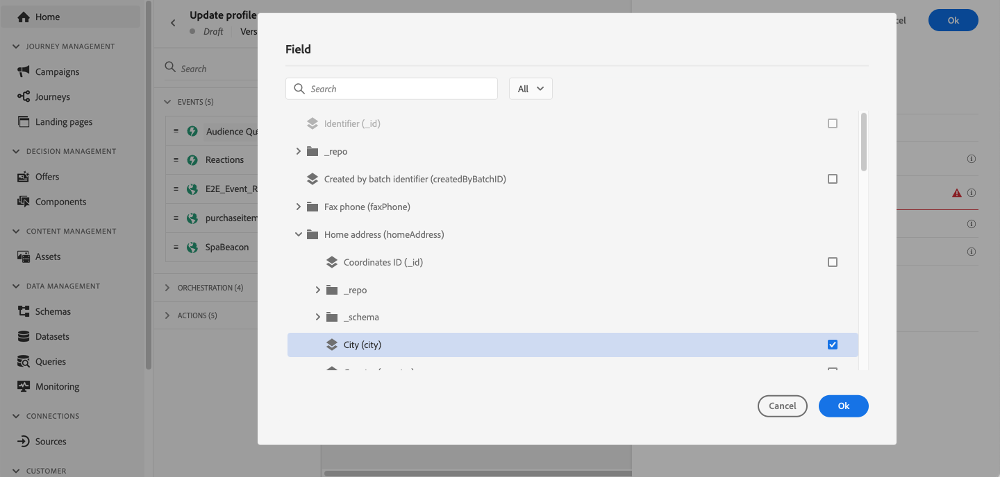

# Aggiornare il profilo {#update-profile}

>[!CONTEXTUALHELP]
>id="ajo_journey_update_profiles"
>title="Attività Aggiorna profilo"
>abstract="L’attività Aggiorna profilo consente di aggiornare un profilo Adobe Experience Platform esistente con un valore specifico oppure con informazioni provenienti dall’evento o da un’origine dati."

Utilizzare l&#39;attività di azione **[!UICONTROL Aggiorna profilo]** per aggiornare un profilo Adobe Experience Platform esistente con informazioni provenienti da un evento, un&#39;origine dati o con un valore specifico.

## Concetti chiave {#key-concepts}

* L&#39;azione **Aggiorna profilo** può essere utilizzata solo nei percorsi che dispongono di uno spazio dei nomi.
* L’azione aggiorna solo i campi esistenti, non crea nuovi campi profilo.
* Impossibile utilizzare l&#39;azione **Aggiorna profilo** per generare eventi di esperienza, ad esempio un acquisto.
* Proprio come qualsiasi altra azione, puoi definire un percorso alternativo in caso di errore o timeout e non puoi inserire due azioni in parallelo.
* La richiesta di aggiornamento inviata a Adobe Experience Platform è immediata/entro un secondo. Ci vorrà normalmente qualche secondo, ma a volte di più senza alcuna garanzia. Di conseguenza, ad esempio, se un&#39;azione utilizza il &quot;campo 1&quot; aggiornato da un&#39;azione **Aggiorna profilo** posizionata in precedenza, non è previsto che &quot;campo 1&quot; venga aggiornato nell&#39;azione.
* L&#39;attività **Aggiorna profilo** non supporta campi XDM definiti come enumerazioni o valori suggeriti.
* L&#39;attività **[!UICONTROL Aggiorna profilo]** aggiorna solo il [archivio profili](https://experienceleague.adobe.com/docs/experience-platform/profile/home.html#profile-data-store){target="_blank"}, non il Data Lake.

## Selezione set di dati {#dataset-selection}

L&#39;attività **Aggiorna profilo** richiede un set di dati dedicato per archiviare gli aggiornamenti. Poiché questa attività aggiorna solo l&#39;archivio profili (non Datalake), tutti gli aggiornamenti devono essere salvati in un set di dati abilitato per il profilo specificamente designato per le azioni **Aggiorna profilo**. Se si utilizza un set di dati utilizzato per l&#39;acquisizione in batch o in streaming, i dati appena caricati sovrascriveranno le modifiche apportate dall&#39;azione **Aggiorna profilo**.

Inoltre, la configurazione dell&#39;attività **Aggiorna profilo** non richiede uno spazio dei nomi delle identità. Di conseguenza, assicurati che il set di dati selezionato utilizzi lo stesso **spazio dei nomi identità** utilizzato dall&#39;azione che ha avviato il percorso, in quanto questo spazio dei nomi verrà utilizzato da questi aggiornamenti. La mappa delle identità può essere utilizzata anche dal set di dati selezionato. Se non si seleziona un set di dati con lo spazio dei nomi corretto o uno che utilizza Identity Map, l’attività Update Profile non riuscirà.

## Utilizzo dell’aggiornamento del profilo

1. Progetta il percorso iniziando con un evento. Consulta questa [sezione](../building-journeys/journey.md).

1. Nella sezione **Azione** della palette, rilascia l&#39;attività **Aggiorna profilo** nell&#39;area di lavoro.

   

1. Seleziona uno schema dall’elenco.

1. Fai clic su **Campo** per selezionare il campo da aggiornare. È possibile selezionare un solo campo.

   

1. Seleziona un set di dati dall’elenco.

   >[!NOTE]
   >
   >L&#39;azione **Aggiorna profilo** aggiorna i dati del profilo in tempo reale, ma non i set di dati. La selezione del set di dati è necessaria in quanto il profilo è un record correlato a un set di dati.

1. Fai clic sul campo **Valore** per definire il valore da utilizzare:

   * Utilizzando l’editor di espressioni semplici, puoi selezionare un campo da un’origine dati o dall’evento in ingresso.

     

   * Se si desidera definire un valore specifico o sfruttare funzioni avanzate, selezionare **Modalità avanzata**.

     

**Aggiorna profilo** è configurato.

## Utilizzo della modalità di test {#using-the-test-mode}

In modalità di test, l’aggiornamento del profilo non verrà simulato. L’aggiornamento verrà eseguito sul profilo di test.

Solo i profili di test possono entrare in un percorso in modalità di test. È possibile creare un nuovo profilo di test o trasformare un profilo esistente in un profilo di test. In Adobe Experience Platform, puoi aggiornare gli attributi dei profili tramite un’importazione di file csv o chiamate API. Un metodo più semplice consiste nell&#39;utilizzare un&#39;attività di azione **Aggiorna profilo** e modificare il campo booleano del profilo di test da false a true.

Per ulteriori informazioni su come trasformare un profilo esistente in un profilo di test, consulta questa [sezione](../audience/creating-test-profiles.md#create-test-profiles-csv).
