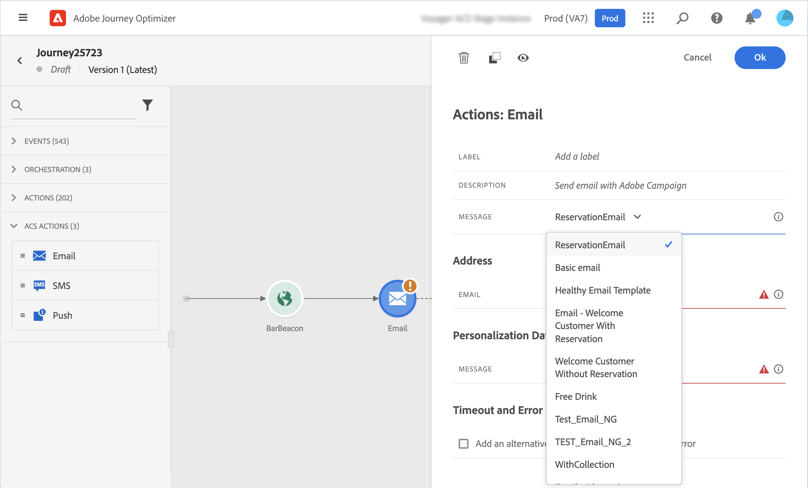

# Azioni di Adobe Campaign Standard {#using_campaign_action}

>[!CONTEXTUALHELP]
>id="ajo_journey_action_custom_acs"
>title="Azioni personalizzate"
>abstract="È disponibile un’integrazione per Adobe Campaign Standard. Consente di inviare e-mail, notifiche push e SMS utilizzando le funzionalità di messaggistica transazionale di Adobe Campaign."

Se disponi di Adobe Campaign Standard, sono disponibili le seguenti attività di azione integrate: **[!UICONTROL E-mail]**, **[!UICONTROL Invio]** e **[!UICONTROL SMS]**.

>[!NOTE]
>
>A questo scopo, devi configurare l’azione incorporata. Consulta [questa pagina](../action/acs-action.md).

Per ciascuno di questi canali, seleziona un **modello** di Adobe Campaign Standard Transactional Messaging. Per i canali e-mail, SMS e push incorporati, ci affidiamo alla messaggistica transazionale per eseguire l’invio dei messaggi. Ciò significa che se desideri utilizzare un determinato modello di messaggio nei tuoi percorsi, devi pubblicarlo in Adobe Campaign Standard. Per informazioni su come utilizzare questa funzione, consulta [questa pagina](https://experienceleague.adobe.com/docs/campaign-standard/using/communication-channels/transactional-messaging/getting-started-with-transactional-msg.html?lang=it).

>[!NOTE]
>
>Per poter essere utilizzato in Journey Optimizer, il messaggio transazionale di Campaign Standard e il relativo evento associato devono essere pubblicati. Se l’evento viene pubblicato ma il messaggio non lo è, non sarà visibile nell’interfaccia di Journey Optimizer. Se il messaggio viene pubblicato ma il relativo evento associato non lo è, sarà visibile nell’interfaccia di Journey Optimizer ma non sarà utilizzabile.



Puoi utilizzare un evento (noto anche come modello di messaggistica transazionale di profilo in tempo reale).

>[!NOTE]
>
>Quando inviamo messaggi transazionali in tempo reale (rtEvent) o quando inviamo messaggi con un sistema di terze parti grazie a un’azione personalizzata, è necessaria una configurazione specifica per la gestione dell’affaticamento, dell’elenco Bloccati o dell’annullamento dell’abbonamento. Ad esempio, se un attributo &quot;unsubscribe&quot; è memorizzato in Adobe Experience Platform o in un sistema di terze parti, sarà necessario aggiungere una condizione prima dell’invio del messaggio per verificare questa condizione.

Quando selezioni un modello, tutti i campi previsti nel payload del messaggio vengono visualizzati nel riquadro di configurazione dell&#39;attività in **[!UICONTROL Indirizzo]** e **[!UICONTROL Dati Personalization]**. Devi mappare ciascuno di questi campi con il campo che desideri utilizzare, dall’evento o dall’origine dati. È inoltre possibile utilizzare l’editor di espressioni avanzate per passare manualmente un valore, manipolare i dati sulle informazioni recuperate (ad esempio, convertire una stringa in maiuscolo) o utilizzare funzioni quali &quot;if, then, else&quot;. Consulta [questa pagina](expression/expressionadvanced.md).


## E-mail e SMS {#section_asc_51g_nhb}

Per **[!UICONTROL Email]** e **[!UICONTROL SMS]**, i parametri sono identici.

>[!NOTE]
>
>Quando si utilizza il modello transazionale di un profilo per le e-mail, il meccanismo di annullamento dell’abbonamento viene gestito automaticamente da Adobe Campaign Standard. Per implementare questa impostazione, puoi includere facilmente un blocco di contenuto di **[!UICONTROL collegamento di annullamento dell&#39;abbonamento]** all&#39;interno di [modello di e-mail transazionale](https://experienceleague.adobe.com/docs/campaign-standard/using/communication-channels/transactional-messaging/getting-started-with-transactional-msg.html?lang=it). Tuttavia, se utilizzi un modello basato su eventi (rtEvent), devi incorporare nel messaggio un collegamento che trasmette l’e-mail del destinatario come parametro URL e li indirizza a una pagina di destinazione per l’annullamento dell’abbonamento. È necessario creare questa pagina di destinazione e assicurarsi che la decisione del destinatario di annullare l’abbonamento sia effettivamente trasmessa ad Adobe.

Innanzitutto, devi scegliere un modello di messaggistica transazionale.

Sono disponibili due categorie: **[!UICONTROL Indirizzo]** e **[!UICONTROL Dati Personalization]**.

Puoi definire facilmente dove recuperare **[!UICONTROL Indirizzo]** o **[!UICONTROL Dati Personalization]** tramite l&#39;interfaccia. Puoi sfogliare gli eventi e i campi dell’origine dati disponibili. È inoltre possibile utilizzare l’editor di espressioni avanzate per casi di utilizzo più avanzati, ad esempio per utilizzare un’origine dati che richiede il passaggio di parametri o l’esecuzione di manipolazioni. Consulta [questa pagina](expression/expressionadvanced.md).

**[!UICONTROL Indirizzo]**

>[!NOTE]
>
>Questa categoria è visibile solo se selezioni un messaggio transazionale &quot;evento&quot;. Per i messaggi &quot;profile&quot;, il campo **[!UICONTROL Indirizzo]** viene recuperato automaticamente da Adobe Campaign Standard.

Questi sono i campi necessari per sapere dove inviare il messaggio. Per un modello e-mail, si tratta dell’indirizzo e-mail. Per un SMS, è il numero del cellulare.


**[!UICONTROL Dati Personalization]**

>[!NOTE]
>
>Non è possibile trasmettere una raccolta nei dati di personalizzazione. Se l’e-mail o l’SMS transazionale prevede delle raccolte, non funzioneranno. Inoltre, i dati di personalizzazione hanno un formato previsto (ad esempio, stringa, decimale e così via). Devi fare attenzione a rispettare questi formati previsti.

Questi sono i campi previsti dal messaggio di Adobe Campaign Standard. Questi campi possono essere utilizzati per personalizzare il messaggio, applicare la formattazione condizionale o scegliere una variante di messaggio specifica.


## Push {#section_im3_hvf_nhb}

Prima di utilizzare l’attività push, è necessario configurare l’app mobile e Campaign Standard per inviare le notifiche push. Utilizza questo [articolo](https://helpx.adobe.com/it/campaign/kb/integrate-mobile-sdk.html) per eseguire i passaggi di implementazione necessari per Mobile.

Innanzitutto, devi scegliere un’app mobile dall’elenco a discesa e un messaggio transazionale.


Sono disponibili due categorie: **[!UICONTROL Target]** e **[!UICONTROL Dati Personalization]**.

**[!UICONTROL Target]**

>[!NOTE]
>
>Questa categoria è visibile solo se selezioni un messaggio evento. Per i messaggi di profilo, i campi **[!UICONTROL Target]** vengono recuperati automaticamente dal sistema utilizzando la riconciliazione eseguita da Adobe Campaign Standard.

In questa sezione è necessario definire la **[!UICONTROL piattaforma push]**. L&#39;elenco a discesa consente di selezionare **[!UICONTROL Apple Push Notification Server]** (iOS) o **[!UICONTROL Firebase Cloud Messaging]** (Android). In alternativa, puoi selezionare un campo specifico da un evento o da un’origine dati oppure definire un’espressione avanzata.

È inoltre necessario definire il **[!UICONTROL Token di registrazione]**. L&#39;espressione dipende dalla modalità di definizione del token nel payload dell&#39;evento o in altre informazioni di [!DNL Journey Optimizer]. Può essere un campo semplice o un’espressione più complessa, nel caso in cui il token sia definito in una raccolta, ad esempio:

```
@event{Event_push._experience.campaign.message.profileSnapshot.pushNotificationTokens.first().token}
```

**[!UICONTROL Dati Personalization]**

>[!NOTE]
>
>Non è possibile trasmettere una raccolta nei dati di personalizzazione. Se il push transazionale prevede delle raccolte, non funzionerà. Inoltre, i dati di personalizzazione hanno un formato previsto (ad esempio, stringa, decimale e così via). Devi fare attenzione a rispettare questi formati previsti.

Questi sono i campi previsti dal modello transazionale utilizzato nel messaggio di Adobe Campaign Standard. Questi campi possono essere utilizzati per personalizzare il messaggio, applicare la formattazione condizionale o scegliere una variante di messaggio specifica.
