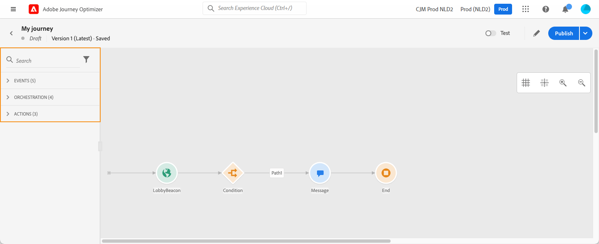
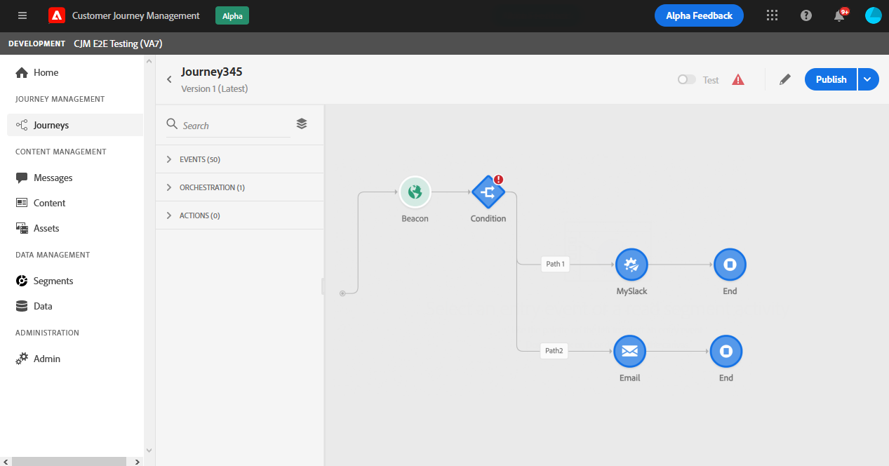

# Progettazione del percorso

L’interfaccia di percorso ti consente di trascinare facilmente le attività dalla palette nell’area di lavoro. Puoi anche fare doppio clic su un’attività per aggiungerla nell’area di lavoro al passaggio successivo disponibile. Ogni attività ha un ruolo specifico e un ruolo specifico nel processo. Le attività vengono sequenziate. Al termine di un’attività, il flusso continua ed elabora l’attività successiva e così via.

## Guida introduttiva alla progettazione di percorsi

La **palette** si trova sul lato sinistro dello schermo. Tutte le attività disponibili sono suddivise in diverse categorie: **[!UICONTROL Events]**, **[!UICONTROL Orchestration]** e **[!UICONTROL Actions]**. È possibile espandere o comprimere le diverse categorie facendo clic sul loro nome. Per utilizzare un’attività nel percorso, trascinala dalla palette nell’area di lavoro.

Quando si avvia un nuovo percorso, gli elementi che non possono essere eliminati nell’area di lavoro come primo passaggio vengono nascosti. Questo riguarda tutte le azioni, l&#39;attività della condizione, l&#39;attesa e la reazione.

L’icona **[!UICONTROL Filter items]** nell’angolo in alto a sinistra consente di visualizzare i seguenti filtri:

* **Mostra solo gli elementi** disponibili: nascondere o visualizzare gli elementi non disponibili nella palette, ad esempio gli eventi che utilizzano uno spazio dei nomi diverso da quelli utilizzati nel percorso. Per impostazione predefinita, gli elementi non disponibili sono nascosti. Se scegli di visualizzarli, verranno visualizzati in grigio.

* **Mostra solo gli elementi** recenti: questo filtro consente di visualizzare solo gli ultimi cinque eventi e azioni utilizzati, oltre a quelli predefiniti. Questo è specifico per ogni utente. Per impostazione predefinita, vengono visualizzati tutti gli elementi.

Puoi inoltre utilizzare il campo **[!UICONTROL Search]** .

La **area di lavoro** è la zona centrale nella finestra di progettazione del percorso. È in questa zona che puoi rilasciare le attività e configurarle. Fai clic su un’attività nell’area di lavoro per configurarla. Viene aperto il riquadro di configurazione dell’attività sul lato destro.

Il **riquadro di configurazione dell&#39;attività** viene visualizzato quando si fa clic su un&#39;attività nella palette. Compila i campi richiesti. Fai clic sull’icona **[!UICONTROL Delete]** per eliminare l’attività. Fai clic su **[!UICONTROL Cancel]** per annullare le modifiche o su **[!UICONTROL Ok]** per confermare. Per eliminare le attività, puoi anche selezionare una (o più) attività e premere il tasto backspace. Premendo il tasto Esc si chiude il riquadro di configurazione dell’attività.

Per impostazione predefinita, i campi di sola lettura sono nascosti. Per visualizzarli, fai clic sull&#39;icona **Mostra campi di sola lettura** in alto a sinistra nel riquadro di configurazione dell&#39;attività.

A seconda dello stato del percorso, è possibile eseguire diverse azioni sul percorso utilizzando i pulsanti disponibili nell’angolo in alto a destra: **[!UICONTROL Publish]**, **[!UICONTROL Duplicate]**, **[!UICONTROL Delete]**, **[!UICONTROL Journey properties]**, **[!UICONTROL Test]**. Questi pulsanti vengono visualizzati quando non è selezionata alcuna attività. Alcuni pulsanti vengono visualizzati contestualmente. Il pulsante del registro della modalità di prova viene visualizzato quando viene attivata la modalità di prova.

## Avvio del percorso

Quando si progetta un percorso, la prima domanda che si desidera porre è come i profili entreranno nel percorso. Esistono due possibilità:

**Inizia con un evento**: quando un percorso è impostato per ascoltare gli eventi, gli individui entrano nell&#39; **** unità del percorso in tempo reale. I messaggi inclusi nel tuo percorso vengono inviati alla persona che si trova attualmente nel percorso. [Ulteriori informazioni sugli eventi](../event/about-events.md)

**Inizia con un segmento** di lettura: puoi impostare il tuo percorso per ascoltare i segmenti Adobe Experience Platform. In questo caso, tutti gli individui appartenenti al segmento specificato entrano nel percorso. I messaggi inclusi nel percorso vengono inviati agli utenti appartenenti al segmento. [Ulteriori informazioni sulla lettura dei segmenti](read-segment.md).

## Definire i passaggi successivi

Dopo il primo evento o segmento di lettura, puoi combinare le diverse attività per creare scenari multicanale con più passaggi. Dalla palette, scegli i passaggi necessari.

**Eventi**

Quando avvii il percorso con un evento, il percorso viene attivato quando l’evento viene ricevuto. La persona seguirà, singolarmente, i passaggi successivi definiti nel tuo percorso.

Puoi aggiungere **diversi eventi** nel percorso, purché utilizzino lo stesso namespace. Gli eventi sono configurati in precedenza. [Ulteriori informazioni sugli eventi](about-journey-activities.md#event-activities)

Puoi anche aggiungere un evento **Reaction** dopo un messaggio per reagire al tracciamento dei dati relativi al messaggio. Questo consente, ad esempio, di inviare un altro messaggio se l’utente ha aperto il messaggio precedente o ha fatto clic al suo interno. Ulteriori informazioni in questa sezione [sezione](reaction-events.md).

L’attività dell’evento **Qualificazione del segmento** ti consente di consentire l’accesso o l’avanzamento di singoli utenti a un percorso in base alle entrate e alle uscite dei segmenti Adobe Experience Platform. Puoi far entrare tutti i nuovi clienti in argento in un percorso e inviare messaggi personalizzati. Ulteriori informazioni in questa sezione [sezione](segment-qualification-events.md).

**Orchestrazione**

Nelle attività di orchestrazione, troverai l’attività **Leggi segmento** che ti consente di impostare il percorso per l’ascolto di un segmento Adobe Experience Platform. [Ulteriori informazioni sull’attività](read-segment.md) Leggi segmento .

Le altre attività ti consentono di aggiungere condizioni al percorso per definire diversi percorsi, impostare un tempo di attesa prima di eseguire l’attività successiva o terminare il percorso. Ulteriori informazioni in questa sezione [sezione](about-journey-activities.md#orchestration-activities).

**Azioni**

Qui trovi l&#39;attività **Messaggio** che ti consente di includere un messaggio progettato in [!DNL Journey Optimizer]. [Ulteriori informazioni sull’attività Messaggio](journeys-message.md)

Troverai anche le azioni personalizzate configurate per l’invio di messaggi con sistemi di terze parti. Ulteriori informazioni in questa sezione [sezione](about-journey-activities.md#action-activities).

## Utilizzo dei percorsi nell’area di lavoro {#paths}

Diverse attività (**[!UICONTROL Condition]**, **[!UICONTROL Action]**) ti consentono di definire un’azione di fallback in caso di errore o timeout. Nel riquadro di configurazione dell’attività, seleziona la casella: **[!UICONTROL Add an alternative path in case of a timeout or an error]**. Un altro percorso viene aggiunto dopo l’attività . La durata del timeout è definita nelle proprietà del percorso (consulta [questa pagina](../building-journeys/journey-gs.md#change-properties) da un utente amministratore. Ad esempio, se l’invio di un’e-mail richiede troppo tempo o si verifica un errore, puoi decidere di inviare un SMS.

Varie attività (evento, azione, attesa) ti consentono di aggiungere diversi percorsi dopo di essi. A questo scopo, posiziona il cursore sull’attività e fai clic sul simbolo &quot;+&quot;. Solo le attività evento e attesa possono essere impostate in parallelo. Se più eventi sono impostati in parallelo, il percorso scelto sarà quello del primo evento che si verifica.

Quando ascolti un evento, ti consigliamo di non attendere l’evento a tempo indefinito. Non è obbligatorio, è solo una buona pratica. Se desideri ascoltare uno o più eventi solo durante un certo periodo di tempo, inserirai uno o più eventi e un’attività di attesa in parallelo. Vedi [questa sezione](../building-journeys/general-events.md#events-specific-time).

Per eliminare il percorso, posiziona il cursore su di esso e fai clic sull&#39;icona **[!UICONTROL Delete arrow]** .

Nell’area di lavoro, quando due attività vengono disconnesse, viene visualizzato un avviso. Posiziona il cursore sull’icona di avviso per visualizzare il messaggio di errore. Per risolvere il problema, sposta semplicemente l’attività disconnessa e collegala all’attività precedente.

## Copia e incolla delle attività {#copy-paste}

Puoi copiare una o più attività di un percorso e incollarle nello stesso percorso o in un&#39;altra. Ciò ti consente di risparmiare tempo se desideri riutilizzare numerose attività già configurate in un percorso precedente.

**Note importanti**

* Puoi copiare/incollare diverse schede e browser. Puoi copiare/incollare solo le attività all’interno della stessa istanza.
* Non è possibile copiare/incollare un evento se il percorso di destinazione dispone di un evento che utilizza uno spazio dei nomi diverso.
* Le attività inviate possono fare riferimento a dati non esistenti nel percorso di destinazione, ad esempio se copi/incolla tra diverse sandbox. Controlla sempre gli errori e apporta le regolazioni necessarie.
* Non è possibile annullare un’azione. Per eliminare le attività incollate, dovrai selezionarle ed eliminarle. Pertanto, accertati di selezionare solo le attività necessarie prima di copiarle.
* Puoi copiare le attività da qualsiasi percorso, anche da quelli in sola lettura.
* Puoi selezionare qualsiasi attività, anche se non collegata. Le attività collegate resteranno collegate dopo essere state incollate.

Di seguito sono riportati i passaggi per copiare/incollare le attività:

1. Apri un percorso.
1. Seleziona le attività da copiare spostando il mouse mentre fai clic. Puoi anche fare clic su ogni attività premendo il tasto **Ctrl/Comando** . Utilizza **Ctrl/Comando + A** per selezionare tutte le attività.
   
1. Premere **Ctrl/Comando + C**.
Se desideri copiare una sola attività, puoi fare clic su di essa e utilizzare l&#39;icona **Copia** in alto a sinistra nel riquadro di configurazione dell&#39;attività.
   
1. In qualsiasi percorso, premi **Ctrl/Comando + V** per incollare le attività senza collegarle a un nodo esistente. Le attività inviate vengono collocate nello stesso ordine. Dopo essere state incollate, le attività rimangono selezionate in modo da poterle spostare facilmente. È inoltre possibile posizionare il cursore su un segnaposto vuoto e premere **Ctrl/Comando + V**. Le attività inviate saranno collegate al nodo .
   
