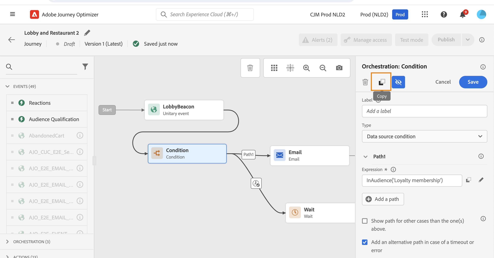
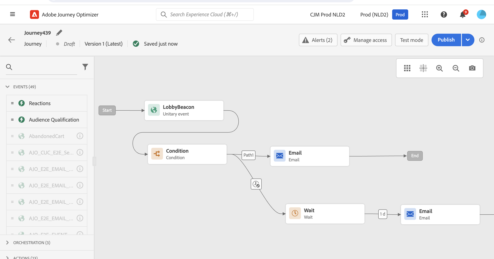

# Progettazione del percorso {#design-your-journey}

>[!CONTEXTUALHELP]
>id="ajo_journey_canvas"
>title="Progettazione del percorso"
>abstract="L’interfaccia dei percorsi consente di trascinare facilmente le attività dalla palette all’area di lavoro. Puoi anche fare doppio clic su un’attività per aggiungerla all’area di lavoro in corrispondenza del prossimo passaggio disponibile."

Adobe Journey Optimizer include un’area di lavoro di orchestrazione omnicanale, che consente ai marketer di armonizzare le attività di marketing con il coinvolgimento dei clienti in modalità uno a uno. L’interfaccia utente ti consente di trascinare facilmente le attività dalla palette all’interno dell’area di lavoro per creare il percorso. Puoi anche fare doppio clic su un’attività per aggiungerla all’area di lavoro, al prossimo passaggio disponibile.

Gli eventi, le attività di orchestrazione e le attività di azione hanno un ruolo e un luogo specifici nel processo. Le attività sono in sequenza: al termine di un’attività, il flusso continua ed elabora l’attività successiva e così via.

## Introduzione alla progettazione del percorso {#gs-journey-design}

La **palette** si trova sul lato sinistro dello schermo. Tutte le attività disponibili sono ordinate in diverse categorie: [Eventi](#jo-event), [Orchestrazione](#jo-orch) e [Azioni](#jo-actions). Puoi espandere/comprimere le diverse categorie facendo clic sul loro nome. Per utilizzare un’attività nel percorso, trascinala dalla palette nell’area di lavoro.

Quando si avvia un nuovo percorso, gli elementi che non possono essere rilasciati nell’area di lavoro come primo passaggio vengono nascosti. Questo riguarda tutte le azioni, l’attività della condizione, l’attesa e la reazione.

L&#39;icona **[!UICONTROL Filtra elementi]** nell&#39;angolo superiore sinistro consente di visualizzare i filtri seguenti:

* **Mostra solo gli elementi disponibili**: nascondi o visualizza gli elementi non disponibili nella tavolozza, ad esempio gli eventi che utilizzano uno spazio dei nomi diverso rispetto a quelli utilizzati nel percorso. Per impostazione predefinita, gli elementi non disponibili sono nascosti. Se scegli di visualizzarli, appariranno in grigio.

* **Mostra solo elementi recenti**: questo filtro consente di visualizzare solo gli ultimi cinque eventi e azioni utilizzati, oltre a quelli predefiniti. Questo è specifico per ogni utente. Per impostazione predefinita, vengono visualizzati tutti gli elementi.

Puoi anche utilizzare il campo **[!UICONTROL Ricerca]**. Vengono filtrati solo gli eventi e le azioni.

L&#39;**area di lavoro** è l&#39;area centrale nella finestra di progettazione del percorso. È in quest’area che puoi rilasciare le attività e configurarle. Fai clic su un’attività nell’area di lavoro per configurarla. Questo apre il riquadro di configurazione dell’attività sul lato destro.

La **barra degli strumenti**, situata nell&#39;angolo superiore destro dell&#39;area di lavoro, consente di mostrare/nascondere la griglia, ingrandire/ridurre e scaricare una schermata dell&#39;area di lavoro. Consulta questa [sezione](../building-journeys/journey-properties.md#timeout_and_error).

<!--and show/hide timeout and error paths-->

{width="70%" align="left"}

Il **riquadro di configurazione attività** viene visualizzato quando si fa clic su un&#39;attività nella tavolozza. Compila i campi obbligatori. Fai clic sull&#39;icona **[!UICONTROL Elimina]** per eliminare l&#39;attività. Fai clic su **[!UICONTROL Annulla]** per annullare le modifiche o su **[!UICONTROL Ok]** per confermare. Per eliminare delle attività, puoi anche selezionare una o più attività e premere il tasto backspace. Premendo il tasto Esc si chiude il riquadro di configurazione dell’attività.

Per impostazione predefinita, i campi di sola lettura sono nascosti. Per visualizzare i campi di sola lettura, fai clic sull&#39;icona **Mostra campi di sola lettura** in alto a sinistra nel riquadro di configurazione dell&#39;attività. Questa impostazione si applica a tutte le attività in tutti i percorsi.

A seconda dello stato del percorso, puoi eseguire diverse azioni sul percorso utilizzando i pulsanti disponibili nell&#39;angolo in alto a destra: **[!UICONTROL Pubblica]**, **[!UICONTROL Duplica]**, **[!UICONTROL Elimina]**, **[!UICONTROL Modalità test]**, **[!UICONTROL Gestisci accesso]**, **[!UICONTROL Avvisi]**. Questi pulsanti vengono visualizzati quando non è selezionata alcuna attività. Alcuni pulsanti vengono visualizzati contestualmente. Il pulsante di registro della modalità di test viene visualizzato quando la modalità di test è attivata.

## Avvia il percorso {#start-your-journey}

Quando si progetta il percorso, la prima domanda da porsi è come i profili entreranno nel percorso.

Esistono due possibilità:

1. **Inizia con un evento**: quando un percorso è impostato per l&#39;ascolto degli eventi, i singoli utenti immettono il percorso **in modo unitario** in tempo reale. I messaggi inclusi nel percorso vengono inviati alla persona che sta entrando nel percorso. [Ulteriori informazioni sugli eventi](../event/about-events.md)

1. **Inizia con un pubblico di lettura**: puoi impostare il percorso in modo che ascolti i tipi di pubblico di Adobe Experience Platform. In questo caso, tutti i singoli utenti appartenenti al pubblico specificato accedono al percorso. I messaggi inclusi nel percorso vengono inviati ai singoli utenti appartenenti al pubblico. Ulteriori informazioni su [audience di lettura](read-audience.md).

## Definire i passaggi successivi{#define-next-steps}

Dopo il primo evento o Read Audiences, puoi combinare le diverse attività per creare scenari cross-channel in più passaggi. Scegli dalla palette i passaggi necessari.

### Eventi{#jo-event}

Gli eventi attivano un percorso personalizzato, ad esempio un acquisto online. Una volta che qualcuno entra in un percorso, si muove come un individuo, e non ci sono due individui che si muovono allo stesso ritmo o lungo lo stesso percorso.

Quando si avvia il percorso con un evento, il percorso viene attivato alla ricezione dell’evento. Ogni persona nel percorso segue quindi singolarmente i passaggi successivi definiti nel percorso.

Puoi aggiungere **diversi eventi** nel percorso, purché utilizzino lo stesso spazio dei nomi. Gli eventi vengono configurati in precedenza. [Ulteriori informazioni sugli eventi di percorso](about-journey-activities.md#event-activities)

Puoi anche aggiungere un evento **Reazione** dopo un messaggio per reagire al tracciamento dei dati relativi al messaggio. Ciò ti consente, ad esempio, di inviare un altro messaggio se l’utente ha aperto il messaggio precedente o ha fatto clic al suo interno. [Ulteriori informazioni sugli eventi di reazione](reaction-events.md).

Utilizza l&#39;attività evento **Qualificazione del pubblico** per consentire ai singoli utenti di entrare o proseguire in un percorso in base alle entrate e alle uscite del pubblico Adobe Experience Platform. Puoi fare in modo che tutti i nuovi clienti silver entrino in un percorso e inviino messaggi personalizzati. Ulteriori informazioni in questa [sezione](audience-qualification-events.md).

### Orchestrazione{#jo-orch}

Le attività di orchestrazione sono condizioni diverse che consentono di determinare il passaggio successivo nel percorso.

Dalle attività di orchestrazione, utilizza l&#39;attività **Read Audience** per impostare il percorso in modo che ascolti un pubblico Adobe Experience Platform. [Ulteriori informazioni sull&#39;attività Read audience](read-audience.md).

Le altre attività ti consentono di aggiungere condizioni al percorso per definire diversi percorsi, impostare un tempo di attesa prima di eseguire l’attività successiva o terminare il percorso. [Ulteriori informazioni sulle attività di orchestrazione](about-journey-activities.md#orchestration-activities).

### Azioni{#jo-actions}

Le azioni sono ciò che desideri che accada come risultato di un qualche tipo di trigger, ad esempio l’invio di un messaggio. È il pezzo di percorso che il cliente sperimenta. Potrebbe trattarsi di un messaggio e-mail, SMS o push oppure di un’azione di terze parti, ad esempio un messaggio Slack.

Le attività di azione del canale consentono di includere un messaggio progettato in [!DNL Journey Optimizer]. [Ulteriori informazioni sulle attività dell&#39;azione del canale](journeys-message.md)

Dalle attività di azione, utilizza azioni personalizzate per inviare messaggi con sistemi di terze parti. [Ulteriori informazioni sulle azioni personalizzate](about-journey-activities.md#action-activities).

## Aggiungere percorsi alternativi {#paths}

È possibile definire un&#39;azione di fallback in caso di errore o timeout per le seguenti attività di percorso: **[!UICONTROL Condizione]** e **[!UICONTROL Azione]**.

Per aggiungere un&#39;azione di fallback per un&#39;attività, selezionare la casella **[!UICONTROL Aggiungi un percorso alternativo in caso di timeout o errore]** nelle proprietà dell&#39;attività: dopo l&#39;attività viene aggiunto un altro percorso. La durata del timeout è definita dagli utenti amministratori nelle [proprietà percorso](../building-journeys/journey-properties.md). Ad esempio, se l’invio di un’e-mail richiede troppo tempo o è in errore, puoi decidere di inviare una notifica push.

Varie attività (evento, azione, attesa) ti consentono di aggiungere diversi percorsi dopo di essi. A questo scopo, posiziona il cursore sull’attività e fai clic sul simbolo &quot;+&quot;. Solo le attività event e wait possono essere impostate in parallelo. Se più eventi sono impostati in parallelo, il percorso scelto sarà quello del primo evento in corso.

Quando ascolti un evento, ti consigliamo di non attendere l’evento a tempo indefinito. Non è obbligatorio, è solo una best practice. Se desideri ascoltare uno o più eventi solo durante un certo periodo di tempo, inserirai uno o più eventi e un’attività Attendi in parallelo. Consulta [questa sezione](../building-journeys/general-events.md#events-specific-time).

Per eliminare il percorso, posizionare il cursore e fare clic sull&#39;icona **[!UICONTROL Elimina percorso]**.

Quando due attività vengono disconnesse, nell’area di lavoro viene visualizzato un avviso. Posizionare il cursore sull&#39;icona di avviso per visualizzare il messaggio di errore. Per risolvere il problema, è sufficiente spostare l’attività disconnessa e collegarla all’attività precedente.

## Attività di copia e incolla {#copy-paste}

Puoi copiare una o più attività di un percorso e incollarle nello stesso percorso o in un altro. Questo ti consente di risparmiare tempo se desideri riutilizzare numerose attività già configurate in un percorso precedente.

**Note importanti**

* Puoi copiare e incollare in diverse schede e browser. Puoi copiare/incollare solo attività all’interno della stessa istanza.
* Non puoi copiare/incollare un evento se il percorso di destinazione ha un evento che utilizza uno spazio dei nomi diverso.
* Le attività incollate possono fare riferimento a dati che non esistono nel percorso di destinazione, ad esempio se si copiano o si incollano in sandbox diverse. Verificare sempre la presenza di errori e apportare le modifiche necessarie.
* Tieni presente che non puoi annullare un’azione. Per eliminare le attività incollate, devi selezionarle ed eliminarle. Accertati quindi di selezionare solo le attività necessarie prima di copiarle.
* Puoi copiare le attività da qualsiasi percorso, anche quelle in sola lettura.
* Puoi selezionare qualsiasi attività, anche quelle non collegate. Le attività collegate rimarranno collegate dopo essere state incollate.

Di seguito sono riportati i passaggi per copiare/incollare le attività:

1. Apri un percorso.
1. Seleziona le attività da copiare spostando il mouse mentre fai clic su. È inoltre possibile fare clic su ogni attività premendo il tasto **Ctrl/Comando**. Utilizzare **Ctrl/Comando + A** per selezionare tutte le attività.
   
1. Premere **Ctrl/Comando + C**.
Se desideri copiare solo un&#39;attività, puoi fare clic su di essa e utilizzare l&#39;icona **Copia** in alto a sinistra nel riquadro di configurazione dell&#39;attività.
   
1. In qualsiasi percorso, premere **Ctrl/Comando + V** per incollare le attività senza collegarle a un nodo esistente. Le attività incollate vengono inserite nello stesso ordine. Dopo essere state incollate, le attività rimangono selezionate in modo da poterle spostare facilmente. Puoi anche posizionare il cursore su un segnaposto vuoto e premere **Ctrl/Comando + V**. Le attività incollate verranno collegate al nodo.
   
