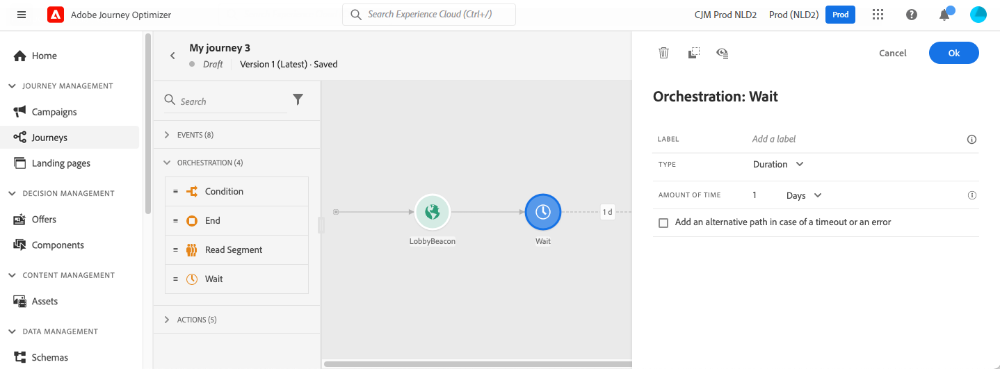
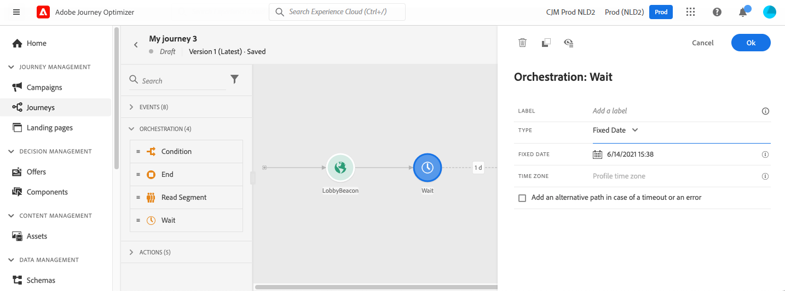
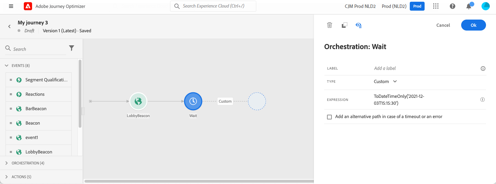

# Attività Attendi {#wait-activity}

>[!BEGINSHADEBOX]

**In questa pagina:** Scopri come configurare l&#39;attività Attendi per sospendere un percorso per una durata relativa o fino a una data calcolata personalizzata prima dell&#39;esecuzione dell&#39;attività successiva.

>[!ENDSHADEBOX]

>[!CONTEXTUALHELP]
>id="ajo_journey_wait"
>title="Attività Attendi"
>abstract="L’attività Attendi ti consente di attendere prima di eseguire l’attività successiva nel percorso. Consente di stabilire il momento in cui verrà eseguita l’attività successiva. Sono disponibili due opzioni: durata e personalizzato."

Puoi utilizzare un&#39;attività **[!UICONTROL Wait]** per definire una durata prima di eseguire l&#39;attività successiva.  La durata massima di attesa è di **90 giorni**.

È possibile impostare tre tipi di attività **Attendi**:

* Un’attesa basata su una durata relativa. [Ulteriori informazioni](#duration)
* Una data personalizzata, utilizzando le funzioni per calcolarla. [Ulteriori informazioni](#custom)
* Un’attesa di ottimizzazione dell’ora di invio. [Ulteriori informazioni](#sto-wait)

<!--
* [Fixed date](#fixed_date) 
-->

## Consigli {#wait-recommendations}

Utilizza queste raccomandazioni per mantenere le attese prevedibili e sicure.

### Attività di attesa multiple {#multiple-wait-activities}

Quando utilizzi più attività **Wait** in un percorso, tieni presente che il [timeout globale](journey-properties.md#global_timeout) per i percorsi è di 91 giorni, il che significa che i profili vengono sempre eliminati dal massimo percorso 91 giorni dopo l&#39;immissione. Ulteriori informazioni sono disponibili in [questa pagina](journey-properties.md#global_timeout).

Una persona può accedere a un&#39;attività **Wait** solo se nel percorso è rimasto abbastanza tempo per completare la durata dell&#39;attesa prima del timeout di 91 percorsi.

### Attendere e rientrare {#wait-reentrance}

È consigliabile non utilizzare le attività **Wait** per bloccare il rientro. Utilizza invece l&#39;opzione **Consenti rientro** a livello di proprietà del percorso. Ulteriori informazioni sono disponibili in [questa pagina](../building-journeys/journey-properties.md#entrance).

### Modalità di attesa e test {#wait-test-mode}

In modalità di test, il parametro **[!UICONTROL Wait time in test]** (Tempo di attesa nel test) consente di definire la durata di ogni attività **Wait**. Il tempo predefinito è di 10 secondi. In questo modo potrai ottenere rapidamente i risultati del test. Ulteriori informazioni sono disponibili in [questa pagina](../building-journeys/testing-the-journey.md).

### Canali attendi e mobili {#wait-mobile-channels}

Se desideri visualizzare un [messaggio in-app](../in-app/create-in-app.md) poco dopo aver inviato una [notifica push](../../rp_landing_pages/push-landing-page.md), utilizza un&#39;attività **Attendi** per consentire la propagazione del tempo di payload del messaggio in-app. In genere si consiglia un’attesa di 5-15 minuti, ma i tempi esatti possono variare a seconda della complessità del payload e delle esigenze di personalizzazione.

## Configurazione {#wait-configuration}

Configura qui la durata e il tempo di attesa.

### Attesa durata {#duration}

Selezionare il tipo **Durata** per impostare la durata relativa dell&#39;attesa prima dell&#39;esecuzione dell&#39;attività successiva. La durata massima è di **90 giorni**.

<!--
## Fixed date wait{#fixed_date}

Select the date for the execution of the next activity.

-->

### Attesa personalizzata {#custom}

Seleziona il tipo **Personalizzato** per definire una data personalizzata, utilizzando un&#39;espressione avanzata basata su un campo proveniente da un evento o una risposta a un&#39;azione personalizzata. Non è possibile definire direttamente una durata relativa, ad esempio 7 giorni, ma è possibile utilizzare le funzioni per calcolarla se necessario (ad esempio, 2 giorni dopo l’acquisto).

L&#39;espressione nell&#39;editor deve fornire un formato `dateTimeOnly`. Consulta [questa pagina](expression/expressionadvanced.md). Per ulteriori informazioni sul formato dateTimeOnly, vedere [questa pagina](expression/data-types.md).

Si consiglia di utilizzare date personalizzate specifiche per i profili ed evitare di utilizzare la stessa data per tutti. Ad esempio, non definire `toDateTimeOnly('2024-01-01T01:11:00Z')`, ma `toDateTimeOnly(@event{Event.productDeliveryDate})` specifico per ciascun profilo. Tieni presente che l’utilizzo di date fisse può causare problemi nell’esecuzione del percorso. Ulteriori informazioni sull&#39;impatto delle attività Attendi sulla velocità di elaborazione del percorso in [questa sezione](entry-management.md#wait-activities-impact).

>[!CAUTION]
>
>Quando si utilizzano espressioni `dateTimeOnly`, tenere presente quanto segue:
>
>* È possibile utilizzare direttamente un&#39;espressione `dateTimeOnly` o convertirla utilizzando una funzione, ad esempio: `toDateTimeOnly(@event{Event.offerOpened.activity.endTime})` dove il valore del campo è nel formato `2023-08-12T09:46:06Z`.
>* Il **fuso orario** è definito nelle proprietà del percorso. Di conseguenza, non è possibile dall’interfaccia utente puntare a un timestamp ISO-8601 completo che combina l’offset di ora e fuso orario, ad esempio `2023-08-12T09:46:06.982-05`. [Ulteriori informazioni](../building-journeys/timezone-management.md)
>* Durante la creazione di un&#39;espressione di attesa personalizzata con `toDateTimeOnly()`, **not** aggiungere `Z` o un offset del fuso orario (ad esempio, `-05:00`). L’espressione deve fare riferimento al fuso orario configurato nel percorso senza indicatori di fuso orario espliciti, altrimenti i profili potrebbero bloccarsi nell’attività Attendi.
>
>| | Esempio |
>| --- | --- |
>| **Corretto** | `toDateTimeOnly(concat(toString(toDateOnly(nowWithDelta(2, "days"))),"T10:00:00"))` |
>| **Errato** | `toDateTimeOnly(concat(toString(toDateOnly(nowWithDelta(2, "days"))),"T10:00:00Z"))` ❌ (contiene `Z`) |

Per verificare che l’attività Attendi funzioni come previsto, puoi utilizzare gli eventi dei passaggi. [Ulteriori informazioni](../reports/query-examples.md#common-queries).

### Attesa ottimizzazione dell’ora di invio {#sto-wait}

>[!CONTEXTUALHELP]
>id="ajo_journey_wait_optimization_channel"
>title="Canale di ottimizzazione"
>abstract="Scegli il modello di ottimizzazione del tempo di invio del canale da utilizzare per calcolare il tempo di attesa ottimale di ciascun profilo: e-mail o notifica push. L’attività Attendi riutilizza i punteggi di coinvolgimento già calcolati per quel canale, pertanto il canale selezionato deve corrispondere al comportamento di messaggistica desiderato per l’ottimizzazione dell’Attesa."

>[!CONTEXTUALHELP]
>id="ajo_journey_wait_optimization_type"
>title="Tipo di ottimizzazione"
>abstract="Per E-mail, scegli se calcolare il tempo di attesa ottimale per massimizzare le aperture o i click-through. Il push ottimizza sempre le aperture, poiché il tracciamento dei clic non si applica ai messaggi push. Scegli il tipo di coinvolgimento che meglio corrisponde all’obiettivo dell’attività che segue l’attesa."

>[!CONTEXTUALHELP]
>id="ajo_journey_wait_send_within"
>title="Invia entro il prossimo"
>abstract="Impostare il numero massimo di ore (2-100) che il sistema può attendere prima di continuare l&#39;attività successiva. Questo definisce il limite esterno della finestra che l’ottimizzazione del tempo di invio considera quando si sceglie il momento migliore: una finestra più breve limita i vantaggi che il modello di intelligenza artificiale può offrire, mentre una finestra più lunga può ritardare le attività a valle più del necessario."

Seleziona il tipo **[!UICONTROL Ottimizzazione dell&#39;ora di invio]** per consentire all&#39;intelligenza artificiale di Adobe di determinare il tempo ottimale per continuare con l&#39;attività successiva nel percorso, in base al comportamento di coinvolgimento previsto di ciascun profilo. In questo modo si utilizza lo stesso modello di [ottimizzazione dell&#39;ora di invio](send-time-optimization.md) delle azioni E-mail e push, ma l&#39;attesa viene separata dall&#39;invio stesso. L’attività che segue l’attesa può essere qualsiasi attività, ad esempio un’azione Personalizzata, anziché essere associata solo a un’azione E-mail o Push.

[Ulteriori informazioni su come funziona l&#39;ottimizzazione dell&#39;ora di invio e su come abilitarla per la tua organizzazione](send-time-optimization.md#how-send-time).

>[!IMPORTANT]
>
>L&#39;ottimizzazione dell&#39;ora di invio non ha visibilità sulle regole delle [ore non interattive](../conflict-prioritization/quiet-hours.md). Le ore non interattive vengono valutate solo quando un profilo raggiunge un&#39;azione **message**, pertanto un&#39;attività di attesa di ottimizzazione del tempo di invio può selezionare un tempo ottimale che rientra in una finestra di ore non interattive per un&#39;azione del canale a valle. Il conflitto compare solo in un secondo momento, quando il messaggio viene inviato.

## Aggiornamento profilo dopo l’attesa {#profile-refresh}

Quando un profilo viene parcheggiato in un&#39;attività **Wait** in un percorso che inizia con un&#39;attività **Read Audience**, il percorso aggiorna automaticamente gli attributi del profilo da Servizio profili unificato (UPS) per recuperare i dati disponibili più recenti.

* **Alla voce percorso**: i profili utilizzano i valori degli attributi dello snapshot del pubblico valutato all&#39;avvio del percorso.
* **Dopo un nodo di attesa**: il percorso esegue una ricerca per recuperare i dati di profilo più recenti da UPS, non i dati snapshot precedenti. Ciò significa che gli attributi del profilo possono essere cambiati dall’inizio del percorso.

Questo comportamento assicura che le attività a valle utilizzino le informazioni correnti del profilo dopo un periodo di attesa. Tuttavia, potrebbero verificarsi risultati imprevisti se si prevede che il percorso utilizzi solo i dati snapshot originali durante l&#39;esecuzione.

Esempio: se un profilo è idoneo per un pubblico &quot;cliente silver&quot; all’inizio del percorso, ma viene aggiornato a &quot;cliente gold&quot; durante un’attesa di 3 giorni, le attività successive all’attesa visualizzeranno lo stato &quot;cliente gold&quot; aggiornato.

## Nodo di attesa automatico  {#auto-wait-node}

>[!CONTEXTUALHELP]
>id="ajo_journey_auto_wait_node"
>title="Informazioni sul nodo di attesa automatico"
>abstract="Un nodo di **attesa** viene inserito automaticamente dopo questa azione in entrata. Il valore predefinito è impostato su 3 giorni, garantendo che i profili rimangano nel percorso il tempo sufficiente per visualizzare il messaggio o l’esperienza. La durata dell’attesa può essere aggiornata, oppure il nodo può essere rimosso, se il caso d’uso lo richiede."

Ogni attività esperienza in entrata (messaggio in-app, esperienza basata su codice o scheda) viene fornita con un&#39;attività **Wait** di 3 giorni. Poiché i messaggi in entrata terminano automaticamente quando un profilo raggiunge la fine del percorso, si presume che gli utenti debbano visualizzarlo almeno per 3 giorni. Puoi rimuovere questa attività **Attendi** o modificarne la configurazione, se necessario.

{{$include /help/_includes/do-not-localize/building-journeys/ai-augmented-wait-activity.md}}
