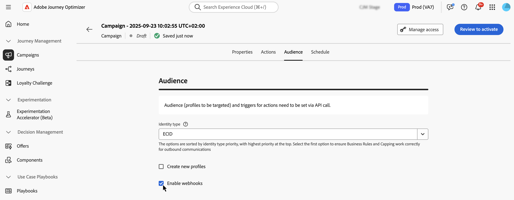

# Define the API triggered campaign audience {#api-audience}

Use the **[!UICONTROL Audience]** tab to define the campaign audience.

## Selezionare il pubblico

**For Marketing API triggered campaigns**, click the **[!UICONTROL Select audience]** button to display the list of available Adobe Experience Platform audiences. [Ulteriori informazioni sui tipi di pubblico](../audience/about-audiences.md)

>[!IMPORTANT]
>
>The use of audiences and attributes from [audience composition](../audience/get-started-audience-orchestration.md) is currently unavailable for use with Healthcare Shield or Privacy and Security Shield.

**For Transactional API triggered campaigns**, the targeted profiles need to be defined in the API call. A single API call supports up to 20 unique recipients. Each recipient must have a unique user ID, duplicate user IDs are not permitted. Learn more in the [Interactive Message Execution API documentation](https://developer.adobe.com/journey-optimizer-apis/references/messaging#operation/postIMUnitaryMessageExecution){target="_blank"}

## Seleziona il tipo di identità

In the **[!UICONTROL Identity type]** field, choose the type of key to use to identify the individuals from the selected audience. You can either use an existing identity type or create a new one using the Adobe Experience Platform Identity Service. Standard Identity namespaces are listed on [this page](https://experienceleague.adobe.com/en/docs/experience-platform/identity/features/namespaces#standard){target="_blank"}.

Only one identity type is allowed per campaign. Individuals belonging to a segment that does not have the selected identity type among their different identities cannot be targeted by the campaign. Learn more about identity types and namespaces in the [Adobe Experience Platform documentation](https://experienceleague.adobe.com/docs/experience-platform/identity/home.html?lang=it){target="_blank"}.

## Activate profile creation at campaign execution

In some cases, you may need to send transactional messages to profiles that do not exist in the system. For example if an unknown user tries to reset password on your website. When a profile does not exist in the database, Journey Optimizer allows you to automatically create it when executing the campaign to allow sending the message to this profile.

To activate profile creation at campaign execution, toggle the **[!UICONTROL Create new profiles]** option on. If this option is disabled, unknown profiles will be rejected for any sending and the API call will fail.

>[!IMPORTANT]
>
>Questa opzione viene fornita per **la creazione di profili di volumi molto piccoli** in un caso di utilizzo di invio transazionale di volumi elevati, con la maggior parte dei profili già esistenti in Platform.
>
>I profili sconosciuti vengono creati nel set di dati del profilo di messaggistica interattiva **AJO**, in tre spazi dei nomi predefiniti (e-mail, telefono e ECID) rispettivamente per ogni canale in uscita (e-mail, SMS e push). Tuttavia, se utilizzi uno spazio dei nomi personalizzato, l’identità viene creata con lo stesso spazio dei nomi personalizzato.
>
>La creazione del profilo in fase di esecuzione non è disponibile per [campagne High Throughput](../campaigns/api-triggered-high-throughput.md), poiché questa modalità non si basa sui profili Adobe. Il sistema non verificherà l’esistenza dei profili.

## Abilitare i webhook {#webhook}

Per le campagne attivate dall’API transazionale, puoi abilitare i webhook per ricevere feedback in tempo reale sullo stato di esecuzione dei messaggi. A tale scopo, attiva l&#39;opzione **[!UICONTROL Abilita webhook]** per inviare eventi di stato di consegna a un webhook configurato.

Le configurazioni del webhook vengono gestite centralmente nel menu **[!UICONTROL Amministrazione]** / **[!UICONTROL Canali]** / **[!UICONTROL Feedback del webhook]**. Da qui, gli amministratori possono creare e modificare gli endpoint del webhook. [Scopri come creare webhook di feedback](../configuration/feedback-webhooks.md)

## Passaggi successivi {#next}

Una volta che la configurazione e il contenuto della campagna sono pronti, puoi pianificarne l’esecuzione. [Ulteriori informazioni](api-triggered-campaign-schedule.md)
