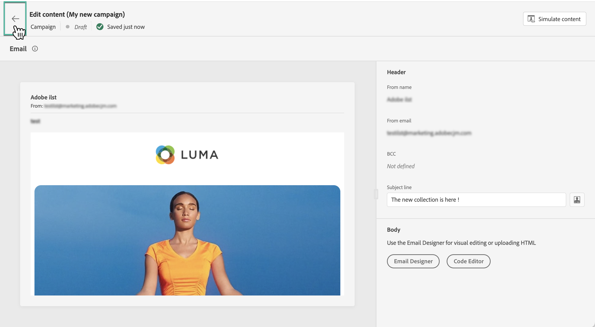

# Modificare il contenuto della campagna attivata dall’API {#api-content}

>[!BEGINSHADEBOX]

**In questa pagina:** Progetta e personalizza il contenuto della campagna attivata dall&#39;API con i dati contestuali passati nel payload dell&#39;API in modo che ogni messaggio sia personalizzato in tempo reale per ogni destinatario.

>[!ENDSHADEBOX]

Per configurare il contenuto del messaggio, passa alla scheda **[!UICONTROL Contenuto]** o fai clic sul pulsante **[!UICONTROL Modifica contenuto]**.

## Progettare il contenuto {#design}

Il processo di creazione dei contenuti dipende dal canale selezionato. Scopri i passaggi dettagliati per creare il contenuto del messaggio nelle pagine seguenti:

<table style="table-layout:fixed"><tr style="border: 0;">
<td>

<a href="../email/create-email.md"><strong>E-mail</strong></a>
</td>
<td>

<a href="../mobile/create-mobile-message.md"><strong>SMS</strong></a>
</td>
<td>

<a href="../push/create-push.md"><strong>Notifica push</strong></a>
</td>
</tr></table>

>[!IMPORTANT]
>
>[Le campagne High Throughput](../campaigns/api-triggered-high-throughput.md) non si basano sui profili Adobe: tutte le personalizzazioni devono essere incluse nel payload API come dati contestuali, come descritto di seguito. Questa modalità è disponibile solo per il canale e-mail e nell’area geografica degli Stati Uniti.

## Personalizzare i contenuti utilizzando i dati contestuali {#contextual}

Puoi trasmettere dati aggiuntivi nel payload API che puoi sfruttare per personalizzare il messaggio.

Prendiamo questo esempio, in cui i clienti vogliono reimpostare la propria password e desideri inviare loro un URL di reimpostazione della password generato in uno strumento di terze parti. Con le campagne attivate da API, puoi passare l’URL generato nel payload API e sfruttarlo nella campagna per aggiungerlo al messaggio.

A questo scopo, devi passarli nel payload API e aggiungerli nel messaggio utilizzando l’editor di personalizzazione. Utilizza la sintassi `{{context.<contextualAttribute>}}`, in cui `<contextualAttribute>` deve corrispondere al nome della variabile nel payload dell&#39;API contenente i dati che desideri trasmettere.

Per il momento non è disponibile alcun attributo contestuale da utilizzare nel menu della barra a sinistra. Gli attributi devono essere digitati direttamente nell&#39;espressione di personalizzazione, senza alcun controllo eseguito da [!DNL Journey Optimizer].

**Deve leggere**

* Gli attributi contestuali passati nella richiesta non possono superare i 200 kb e sono sempre considerati di tipo stringa.
* La sintassi `context.system` è limitata all&#39;uso interno di Adobe e non deve essere utilizzata per trasmettere attributi contestuali.
* A differenza degli eventi abilitati per il profilo, i dati contestuali passati nell’API REST vengono utilizzati per una comunicazione una tantum e non memorizzati rispetto al profilo. Al massimo, il profilo viene creato con i dettagli dello spazio dei nomi, se questo è stato trovato mancante.
* L’utilizzo di un numero elevato o di dati contestuali pesanti nel contenuto può influire sulle prestazioni.

## Verifica e verifica il contenuto

Una volta definito il contenuto, utilizza il pulsante **[!UICONTROL Simula contenuto]** per visualizzare in anteprima e verificare il contenuto. Puoi utilizzare uno dei due metodi di simulazione:

* Fai clic su **[!UICONTROL Simula contenuto]** per testare le varianti di contenuto con dati di input di esempio o con generazione automatica di IA.
* Fai clic su **[!UICONTROL Simula contenuto]**, quindi seleziona **[!UICONTROL Simula contenuto (profili AEP)]** dal menu a discesa per visualizzare l&#39;anteprima con i profili di test.

[Scopri come visualizzare in anteprima e verificare il contenuto](../content-management/preview-test.md). Per tornare alla schermata di creazione della campagna, fai clic sulla freccia sinistra.

## Passaggi successivi {#next}

Una volta che la configurazione e il contenuto della campagna sono pronti, puoi definire il pubblico della campagna. [Ulteriori informazioni](api-triggered-campaign-audience.md)
