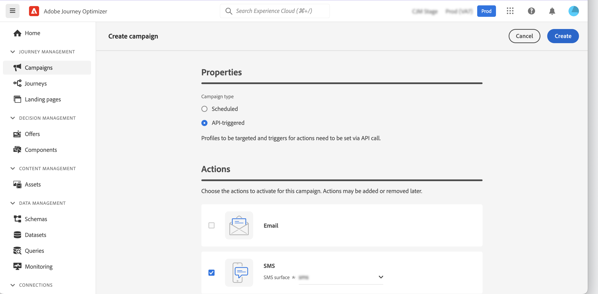

# Attivare campagne tramite API {#trigger-campaigns}

>[!CONTEXTUALHELP]
>id="ajo_campaigns_api_profile_creation"
>title="Tipo di campagna"
>abstract="Per la funzione di disponibilità limitata di inviare messaggi senza creare profili, segui i passaggi descritti nella documentazione."

## Informazioni sulle campagne attivate da API {#about}

Con [!DNL Journey Optimizer], puoi creare campagne e richiamarle da un sistema esterno in base all’attivazione dell’utente utilizzando [API REST di esecuzione messaggi interattivi](https://developer.adobe.com/journey-optimizer-apis/references/messaging/#tag/execution). Questo ti consente di soddisfare varie esigenze di marketing e messaggistica transazionale, tra cui reimpostazioni di password e token OTP.

A tal fine, devi innanzitutto creare una campagna attivata da API in Journey Optimizer e quindi avviarne l’esecuzione tramite una chiamata API.

I canali disponibili per le campagne attivate da API sono e-mail, SMS e messaggi push.

>[!NOTE]
>
>Al momento, la modalità Consegna rapida non è supportata per le campagne attivate dall’API per le notifiche push.

## Creare una campagna attivata da API {#create}

### Configurare e attivare la campagna {#create-activate}

Per creare una campagna attivata da API, segui i passaggi seguenti. Informazioni dettagliate su come creare una campagna sono disponibili in [questa sezione](create-campaign.md).

1. Crea una nuova campagna con **[!UICONTROL Attivato da API]** tipo.

1. Scegli la **[!UICONTROL Marketing]** o **[!UICONTROL Transazionale]** a seconda del tipo di comunicazione che desideri inviare.

1. Scegli uno dei canali supportati e la superficie di canale associata da utilizzare per inviare il messaggio, quindi fai clic su **[!UICONTROL Crea]**.

   

1. Specifica un titolo e una descrizione per la campagna, quindi fai clic su **[!UICONTROL Modifica contenuto]** per configurare il messaggio da inviare.

   >[!NOTE]
   >
   >Puoi trasmettere dati aggiuntivi nel payload API che puoi sfruttare per personalizzare il messaggio. [Ulteriori informazioni](#contextual)
   >
   >L’utilizzo di un numero elevato o di dati contestuali pesanti nel contenuto può influire sulle prestazioni.

1. In **[!UICONTROL Pubblico]** , specifica lo spazio dei nomi da utilizzare per identificare i singoli utenti.

   * Se stai creando un **transazionale** di tipo, i profili target devono essere definiti nella chiamata API. Il **[!UICONTROL Creare nuovi profili]** consente di creare automaticamente profili che non esistono nel database. [Ulteriori informazioni sulla creazione di profili durante l’esecuzione della campagna](#profile-creation)

   * Per **marketing** campagne di tipo, fai clic sul pulsante **[!UICONTROL Pubblico]** per scegliere il pubblico di destinazione.

1. Configura le date di inizio e di fine della campagna.

   Se configuri una data di inizio e/o di fine specifica per una campagna, questa non verrà eseguita al di fuori di tali date e le chiamate API non riusciranno se la campagna viene attivata dalle API.

1. Clic **[!UICONTROL Controlla per attivare]** per verificare che la campagna sia configurata correttamente, quindi attivala.

Ora puoi eseguire la campagna dalle API. [Ulteriori informazioni](#execute)

### Eseguire la campagna {#execute}

Una volta attivata la campagna, devi recuperare la richiesta cURL di esempio generata e utilizzarla nell’API per generare il payload e attivare la campagna.

1. Apri la campagna, quindi copia e incolla la richiesta di esempio dalla **[!UICONTROL richiesta cURL]** sezione.

   

1. Utilizza questa richiesta cURL nelle API per generare il payload e attivare la campagna. Per ulteriori informazioni, consulta [Documentazione API di esecuzione messaggi interattivi](https://developer.adobe.com/journey-optimizer-apis/references/messaging/#tag/execution).

   Gli esempi di chiamate API sono disponibili anche in [questa pagina](https://developer.adobe.com/journey-optimizer-apis/references/messaging-samples/).

   >[!NOTE]
   >
   >Se hai configurato una data di inizio e/o di fine specifica durante la creazione della campagna, questa non verrà eseguita al di fuori di queste date e le chiamate API avranno esito negativo.

## Utilizzare attributi contestuali in campagne attivate da API {#contextual}

Con le campagne attivate da API, puoi trasmettere dati aggiuntivi nel payload API e utilizzarli all’interno della campagna per personalizzare il messaggio.

Prendiamo questo esempio, in cui i clienti vogliono reimpostare la propria password e desideri inviare loro un URL di reimpostazione della password generato in uno strumento di terze parti. Con le campagne attivate da API, puoi passare l’URL generato nel payload API e sfruttarlo nella campagna per aggiungerlo al messaggio.

>[!NOTE]
>
>A differenza degli eventi abilitati per il profilo, i dati contestuali passati nell’API REST vengono utilizzati per una comunicazione una tantum e non memorizzati rispetto al profilo. Al massimo, il profilo viene creato con i dettagli dello spazio dei nomi, se questo è stato trovato mancante.

Per utilizzare questi dati nelle campagne, devi passarli nel payload API e aggiungerli nel messaggio utilizzando l’editor di espressioni. A tale scopo, utilizza `{{context.<contextualAttribute>}}` sintassi, dove `<contextualAttribute>` deve corrispondere al nome della variabile nel payload API contenente i dati che desideri trasmettere.

Il `{{context.<contextualAttribute>}}` La sintassi è mappata solo a un tipo di dati String.

>[!IMPORTANT]
>
>Gli attributi contestuali trasmessi nella richiesta non possono superare i 50 kb e sono sempre considerati di tipo stringa.
>
>Il `context.system` la sintassi è limitata solo all’utilizzo interno di Adobe e non deve essere utilizzata per trasmettere attributi contestuali.

Per il momento non è disponibile alcun attributo contestuale da utilizzare nel menu della barra a sinistra. Gli attributi devono essere digitati direttamente nell’espressione di personalizzazione, senza che venga eseguito alcun controllo da [!DNL Journey Optimizer].

## Creazione di profili durante l’esecuzione della campagna {#profile-creation}

In alcuni casi, potrebbe essere necessario inviare messaggi transazionali a profili che non esistono nel sistema. Ad esempio, se un utente sconosciuto tenta di reimpostare la password sul sito web.

Se nel database non esiste un profilo, Journey Optimizer ti consente di crearlo automaticamente durante l’esecuzione della campagna per consentire l’invio del messaggio a questo profilo.

>[!IMPORTANT]
>
>In caso di messaggi transazionali, questa funzione è disponibile per **creazione di profili di volume molto piccoli** in un caso di utilizzo relativo all’invio transazionale di grandi volumi, con la maggior parte dei profili già esistenti in platform.

Per attivare la creazione del profilo durante l’esecuzione della campagna, attiva **[!UICONTROL Creare nuovi profili]** opzione su in **[!UICONTROL Pubblico]** sezione. Se questa opzione è disabilitata, i profili sconosciuti verranno rifiutati per qualsiasi invio e la chiamata API avrà esito negativo.

>[!NOTE]
>
>I profili sconosciuti vengono creati in **Set di dati profilo messaggistica interattiva AJO** set di dati, in tre spazi dei nomi predefiniti (e-mail, telefono e ECID) rispettivamente per ogni canale in uscita (e-mail, SMS e push).
