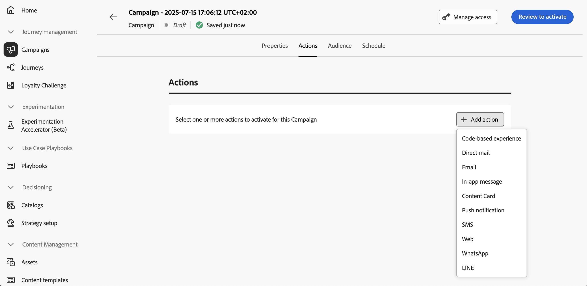
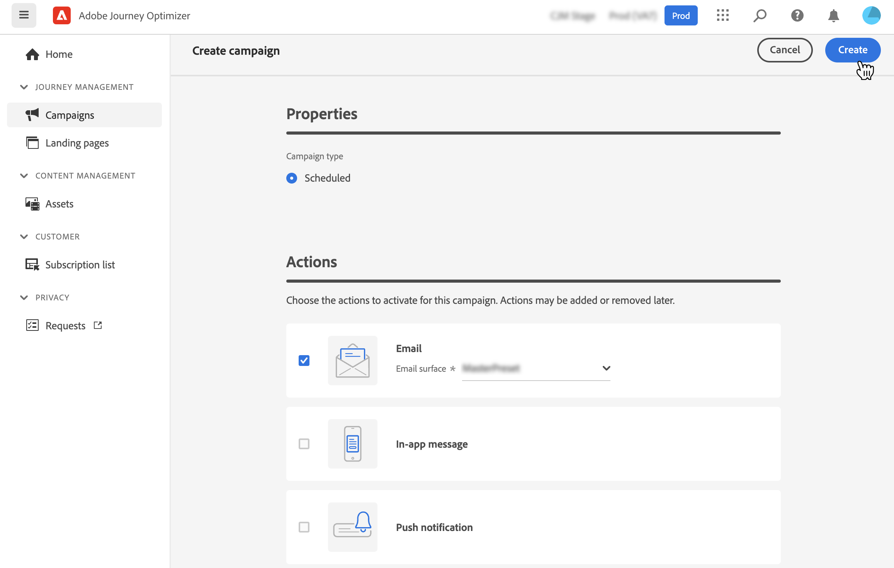

# Configurare l’azione della campagna {#action-campaign-action}

>[!BEGINSHADEBOX]

**In questa pagina:** configura l&#39;azione della campagna selezionando una configurazione di canale e canale insieme a ottimizzazione e contenuto multilingue e aggiungi più azioni in entrata in modo che la campagna distribuisca le esperienze giuste tra i canali.

>[!ENDSHADEBOX]

Utilizza la scheda **[!UICONTROL Azioni]** per selezionare una configurazione dei canali per il messaggio e configurare impostazioni aggiuntive, ad esempio il tracciamento, l’esperimento sul contenuto o il contenuto multilingue.

1. **Scegli il canale**

   Passa alla scheda **[!UICONTROL Azioni]**, fai clic sul pulsante **[!UICONTROL Aggiungi azione]** e seleziona il canale di comunicazione.

   

   >[!NOTE]
   >
   >Per ulteriori informazioni sui canali supportati, consulta la tabella in questa sezione: [Canali nei percorsi e nelle campagne](../channels/gs-channels.md#channels).
   >
   >I canali disponibili variano in base al modello di licenza e ai componenti aggiuntivi.

   Se selezioni un canale in entrata (esperienza basata su codice, messaggio in-app, scheda di contenuto o azione web), puoi aggiungere più azioni in entrata, per un totale massimo di 10 azioni in una singola campagna. [Scopri come](#multi-action)

1. **Seleziona una configurazione di canale**

   Una configurazione viene definita da un [amministratore di sistema](../start/path/administrator.md). Contiene tutti i parametri tecnici per l&#39;invio del messaggio, ad esempio parametri di intestazione, sottodominio, app mobili e così via. [Scopri come impostare le configurazioni del canale](../configuration/channel-surfaces.md)

   

1. **Ottimizzazione dell&#39;utilizzo**

   Utilizza la sezione **[!UICONTROL Ottimizzazione]** per eseguire esperimenti di contenuto, sfruttare le regole di targeting o utilizzare combinazioni avanzate di sperimentazione e targeting. Queste diverse opzioni e i passaggi da seguire sono descritti in [questa sezione](../content-management/gs-message-optimization.md).
<!--
1. **Create a content experiment**

    Use the **[!UICONTROL Content experiment]** section to define multiple delivery treatments in order to measure which one performs best for your target audience. Click the **[!UICONTROL Create experiment]** button then follow the steps detailed in this section: [Create a content experiment](../content-management/content-experiment.md).
-->

1. **Aggiungi contenuto multilingue**

   Utilizza la sezione **[!UICONTROL Lingue]** per creare contenuti in più lingue all’interno della campagna. A tale scopo, fai clic sul pulsante **[!UICONTROL Aggiungi lingue]** e seleziona le **[!UICONTROL impostazioni lingua]** desiderate. Informazioni dettagliate su come impostare e utilizzare le funzionalità multilingue sono disponibili in [questa sezione](../content-management/multilingual-gs.md).

Sono disponibili impostazioni aggiuntive a seconda del canale di comunicazione selezionato. Per ulteriori informazioni, espandi le sezioni seguenti.

+++**Applica regole limite** (e-mail, direct mailing, push, SMS)

Nell&#39;elenco a discesa **[!UICONTROL Regole aziendali]**, seleziona un set di regole per applicare le regole di limitazione alla campagna. L’utilizzo dei set di regole di canale consente di impostare i limiti di frequenza per tipo di comunicazione per evitare di sovraccaricare i clienti con messaggi simili. [Scopri come utilizzare i set di regole](../conflict-prioritization/rule-sets.md)

+++

+++**Rileva coinvolgimento** (e-mail, SMS).

Utilizza la sezione **[!UICONTROL Tracciamento delle azioni]** per tenere traccia di come i destinatari reagiscono alle consegne e-mail o SMS. I risultati del tracciamento sono accessibili dal rapporto della campagna una volta che è stata eseguita. [Ulteriori informazioni sui rapporti della campagna](../reports/campaign-global-report-cja.md).

+++

+++**Attiva modalità Consegna rapida** (Push).

La modalità Consegna rapida è un componente aggiuntivo [!DNL Journey Optimizer] che consente l&#39;invio molto rapido di messaggi push in volumi elevati tramite campagne. La consegna rapida viene utilizzata quando il ritardo nella consegna dei messaggi è business-critical, quando desideri inviare un avviso push urgente sui telefoni cellulari, ad esempio una notizia straordinaria agli utenti che hanno installato la tua app per il canale notizie. Scopri come abilitare la modalità Consegna rapida per le notifiche push [&#x200B; in questa pagina](../push/create-push.md#rapid-delivery).

Per ulteriori informazioni sulle prestazioni durante l’utilizzo della modalità Consegna rapida, consulta la [descrizione del prodotto Adobe Journey Optimizer](https://helpx.adobe.com/it/legal/product-descriptions/adobe-journey-optimizer.html){target="_blank"}.

+++

+++**Assegna punteggi di priorità** (Web, In-app, basati su codice)

L’assegnazione di un punteggio di priorità alla campagna ti consente di assegnare la priorità a una campagna in entrata in presenza di un vincolo imposto, ad esempio un limite di frequenza. Immetti un valore numerico (da 0 a 100). Tieni presente che più alto è il numero, maggiore è la priorità. [Scopri come assegnare punteggi di priorità a percorsi e campagne](../conflict-prioritization/priority-scores.md)

+++

+++**Imposta regole di consegna aggiuntive** (schede contenuto)

Per le campagne basate su schede di contenuto, puoi abilitare regole di consegna aggiuntive per scegliere gli eventi e i criteri di attivazione del messaggio. [Scopri come creare le schede dei contenuti](../content-card/create-content-card.md)

+++

+++**Definisci trigger** (in-app)

Per i messaggi in-app, puoi utilizzare il pulsante **[!UICONTROL Modifica trigger]** per scegliere gli eventi e i criteri che attivano il messaggio. [Scopri come creare un messaggio in-app](../in-app/create-in-app.md)

+++

## Aggiungere più azioni in entrata {#multi-action}

>[!CONTEXTUALHELP]
>id="ajo_multi_action"
>title="Aggiungere più azioni in entrata"
>abstract="Puoi selezionare diverse azioni in entrata all’interno di una singola campagna. Questa funzionalità consente di consegnare più esperienze basate su codice, messaggi in-app, schede di contenuto o azioni web in diverse posizioni contemporaneamente, ciascuna con contenuti specifici."

Per semplificare l’orchestrazione delle campagne, puoi definire diverse azioni in entrata all’interno di una singola campagna, ciascuna contenente un contenuto specifico.

>[!NOTE]
>
>Questa funzionalità è disponibile solo per i canali in entrata. Attualmente i canali in uscita come e-mail non sono supportati.

Questa funzionalità ti consente di distribuire varie esperienze basate su codice, messaggi in-app, schede di contenuto o azioni web a posizioni diverse in contemporanea, senza la necessità di creare più campagne. Semplifica l’implementazione della campagna e consente rapporti più fluidi, con tutti i dati consolidati in un’unica campagna.

Ad esempio, puoi inviare un’esperienza basata su codice a più endpoint con contenuti leggermente diversi. A questo scopo, crea più azioni basate su codice all’interno della stessa campagna, ciascuna con una configurazione di endpoint diversa.

Per definire diverse azioni in entrata in una campagna, segui i passaggi indicati di seguito.

1. Seleziona un&#39;azione in entrata (**Esperienza basata su codice**, **Messaggio in-app**, **Scheda contenuto** o **Web**) dalla sezione **[!UICONTROL Azioni]**.

1. Seleziona la configurazione del canale e definisci un contenuto specifico per tale azione.

1. Utilizza il pulsante **[!UICONTROL Aggiungi azione]** per selezionare un&#39;altra azione in entrata dall&#39;elenco a discesa.

   {width="80%"}

1. Procedi in modo simile per aggiungere altre azioni. Puoi aggiungere fino a 10 azioni in entrata in una campagna.

Una volta che la campagna è [live](review-activate-campaign.md), tutte le azioni vengono attivate contemporaneamente.

## Passaggi successivi {#next}

Quando l’azione della campagna è pronta, puoi progettarne il contenuto. [Ulteriori informazioni](campaign-content.md)
