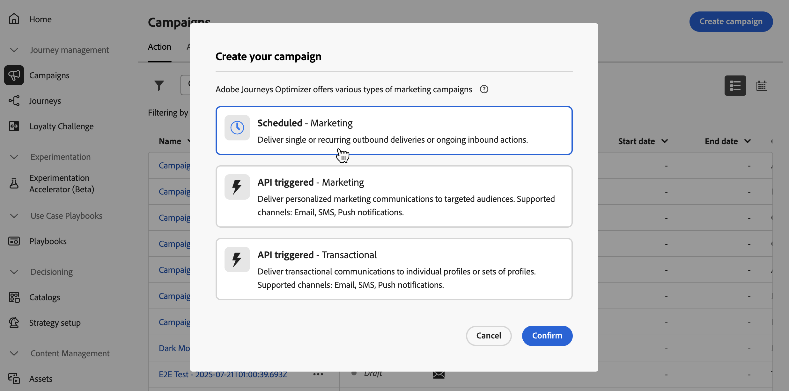

# Definire le proprietà della campagna di azione {#action-campaign-properties}

Per creare una campagna di azioni e definirne le proprietà, effettua le seguenti operazioni:

1. Passare al menu **[!UICONTROL Campagne]** e selezionare la scheda **[!UICONTROL Azione]**.

1. Fai clic sul pulsante **[!UICONTROL Crea campagna]** e seleziona il tipo di campagna **[!UICONTROL Pianificato - Marketing]**.

   

1. Nella scheda **[!UICONTROL Proprietà]**, immetti un nome e una descrizione per la campagna.

   

1. Utilizza il campo **Tag** per assegnare alla campagna i tag unificati di Adobe Experience Platform. Questo consente di classificarle facilmente e migliorare la ricerca dall’elenco delle campagne. [Scopri come utilizzare i tag](../start/search-filter-categorize.md#tags).

1. Puoi limitare l’accesso a questa campagna in base alle etichette di accesso. Per aggiungere un limite di accesso, seleziona il pulsante **[!UICONTROL Gestisci accesso]** nella parte superiore della pagina. Assicurati di selezionare solo le etichette per le quali disponi dell’autorizzazione. [Ulteriori informazioni sul controllo degli accessi a livello di oggetto](../administration/object-based-access.md).

## Passaggi successivi {#next}

Una volta creata e configurata la campagna di azione, puoi configurarne l’azione. [Ulteriori informazioni](campaign-action.md)
