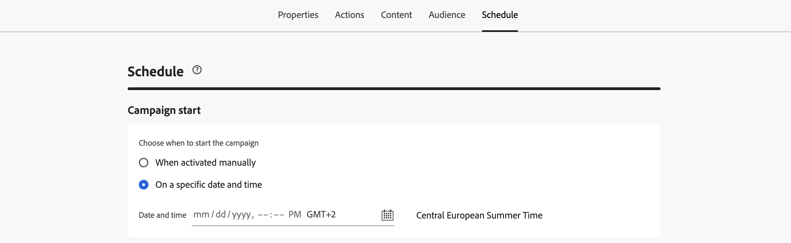
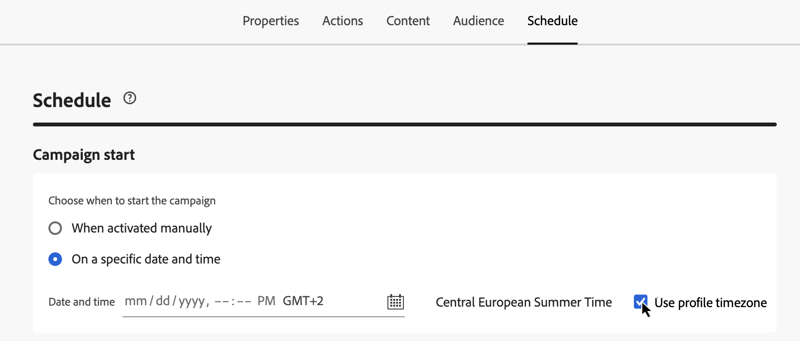
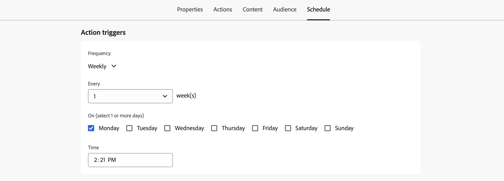
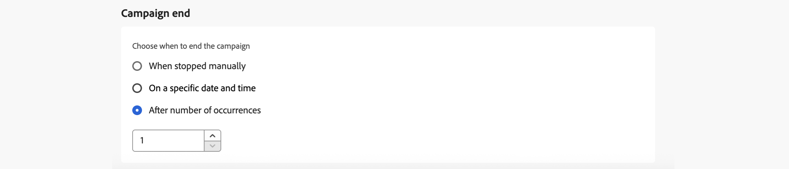

# Pianificare la campagna Azione {#action-campaign-schedule}

Utilizza la scheda **[!UICONTROL Pianificazione]** per definire la pianificazione della campagna.

## Impostare una data di inizio campagna

Per impostazione predefinita, le campagne di azione iniziano una volta attivate manualmente e terminano non appena il messaggio viene inviato una volta. Se non desideri eseguire la campagna subito dopo l&#39;attivazione, puoi specificare la data e l&#39;ora dell&#39;invio del messaggio nella sezione **[!UICONTROL Inizio campagna]**.

Quando pianifichi campagne in [!DNL Adobe Journey Optimizer], assicurati che la data/ora di inizio sia allineata alla prima consegna desiderata. Per le campagne ricorrenti, se l’ora pianificata iniziale è già passata, le campagne passeranno al successivo intervallo di tempo disponibile in base alle relative regole di ricorrenza.

## Invia all’ora locale del destinatario {#profile-timezone}

>[!CONTEXTUALHELP]
>id="ajo_campaigns_schedule_profile_timezone"
>title="Usa fuso orario del profilo"
>abstract="Invia messaggi in base al fuso orario del profilo di ciascun destinatario. Tutti i destinatari riceveranno il messaggio alla stessa ora locale, indipendentemente dalla loro posizione geografica. Il sistema utilizza il campo &quot;timeZone&quot; dai profili Adobe Experience Platform, con il fuso orario del creatore della campagna come fallback."

Quando pianifichi una campagna per una data e un’ora specifiche, puoi scegliere di inviare messaggi in base al fuso orario del profilo di ciascun destinatario. In questo modo tutti i destinatari ricevono il messaggio alla stessa ora locale, indipendentemente dalla loro posizione geografica.

Ad esempio, se pianifichi una campagna da inviare alle 9 utilizzando il fuso orario del profilo, i destinatari a New York (ET) la riceveranno alle 9 (ET), mentre i destinatari a Los Angeles (PT) la riceveranno alle 9 (PT).

>[!AVAILABILITY]
>
>La pianificazione utilizzando i fusi orari del profilo è disponibile solo per questi canali in uscita: E-mail, Push, SMS, WhatsApp e LINE.

Per abilitare la pianificazione del fuso orario del profilo:

1. Nella sezione **[!UICONTROL Inizio campagna]**, specifica la data e l&#39;ora in cui il messaggio deve essere inviato.

1. Abilita l&#39;opzione **[!UICONTROL Usa fuso orario del profilo]**.

   

**Funzionamento:**

Il sistema utilizza il campo `profile.timeZone` del profilo Adobe Experience Platform di ogni destinatario per determinare il proprio fuso orario locale. Se un profilo non ha un valore di fuso orario, il sistema utilizza come fallback il fuso orario in cui è stata creata la campagna.

La campagna rimane nello stato **Live** mentre i messaggi vengono recapitati in tutti i fusi orari. Una volta elaborati tutti i fusi orari, lo stato della campagna diventa **Completata**.

**Identificatori fuso orario supportati:**

Il formato `profile.timeZone` può essere una denominazione IANA o definito come offset UTC. La denominazione IANA è il formato preferito, in quanto si regola automaticamente per le regole di risparmio dell’ora legale.

Per la denominazione IANA, gli identificatori fanno distinzione tra maiuscole e minuscole e devono corrispondere alla denominazione IANA ufficiale. Gli offset possono cambiare nel tempo a causa delle regole di salvataggio dell&#39;ora legale e degli aggiornamenti cronologici. Per l&#39;elenco ufficiale degli identificatori, fare riferimento al [database del fuso orario IANA](https://www.iana.org/time-zones){_blank}.

## Impostare una frequenza di esecuzione

Per le azioni **E-mail**, **SMS** e **Notifica push**, puoi definire una frequenza con cui inviare il messaggio della campagna. A questo scopo, utilizza le opzioni **[!UICONTROL Action triggers]** nella schermata di creazione della campagna per specificare se la campagna deve essere eseguita ogni giorno, ogni settimana o ogni mese.

>[!NOTE]
>
>Per le azioni **email**, puoi creare campagne di attivazione del piano di riscaldamento IP specifiche. La pianificazione della campagna sarà guidata dal piano di riscaldamento IP a cui sarà associata, il che significa che la pianificazione non è più definita nella campagna stessa. [Scopri come creare campagne di riscaldamento IP](../configuration/ip-warmup-campaign.md).

## Impostare una data di fine

La sezione **[!UICONTROL Fine campagna]** ti consente di specificare quando interrompere l&#39;esecuzione di una campagna. Al di fuori delle date specificate, la campagna non verrà eseguita.

## Imposta il controllo della frequenza

[!DNL Journey Optimizer] consente di abilitare il controllo della frequenza per le azioni in uscita (e-mail, SMS, notifiche push).

Questa funzione è particolarmente utile per prevenire il sovraccarico sui sistemi a valle, come le pagine di destinazione o le piattaforme di assistenza clienti. Ad esempio, puoi impostare un limite di velocità di 165 messaggi al secondo per garantire una consegna costante senza sovraccaricare i sistemi a valle.

Per impostare il controllo della velocità, abilita l&#39;opzione **[!UICONTROL Limita consegna]** nella sezione **[!UICONTROL Impostazioni consegna]** e specifica la **[!UICONTROL Velocità di consegna]** al secondo desiderata.

* Velocità minima di consegna supportata: 1 al secondo.
* Velocità massima di consegna supportata: 2000 al secondo quando l’opzione &quot;Limita consegna&quot; è abilitata.

>[!IMPORTANT]
>
>Quando si imposta una frequenza di consegna, l’intervallo di tempo massimo per il quale il pubblico della campagna può essere eseguito è di 12 ore. Se la velocità di consegna è impostata su un valore che non consente a tutto il pubblico di ricevere il messaggio nell’arco di 12 ore, i profili rimanenti vengono esclusi dalla campagna. Puoi visualizzare il conteggio di questi profili esclusi nel rapporto della campagna.

## Inviare utilizzando gli scaglioni

Per consegnare il messaggio della campagna in batch nel tempo, anziché in una sola volta, puoi utilizzare l’invio ondata. Questo consente di bilanciare il carico, supportare il recapito messaggi ed evitare di sopraffare i sistemi a valle (ad esempio, call center o pagine di destinazione). Potete definire il numero di scaglioni, la loro dimensione (in percentuale o numero assoluto) e la pianificazione per ogni scaglione.

[Scopri come inviare utilizzando le ondate](send-using-waves.md).

## Passaggi successivi {#next}

Una volta che la pianificazione della campagna è pronta, puoi rivederla e attivarla. [Ulteriori informazioni](review-activate-campaign.md)
