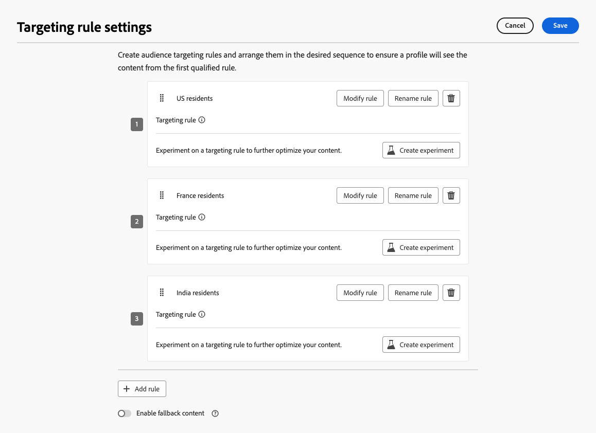
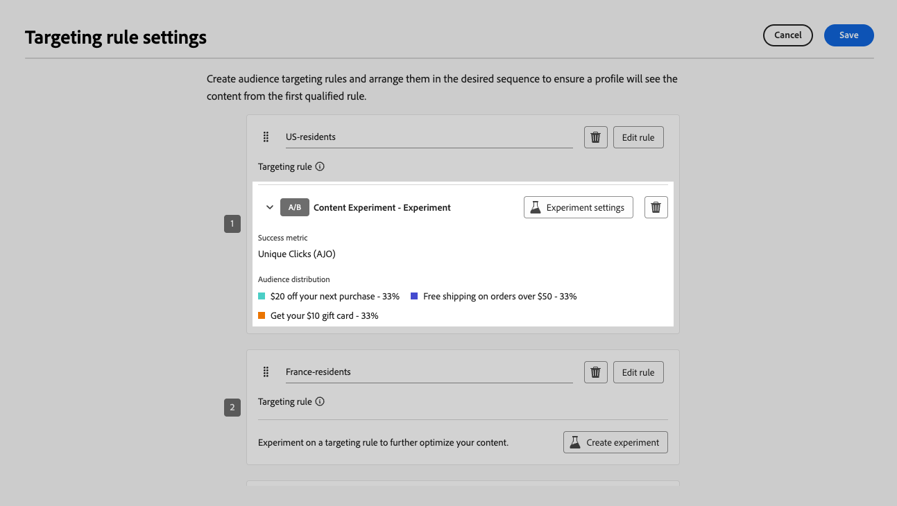

# Ottimizzazione in campagne e percorsi {#message-optimization}

L&#39;ottimizzazione ti offre gli strumenti per fornire al tuo pubblico contenuti personalizzati e ottimizzati, <!--based on marketer-defined advanced decision configurations. This ensures that the right message reaches the right audience at the right time in order to maximize the effectiveness of your campaigns. (Removed for now as Decisioning is not yet supported)-->assicurandoti il massimo coinvolgimento e successo nella creazione di <!--customized and -->percorsi e campagne efficaci.

Con l&#39;ottimizzazione è possibile:

* Sfrutta [regole di targeting](#targeting)
* Esegui [esperimenti di contenuto](#experimentation)
* Utilizza [combinazioni avanzate](#combination) sia di sperimentazione che di targeting all&#39;interno di una singola campagna

Una volta che il percorso o la campagna è in esecuzione, i profili vengono valutati in base ai criteri definiti e, in base ai criteri di corrispondenza, vengono consegnati con l’esperienza o il contenuto appropriato dal percorso/campagna.

La differenza tra esperimenti e targeting può essere descritta come segue:

* La sperimentazione consiste in una suddivisione casuale nella distribuzione dei contenuti in base all’allocazione del traffico&#x200B;.
* Il targeting utilizza tecniche deterministiche per distribuire contenuti in base al profilo utente, all’iscrizione al pubblico o a regole basate sul contesto.

{width="110%" zoomable="yes"}

➡️ [Ulteriori informazioni sull&#39;ottimizzazione in una campagna in questo video](#video)

## Utilizzo del targeting {#targeting}

>[!CONTEXTUALHELP]
>id="ajo_content_targeting_fallback"
>title="Cos’è il contenuto di fallback?"
>abstract="Il contenuto di fallback consente al pubblico di ricevere un contenuto predefinito quando non è stata qualificata alcuna regola di targeting. Se non selezioni questa opzione, i tipi di pubblico non idonei per una regola di targeting definita sopra non riceveranno contenuto."

Il targeting offre contenuti personalizzati a segmenti di pubblico specifici in base agli attributi del profilo utente o agli attributi contestuali.

A differenza della sperimentazione, che è un’assegnazione casuale del contenuto di un messaggio, il targeting è deterministico in termini di distribuzione del contenuto al pubblico giusto.

Con il targeting è possibile definire regole specifiche in base a:

* **Attributi del profilo utente** come la posizione (esempio: geotargeting), età o preferenze. Ad esempio, negli Stati Uniti gli utenti possono vedere una promozione &quot;Golden Gate&quot;, mentre in Francia gli utenti possono vedere una promozione &quot;Eiffel Tower&quot;.

* **Dati contestuali** come tipo di dispositivo (esempio: device-targeting), l’ora del giorno o i dettagli della sessione. Ad esempio, gli utenti desktop ricevono contenuti ottimizzati per il desktop, mentre gli utenti mobili ricevono contenuti ottimizzati per il mobile.

* **Tipi di pubblico** che possono essere utilizzati per includere o escludere profili con una particolare appartenenza al pubblico.

Per impostare il targeting, segui i passaggi indicati di seguito.

1. Crea un [percorso](../building-journeys/journey-gs.md#jo-build) o una [campagna](../campaigns/create-campaign.md).

   >[!NOTE]
   >
   >Se fai parte di un percorso, aggiungi un&#39;attività **[!UICONTROL Azione]**, scegli un&#39;attività canale e seleziona **[!UICONTROL Configura azione]**. [Ulteriori informazioni](../building-journeys/journey-action.md#add-action)

1. Dalla scheda **[!UICONTROL Azioni]**, seleziona almeno un&#39;azione.

1. Nella sezione **[!UICONTROL Ottimizzazione]**, seleziona **[!UICONTROL Crea regola di targeting]**.

   {width=85%}

1. Fai clic su **[!UICONTROL Crea regola]** > **[!UICONTROL Crea nuovo]** e utilizza il generatore di regole per definire i criteri in movimento.

   {width=100%}

   Ad esempio, definisci una regola per i residenti negli Stati Uniti, una regola per i residenti in Francia e una regola per i residenti in India.

   {width=85%}

1. Puoi anche fare clic su **[!UICONTROL Crea regola]** > **[!UICONTROL Seleziona regola]** per selezionare una regola di targeting esistente creata dal menu **[!UICONTROL Regole]**. [Ulteriori informazioni](../experience-decisioning/rules.md)

   {width=70%}

   In questo caso, la formula che costituisce la regola viene semplicemente copiata nel percorso o nella campagna. Eventuali modifiche successive apportate alla regola dal menu **[!UICONTROL Regole]** non influiranno sulla copia del percorso o della campagna.

   >[!AVAILABILITY]
   >
   >[La creazione di regole di targeting](../experience-decisioning/rules.md#create) dal menu dedicato [!DNL Journey Optimizer] è attualmente disponibile per le organizzazioni che hanno acquistato l&#39;offerta del componente aggiuntivo Decisioning e per le altre organizzazioni (disponibilità limitata).
   >
   >Questa capacità verrà gradualmente estesa a tutti i clienti. Nel frattempo, contatta il tuo rappresentante Adobe per ottenere l’accesso.

1. Dopo aver aggiunto una regola, puoi comunque modificarla. Scegli **[!UICONTROL Modifica in linea]** per aggiornarlo in movimento utilizzando il generatore di regole, oppure **[!UICONTROL Seleziona regola]** per raccogliere un&#39;altra regola esistente.

   {width=100%}

   >[!NOTE]
   >
   >La modifica in linea di una regola non influisce sulla regola esistente da cui ha origine.

1. Selezionare l&#39;opzione **[!UICONTROL Abilita contenuto di fallback]** in base alle esigenze. Il contenuto di fallback consente al pubblico di ricevere un contenuto predefinito quando non sono qualificate regole di targeting.

   >[!NOTE]
   >
   >Se non selezioni questa opzione, i tipi di pubblico non idonei per una regola di targeting definita sopra non riceveranno contenuto.

1. Salva le impostazioni della regola di targeting.

1. Nella scheda **[!UICONTROL Azioni]**, seleziona **[!UICONTROL Modifica contenuto]**.

1. Progetta il contenuto appropriato per ogni gruppo definito dalle impostazioni delle regole di targeting.

   {width=85%}

   In questo esempio, progetta un contenuto specifico per i residenti negli Stati Uniti, un contenuto diverso per i residenti francesi e un altro contenuto per i residenti in India.

1. [Attiva](review-activate-campaign.md) il percorso o la campagna.

Una volta che il percorso/la campagna è attivo, vengono inviati contenuti personalizzati per ciascun target in modo che i residenti degli Stati Uniti ricevano un messaggio specifico, i residenti della Francia un messaggio diverso e così via.

<!--Default content:

* If no targeting rules match, default content can be delivered.

* If default content is not enabled, passthrough behavior ensures lower-priority campaigns are evaluated.-->

## Utilizzare la sperimentazione {#experimentation}

La sperimentazione consente di testare più versioni di contenuto per determinare quale offre le migliori prestazioni in base a metriche di successo predefinite.

Per impostare la sperimentazione, segui i passaggi riportati di seguito.

Supponiamo che tu voglia testare i seguenti messaggi promozionali in una campagna:

* **Trattamento A**: &quot;20% di sconto sul prossimo acquisto&quot;
* **Trattamento B**: &quot;Spedizione gratuita per ordini superiori a $50&quot;
* **Trattamento C**: &quot;Ottieni la tua gift card da $ 10&quot;

Per impostare la sperimentazione e determinare quale messaggio determina il maggior numero di acquisti, segui i passaggi seguenti.

1. Crea un [percorso](../building-journeys/journey-gs.md#jo-build) o una [campagna](../campaigns/create-campaign.md).

   >[!NOTE]
   >
   >Se fai parte di un percorso, aggiungi un&#39;attività **[!UICONTROL Azione]**, scegli un&#39;attività canale e seleziona **[!UICONTROL Configura azione]**. [Ulteriori informazioni](../building-journeys/journey-action.md#add-action)

1. Dalla scheda **[!UICONTROL Azioni]**, seleziona due azioni in entrata, ad esempio [esperienza basata su codice](../code-based/get-started-code-based.md) e [In-app](../../rp_landing_pages/in-app-landing-page.md).

1. Nella sezione **[!UICONTROL Ottimizzazione]**, seleziona **[!UICONTROL Crea esperimento]**.

   {width=85%}

1. Progetta e configura l’esperimento sui contenuti come desideri. [Scopri come](../content-management/content-experiment.md)

   {width=85%}

   Una volta definito, l&#39;esperimento viene applicato a tutte le azioni inserite in quella campagna o tramite l&#39;attività di percorso **[!UICONTROL Azione]**, il che significa che gli stessi clienti visualizzano le stesse offerte su tutte le superfici.

   >[!NOTE]
   >
   >Puoi selezionare altre azioni: la sperimentazione si applica a tutte le azioni aggiunte alla campagna o all’azione di percorso.

1. [Attiva](review-activate-campaign.md) il percorso o la campagna.

Una volta che il percorso/la campagna è attivo, agli utenti vengono assegnate in modo casuale le diverse varianti di contenuto. [!DNL Journey Optimizer] tiene traccia della variante che determina più acquisti e fornisce informazioni fruibili.

Segui il successo della tua campagna con i report [percorso](../reports/journey-global-report-cja.md) e [campagna](../reports/campaign-global-report-cja-experimentation.md). <!--Link to Experimentation journey reportis missing-->

## Combinare targeting e sperimentazione {#combination}

Journey Optimizer consente inoltre di combinare il targeting e gli esperimenti all’interno di un singolo percorso o campagna per creare strategie più sofisticate.

In effetti, puoi utilizzare il targeting per creare diverse varianti e, per ogni variante, utilizzare la sperimentazione per ottimizzare ulteriormente ogni contenuto. In questo modo gli esperimenti sono specifici per ogni regola di targeting e non si estendono su più varianti.

Ad esempio, puoi provare una promozione del 50% rispetto a una gift card da 50 dollari per i clienti negli Stati Uniti e testare in modo diverso i clienti in Europa, ad esempio la spedizione gratuita su ordini superiori a 50 euro rispetto al 20% di sconto sul prossimo acquisto.

Per combinare sia il targeting che gli esperimenti in un percorso o in una campagna, segui i passaggi riportati di seguito.

1. Crea un percorso o una campagna in cui puoi definire diverse regole di targeting. [Scopri come](#targeting)

   {width=85%}

1. Crea un esperimento per la prima regola di targeting.

1. Progetta e configura l’esperimento sui contenuti come desideri. [Scopri come](../content-management/content-experiment.md)

   {width=85%}

   Una volta definita la sperimentazione, questa si applica solo alla prima regola di targeting.

1. Nella scheda **[!UICONTROL Azioni]**, seleziona **[!UICONTROL Modifica contenuto]**.

1. Per il gruppo definito dalla prima regola di targeting, puoi definire un contenuto specifico per ogni variante dell’esperimento.

   Se hai aggiunto più di un’azione in entrata al percorso o alla campagna, a ogni azione si applica la stessa combinazione di targeting ed esperimento. Tuttavia, devi definire un contenuto specifico per ogni variante di ciascuna azione.

   {width=85%}

1. Procedi in modo simile per le altre regole di targeting e progetta il contenuto corrispondente per ogni variante.

1. Salva le modifiche e [attiva](review-activate-campaign.md) il percorso o la campagna.

Una volta che il percorso/la campagna è attivo, agli utenti di ciascun gruppo target vengono assegnate in modo casuale le diverse varianti di contenuto definite per il gruppo a cui appartengono.

<!--
## Reporting on Message optimization

E.g. explaining how a marketer can look at the report to determine which treatment (e.g. which message content) is performing the best for the targeting audience
-->

## Video dimostrativo{#video}

Scopri come sfruttare l’ottimizzazione dei messaggi nelle campagne attivate da azioni o da API. Scoprirai come eseguire il targeting dei tipi di pubblico secondari, creare varianti di messaggio per posizione, abilitare il contenuto di fallback ed eseguire più esperimenti all’interno di una singola campagna. Questo tutorial illustra anche come gestire le campagne multicanale mantenendo al contempo la coerenza dei messaggi.

>[!VIDEO](https://video.tv.adobe.com/v/3470368?quality=12)