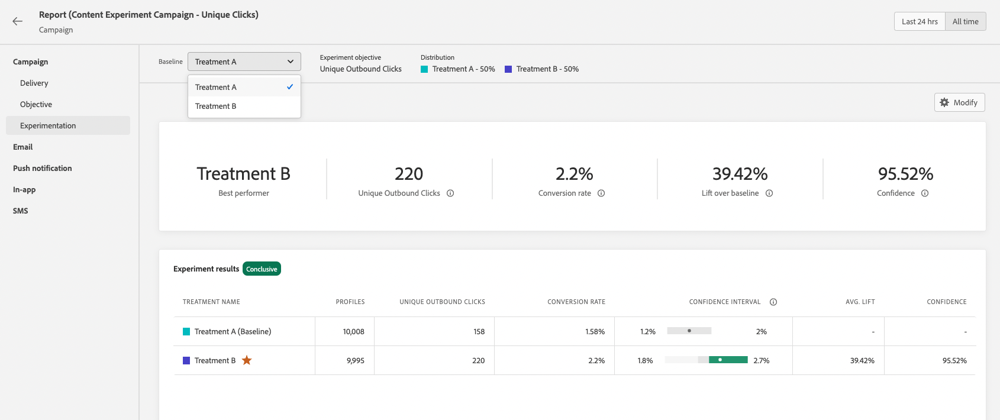

# Creare un esperimento sui contenuti {#content-experiment}

>[!CONTEXTUALHELP]
>id="ajo_campaigns_content_experiment"
>title="Esperimento sui contenuti"
>abstract="Puoi scegliere di variare il contenuto, l’oggetto o il mittente della consegna al fine di definire più trattamenti di consegna e determinare la combinazione migliore per il pubblico."

>[!BEGINSHADEBOX]

Cosa troverai in questa documentazione:

* [Introduzione all’esperimento sui contenuti](get-started-experiment.md)
* **[Creare un esperimento sui contenuti](content-experiment.md)**
* [Comprendere i calcoli statistici](experiment-calculations.md)
* [Configurare i rapporti sulla sperimentazione](reporting-configuration.md)
* [Calcoli statistici nel rapporto di sperimentazione](experiment-report-calculations.md)

>[!ENDSHADEBOX]

L’esperimento sui contenuti di Journey Optimizer consente di definire più trattamenti di consegna per misurare quale offre le migliori prestazioni per il pubblico di destinazione. Puoi scegliere di variare il contenuto, l’oggetto o il mittente della consegna. Il pubblico di interesse viene allocato in modo casuale a ciascun trattamento per determinare quale funziona meglio in termini di metrica specificata.

>[!NOTE]
>
>Prima di iniziare con Content Experiment, assicurati che la configurazione del reporting sia impostata per i set di dati personalizzati. Ulteriori informazioni in [questa sezione](reporting-configuration.md).

Nell’esempio seguente, l’obiettivo di consegna è stato suddiviso in due gruppi, ciascuno dei quali rappresenta il 45% della popolazione target e un gruppo di riserva del 10%, che non riceverà la consegna.

Ogni persona nel pubblico di destinazione riceverà una versione di un’e-mail, con un oggetto che corrisponde a uno dei due seguenti:

* uno promuove direttamente un’offerta del 10% sulla nuova collezione e un’immagine.
* l&#39;altra si limita a pubblicizzare un&#39;offerta speciale senza specificare il 10% di sconto senza alcuna immagine.

L’obiettivo qui è vedere se i destinatari interagiscono con l’e-mail a seconda dell’esperimento ricevuto. Pertanto sceglieremo **[!UICONTROL Aperture e-mail]** come metrica di obiettivo principale in questo esperimento sui contenuti.

## Creare la campagna {#campaign-experiment}

1. Dalla sezione **[!UICONTROL Campagne]** pagina, fai clic su **[!UICONTROL Crea campagna]**.

   

<!--
1. In the **[!UICONTROL Properties]** section, choose your **[!UICONTROL Campaign type]**:

    * **[!UICONTROL Scheduled]**: designed to send marketing messages and can be executed immediately or at a specified date.

    * **[!UICONTROL API-Triggered]**: designed to send transactional messages, such as password reset notifications or cart abandonment reminders. 
    
        To execute an API-triggered campaign, you will need to make an API call. [Learn more](api-triggered-campaigns.md)
-->
1. Seleziona il tuo canale e quindi **[!UICONTROL Superficie]** desideri utilizzare per questa consegna e fai clic su **[!UICONTROL Crea]**. Per ulteriori informazioni, consulta [Superfici di canale](../configuration/channel-surfaces.md) pagina.

   

1. Configurare **[!UICONTROL Proprietà]** della consegna:
   * **[!UICONTROL Nome]**
   * **[!UICONTROL Descrizione]**

1. Definisci il pubblico di destinazione. A questo scopo, fai clic su **[!UICONTROL Seleziona pubblico]** per visualizzare l’elenco dei segmenti di Adobe Experience Platform disponibili. [Ulteriori informazioni sui segmenti](../segment/about-segments.md)

   In **[!UICONTROL Spazio dei nomi dell’identità]** , scegli lo spazio dei nomi da utilizzare per identificare i singoli utenti dal segmento selezionato. [Ulteriori informazioni](get-started-experiment.md#content-experiment-work)

   

1. In **[!UICONTROL Tracciamento delle azioni]** , specifica se desideri tenere traccia della reazione dei destinatari alla consegna: puoi tenere traccia dei clic e/o delle aperture.

   I risultati del tracciamento saranno accessibili dal rapporto della campagna una volta eseguita la campagna.

1. Per eseguire la campagna in una data specifica o con una frequenza ricorrente, configura la **[!UICONTROL Pianificazione]** sezione. [Ulteriori informazioni](create-campaign.md)

1. Clic **[!UICONTROL Modifica contenuto]** per iniziare a personalizzare la consegna. [Ulteriori informazioni](../email/content-from-scratch.md)

   

1. Dalla sezione **[!UICONTROL Modifica contenuto]** finestra, iniziare a personalizzare il trattamento A.

   Per questo trattamento, specificheremo l’offerta speciale direttamente nell’oggetto e aggiungeremo la personalizzazione.

   

## Configurare l’esperimento sui contenuti {#configure-experiment}

1. Quando la consegna è stata personalizzata, dalla pagina di riepilogo della campagna fai clic su **[!UICONTROL Crea esperimento]** per iniziare a configurare l’esperimento sui contenuti.

   

1. Seleziona la **[!UICONTROL Metrica di successo]** desideri impostare per l’esperimento.

   Per il nostro esperimento, selezioniamo **[!UICONTROL E-mail aperta]** per verificare se i destinatari apriranno le e-mail se il codice promozionale è nella riga dell’oggetto.

   

1. Clic **[!UICONTROL Aggiungi trattamento]** per creare il maggior numero di nuovi trattamenti necessario.

   

1. Modificare il **[!UICONTROL Titolo]** del trattamento per differenziarli meglio.

1. Scegli di aggiungere una **[!UICONTROL Blocco]** raggruppa per la consegna. Questo gruppo non riceverà alcun contenuto da questa campagna.

   Se passi alla barra di attivazione, riceverai automaticamente il 10% della tua popolazione; se necessario puoi regolare questa percentuale.

   

1. Puoi quindi scegliere di allocare una percentuale precisa a ciascuno **[!UICONTROL Trattamento]** o semplicemente accendere il **[!UICONTROL Distribuisci uniformemente]** barra di selezione.

   

1. Clic **[!UICONTROL Crea]** quando la configurazione è impostata.

## Progettare i trattamenti {#treatment-experiment}

1. Dalla sezione **[!UICONTROL Modifica contenuto]** finestra, selezionare il trattamento B per modificare il contenuto.

   In questo caso, scegliamo di non specificare l’offerta nel **[!UICONTROL Oggetto]**.

   

1. Clic **[!UICONTROL Modifica corpo dell’e-mail]** per personalizzare ulteriormente il trattamento B.

   

1. Dopo aver progettato i trattamenti, fai clic su **[!UICONTROL Altre azioni]** per accedere alle opzioni relative ai trattamenti: **[!UICONTROL Rinomina]**, **[!UICONTROL Duplica]** e **[!UICONTROL Elimina]**.

   

1. Se necessario, accedi a **[!UICONTROL Impostazioni esperimento]** per modificare la configurazione dei trattamenti.

   

1. Una volta definito il contenuto del messaggio, fai clic su **[!UICONTROL Simula contenuto]** per controllare il rendering della consegna e controllare le impostazioni di personalizzazione con i profili di test. [Ulteriori informazioni](../email/preview.md)

1. Quando l’esperimento sui contenuti è pronto, dalla pagina di riepilogo della campagna puoi fare clic su **[!UICONTROL Controlla per attivare]** per visualizzare un riepilogo della campagna. Gli avvisi vengono visualizzati se un parametro è errato o mancante.

   

1. Verifica che la campagna sia configurata correttamente, quindi fai clic su **[!UICONTROL Attiva]** per avviarlo.

   

Dopo aver configurato la sperimentazione e la campagna, puoi seguire il successo della consegna con il rapporto della campagna.

## Relazione sugli obiettivi {#objectives-global}

>[!AVAILABILITY]
>
>La funzione di esperimento sui contenuti è attualmente disponibile solo per un set di organizzazioni (disponibilità limitata). Per ulteriori informazioni, contatta il tuo rappresentante Adobe.

Il **[!UICONTROL Obiettivi]** del rapporto Campaign ti consente di perfezionare meglio i rapporti delle consegne eseguendo il targeting di una metrica specifica.

Il **[!UICONTROL Obiettivi]** elencati sono collegati a **[!UICONTROL Set di dati]** che definiscono una connessione a un sistema per il recupero di informazioni aggiuntive. Elenco di elementi incorporati **[!UICONTROL Obiettivi]** è disponibile, ma puoi aggiungerne uno nuovo aggiungendo nuove **[!UICONTROL Set di dati]**. Per la procedura dettagliata, fare riferimento al seguente [sezione](reporting-configuration.md).

Dopo aver selezionato gli obiettivi di destinazione, i due **[!UICONTROL Panoramica delle prestazioni]** e **[!UICONTROL Finalità della campagna]** I widget forniranno un riepilogo dettagliato delle prestazioni di consegna.

Con il **[!UICONTROL Finalità della campagna]** widget, puoi anche scegliere di confrontare l’obiettivo principale con un’altra metrica.

Ogni widget può essere ridimensionato ed eliminato, se necessario. Per ulteriori informazioni, consulta questa [sezione](../reports/global-report.md#modify-dashboard).

## Rapporto sulla sperimentazione {#experimentation-global}

>[!CONTEXTUALHELP]
>id="ajo_campaigns_content_experiment_click"
>title="Metrica Successo"
>abstract="Valore totale della metrica Successo, precedentemente selezionata durante la creazione degli esperimenti, diviso per il numero di profili."

>[!AVAILABILITY]
>
>La funzione di esperimento sui contenuti è attualmente disponibile solo per un set di organizzazioni (disponibilità limitata). Per ulteriori informazioni, contatta il tuo rappresentante Adobe.

Dalla campagna **[!UICONTROL Rapporto globale]**, il **[!UICONTROL Sperimentazione]** La scheda descrive le informazioni principali relative alle prestazioni di ogni variante e all’eventuale migliore prestazione.

La definizione dell&#39;esecutore migliore potrebbe richiedere un po&#39; di tempo, sarà rappresentata da questa icona .

Il **[!UICONTROL Risultato esperimento]** il widget descrive le prestazioni di ogni variante. È possibile modificare la linea di base selezionando uno dei trattamenti tra **[!UICONTROL Linea di base]** il menu a discesa. Il miglior trattamento sarà rappresentato da un’icona a forma di stella.

La tabella presenta le metriche seguenti:

* **[!UICONTROL Profili]**: numero di profili target per questo trattamento.

* **[!UICONTROL Clic in uscita univoci]**: numero totale di clic tra i canali in uscita.

* **[!UICONTROL Conteggio per profilo]**: valore totale della metrica di finalità dell’esperimento diviso per il numero di profili.

* **[!UICONTROL Intervallo di affidabilità]**: differenza percentuale nelle prestazioni tra la linea di base e il trattamento dalle prestazioni migliori. [Maggiori informazioni](../campaigns/experiment-calculations.md#confidence-intervals).

* **[!UICONTROL Incremento medio]**: miglioramento percentuale del tasso di conversione di un dato trattamento rispetto al basale. [Ulteriori informazioni](../campaigns/experiment-calculations.md#understand-lift)

* **[!UICONTROL Affidabilità]**: evidenza che un dato trattamento è uguale al trattamento di base. [Ulteriori informazioni](../campaigns/experiment-calculations.md#understand-confidence)

Per informazioni approfondite su questi risultati e su come interpretarli, consulta [questa pagina](../campaigns/get-started-experiment.md#interpret-results).
