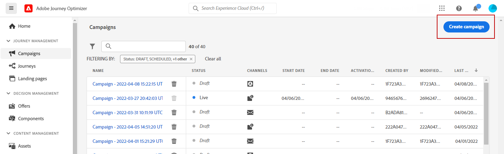
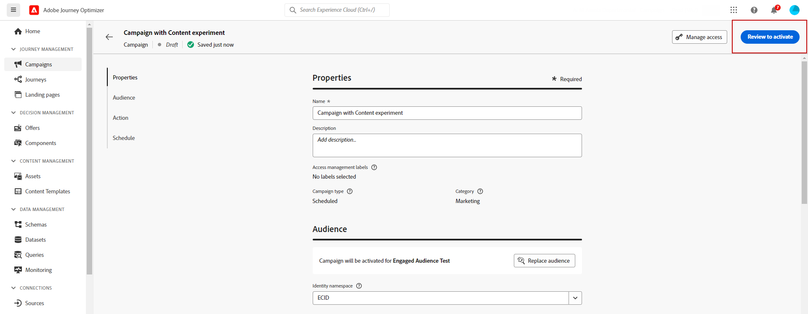

# Creare un esperimento sui contenuti {#content-experiment}

>[!CONTEXTUALHELP]
>id="ajo_campaigns_content_experiment"
>title="Esperimento sui contenuti"
>abstract="Puoi scegliere di variare il contenuto del messaggio, l’oggetto o il mittente per definire più trattamenti e determinare la combinazione migliore per il pubblico."

>[!NOTE]
>
>Prima di iniziare con Content Experiment, assicurati che la configurazione del reporting sia impostata per i set di dati personalizzati. Ulteriori informazioni in [questa sezione](reporting-configuration.md).

L’esperimento sui contenuti di Journey Optimizer consente di definire più trattamenti di consegna per misurare quale offre le migliori prestazioni per il pubblico di destinazione. Puoi scegliere di variare il contenuto, l’oggetto o il mittente della consegna. Il pubblico di interesse viene allocato in modo casuale a ciascun trattamento per determinare quale funziona meglio in termini di metrica specificata.

Nell’esempio seguente, l’obiettivo di consegna è stato suddiviso in due gruppi, ciascuno dei quali rappresenta il 45% della popolazione target e un gruppo di riserva del 10%, che non riceverà la consegna.

Ogni persona nel pubblico di destinazione riceverà una versione di un’e-mail, con un oggetto che corrisponde a uno dei due seguenti:

* uno promuove direttamente un’offerta del 10% sulla nuova collezione e un’immagine.
* l&#39;altra si limita a pubblicizzare un&#39;offerta speciale senza specificare il 10% di sconto senza alcuna immagine.

L’obiettivo qui è vedere se i destinatari interagiscono con l’e-mail a seconda dell’esperimento ricevuto. Pertanto sceglieremo **[!UICONTROL Aperture e-mail]** come metrica di obiettivo principale in questo esperimento sui contenuti.

## Creare la campagna {#campaign-experiment}

1. Dalla sezione **[!UICONTROL Campagne]** pagina, fai clic su **[!UICONTROL Crea campagna]**.

   

<!--
1. In the **[!UICONTROL Properties]** section, choose your **[!UICONTROL Campaign type]**:

    * **[!UICONTROL Scheduled]**: designed to send marketing messages and can be executed immediately or at a specified date.

    * **[!UICONTROL API-Triggered]**: designed to send transactional messages, such as password reset notifications or cart abandonment reminders. 
    
        To execute an API-triggered campaign, you will need to make an API call. [Learn more](api-triggered-campaigns.md)
-->
1. Seleziona il tuo canale e quindi **[!UICONTROL Superficie]** desideri utilizzare per questa consegna e fai clic su **[!UICONTROL Crea]**. Per ulteriori informazioni, consulta [Superfici di canale](../configuration/channel-surfaces.md) pagina.

   In questo esempio, scegliamo di inviare una campagna tramite e-mail.

   

1. Configurare **[!UICONTROL Proprietà]** della consegna:
   * **[!UICONTROL Nome]**
   * **[!UICONTROL Descrizione]**

1. Definisci il pubblico di destinazione. A questo scopo, fai clic su **[!UICONTROL Seleziona pubblico]** per visualizzare l’elenco dei tipi di pubblico di Adobe Experience Platform disponibili. [Ulteriori informazioni sui tipi di pubblico](../audience/about-audiences.md)

   In **[!UICONTROL Spazio dei nomi dell’identità]** , scegli lo spazio dei nomi da utilizzare per identificare i singoli utenti del pubblico selezionato. [Ulteriori informazioni](get-started-experiment.md#content-experiment-work)

   

1. In **[!UICONTROL Tracciamento delle azioni]** , specifica se desideri tenere traccia della reazione dei destinatari alla consegna: puoi tenere traccia dei clic e/o delle aperture.

   I risultati del tracciamento saranno accessibili dal rapporto della campagna una volta eseguita la campagna.

1. Per eseguire la campagna in una data specifica o con una frequenza ricorrente, configura la **[!UICONTROL Pianificazione]** sezione. [Ulteriori informazioni](create-campaign.md)

1. Clic **[!UICONTROL Modifica contenuto]** per iniziare a personalizzare la consegna.

   

1. Dalla sezione **[!UICONTROL Modifica contenuto]** finestra, iniziare a personalizzare il trattamento A.

   Per questo trattamento, specificheremo l’offerta speciale direttamente nell’oggetto e aggiungeremo la personalizzazione.

   

## Configurare l’esperimento sui contenuti {#configure-experiment}

>[!CONTEXTUALHELP]
>id="ajo_campaigns_content_experiment_dimension"
>title="Dimensione"
>abstract="Scegli la dimensione da monitorare per l’esperimento, ad esempio clic o visualizzazioni specifici di pagine specifiche."

>[!CONTEXTUALHELP]
>id="ajo_campaigns_content_experiment_success_metric"
>title="Metrica di successo"
>abstract="La metrica di successo viene utilizzata per monitorare e valutare il trattamento dalle prestazioni migliori in un esperimento. Assicurati di impostare il set di dati per determinate metriche prima di utilizzarlo."

1. Quando il messaggio è personalizzato, dalla pagina di riepilogo della campagna fai clic su **[!UICONTROL Crea esperimento]** per iniziare a configurare l’esperimento sui contenuti.

   

1. Seleziona la **[!UICONTROL Metrica di successo]** desideri impostare per l’esperimento.

   Per questo esempio, seleziona **[!UICONTROL E-mail aperta]** per verificare se i profili aprono le e-mail se il codice promozionale è nella riga dell’oggetto.

   

1. Quando si imposta un esperimento utilizzando il canale in-app o web e si sceglie **[!UICONTROL Clic in entrata]**, **[!UICONTROL Clic univoci in entrata]** , **[!UICONTROL Visualizzazioni pagina]** , o **[!UICONTROL Metriche delle visualizzazioni di pagina univoche]** , il **[!UICONTROL Azione clic]**  a discesa consente di monitorare e tenere traccia con precisione dei clic e delle visualizzazioni su pagine specifiche.

   

1. Clic **[!UICONTROL Aggiungi trattamento]** per creare il maggior numero di nuovi trattamenti necessario.

   

1. Modificare il **[!UICONTROL Titolo]** del trattamento per differenziarli meglio.

1. Scegli di aggiungere una **[!UICONTROL Blocco]** raggruppa per la consegna. Questo gruppo non riceverà alcun contenuto da questa campagna.

   Se passi alla barra di attivazione, riceverai automaticamente il 10% della tua popolazione; se necessario puoi regolare questa percentuale.

   

1. Puoi quindi scegliere di allocare una percentuale precisa a ciascuno **[!UICONTROL Trattamento]** o semplicemente accendere il **[!UICONTROL Distribuisci uniformemente]** barra di selezione.

   

1. Clic **[!UICONTROL Crea]** quando la configurazione è impostata.

## Progettare i trattamenti {#treatment-experiment}

1. Dalla sezione **[!UICONTROL Modifica contenuto]** finestra, selezionare il trattamento B per modificare il contenuto.

   In questo caso, scegliamo di non specificare l’offerta nel **[!UICONTROL Oggetto]**.

   

1. Clic **[!UICONTROL Modifica corpo dell’e-mail]** per personalizzare ulteriormente il trattamento B.

   

1. Dopo aver progettato i trattamenti, fai clic su **[!UICONTROL Altre azioni]** per accedere alle opzioni relative ai trattamenti: **[!UICONTROL Rinomina]**, **[!UICONTROL Duplica]** e **[!UICONTROL Elimina]**.

   

1. Se necessario, accedi a **[!UICONTROL Impostazioni esperimento]** per modificare la configurazione dei trattamenti.

   

1. Una volta definito il contenuto del messaggio, fai clic su **[!UICONTROL Simula contenuto]** per controllare il rendering della consegna e controllare le impostazioni di personalizzazione con i profili di test. [Ulteriori informazioni](../email/preview.md)

1. Quando l’esperimento sui contenuti è pronto, dalla pagina di riepilogo della campagna puoi fare clic su **[!UICONTROL Controlla per attivare]** per visualizzare un riepilogo della campagna. Gli avvisi vengono visualizzati se un parametro è errato o mancante.

   

1. Verifica che la campagna sia configurata correttamente, quindi fai clic su **[!UICONTROL Attiva]** per avviarlo.

   

Dopo aver configurato la sperimentazione e la campagna, puoi seguire il successo della consegna con il rapporto della campagna. [Ulteriori informazioni](../reports/campaign-global-report.md#experimentation-report)
