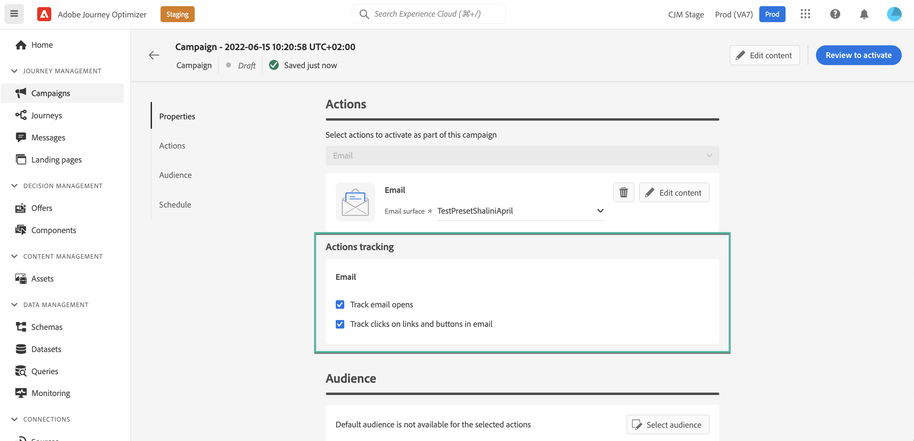

# Creare una campagna {#create-campaign}

>[!NOTE]
>
>Prima di creare una nuova campagna, accertati di disporre di un predefinito per messaggi e di un segmento Adobe Experience Platform pronto per l’uso. Ulteriori informazioni in queste sezioni:
>
>* [Creare predefiniti per messaggi](../configuration/message-presets.md)
>* [Introduzione ai segmenti](../segment/about-segments.md)

## Configurare una campagna {#configure}

I passaggi per creare una campagna sono i seguenti:

1. Accedere al **[!UICONTROL Campaigns]** menu, quindi fai clic su **[!UICONTROL Create campaign]**.

   

<!--1. In the **[!UICONTROL Properties]** section, specify when you want to execute the campaign:

    * **[!UICONTROL Scheduled]**: execute the campaign immediately or on a specified date,
    * **[!UICONTROL API-triggered]**: execute the campaign using an API call. In this case, profiles to be targeted and triggers for actions need to be set via the API call.-->

1. In **[!UICONTROL Actions]** scegli il canale e la superficie del messaggio (ad es. predefinito messaggio) da usare per inviare il messaggio.

   

1. Specifica un titolo e una descrizione per la campagna.

   <!--To test the content of your message, toggle the **[!UICONTROL Content experiment]** option on. This allows you to test multiple variables of a delivery on populations samples, in order to define which treatment has the biggest impact on the targeted population.[Learn more about content experiment](../campaigns/content-experiment.md).-->

   

1. In **[!UICONTROL Actions]** configura il messaggio da inviare con la campagna:

   1. Fai clic sul pulsante **[!UICONTROL Edit content]** , quindi configura e progetta il messaggio. [Scopri come configurare i messaggi](../messages/get-started-content.md).

      Quando il contenuto è pronto, fai clic sulla freccia per tornare alla schermata di creazione della campagna.

      

   1. In **[!UICONTROL Actions tracking]** specifica se desideri tenere traccia della reazione dei destinatari alla consegna.

      I risultati del tracciamento saranno accessibili dal rapporto della campagna una volta che la campagna sarà stata eseguita. [Ulteriori informazioni sui report delle campagne](campaign-global-report.md)

      

1. Definisci il pubblico di cui eseguire il targeting. A questo scopo, fai clic sul pulsante **[!UICONTROL Select audience]** per visualizzare l’elenco dei segmenti Adobe Experience Platform disponibili. [Ulteriori informazioni sui segmenti](../segment/about-segments.md)

   

   <!--By default, the targeted audience for in-app messages includes all the users of the selected mobile application.-->

   In **[!UICONTROL Identity namespace]** scegli lo spazio dei nomi da utilizzare per identificare gli individui del segmento selezionato. [Ulteriori informazioni sugli spazi dei nomi](../event/about-creating.md#select-the-namespace)

   

   >[!NOTE]
   >
   >Gli individui appartenenti a un segmento che non hanno l’identità selezionata (spazio dei nomi) tra le loro diverse identità non verranno presi di mira dalla campagna. <!--info vue dans section journeys, read segment-->

   <!--If you are creating a campaign to send an in-app message, you can choose how and when the message will be shown to the audience using existing mobile app triggers.-->
   <!-- where are triggers configured?-->

1. Configura le date di inizio e di fine della campagna.

   Per impostazione predefinita, le campagne vengono configurate per avviarsi una volta attivate manualmente e per terminare non appena il messaggio è stato inviato una volta.

1. Inoltre, puoi configurare una frequenza per l’esecuzione dell’azione configurata nella campagna.

   

Quando la campagna è pronta, puoi rivederla e pubblicarla (vedi [Rivedere e attivare una campagna](#review-activate)).

## Rivedere e attivare una campagna {#review-activate}

Una volta configurata la campagna, devi rivederne il parametro e il contenuto prima di attivarlo. Per farlo, esegui questi passaggi:

1. Nella schermata di configurazione della campagna, fai clic su **[!UICONTROL Review to activate]** per visualizzare un riepilogo della campagna.

   Il riepilogo consente di modificare la campagna se necessario e di verificare se è presente un parametro errato o mancante.

   >[!IMPORTANT]
   >
   >In caso di errori, non potrai attivare la campagna. Risolvi gli errori prima di procedere.

   

1. Verifica che la campagna sia configurata correttamente, quindi fai clic su **[!UICONTROL Activate]**.

   

1. La campagna è ora attivata e presenta la variabile **[!UICONTROL Live]** status (o **[!UICONTROL Scheduled]**  se è stata specificata una data di inizio). [Ulteriori informazioni sugli stati delle campagne](get-started-with-campaigns.md#statuses)

   Il messaggio configurato nella campagna viene eseguito immediatamente o alla data specificata.

   >[!NOTE]
   >
   >Una volta che una campagna è stata attivata, manterrà lo stato &quot;Live&quot; anche dopo l’esecuzione del messaggio. Per modificarne lo stato, è necessario interromperlo manualmente. [Scopri come interrompere una campagna](modify-stop-campaign.md)

1. Una volta che una campagna è stata attivata, puoi controllarne in qualsiasi momento le informazioni aprendole. Il riepilogo ti consente di ottenere statistiche sul numero di profili target e azioni consegnate e non riuscite.

   È inoltre possibile ottenere statistiche aggiuntive nei rapporti dedicati facendo clic sul pulsante **[!UICONTROL Reports]** pulsante . [Ulteriori informazioni](campaign-global-report.md)

   

   >[!IMPORTANT]
   >
   >I messaggi creati nelle campagne sono specifici per [!DNL Journey Optimizer] funzionalità della campagna. Una volta creati, saranno accessibili solo dalle campagne e non verranno visualizzati nella **[!UICONTROL Messages]** menu.