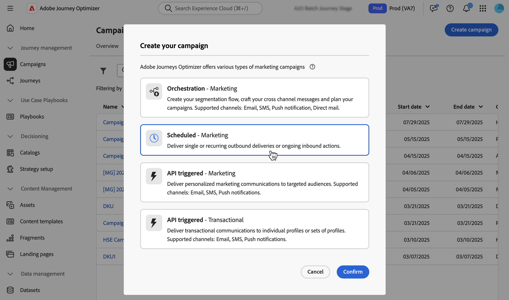

# Creare una campagna {#create-campaign}

>[!NOTE]
>
>Prima di creare una nuova campagna, accertati di disporre di una configurazione di canale (ad esempio una superficie di messaggio) e di un pubblico Adobe Experience Platform pronto per l’uso. Per ulteriori informazioni, consulta le sezioni seguenti:
>
>* [Crea configurazioni canale](../configuration/channel-surfaces.md)
>* [Introduzione ai tipi di pubblico](../audience/about-audiences.md)

Per creare una nuova campagna, accedi al menu **[!UICONTROL Campagne]**, quindi fai clic su **[!UICONTROL Crea campagna]**. Puoi anche duplicare una campagna live esistente per crearne una nuova. [Ulteriori informazioni](modify-stop-campaign.md#duplicate)

## Scegli il tipo di campagna {#campaigntype}

>[!CONTEXTUALHELP]
>id="ajo_campaigns_campaign_type"
>title="Tipo di campagna"
>abstract="Le **Campagne pianificate** vengono eseguite immediatamente o in una data specificata e hanno lo scopo di inviare messaggi di tipo marketing. Le campagne **attivate da API** vengono eseguite utilizzando una chiamata API. Hanno lo scopo di inviare messaggi di marketing (messaggi promozionali che richiedono il consenso dell’utente) o messaggi transazionali (messaggi non commerciali, che possono essere inviati anche a profili non abbonati in contesti specifici)."

>[!CONTEXTUALHELP]
>id="ajo_campaigns_campaign_category"
>title="Categoria campagna"
>abstract="Se stai creando una campagna pianificata, il tipo di **marketing** viene selezionato automaticamente. Per le campagne attivate da API, scegli se desideri inviare un messaggio di **marketing** (messaggio promozionale che richiede il consenso dell’utente) o un messaggio **transazionale** (messaggio non commerciale, che può anche essere inviato a profili non abbonati in contesti specifici)."

1. Seleziona il tipo di campagna da eseguire

   * **[!UICONTROL Pianificato - Marketing]**: esegui la campagna immediatamente o in una data specificata. Le campagne pianificate hanno lo scopo di inviare **messaggi di marketing**. Vengono configurati ed eseguiti dall’interfaccia utente di.

   * **[!UICONTROL Attivato da API - Marketing/Transazionale]**: esegui la campagna utilizzando una chiamata API. Le campagne attivate da API hanno lo scopo di inviare **messaggi di marketing** o **messaggi transazionali**, ovvero messaggi inviati in seguito a un&#39;azione eseguita da un individuo: reimpostazione della password, acquisto del carrello, ecc. [Scopri come attivare una campagna utilizzando le API](api-triggered-campaigns.md)

   

1. Fai clic su **[!UICONTROL Crea]** per creare la campagna.

## Definire le proprietà della campagna {#create}

1. Nella sezione **[!UICONTROL Proprietà]**, specifica un nome e una descrizione per la campagna.

   <!--To test the content of your message, toggle the **[!UICONTROL Content experiment]** option on. This allows you to test multiple variables of a delivery on populations samples, in order to define which treatment has the biggest impact on the targeted population.[Learn more about content experiment](../content-management/content-experiment.md).-->

1. Il campo **Tag** consente di assegnare alla campagna i tag unificati Adobe Experience Platform. Questo consente di classificarle facilmente e migliorare la ricerca dall’elenco delle campagne. [Scopri come utilizzare i tag](../start/search-filter-categorize.md#tags)

1. Per assegnare etichette di utilizzo dei dati personalizzate o di base alla campagna, fare clic sul pulsante **[!UICONTROL Gestisci accesso]**. [Ulteriori informazioni sul controllo degli accessi a livello di oggetto](../administration/object-based-access.md)

## Definire il pubblico della campagna {#audience}

Definisci la popolazione target della campagna, segui questi passaggi:

>[!IMPORTANT]
>
>L&#39;utilizzo dei tipi di pubblico e degli attributi di [composizione del pubblico](../audience/get-started-audience-orchestration.md) non è attualmente disponibile per l&#39;utilizzo con Healthcare Shield o Privacy and Security Shield.
>
>Per le campagne attivate da API, il pubblico deve essere impostato tramite chiamata API.

1. Nella sezione **Pubblico**, fai clic sul pulsante **[!UICONTROL Seleziona pubblico]** per visualizzare l&#39;elenco dei tipi di pubblico di Adobe Experience Platform disponibili. [Ulteriori informazioni sul pubblico](../audience/about-audiences.md)

1. Nel campo **[!UICONTROL Spazio dei nomi identità]**, scegli lo spazio dei nomi da utilizzare per identificare i singoli utenti dal segmento selezionato.

   Gli utenti appartenenti a un segmento che non ha l’identità (spazio dei nomi) selezionata tra le loro diverse identità non saranno presi in considerazione dalla campagna. [Ulteriori informazioni sugli spazi dei nomi](../event/about-creating.md#select-the-namespace)

   

   <!--If you are are creating an API-triggered campaign, the **[!UICONTROL cURL request]** section allows you to retrieve the **[!UICONTROL Campaign ID]** to use in the API call. [Learn more](api-triggered-campaigns.md)-->

## Creare il messaggio e configurare il tracciamento {#content}

1. Nella sezione **[!UICONTROL Azioni]**, seleziona o crea una nuova configurazione.

   Configurazione definita da un [amministratore di sistema](../start/path/administrator.md). Contiene tutti i parametri tecnici per l’invio del messaggio, ad esempio parametri di intestazione, sottodominio, app mobili e così via. [Ulteriori informazioni](../configuration/channel-surfaces.md).

   Nell’elenco a discesa sono elencate solo le configurazioni di canale compatibili con il tipo di campagna di marketing.

   

   >[!NOTE]
   >
   >Se si sta creando una campagna di notifica push, è possibile abilitare la **[!UICONTROL modalità Consegna rapida]**, un componente aggiuntivo di Journey Optimizer che consente l&#39;invio molto rapido di messaggi push in volumi elevati. [Ulteriori informazioni](../push/create-push.md#rapid-delivery)

1. Fai clic sul pulsante **[!UICONTROL Modifica contenuto]** per creare e progettare il messaggio. Scopri i passaggi dettagliati per creare il contenuto del messaggio nelle pagine seguenti:

   <table style="table-layout:fixed">
    <tr style="border: 0;">
    <td>
    
    
<a href="../email/create-email.md"><strong>Creare e-mail</strong>
    

    

    </td>
    <td>
    
    

    <a href="../push/create-push.md"><strong>Creare notifiche push</strong></a>
    

    

    </td>
    <td>
    
    

    <a href="../sms/create-sms.md"><strong>Creare messaggi SMS</strong></a>
    

    

    </td>
    </tr>
    </table>

1. Una volta definito il contenuto, utilizza il pulsante **[!UICONTROL Simula contenuto]** per visualizzare in anteprima e verificare il contenuto con i profili di test. [Ulteriori informazioni](../content-management/preview-test.md).

1. Fai clic sulla freccia per tornare alla schermata di creazione della campagna.

   

1. Nella sezione **[!UICONTROL Tracciamento azioni]**, specifica se desideri tenere traccia della reazione dei destinatari alla consegna: puoi tenere traccia dei clic e/o delle aperture.

   I risultati del tracciamento saranno accessibili dal rapporto della campagna una volta eseguita la campagna. [Ulteriori informazioni sui report delle campagne](../reports/campaign-global-report.md)

## Pianificare la campagna {#schedule}

>[!CONTEXTUALHELP]
>id="ajo_campaigns_schedule"
>title="Pianificazione della campagna"
>abstract="Per impostazione predefinita, le campagne iniziano al momento dell’attivazione manuale e terminano immediatamente dopo l’invio del messaggio. Tuttavia, puoi impostare una data e un’ora specifiche per l’invio del messaggio. Inoltre, puoi specificare una data di fine per le campagne ricorrenti o attivate da API. Nei trigger di Azione, puoi anche configurare la frequenza di invio del messaggio in base alle tue preferenze."

>[!CONTEXTUALHELP]
>id="ajo_campaigns_schedule_start"
>title="Inizio della campagna"
>abstract="Specifica la data e l’ora in cui il messaggio deve essere inviato."

>[!CONTEXTUALHELP]
>id="ajo_campaigns_schedule_end"
>title="Fine della campagna"
>abstract="Specifica quando interrompere l’esecuzione di una campagna ricorrente."

>[!CONTEXTUALHELP]
>id="ajo_campaigns_schedule_triggers"
>title="Trigger delle azioni della campagna"
>abstract="Definisci la frequenza con cui deve essere inviato il messaggio della campagna."

Per impostazione predefinita, le campagne iniziano una volta attivate manualmente e terminano non appena il messaggio viene inviato.

Puoi definire una frequenza con cui inviare il messaggio della campagna. A questo scopo, utilizza le opzioni **[!UICONTROL Action triggers]** nella schermata di creazione della campagna per specificare se la campagna deve essere eseguita ogni giorno, ogni settimana o ogni mese.

Se non desideri eseguire la campagna subito dopo l&#39;attivazione, puoi specificare la data e l&#39;ora dell&#39;invio del messaggio utilizzando l&#39;opzione **[!UICONTROL Inizio campagna]**. L&#39;opzione **[!UICONTROL Fine campagna]** consente di specificare quando deve cessare l&#39;esecuzione di una campagna ricorrente.

Una volta che la campagna è pronta, puoi rivederla e pubblicarla. [Ulteriori informazioni](review-activate-campaign.md)
