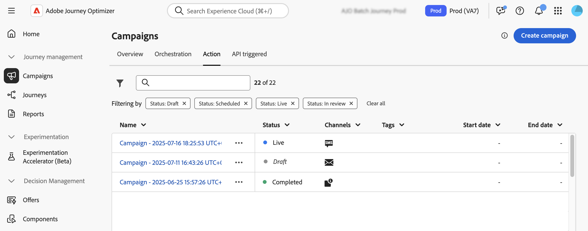

# Introduzione alle campagne {#get-started-campaigns}

>[!CONTEXTUALHELP]
>id="ajo_campaigns_schedule"
>title="Pianificazione della campagna"
>abstract="Per impostazione predefinita, le campagne iniziano al momento dell’attivazione manuale e terminano immediatamente dopo l’invio del messaggio. Puoi impostare una data e un’ora specifiche per l’invio del messaggio. Inoltre, puoi specificare una data di fine per le campagne di azione ricorrenti. Nei trigger di Azione, puoi anche configurare la frequenza di invio del messaggio in base alle tue preferenze."

>[!CONTEXTUALHELP]
>id="ajo_campaigns_schedule_start"
>title="Inizio della campagna"
>abstract="Specifica la data e l’ora in cui il messaggio deve essere inviato."

>[!CONTEXTUALHELP]
>id="ajo_campaigns_schedule_end"
>title="Fine della campagna"
>abstract="Specifica quando interrompere l’esecuzione di una campagna ricorrente."

>[!CONTEXTUALHELP]
>id="ajo_campaigns_schedule_triggers"
>title="Trigger delle azioni della campagna"
>abstract="Definisci la frequenza con cui deve essere inviato il messaggio della campagna."

>[!CONTEXTUALHELP]
>id="ajo_campaigns_throttling"
>title="Controllo della frequenza"
>abstract="Imposta il controllo della frequenza della tua campagna specificando i limiti di frequenza desiderati. Questa funzione è particolarmente utile per prevenire il sovraccarico sui sistemi a valle, come le pagine di destinazione o le piattaforme di assistenza clienti."

>[!CONTEXTUALHELP]
>id="ajo_homepage_card3"
>title="Creare le campagne"
>abstract="Utilizza **Adobe Journey Optimizer** per distribuire contenuti una tantum a un pubblico specifico utilizzando vari canali. Quando si utilizzano i percorsi, le azioni vengono eseguite in sequenza. Con le campagne, le azioni vengono eseguite simultaneamente, immediatamente o in base a una pianificazione specifica."

>[!CONTEXTUALHELP]
>id="campaigns_list"
>title="Campagne"
>abstract="Crea campagne per distribuire contenuti una tantum a un pubblico specifico su vari canali. Prima di creare una campagna, accertati di avere una configurazione dei canali e un pubblico di Adobe Experience Platform pronti per l’uso."

>[!CONTEXTUALHELP]
>id="ajo_campaigns_campaign_type"
>title="Tipo di campagna"
>abstract="Seleziona il tipo di campagna. I canali disponibili variano a seconda del tipo selezionato.  **Campagne pianificate** (campagne di azione): ideali per comunicazioni batch semplici e una tantum che puoi pianificare per essere eseguite in un momento specifico. **Campagne attivate da API**: vengono attivate tramite una chiamata API e abilitano la messaggistica automatizzata basata su eventi direttamente da sistemi esterni. **Campagne orchestrate**: forniscono un’area di lavoro visiva e basata su trascinamento per progettare e automatizzare flussi di lavoro di marketing complessi e in più passaggi, dalla segmentazione del pubblico alla consegna personalizzata dei messaggi su tutti i canali."

>[!CONTEXTUALHELP]
>id="ajo_campaigns_create_orchestration"
>title="Campagne"
>abstract="Crea il flusso di segmentazione, definisci i messaggi cross-channel e pianifica le campagne. Canali supportati: e-mail, SMS, notifiche push."

>[!CONTEXTUALHELP]
>id="ajo_campaigns_create_scheduled_marketing"
>title="Campagne"
>abstract="Consegne in uscita singole o ricorrenti o azioni in entrata continue."

>[!CONTEXTUALHELP]
>id="ajo_campaigns_create_scheduled_transactional"
>title="Campagne"
>abstract="Consegna di azioni transazionali in uscita singole o ricorrenti."

>[!CONTEXTUALHELP]
>id="ajo_campaigns_create_api_marketing"
>title="Campagne"
>abstract="Consegna di comunicazioni di marketing personalizzate a un pubblico target. Canali supportati: e-mail, SMS, notifiche push."

>[!CONTEXTUALHELP]
>id="ajo_campaigns_create_api_transactional"
>title="Campagne"
>abstract="Consegna di comunicazioni transazionali a singoli profili o a set di profili. Canali supportati: e-mail, SMS, notifiche push."

Adobe Journey Optimizer consente di fornire contenuti una tantum mirati a tipi di pubblico specifici su più canali. Utilizzando le campagne, puoi eseguire contemporaneamente azioni di marketing coordinate, raggiungendo il pubblico con il messaggio giusto al momento giusto.

Questa guida fornisce una roadmap chiara che ti aiuta a comprendere le nozioni di base della campagna, a scegliere il tipo di campagna adatto al tuo caso d’uso e a progettare con sicurezza campagne in grado di fornire esperienze cliente significative.

## Cosa sono le campagne?

**Le campagne** sono azioni di marketing coordinate che distribuiscono contenuti a un pubblico specifico su uno o più canali. A differenza dei percorsi in cui le azioni vengono eseguite in sequenza, le campagne eseguono le azioni contemporaneamente, immediatamente o secondo una pianificazione definita.

Utilizza [!DNL Journey Optimizer] per:

* Consegna di **contenuti occasionali o ricorrenti** ai segmenti di pubblico di destinazione
* Esegui **comunicazioni multicanale coordinate** tramite e-mail, push, SMS, in-app, Web e altro ancora
* Attiva **risposte automatizzate** tramite chiamate API per messaggi in tempo reale basati su eventi
* Progetta **flussi di lavoro di marketing complessi** con strumenti di orchestrazione visiva

➡️ **Inizio generazione?** [Crea la tua prima campagna](create-campaign.md) in pochi minuti.

## Scegli il tipo di campagna {#campaign-types}

**Prima di iniziare a generare**, è importante capire quale tipo di campagna si adatta al tuo caso d&#39;uso. Adobe Journey Optimizer supporta tre tipi di campagne, ciascuno progettato per diversi scenari e meccanismi di attivazione:

>[!BEGINTABS]

>[!TAB Campagne azione (pianificate)]

**Quando utilizzare:** Comunicazioni batch semplici e pianificate

**Le campagne di azione** (dette anche campagne pianificate) sono ideali per comunicazioni in batch semplici, una tantum o ricorrenti che vengono eseguite in un momento specifico.

**Due categorie:**

* **Marketing** - Offerte promozionali, campagne di coinvolgimento, annunci, note legali o aggiornamenti dei criteri. Richiede il consenso dei destinatari.
* **Transazionale** - Interruzioni, emergenze, annullamenti. Non richiede il consenso.

**Ideale per:**

* Newsletter mensili per segmenti di clienti
* Annunci promozionali
* Campagne di marketing stagionale
* Comunicazioni per il lancio dei prodotti
* Notifiche di interruzione del servizio

➡️ [Informazioni sulle campagne Azione](create-campaign.md)

>[!TAB Campagne attivate da API]

**Quando utilizzare:** Messaggistica basata su eventi in tempo reale con sistemi esterni

**Le campagne attivate da API** vengono attivate tramite chiamate API, abilitando la messaggistica automatizzata direttamente da sistemi esterni. Queste campagne supportano la personalizzazione utilizzando sia gli attributi del profilo che i dati contestuali in tempo reale dal payload API.

**Due categorie:**

* **Marketing** - Comunicazioni di marketing personalizzate per tipi di pubblico mirati
* **Transazionale** - Messaggi successivi a singole azioni (reimpostazione password, acquisti carrello, ecc.)

**Ideale per:**

* Conferme reimpostazione password
* Recupero abbandono carrello
* Conferme degli ordini e aggiornamenti della spedizione
* Notifiche di attività dell’account
* Consigli personalizzati in tempo reale

➡️ [Informazioni sulle campagne attivate da API](api-triggered-campaigns.md)

>[!TAB Campagne orchestrate]

**Quando utilizzare:** flussi di lavoro di marketing complessi e con più passaggi

**Le campagne orchestrate** forniscono un&#39;area di lavoro visiva e trascinata per progettare e automatizzare flussi di lavoro di marketing sofisticati. Dalla segmentazione del pubblico alla consegna personalizzata dei messaggi attraverso i canali, tutto avviene in un ambiente intuitivo costruito per velocità e controllo.

**Ideale per:**

* Programmi di coinvolgimento dei clienti in più fasi
* Strategie di segmentazione e targeting complesse
* Orchestrazione di campagne cross-channel
* Marketing avviato dal brand su larga scala
* Automazione avanzata dei flussi di lavoro con più punti decisionali

➡️ [Informazioni sulle campagne orchestrate](../orchestrated/gs-orchestrated-campaigns.md)

>[!ENDTABS]

>[!NOTE]
>
>Non sei sicuro del tipo da scegliere? Inizia con **Campagne azione** per le comunicazioni in batch pianificate o **Campagne attivate da API** per la messaggistica in tempo reale. Queste campagne riguardano i casi d&#39;uso più comuni.

## Flusso di lavoro di creazione della campagna {#workflow}

La creazione di campagne di successo segue un processo chiaro e ripetibile. Di seguito è riportato il flusso di lavoro dettagliato:

**1. Piano** → **2. Configura** → **3. Progettazione** → **4. Rivedi** → **5. Attiva** → **6. Monitora**

### &#x200B;1. **Pianifica la tua campagna** {#plan}

Prima di iniziare, chiarisci i tuoi obiettivi:

* **Qual è l&#39;obiettivo?** (ad esempio conversioni di unità, aumento del coinvolgimento, notifica ai clienti)
* **Chi è il pubblico?** (ad esempio, build o select from Adobe Experience Platform)
* **Quale tipo di campagna è adatto?** (vedi [tipi di campagna](#campaign-types) sopra)
* **Quali canali utilizzerai?** (e-mail, push, SMS, in-app, web, ecc.) → [Visualizza i canali supportati per tipo di campagna](../channels/gs-channels.md#channels)
* **Quando deve essere eseguito?** (immediato, pianificato o attivato da API)

### &#x200B;2. **Configurare le proprietà della campagna** {#configure}

Imposta le basi della campagna:

1. **Denomina e descrivi** la tua campagna per una facile identificazione
2. **Seleziona tipo di campagna** (azione, attivata da API o orchestrata)
3. **Scegli il pubblico**
4. **Imposta priorità** se si utilizza la gestione dei conflitti
5. **Configura pianificazione** (per campagne Azione) o dettagli API (per attivate da API)

**Guide specifiche per tipo:**
* [Proprietà campagna azione →](campaign-properties.md)
* [→ delle proprietà di una campagna attivata da API](api-triggered-campaign-properties.md)
* [→ di configurazione della campagna orchestrata](../orchestrated/create-orchestrated-campaign.md)

### &#x200B;3. **Progetta il contenuto** {#design}

Creare messaggi convincenti per il pubblico:

* Utilizza **E-mail Designer** per esperienze e-mail avanzate
* Configura **notifiche push** con immagini e collegamenti profondi
* Progetta **messaggi SMS/MMS** con personalizzazione
* Crea **esperienze in-app** e **web**
* Aggiungi **personalizzazione** utilizzando gli attributi del profilo e i dati contestuali

**Guide specifiche per tipo:**
* [→ del contenuto della campagna di azione](campaign-content.md)
* [→ di contenuto di campagne attivate da API](api-triggered-campaign-content.md)
* [→ del contenuto della campagna orchestrata](../orchestrated/create-orchestrated-campaign.md)

### &#x200B;4. **Verifica e verifica** {#review}

Rivedi sempre la campagna prima dell’attivazione:

* **Anteprima contenuto** con profili di test
* **Controlla il targeting** per assicurarti che il pubblico sia quello giusto
* **Verifica pianificazione** e impostazioni di attivazione
* **Richiedi l&#39;approvazione** se si utilizza il flusso di lavoro di approvazione
* **Verifica recapito messaggi** con elenchi di seed

**Guide specifiche per tipo:**
* [Campagne Rivedi azione →](review-activate-campaign.md)
* [Rivedi le campagne attivate da API →](review-activate-api-triggered-campaign.md)
* [Rivedi → campagne orchestrate](../orchestrated/create-orchestrated-campaign.md)

### &#x200B;5. **Attiva la campagna** {#activate}

Al termine della revisione, attiva la campagna:

* **Attivazione manuale** - Attivazione immediata o programmata
* **Attivazione API** - Per le campagne attivate da API, utilizza l&#39;endpoint di attivazione
* **Processo di approvazione** - Se necessario, attendi l&#39;approvazione delle parti interessate
* Nota: non è possibile modificare le campagne attive (è necessario duplicarle per apportare modifiche)

**Guide specifiche per tipo:**
* [Attivare campagne di azione →](review-activate-campaign.md)
* [Attivare le campagne attivate da API →](review-activate-api-triggered-campaign.md)
* [Attiva → campagne orchestrate](../orchestrated/create-orchestrated-campaign.md)

### &#x200B;6. **Monitorare e analizzare** {#monitor}

Monitora le prestazioni della campagna:

* Visualizzare i rapporti e le analisi delle campagne
* Monitorare i tassi di consegna e le metriche di coinvolgimento
* Tracciare errori e mancati recapiti
* Analisi della conversione e del ROI
* Utilizzare gli approfondimenti per l’ottimizzazione

**Guide specifiche per tipo:**
* [Rapporti sulle campagne d’azione →](../reports/campaign-global-report-cja.md)
* [→ di monitoraggio delle campagne attivate da API](api-triggered-campaigns.md#monitor)
* [→ orchestrato di analisi delle campagne](../orchestrated/create-orchestrated-campaign.md)

➡️ **Inizio?** Scegli il tipo di campagna:
* [Crea → campagna azione](create-campaign.md)
* [Creare → di campagne attivate da API](api-triggered-campaigns.md)
* [Creare → orchestrati per le campagne](../orchestrated/gs-orchestrated-campaigns.md)

## Prerequisiti {#prerequisites}

Prima di lavorare con le campagne, assicurati di disporre dei seguenti elementi:

### Configurazione richiesta

* **Tipi di pubblico** - I tipi di pubblico devono essere disponibili in Adobe Experience Platform prima di creare le campagne. [Introduzione ai tipi di pubblico →](../audience/about-audiences.md)

* **Configurazioni canale** - Le configurazioni canale (predefiniti) devono essere create e disponibili per i canali che desideri utilizzare. [Configurare le configurazioni del canale →](../configuration/channel-surfaces.md)

* **Autorizzazioni** - Sono necessarie le autorizzazioni appropriate in base al tipo di campagna. Se non riesci ad accedere alle funzionalità della campagna, contatta l’amministratore. [Informazioni sui ruoli incorporati →](../administration/ootb-product-profiles.md)

| Tipo di campagna | Autorizzazioni |
|----------------------------|----------------------------------------------------------------------------|
| **Campagne di azione** | Amministratore campagna Approvatore campagna Responsabile campagna Visualizzatore campagna |
| **Campagne attivate da API** | Amministratore campagna Approvatore campagna Responsabile campagna Visualizzatore campagna |
| **Campagne orchestrate** | Amministratore campagna orchestrata Approvatore campagna orchestrata Responsabile campagna orchestrata Visualizzatore campagna orchestrata |

+++Assegnare le autorizzazioni della campagna

1. Passa alla scheda **[!UICONTROL Ruoli]** nel prodotto [!DNL Permissions] e seleziona una delle **[!UICONTROL Mansioni]** correlate alla campagna incorporata.

1. Dalla scheda **[!UICONTROL Utenti]**, fai clic su **[!UICONTROL Aggiungi utente]**.

1. Digita il nome o l’indirizzo e-mail dell’utente o selezionalo dall’elenco e fai clic su **[!UICONTROL Salva]**.

   Se l’utente non è stato creato in precedenza, consulta la [documentazione Aggiungere utenti](https://experienceleague.adobe.com/it/docs/experience-platform/access-control/ui/users){target="_blank"}.

L’utente dovrebbe quindi ricevere un messaggio e-mail di reindirizzamento all’istanza.

+++

## Funzionalità di Campaign {#capabilities}

Man mano che acquisisci dimestichezza con le campagne, esplora queste potenti funzionalità:

:::: landing-cards-container

:::

**Pianificazione e tempistica**

Pianifica campagne per date/ore specifiche, imposta consegne ricorrenti e ottimizza gli orari di invio per il massimo impatto.

[Informazioni sulla pianificazione](campaign-schedule.md)
:::

:::

**Controllo frequenza**

Limita la velocità effettiva dei messaggi per evitare il sovraccarico su sistemi a valle come pagine di destinazione o piattaforme di assistenza clienti.

[Limiti della velocità di controllo](create-campaign.md)
:::

:::

**Destinazione pubblico**

Puoi indirizzare l’attività a tipi di pubblico specifici di Adobe Experience Platform con precisione e gestire dinamicamente le qualifiche del pubblico.

[Selezionare il pubblico della campagna](campaign-audience.md)
:::

:::

**Flussi di lavoro di approvazione**

Implementa i processi di revisione e approvazione prima che le campagne vengano pubblicate, garantendo qualità e conformità.

[Rivedi e attiva](review-activate-campaign.md)
:::

:::

**Ore non interattive**

Rispetta le preferenze del cliente evitando la consegna dei messaggi durante gli intervalli di tempo specificati.

[Configurare le ore non interattive](quiet-hours.md)
:::

:::

**Ottimizzazione dell&#39;ora di invio**

Utilizza l’intelligenza artificiale per determinare il momento migliore per inviare messaggi in modo da coinvolgere al massimo ogni individuo.

[Ottimizza tempo di invio](campaigns-message-optimization.md)
:::

::::

## Introduzione ai tipi di campagna {#get-started-types}

Ora che conosci le campagne in [!DNL Journey Optimizer], scegli il tipo di campagna per iniziare:

<table style="table-layout:fixed"><tr style="border: 0; text-align: center;">
<td> <a href="create-campaign.md">Campagne di azione</a></td>
<td> <a href="api-triggered-campaigns.md">Campagne attivate da API</a></td>
<td><a href="../orchestrated/gs-orchestrated-campaigns.md">Campagne orchestrate</a></td>
</tr></table>
