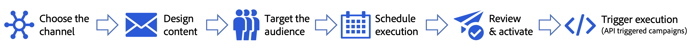

# Introduzione alle campagne {#get-started-campaigns}

>[!CONTEXTUALHELP]
>id="campaigns_list"
>title="Campagne"
>abstract="Crea campagne per distribuire contenuti una tantum a un segmento specifico su vari canali. Prima di creare la campagna, accertati di disporre di una superficie di canale (ossia un predefinito per messaggi) e di un segmento Adobe Experience Platform pronto per l’uso."

Utilizza le campagne Journey Optimizer per distribuire contenuti una tantum a un segmento specifico utilizzando vari canali. Quando si utilizzano i percorsi, le azioni vengono eseguite in sequenza. Con le campagne, le azioni vengono eseguite simultaneamente, immediatamente o in base a una pianificazione specifica.

Puoi creare due tipi di campagne:

* **Campagne pianificate** consente semplici comunicazioni in batch ad hoc per casi di utilizzo di marketing come offerte promozionali, campagne di coinvolgimento, annunci, note legali o aggiornamenti delle policy.
* **Campagne attivate da API** consente di inviare semplici messaggi transazionali/operativi con API REST (reimpostazione password, abbandono carrello, ecc.), dove la necessità può richiedere la personalizzazione utilizzando gli attributi del profilo e i dati contestuali del payload.

I passaggi principali per creare una campagna sono i seguenti:

➡️ [Scopri questa funzione nel video](#video)

## Prima di iniziare {#campaign-prerequisites}

Verifica i seguenti prerequisiti prima di iniziare a creare la prima campagna in Journey Optimizer:

1. **Devi disporre delle autorizzazioni appropriate**. Le campagne sono disponibili solo per gli utenti con accesso a una campagna **[!UICONTROL Profilo di prodotto]** come amministratore di Campaign, approvatore di Campaign, manager di Campaign e/o visualizzatore di Campaign.

   Se non riesci ad accedere alle campagne, devi estendere le autorizzazioni. Se hai accesso a [Adobe Admin Console](https://adminconsole.adobe.com/){target="_blank"} per la tua organizzazione, segui i passaggi indicati di seguito. In caso contrario, contattare l&#39;amministratore di Journey Optimizer.

   +++Scopri come assegnare le autorizzazioni per la campagna

   Per assegnare il corrispondente **[!UICONTROL Profilo di prodotto]** per i tuoi utenti:

   1. Da [Adobe Admin Console](https://adminconsole.adobe.com/){target="_blank"}, seleziona la [!DNL Adobe Experience Platform] prodotto.

   1. Accedi a **[!UICONTROL Profilo di prodotto]** , seleziona una delle campagne integrate correlate a **[!UICONTROL Profilo di prodotto]**: amministratore di Campaign, approvatore di Campaign, manager di Campaign o visualizzatore di Campaign.

      Per ulteriori informazioni sulla campagna Journey Optimizer **[!UICONTROL Profili di prodotto]** e **[!UICONTROL Autorizzazioni]**, [fai riferimento a questa pagina](../administration/ootb-product-profiles.md).

      

   1. Clic **[!UICONTROL Aggiungi utente]** per assegnare all&#39;utente la selezione **[!UICONTROL Profilo di prodotto]**.

      

   1. Digita il nome, il gruppo o l’indirizzo e-mail dell’utente e fai clic su **[!UICONTROL Salva]**.
   L’utente ora può accedere a **[!UICONTROL Campagne]**.

+++

1. **È necessario un pubblico**. I segmenti di pubblico devono essere disponibili prima di creare la campagna. Ulteriori informazioni sulla creazione di tipi di pubblico [in questa pagina](../segment/about-segments.md).
1. **È necessaria una superficie di canale**. Per poter selezionare un canale, dovete creare e rendere disponibile la superficie di canale corrispondente (ossia il predefinito). Ulteriori informazioni sulle superfici di canale [in questa pagina](../configuration/channel-surfaces.md).

## Video tutorial {#video}

Scopri come creare la tua prima campagna.

>[!VIDEO](https://video.tv.adobe.com/v/346680?quality=12)
