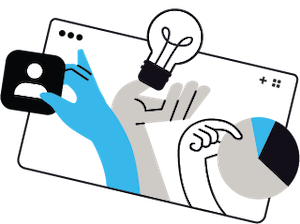

# Introduzione alle campagne {#get-started-campaigns}

>[!CONTEXTUALHELP]
>id="ajo_campaigns_schedule"
>title="Pianificazione della campagna"
>abstract="Per impostazione predefinita, le campagne iniziano al momento dell’attivazione manuale e terminano immediatamente dopo l’invio del messaggio. Puoi impostare una data e un’ora specifiche per l’invio del messaggio. Inoltre, puoi specificare una data di fine per le campagne di azione ricorrenti. Nei trigger di Azione, puoi anche configurare la frequenza di invio del messaggio in base alle tue preferenze."

>[!CONTEXTUALHELP]
>id="ajo_campaigns_schedule_start"
>title="Inizio della campagna"
>abstract="Specifica la data e l’ora in cui il messaggio deve essere inviato."

>[!CONTEXTUALHELP]
>id="ajo_campaigns_schedule_end"
>title="Fine della campagna"
>abstract="Specifica quando interrompere l’esecuzione di una campagna ricorrente."

>[!CONTEXTUALHELP]
>id="ajo_campaigns_schedule_triggers"
>title="Trigger delle azioni della campagna"
>abstract="Definisci la frequenza con cui deve essere inviato il messaggio della campagna."

>[!CONTEXTUALHELP]
>id="ajo_campaigns_throttling"
>title="Controllo della frequenza di limitazione"
>abstract="Controllo della frequenza di limitazione"

>[!CONTEXTUALHELP]
>id="ajo_homepage_card3"
>title="Creare le campagne"
>abstract="Utilizza **Adobe Journey Optimizer** per distribuire contenuti una tantum a un pubblico specifico utilizzando vari canali. Quando si utilizzano i percorsi, le azioni vengono eseguite in sequenza. Con le campagne, le azioni vengono eseguite simultaneamente, immediatamente o in base a una pianificazione specifica."

>[!CONTEXTUALHELP]
>id="campaigns_list"
>title="Campagne"
>abstract="Crea campagne per distribuire contenuti una tantum a un pubblico specifico su vari canali. Prima di creare una campagna, accertati di avere una configurazione dei canali e un pubblico di Adobe Experience Platform pronti per l’uso."

>[!CONTEXTUALHELP]
>id="ajo_campaigns_campaign_type"
>title="Tipo di campagna"
>abstract="Le **Campagne pianificate** vengono eseguite immediatamente o in una data specificata e hanno lo scopo di inviare messaggi di tipo marketing. Le campagne **attivate da API** vengono eseguite utilizzando una chiamata API. Hanno lo scopo di inviare messaggi di marketing (messaggi promozionali che richiedono il consenso dell’utente) o messaggi transazionali (messaggi non commerciali, che possono essere inviati anche a profili non abbonati in contesti specifici)."

Utilizza le campagne Journey Optimizer per distribuire contenuti una tantum a un pubblico specifico utilizzando vari canali. Quando si utilizzano i percorsi, le azioni vengono eseguite in sequenza. Con le campagne, le azioni vengono eseguite simultaneamente, immediatamente o in base a una pianificazione specifica.

Puoi creare diversi tipi di campagne in Journey Optimizer:

* **Campagne di azione**

  Le campagne di azione (o campagne pianificate) consentono semplici comunicazioni in batch ad hoc per casi di utilizzo di marketing come offerte promozionali, campagne di coinvolgimento, annunci, note legali o aggiornamenti delle policy.

* **Campagne attivate da API**

  Le campagne attivate da API consentono alle comunicazioni di marketing di raggiungere un pubblico al momento giusto oppure messaggi transazionali/operativi a un individuo come la reimpostazione della password, dove la necessità può comportare la personalizzazione non solo utilizzando l’attributo di profilo, ma anche i dati contestuali in tempo reale nel trigger, che è un payload API REST.

<!--* **Orchestrated campaigns**

    Campaign Orchestration in Adobe Journey Optimizer powers sophisticated, brand-initiated marketing campaigns across channels, helping you drive engagement, revenue, and customer loyalty at scale.

    While cross-channel marketing is essential, orchestrated campaigns make it seamless. With a visual, drag-and-drop interface, you can design and automate complex marketing workflows, from segmentation to message delivery, across multiple channels. Everything happens in one intuitive environment, built for speed, control, and efficiency.-->

## Prima di iniziare {#campaign-prerequisites}

Prima di iniziare a creare la prima campagna in [!DNL Journey Optimizer], verifica i seguenti prerequisiti:

1. **Sono necessarie autorizzazioni adeguate**. Le campagne sono disponibili solo per gli utenti con accesso a un **[!UICONTROL profilo di prodotto]** relativo alla campagna, ad esempio l&#39;amministratore di Campaign, l&#39;approvatore di Campaign, il manager di Campaign e/o il visualizzatore di Campaign. Se non riesci ad accedere alle campagne, devi estendere le autorizzazioni.

   +++Scopri come assegnare il relativo ruolo alla campagna

   1. Per assegnare un ruolo a un utente nel prodotto [!DNL Permissions], passa alla scheda **[!UICONTROL Ruoli]** e seleziona uno dei **[!UICONTROL Ruoli]** incorporati relativi alle campagne: amministratore di campagna, approvatore di campagna, manager di campagna o visualizzatore di campagna.

   1. Dalla sezione **[!UICONTROL Utenti]**, fai clic su **[!UICONTROL Aggiungi utente]**.

   1. Digita il nome o l’indirizzo e-mail dell’utente o selezionalo dall’elenco e fai clic su **[!UICONTROL Salva]**.

      Se l’utente non è stato creato in precedenza, consulta la [documentazione Aggiungere utenti](https://experienceleague.adobe.com/it/docs/experience-platform/access-control/ui/users).

   L’utente dovrebbe quindi ricevere un messaggio e-mail di reindirizzamento all’istanza.

+++

1. **Hai bisogno di un pubblico**. I tipi di pubblico devono essere disponibili prima di creare la campagna. [Introduzione ai tipi di pubblico](../audience/about-audiences.md).

1. **È necessaria una configurazione dei canali**. Per poter selezionare un canale, è necessario che la configurazione dei canali corrispondente (ovvero, preimpostata) sia creata e disponibile. [Scopri come impostare le configurazioni dei canali](../configuration/channel-surfaces.md).

## Approfondiamo

Ora che conosci le campagne in [!DNL Journey Optimizer], è il momento di approfondire queste sezioni della documentazione per iniziare a creare le prime campagne.

<table style="table-layout:fixed"><tr style="border: 0; text-align: center;">
<td> <a href="create-campaign.md">Campagne di azione</a></td>
<td> <a href="api-triggered-campaigns.md">Campagne attivate da API</a></td>
</tr></table>

<!--
<table style="table-layout:fixed"><tr style="border: 0; text-align: center;">
<td> <a href="create-campaign.md">Action campaigns</a></td>
<td> <a href="api-triggered-campaigns.md">API triggered campaigns</a></td>
<td><a href="../orchestrated/gs-orchestrated-campaigns.md">Orchestrated campaigns</a></td>
</tr></table>-->
