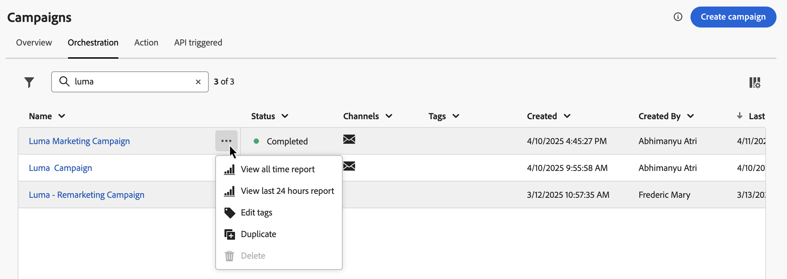
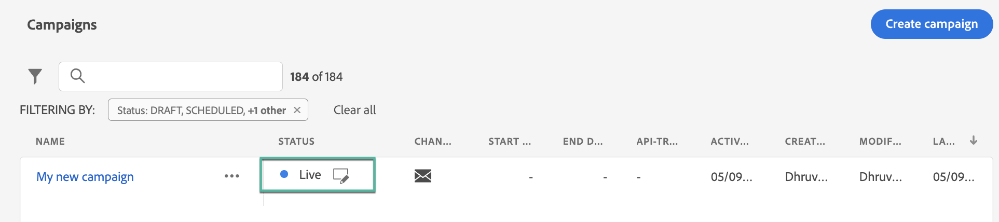
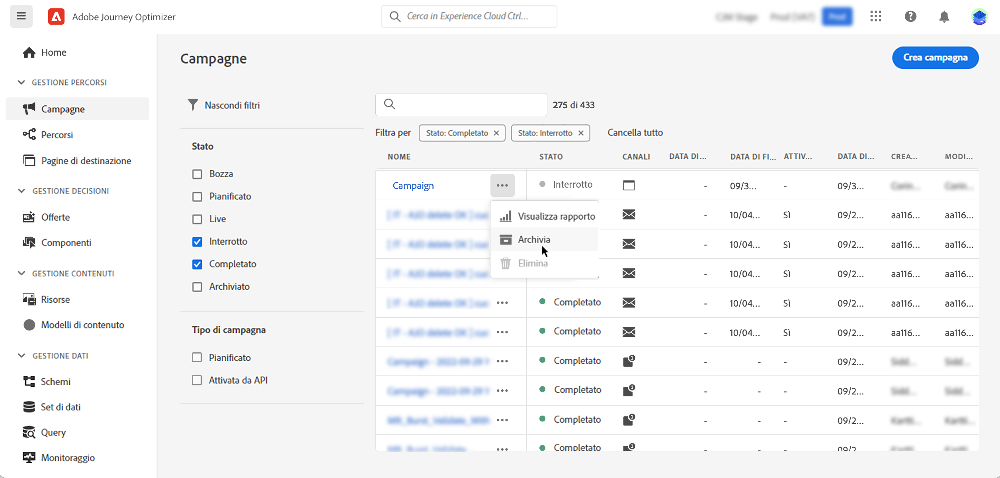

# Accedere alle campagne e gestirle {#manage-campaigns}

>[!CONTEXTUALHELP]
>id="ajo_targeting_workflow_list"
>title="Inventario delle campagne orchestrate"
>abstract="In questa schermata, puoi accedere all’elenco completo delle campagne orchestrate, controllarne lo stato corrente, le date dell’ultima/successiva esecuzione e creare una nuova campagna orchestrata."

>[!CONTEXTUALHELP]
>id="ajo_orchestration_campaign_action"
>title="Azione"
>abstract="In questa sezione sono elencate tutte le azioni utilizzate all’interno della campagna orchestrata."

Le campagne sono accessibili dal menu **[!UICONTROL Campagne]**. Utilizza le schede per sfogliare le campagne per tipo: **Campagne Azione**, **Campagne attivate da API** e **Campagne orchestrate**. Ulteriori informazioni sui [tipi di campagne](get-started-with-campaigns.md#get-started-campaigns). I tipi disponibili dipendono dal contratto di licenza e dalle autorizzazioni.

>[!BEGINTABS]

>[!TAB Campagne di azione]

Seleziona la scheda **[!UICONTROL Azione]** per accedere all&#39;elenco delle campagne Azione.

Per impostazione predefinita, l&#39;elenco mostra tutte le campagne con gli stati **[!UICONTROL Bozza]**, **[!UICONTROL Pianificato]** e **[!UICONTROL Live]**. Per visualizzare le campagne interrotte, completate e archiviate, è necessario cancellare il filtro.

>[!TAB Campagne attivate da API]

Seleziona la scheda **[!UICONTROL API triggered]** per accedere all&#39;elenco delle campagne attivate dall&#39;API.

Per impostazione predefinita, l&#39;elenco mostra tutte le campagne con gli stati **[!UICONTROL Bozza]**, **[!UICONTROL Pianificato]** e **[!UICONTROL Live]**. Per visualizzare le campagne interrotte, completate e archiviate, è necessario cancellare il filtro.

>[!TAB Campagne orchestrate]

Seleziona la scheda **[!UICONTROL Orchestrazione]** per accedere all&#39;elenco delle campagne orchestrate.

{zoomable="yes"}{zoomable="yes"}

Ogni campagna orchestrata nell&#39;elenco visualizza informazioni quali il [stato](#status) corrente della campagna, il canale e i tag associati o l&#39;ultima modifica. È possibile personalizzare le colonne visualizzate facendo clic sul .

>[!ENDTABS]

Inoltre, sono disponibili una barra di ricerca e dei filtri per facilitare la ricerca all’interno dell’elenco. Ad esempio, puoi filtrare le campagne per visualizzare solo quelle associate a un canale o a un tag specifico, o quelle create durante un intervallo di date specifico.

Il pulsante  nell’inventario delle campagne ti consente di eseguire varie operazioni descritte di seguito.

* **[!UICONTROL Visualizza report completo]** / **[!UICONTROL Visualizza report delle ultime 24 ore]** - Accedi ai report per misurare e visualizzare l&#39;impatto e le prestazioni delle campagne. Ulteriori informazioni sui [report campagne](../reports/campaign-global-report-cja.md).
* **[!UICONTROL Modifica tag]** - Modifica i tag associati alla campagna. Scopri come [utilizzare i tag nelle campagne](../start/search-filter-categorize.md#add-tags)
* **[!UICONTROL Duplicato]** - Utilizzare questa opzione per duplicare una campagna, ad esempio per eseguire una campagna orchestrata interrotta. [Ulteriori informazioni](#duplicate-a-campaign)
* **[!UICONTROL Elimina]** - Utilizzare questa opzione per eliminare una campagna. [Ulteriori informazioni](#delete-a-campaign)
* **[!UICONTROL Archivia]**: archivia la campagna. Tutte le campagne archiviate vengono eliminate secondo una pianificazione continua 30 giorni dopo la data dell’ultima modifica. Questa azione è disponibile per tutte le campagne ad eccezione delle campagne **[!UICONTROL Bozza]**. Ulteriori informazioni sull&#39;[archivio campagne](#archive-a-campaign).

Per le campagne attivate da Azioni e API, sono disponibili le azioni aggiuntive seguenti:

* **[!UICONTROL Aggiungi al pacchetto]** - Aggiungi la campagna a un pacchetto per esportarla in un&#39;altra sandbox. Scopri come [esportare gli oggetti in un&#39;altra sandbox](../configuration/copy-objects-to-sandbox.md)
* **[!UICONTROL Apri bozza versione]** - Se è stata creata una nuova versione della campagna e non è ancora stata attivata, puoi accedere alla versione bozza utilizzando questa azione.

## Ciclo di vita della campagna {#statuses}

In Adobe Journey Optimizer, ogni campagna si sposta attraverso un ciclo di vita che si riflette sul suo stato nell’interfaccia. Gli stati disponibili variano a seconda del tipo di campagna: Azione, API attivata o Orchestrata. Utilizza le schede seguenti per esplorare il ciclo di vita e gli stati specifici di ciascun tipo di campagna.

>[!BEGINTABS]

>[!TAB Campagne di azione]

* **[!UICONTROL Bozza]**: la campagna è in corso di modifica e non è stata attivata.
* **[!UICONTROL Pianificato]**: la campagna è configurata per essere attivata in una data di inizio specifica.
* **[!UICONTROL Live]**: la campagna è stata attivata.
* **[!UICONTROL In revisione]**: la campagna è stata inviata per l&#39;approvazione per essere pubblicata. [Scopri come utilizzare le approvazioni](../test-approve/gs-approval.md)
* **[!UICONTROL Interrotto]**: la campagna è stata interrotta manualmente. Non è più possibile attivarla o riutilizzarla. [Scopri come interrompere una campagna](manage-campaigns.md#stop)
* **[!UICONTROL Completata]**: campagna completata. Questo stato viene assegnato automaticamente 3 giorni dopo l’attivazione di una campagna o alla data di fine della campagna, se questa ha un’esecuzione ricorrente.
* **[!UICONTROL Non riuscito]**: esecuzione della campagna non riuscita. Controlla i registri per identificare il problema.
* **[!UICONTROL Archiviata]**: la campagna è stata archiviata. [Scopri come archiviare le campagne](manage-campaigns.md#archive)

>[!NOTE]
>
>L&#39;icona &quot;Open draft version&quot; (Apri versione bozza) accanto allo stato **[!UICONTROL Live]** o **[!UICONTROL Scheduled]** indica che è stata creata una nuova versione di una campagna attivata da un&#39;azione o da un&#39;API e che tale versione non è ancora stata attivata.

>[!TAB Campagne attivate da API]

* **[!UICONTROL Bozza]**: la campagna è in corso di modifica e non è stata attivata.
* **[!UICONTROL Pianificato]**: la campagna è configurata per essere attivata in una data di inizio specifica.
* **[!UICONTROL Live]**: la campagna è stata attivata.
* **[!UICONTROL In revisione]**: la campagna è stata inviata per l&#39;approvazione per essere pubblicata. [Scopri come utilizzare le approvazioni](../test-approve/gs-approval.md)
* **[!UICONTROL Interrotto]**: la campagna è stata interrotta manualmente. Non è più possibile attivarla o riutilizzarla. [Scopri come interrompere una campagna](manage-campaigns.md#stop)
* **[!UICONTROL Completata]**: campagna completata. Questo stato viene assegnato automaticamente 3 giorni dopo l’attivazione di una campagna o alla data di fine della campagna, se questa ha un’esecuzione ricorrente.
* **[!UICONTROL Non riuscito]**: esecuzione della campagna non riuscita. Controlla i registri per identificare il problema.
* **[!UICONTROL Archiviata]**: la campagna è stata archiviata. [Scopri come archiviare le campagne](manage-campaigns.md#archive)

>[!NOTE]
>
>L&#39;icona &quot;Open draft version&quot; (Apri versione bozza) accanto allo stato **[!UICONTROL Live]** o **[!UICONTROL Scheduled]** indica che è stata creata una nuova versione di una campagna attivata da un&#39;azione o da un&#39;API e che tale versione non è ancora stata attivata.

>[!TAB Campagne orchestrate]

* **[!UICONTROL Bozza]**: la campagna orchestrata è stata creata. Non è ancora stata pubblicata.
* **[!UICONTROL Pubblicazione]**: è in corso la pubblicazione della campagna orchestrata.
* **[!UICONTROL Live]**: la campagna orchestrata è stata pubblicata ed è in esecuzione.
* **[!UICONTROL Pianificato]**: l&#39;esecuzione della campagna orchestrata è stata pianificata.
* **[!UICONTROL Completata]**: esecuzione della campagna orchestrata completata. Lo stato Completata viene assegnato automaticamente fino a 3 giorni dopo il completamento di una campagna e l’invio dei messaggi senza errori.
* **[!UICONTROL Chiusa]**: questo stato viene visualizzato quando una campagna ricorrente è stata chiusa. La campagna continua l’esecuzione fino al completamento di tutte le attività, ma nessun altro profilo può entrare nella campagna.
* **[!UICONTROL Archiviata]**: la campagna orchestrata è stata archiviata. Tutte le campagne archiviate vengono eliminate con una nuova pianificazione continua 30 giorni dopo la data dell’ultima modifica. Se necessario, puoi duplicare una campagna archiviata per continuare a lavorarci.
* **[!UICONTROL Arrestato]**: l&#39;esecuzione della campagna orchestrata è stata interrotta. Per riavviare la campagna, devi duplicarla.

>[!ENDTABS]

Quando si verifica un errore all’interno di una delle campagne, accanto allo stato della campagna viene visualizzata un’icona di avviso. Fai clic su di esso per visualizzare le informazioni relative all’avviso. Questi avvisi possono verificarsi in varie situazioni, ad esempio quando il messaggio della campagna non è stato pubblicato o se la configurazione scelta non è corretta.

## Calendario delle campagne {#calendar}

>[!CONTEXTUALHELP]
>id="ajo_campaigns_view"
>title="Visualizzazioni calendario ed elenco campagne"
>abstract="Oltre all’elenco delle campagne, [!DNL Journey Optimizer] fornisce una visualizzazione del calendario delle campagne, offrendo una chiara rappresentazione visiva delle relative pianificazioni. È possibile passare dalla visualizzazione elenco alla visualizzazione calendario in qualsiasi momento utilizzando questi pulsanti."

Oltre all&#39;elenco delle campagne, [!DNL Journey Optimizer] fornisce una visualizzazione del calendario delle campagne, offrendo una chiara rappresentazione visiva delle loro pianificazioni.

Modalità di rappresentazione delle campagne:

* Per impostazione predefinita, la griglia del calendario mostra tutte le campagne live e pianificate per la settimana selezionata. Altre opzioni di filtro possono mostrare attivazioni completate, interrotte e terminate o attivazioni di un certo tipo o canale.
* Le bozze di campagne non vengono visualizzate.
* Le campagne che si estendono su più giorni vengono visualizzate nella parte superiore della griglia del calendario.
* Se non viene specificato alcun orario di inizio, viene utilizzato il tempo di attivazione manuale più vicino per posizionarlo nel calendario.
* Le campagne vengono visualizzate come intervalli di 1 ora, ma questo non riflette l’ora effettiva di invio o completamento.

Per spostarti nel calendario delle campagne:

1. Fai clic sull&#39;icona  per accedere al calendario delle campagne.

1. Utilizza i pulsanti freccia o il selettore data sopra il calendario per spostarti tra le settimane.

   Il calendario visualizza tutte le campagne pianificate per la settimana corrente.

   

1. Fai clic sull&#39;icona  per attivare/disattivare la visualizzazione degli elementi per più giorni o settimane.

   

1. Fai clic sull&#39;icona  per gestire e aggiungere fino a tre calendari esterni.

   

1. Trascina e rilascia i file CSV contenenti i nomi degli eventi, le date di inizio e di fine.

   Gli eventi caricati vengono visualizzati per tutti gli utenti dell’organizzazione e sono visualizzati sia sul calendario di Percorso che su quello di Campaign.

   +++Il formato CSV deve essere il seguente:

   | Colonna1 | Colonna2 | Colonna3 |
   |-|-|-|
   | Nome evento | Data di inizio in formato mm/gg/aa | Data di fine in formato mm/gg/aa |

   +++

1. Se necessario, è possibile nascondere, visualizzare o rimuovere i calendari esterni aggiunti.

   

1. Per ulteriori dettagli su una campagna, fai clic sul relativo blocco visivo per aprirne i dettagli. Si aprirà un riquadro informazioni con varie informazioni sulla campagna, ad esempio il tipo, l’accesso ai rapporti o i tag assegnati.

   

## Modificare e interrompere le campagne di azione ricorrenti {#modify}

### Modificare una campagna di azioni

Per modificare e creare una nuova versione di una campagna Azione ricorrente, effettua le seguenti operazioni:

1. Apri la campagna Azione, quindi fai clic sul pulsante **[!UICONTROL Modifica campagna]**.

1. Viene creata una nuova versione della campagna. Puoi controllare la versione live facendo clic su **[!UICONTROL Apri versione live]**.

   

   Nell&#39;elenco delle campagne, le campagne attivate con una versione bozza in corso vengono visualizzate con un&#39;icona specifica nella colonna **[!UICONTROL Stato]**. Fai clic su questa icona per aprire la versione bozza della campagna.

   

1. Quando le modifiche sono pronte, puoi attivare la nuova versione della campagna (vedi [Rivedi e attiva una campagna](review-activate-campaign.md)).

   >[!IMPORTANT]
   >
   >L’attivazione della bozza sostituirà la versione live della campagna.

### Interrompere una campagna di azioni {#stop}

Per interrompere una campagna ricorrente, aprirla e fare clic sul pulsante **[!UICONTROL Interrompi campagna]**.

>[!IMPORTANT]
>
>L’interruzione di una campagna non interrompe un invio in corso, ma interrompe un invio pianificato o le occorrenze successive se l’invio è già in corso.

## Archiviare una campagna {#archive}

Con il tempo, l’elenco delle campagne continua a crescere e alla fine diventa più difficile sfogliare le campagne completate e interrotte.

Per evitare questo problema, puoi archiviare campagne completate e interrotte che non sono più necessarie. A questo scopo, fai clic sul pulsante con i puntini di sospensione, quindi seleziona **[!UICONTROL Archivia]**.

Le campagne archiviate possono quindi essere recuperate utilizzando il filtro dedicato nell’elenco.

## Eliminare una campagna {#delete}

Per eliminare una campagna, usa i puntini di sospensione  e seleziona **[!UICONTROL Elimina]**.

{width="70%" align="left"}

>[!IMPORTANT]
>
>Questa opzione è disponibile solo per le campagne **[!UICONTROL Bozza]**.

## Duplicare una campagna {#duplicate}

Per duplicare una campagna, ad esempio se è stata interrotta, usa i puntini di sospensione  e seleziona **[!UICONTROL Duplica]**.

Inserisci il nome della campagna e conferma.

La campagna viene creata e aggiunta all’elenco delle campagne.
