# Accedere e gestire le campagne {#manage-campaigns}

>[!CONTEXTUALHELP]
>id="ajo_targeting_workflow_list"
>title="Inventario delle campagne orchestrate"
>abstract="In questa schermata, puoi accedere all’elenco completo delle campagne orchestrate, controllarne lo stato corrente, le date dell’ultima/successiva esecuzione e creare una nuova campagna orchestrata."

>[!CONTEXTUALHELP]
>id="ajo_orchestration_campaign_action"
>title="Azione"
>abstract="In questa sezione sono elencate tutte le azioni utilizzate all’interno della campagna orchestrata."

Scopri come accedere, organizzare e gestire le campagne in Adobe Journey Optimizer. Questa guida descrive tutte le operazioni, dalla ricerca delle campagne alla comprensione degli stati, all’esecuzione di operazioni comuni e alla manutenzione dell’area di lavoro della campagna.

>[!BEGINSHADEBOX]

**Passa direttamente a ciò di cui hai bisogno:**

* **Crea una nuova campagna** - [Scegli il tipo di campagna](get-started-with-campaigns.md#campaign-types) | [Crea campagna azione](create-campaign.md) | [Crea campagna attivata da API](api-triggered-campaigns.md) | [Crea campagna orchestrata](../orchestrated/gs-orchestrated-campaigns.md)
* **Trova campagne esistenti** - [Cerca e filtra](#access)
* **Visualizza prestazioni campagna** - [Report campagna](../reports/campaign-global-report-cja.md)
* **Pianifica campagne** - [Utilizza il calendario](#calendar)
* **Gestione dei conflitti** - [Guida alla gestione dei conflitti](../conflict-prioritization/gs-conflict-prioritization.md)

>[!ENDSHADEBOX]

## Accedere e sfogliare le campagne {#access}

Le campagne sono accessibili dal menu **[!UICONTROL Campagne]**. Utilizza le schede per sfogliare le campagne per tipo: **Campagne Azione**, **Campagne attivate da API** e **Campagne orchestrate**. Ulteriori informazioni sui [tipi di campagne](get-started-with-campaigns.md#campaign-types). I tipi disponibili dipendono dal contratto di licenza e dalle autorizzazioni.

>[!BEGINTABS]

>[!TAB Campagne con azioni]

Seleziona la scheda **[!UICONTROL Azione]** per accedere all&#39;elenco delle campagne Azione.

Per impostazione predefinita, l&#39;elenco mostra tutte le campagne con gli stati **[!UICONTROL Bozza]**, **[!UICONTROL Pianificato]** e **[!UICONTROL Live]**. Per visualizzare le campagne interrotte, completate e archiviate, è necessario cancellare il filtro.

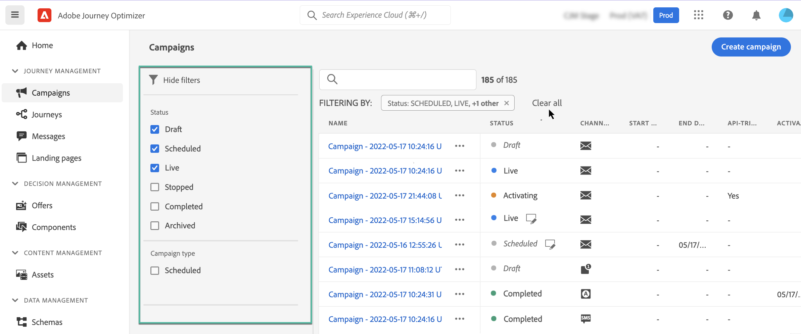

>[!TAB Campagne attivate da API]

Seleziona la scheda **[!UICONTROL API triggered]** per accedere all&#39;elenco delle campagne attivate dall&#39;API.

Per impostazione predefinita, l&#39;elenco mostra tutte le campagne con gli stati **[!UICONTROL Bozza]**, **[!UICONTROL Pianificato]** e **[!UICONTROL Live]**. Per visualizzare le campagne interrotte, completate e archiviate, è necessario cancellare il filtro.

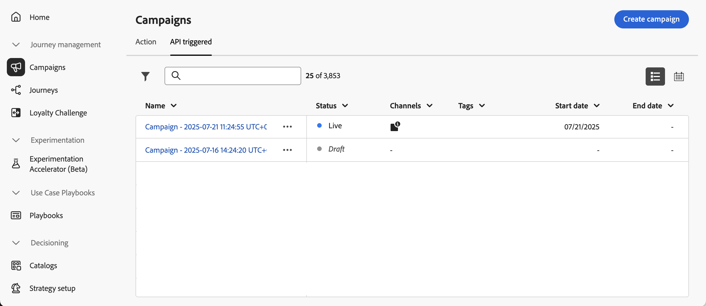

>[!TAB Campagne orchestrate]

Seleziona la scheda **[!UICONTROL Orchestrazione]** per accedere all&#39;elenco delle campagne orchestrate.

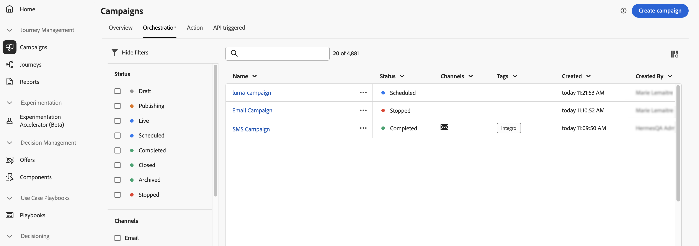{zoomable="yes"}

Ogni campagna orchestrata nell&#39;elenco visualizza informazioni quali il [stato](#statuses) corrente della campagna, il canale e i tag associati o l&#39;ultima modifica. È possibile personalizzare le colonne visualizzate facendo clic sul .

>[!ENDTABS]

### Campagne di ricerca e filtro {#search-filter}

Inoltre, sono disponibili una barra di ricerca e dei filtri per facilitare la ricerca all’interno dell’elenco. Ad esempio, puoi filtrare le campagne per visualizzare solo quelle associate a un canale o a un tag specifico, o quelle create durante un intervallo di date specifico.

## Operazioni della campagna {#operations}

L&#39;immagine  nell&#39;inventario delle campagne consente di eseguire varie operazioni.

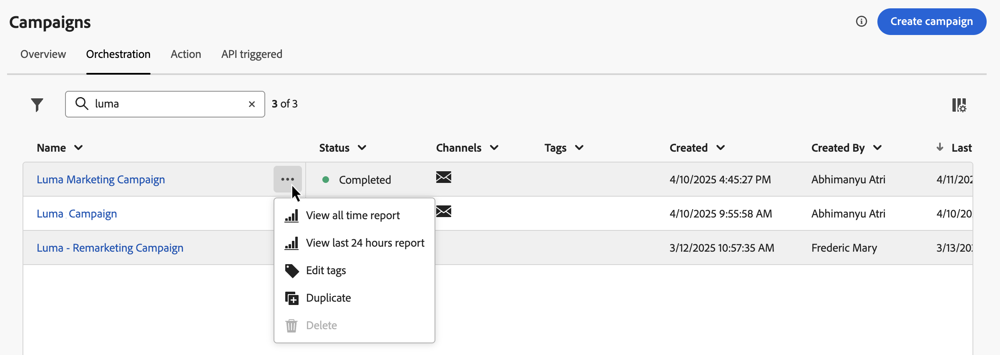

### Azioni disponibili

**Per tutti i tipi di campagna:**

* **[!UICONTROL View all time report]** / **[!UICONTROL View last 24 hours report]** - Access reports to measure and visualize the impact and performances of your campaigns. [Learn more about campaign reports →](../reports/campaign-global-report-cja.md)
* **[!UICONTROL Modifica tag]** - Modifica i tag associati alla campagna. [Scopri come utilizzare i tag →](../start/search-filter-categorize.md#add-tags)
* **[!UICONTROL Duplicato]** - Utilizzare questa opzione per duplicare una campagna, ad esempio per eseguire una campagna orchestrata interrotta. [Ulteriori informazioni sulla duplicazione di →](#duplicate-a-campaign)
* **[!UICONTROL Elimina]** - Utilizzare questa opzione per eliminare una campagna. [Ulteriori informazioni sull&#39;eliminazione di →](#delete-a-campaign)
* **[!UICONTROL Archivia]**: archivia la campagna. Tutte le campagne archiviate vengono eliminate secondo una pianificazione continua 30 giorni dopo la data dell’ultima modifica. Questa azione è disponibile per tutte le campagne ad eccezione delle campagne **[!UICONTROL Bozza]**. [Ulteriori informazioni sull&#39;archiviazione di →](#archive-a-campaign)

**Solo per campagne attivate da API e azione:**

* **[!UICONTROL Aggiungi al pacchetto]** - Aggiungi la campagna a un pacchetto per esportarla in un&#39;altra sandbox. [Scopri come esportare gli oggetti →](../configuration/copy-objects-to-sandbox.md)
* **[!UICONTROL Apri bozza versione]** - Se è stata creata una nuova versione della campagna e non è ancora stata attivata, puoi accedere alla versione bozza utilizzando questa azione.

**Solo per campagne orchestrate:**

* **[!UICONTROL Torna alla bozza]** - Annulla la pubblicazione e ripristina lo stato di bozza di una campagna per il recupero degli errori. Questa azione è disponibile quando una campagna pianificata non è ancora stata avviata o quando una campagna live rileva un errore prima del completamento di qualsiasi esecuzione. [Ulteriori informazioni sul ripristino delle campagne →](../orchestrated/start-monitor-campaigns.md#back-to-draft)

## Informazioni sullo stato della campagna {#statuses}

Each campaign moves through a lifecycle that is reflected by its status in the interface. Understanding these statuses helps you know what actions are available and what to do next.

| Stato | Campagne con azioni | Campagne attivate da API | Campagne orchestrate | Che cosa significa | Azioni successive |
|--------|:----------------:|:-----------------------:|:----------------------:|---------------|--------------|
| **[!UICONTROL Bozza]** | ✅ | ✅ | ✅ | In fase di modifica, non attivato | Continua a modificare o [attivare la campagna](review-activate-campaign.md) |
| **[!UICONTROL Pianificato]** | ✅ | ✅ | ✅ | Configurato per una data di inizio specifica | Attendi l&#39;avvio, [modifica se necessario](#modify) o [visualizza nel calendario](#calendar) |
| **[!UICONTROL Live]** | ✅ | ✅ | ✅ | Attivato ed in esecuzione | [Monitorare le prestazioni](../reports/campaign-global-report-cja.md), [creare una nuova versione](#modify) se necessario. Per le campagne orchestrate: [ripristina la bozza](../orchestrated/start-monitor-campaigns.md#back-to-draft) per le campagne pianificate non ancora avviate o per le campagne con errori di esecuzione prima dell&#39;invio di messaggi |
| **[!UICONTROL In revisione]** | ✅ | ✅ | — | Presentato per l’omologazione | Attendi [approvazione](../test-approve/gs-approval.md) o modifica |
| **[!UICONTROL Arrestata]** | ✅ | ✅ | ✅ | Arrestato manualmente, impossibile riattivarlo | [Duplicato da riutilizzare](#duplicate-a-campaign) |
| **[!UICONTROL Completato]** | ✅ | ✅ | ✅ | Esecuzione completata (assegnata automaticamente 3 giorni dopo l’attivazione o alla data di fine per ricorrenti) | [Visualizza report](../reports/campaign-global-report-cja.md), [archivio](#archive-a-campaign) o [duplicato](#duplicate-a-campaign) |
| **[!UICONTROL Non riuscito]** | ✅ | ✅ | — | Esecuzione non riuscita | Check logs, fix issues, [duplicate to retry](#duplicate-a-campaign) |
| **[!UICONTROL Archived]** | ✅ | ✅ | ✅ | Archived (auto-deleted after 30 days) | [Recupera utilizzando il filtro](#access) se necessario |
| **[!UICONTROL Chiuso]** | — | — | ✅ | Campagna ricorrente chiusa, nessun nuovo ingresso consentito (continua fino al completamento di tutte le attività) | Attendere il completamento |
| **[!UICONTROL Pubblicazione]** | — | — | ✅ | In fase di pubblicazione | Attendere il completamento della pubblicazione |

>[!NOTE]
>
>For Action and API-triggered campaigns, the &quot;Open draft version&quot; icon next to a **[!UICONTROL Live]** or **[!UICONTROL Scheduled]** status indicates that a new version has been created and has not been activated yet.

### Indicatori di errore

When an error occurs within one of your campaigns, a warning icon appears alongside the campaign&#39;s status. Fai clic su di esso per visualizzare le informazioni relative all’avviso. These alerts may occur in various situations, such as when the campaign message has not been published or if the chosen configuration is incorrect.

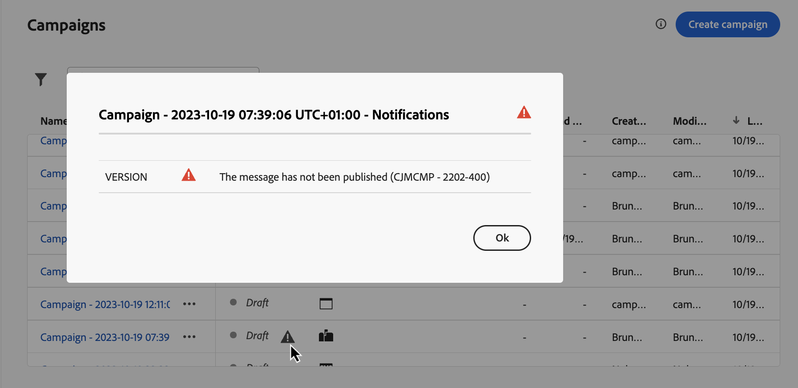

>[!NOTE]
>
>Assets/Images are accessible in delivered content for up to 2 years (730 days) since their first publication in any fragment/inline message. Re-publishing is required after this expiry period (any time after 730 days) to keep them accessible for another 2 years. Any re-publication done within 730 days of the first publication will not extend the expiry of assets/images to the next 730 days.

## Calendario delle campagne {#calendar}

>[!CONTEXTUALHELP]
>id="ajo_campaigns_view"
>title="Visualizzazioni calendario ed elenco campagne"
>abstract="Oltre all’elenco delle campagne, [!DNL Journey Optimizer] fornisce una visualizzazione del calendario delle campagne, offrendo una chiara rappresentazione visiva delle relative pianificazioni. È possibile passare dalla visualizzazione elenco alla visualizzazione calendario in qualsiasi momento utilizzando questi pulsanti."

Oltre all&#39;elenco delle campagne, [!DNL Journey Optimizer] fornisce una visualizzazione del calendario delle campagne, offrendo una chiara rappresentazione visiva delle loro pianificazioni.

### Funzionamento del calendario

Modalità di rappresentazione delle campagne:

* Per impostazione predefinita, la griglia del calendario mostra tutte le campagne live e pianificate per la settimana selezionata. Altre opzioni di filtro possono mostrare attivazioni completate, interrotte e terminate o attivazioni di un certo tipo o canale.
* Le bozze di campagne non vengono visualizzate.
* Le campagne che si estendono su più giorni vengono visualizzate nella parte superiore della griglia del calendario.
* Se non viene specificato alcun orario di inizio, viene utilizzato il tempo di attivazione manuale più vicino per posizionarlo nel calendario.
* Campaigns are displayed as 1-hour timespans, but this does not reflect actual send or completion time.

### Navigate the calendar

1. Click the  icon to access your Campaigns calendar.

1. Utilizza i pulsanti freccia o il selettore data sopra il calendario per spostarti tra le settimane.

   Il calendario visualizza tutte le campagne pianificate per la settimana corrente.

   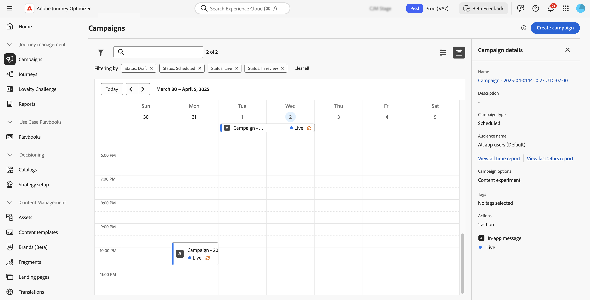

1. Fai clic sull&#39;icona  per attivare/disattivare la visualizzazione degli elementi per più giorni o settimane.

   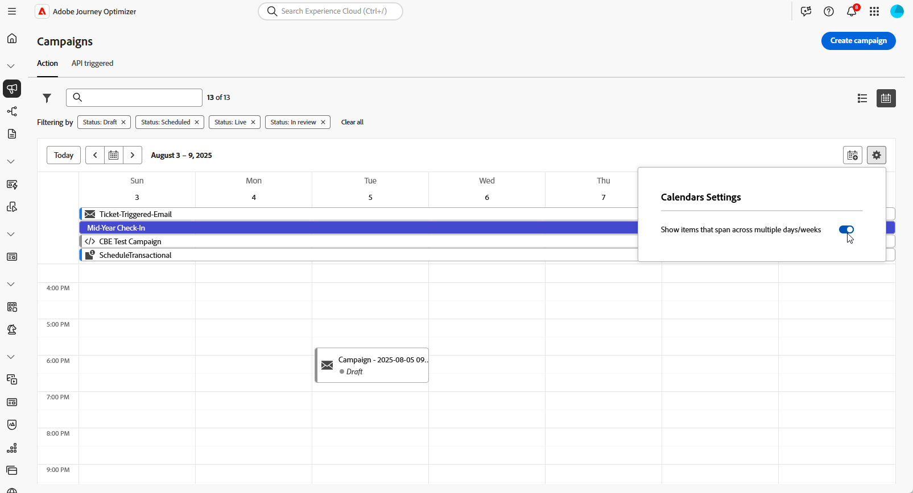

1. Fai clic sull&#39;icona  per gestire e aggiungere fino a tre calendari esterni.

   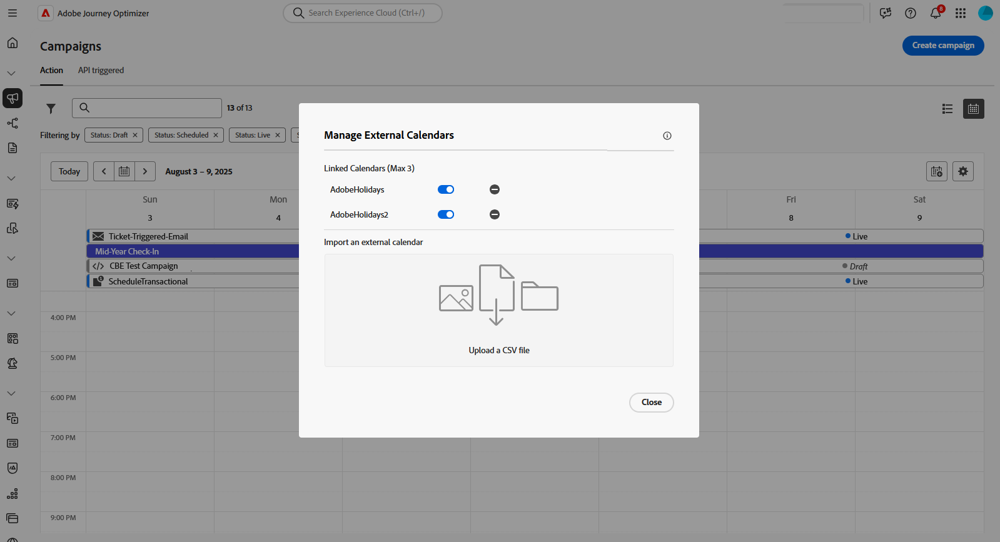

1. Trascina e rilascia i file CSV contenenti i nomi degli eventi, le date di inizio e di fine.

   Gli eventi caricati vengono visualizzati per tutti gli utenti dell’organizzazione e sono visualizzati sia sul calendario di Percorso che su quello di Campaign.

   +++Il formato CSV deve essere il seguente:

   | Colonna1 | Colonna2 | Colonna3 |
   |-|-|-|
   | Nome evento | Data di inizio in formato mm/gg/aa | Data di fine in formato mm/gg/aa |

   +++

1. Se necessario, è possibile nascondere, visualizzare o rimuovere i calendari esterni aggiunti.

   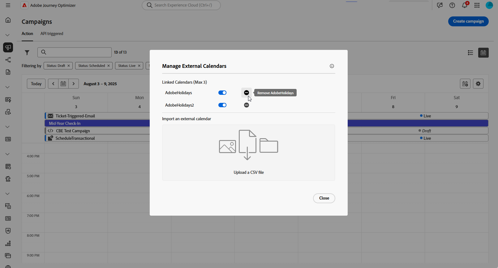

1. Per ulteriori dettagli su una campagna, fai clic sul relativo blocco visivo per aprirne i dettagli. Si aprirà un riquadro informazioni con varie informazioni sulla campagna, ad esempio il tipo, l’accesso ai rapporti o i tag assegnati.

   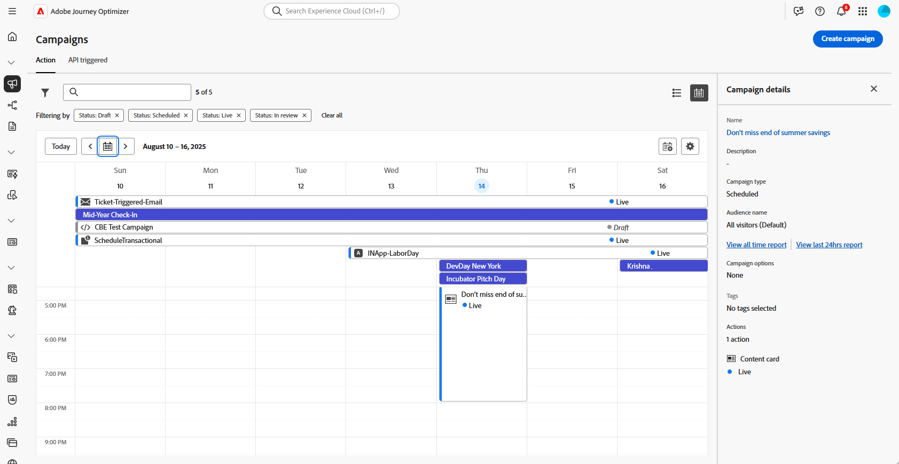

## Modificare e interrompere le campagne di azione ricorrenti {#modify}

### Modificare una campagna di azioni {#modify-an-action-campaign}

Per modificare e creare una nuova versione di una campagna Azione ricorrente, effettua le seguenti operazioni:

1. Apri la campagna Azione, quindi fai clic sul pulsante **[!UICONTROL Modifica campagna]**.

1. Viene creata una nuova versione della campagna. Puoi controllare la versione live facendo clic su **[!UICONTROL Apri versione live]**.

   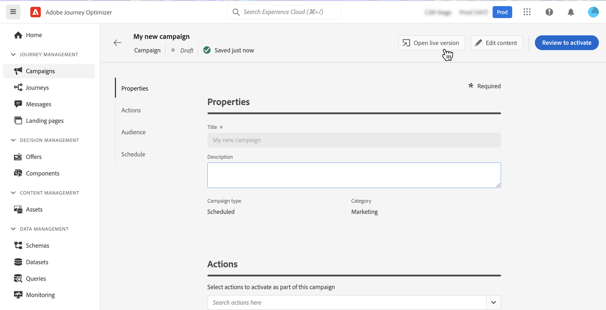

   In the campaigns list, activated campaigns with a draft version in progress display with a specific icon in the **[!UICONTROL Status]** column. Click this icon to open the draft version of the campaign.

   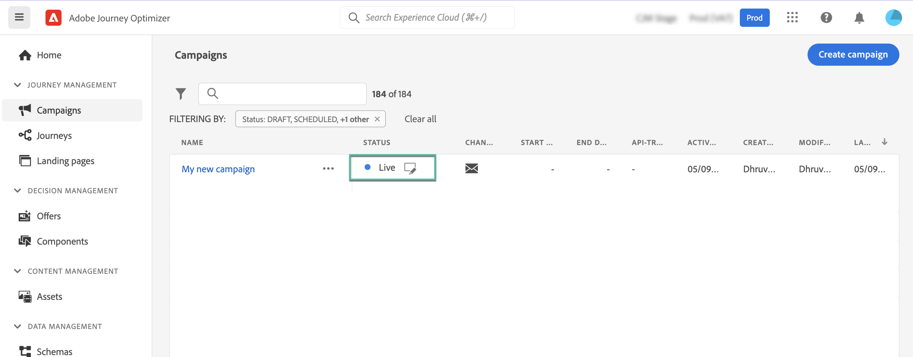

1. Once your changes are ready, you can activate the new version of the campaign (see [Review and activate a campaign](review-activate-campaign.md)).

   >[!IMPORTANT]
   >
   >Activating the draft will replace the live version of the campaign.

**Argomenti correlati:**
* [Proprietà campagna](campaign-properties.md)
* [Azioni della campagna](campaign-action.md)
* [Contenuto della campagna](campaign-content.md)
* [Pubblico della campagna](campaign-audience.md)
* [Pianificazione della campagna](campaign-schedule.md)

### Interrompere una campagna di azioni {#stop}

Per interrompere una campagna ricorrente, aprirla e fare clic sul pulsante **[!UICONTROL Interrompi campagna]**.

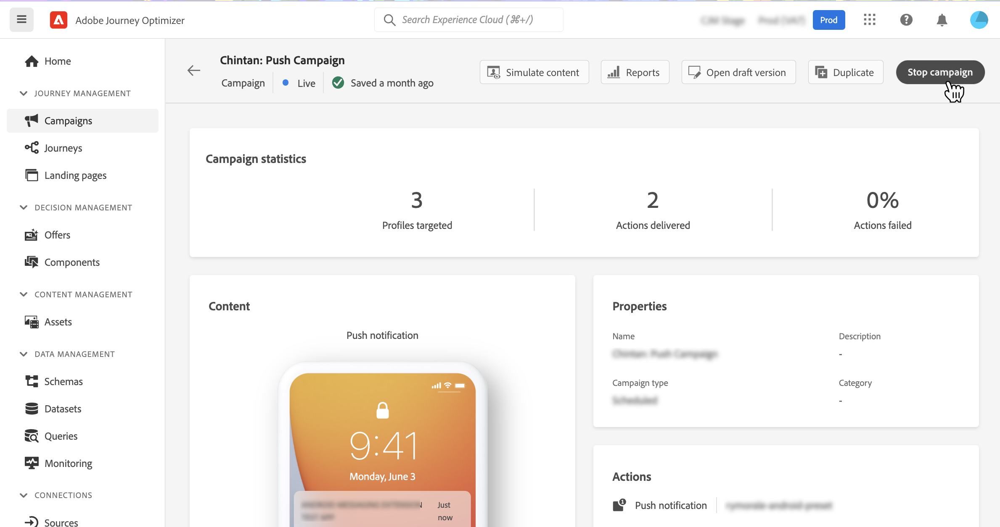

>[!IMPORTANT]
>
>L’interruzione di una campagna non interrompe un invio in corso, ma interrompe un invio pianificato o le occorrenze successive se l’invio è già in corso.

## Archiviare una campagna {#archive-a-campaign}

Con il tempo, l’elenco delle campagne continua a crescere e alla fine diventa più difficile sfogliare le campagne completate e interrotte.

Per evitare questo problema, puoi archiviare campagne completate e interrotte che non sono più necessarie. A questo scopo, fai clic sul pulsante con i puntini di sospensione, quindi seleziona **[!UICONTROL Archivia]**.

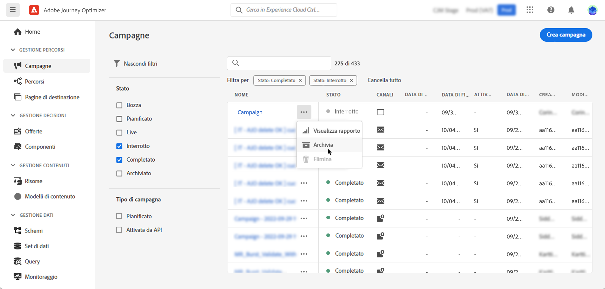

Le campagne archiviate possono quindi essere recuperate utilizzando il filtro dedicato nell’elenco.

## Delete a campaign {#delete-a-campaign}

To delete a campaign, use the ellipsis  button and select **[!UICONTROL Delete]**.

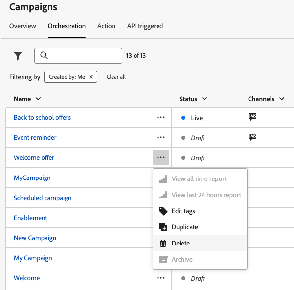{width="70%" align="left"}

>[!IMPORTANT]
>
>This option is available for **[!UICONTROL Draft]** campaigns only.

## Duplicare una campagna {#duplicate-a-campaign}

Per duplicare una campagna, ad esempio se è stata interrotta, usa i puntini di sospensione  e seleziona **[!UICONTROL Duplica]**.

Inserisci il nome della campagna e conferma.

La campagna viene creata e aggiunta all’elenco delle campagne.

## Risorse aggiuntive

* **Guida introduttiva** - [Guida introduttiva alle campagne](get-started-with-campaigns.md) | [Crea la tua prima campagna Azione](create-campaign.md) | [Guida alle campagne attivate dall&#39;API](api-triggered-campaigns.md) | [Guida alle campagne orchestrate](../orchestrated/gs-orchestrated-campaigns.md)

* **Configurazione campagna** - [Proprietà campagna](campaign-properties.md) | [Azioni campagna e canali](campaign-action.md) | [Progettazione contenuti campagna](campaign-content.md) | [Selezione pubblico campagna](campaign-audience.md) | [Pianificazione campagne](campaign-schedule.md)

* **Funzioni avanzate** - [Flussi di lavoro di approvazione](../test-approve/gs-approval.md) | [Gestione dei conflitti e definizione delle priorità](../conflict-prioritization/gs-conflict-prioritization.md) | [Limitazione della frequenza per canale](../conflict-prioritization/channel-capping.md) | [Punteggi di priorità](../conflict-prioritization/priority-scores.md) | [Esporta campagne in altre sandbox](../configuration/copy-objects-to-sandbox.md)

* **Monitoraggio e ottimizzazione** - [Report campagne (CJA)](../reports/campaign-global-report-cja.md) | [Configurazione avvisi](../reports/alerts.md)

* **Organizzazione** - [Utilizzo dei tag](../start/search-filter-categorize.md) | [Gestione delle autorizzazioni](../administration/ootb-product-profiles.md)
