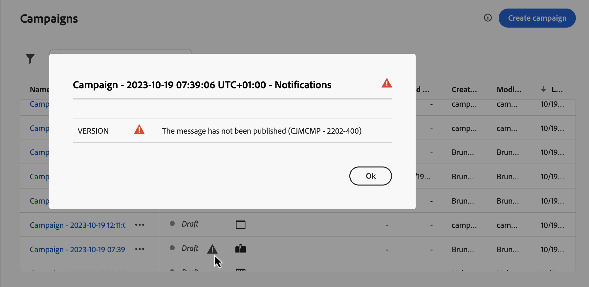

# Gestire le campagne {#modify-stop-campaign}

Una volta attivata una campagna, puoi modificarla o interromperla in qualsiasi momento. Queste operazioni sono disponibili solo per le campagne con un’esecuzione ricorrente.

Inoltre, puoi duplicare le campagne live (eseguite una volta o con un’esecuzione ricorrente) per crearne di nuove e archiviare le campagne completate o interrotte.

## Accedere alle campagne {#access}

>[!CONTEXTUALHELP]
>id="ajo_campaigns_view"
>title="Campagne basate su tabelle e viste Timeline"
>abstract="Visualizzazioni di tabella e timeline delle campagne"

Le campagne sono accessibili dal menu **[!UICONTROL Campagne]**.

Per impostazione predefinita, l&#39;elenco mostra tutte le campagne con gli stati **[!UICONTROL Bozza]**, **[!UICONTROL Pianificato]** e **[!UICONTROL Live]**. Per visualizzare le campagne interrotte, completate e archiviate, è necessario cancellare il filtro.

Inoltre, puoi filtrare l’elenco in base al tipo di campagna e al canale, o ai tag assegnati alle campagne durante la loro creazione. [Scopri come assegnare i tag a una campagna](create-campaign.md#create)

## Stati e avvisi delle campagne {#statuses}

Le campagne possono avere più stati:

* **[!UICONTROL Bozza]**: la campagna è in corso di modifica e non è stata attivata.
* **[!UICONTROL Attivazione]**: attivazione della campagna in corso.
* **[!UICONTROL Elaborazione]** *(solo campagne e-mail)*: l&#39;esportazione del pubblico è stata completata, la campagna è in fase di pubblicazione.
* **[!UICONTROL Live]**: la campagna è stata attivata.
* **[!UICONTROL Pianificato]**: la campagna è configurata per essere attivata in una data di inizio specifica.
* **[!UICONTROL Interrotto]**: la campagna è stata interrotta manualmente. Non è più possibile attivarla o riutilizzarla. [Scopri come interrompere una campagna](modify-stop-campaign.md#stop)
* **[!UICONTROL Completata]**: campagna completata. Questo stato viene assegnato automaticamente 3 giorni dopo l’attivazione di una campagna o alla data di fine della campagna, se questa ha un’esecuzione ricorrente.
* **[!UICONTROL Archiviata]**: la campagna è stata archiviata. [Scopri come archiviare le campagne](modify-stop-campaign.md#archive)

>[!NOTE]
>
>L&#39;icona &quot;Open draft version&quot; (Apri versione bozza) accanto allo stato **[!UICONTROL Live]** o **[!UICONTROL Scheduled]** indica che è stata creata una nuova versione della campagna e che non è ancora stata attivata. [Ulteriori informazioni](modify-stop-campaign.md#modify).

Quando si verifica un errore all’interno di una delle campagne, accanto allo stato della campagna viene visualizzata un’icona di avviso. Fai clic su di esso per visualizzare le informazioni relative all’avviso. Questi avvisi possono verificarsi in varie situazioni, ad esempio quando il messaggio della campagna non è stato pubblicato o se la configurazione scelta non è corretta.

## Modificare una campagna ricorrente {#modify}

Per modificare e creare una nuova versione di una campagna ricorrente, effettua le seguenti operazioni:

1. Apri la campagna, quindi fai clic sul pulsante **[!UICONTROL Modifica campagna]**.

1. Viene creata una nuova versione della campagna. Puoi controllare la versione live facendo clic su **[!UICONTROL Apri versione live]**.

   

   Nell&#39;elenco delle campagne, le campagne attivate con una versione bozza in corso vengono visualizzate con un&#39;icona specifica nella colonna **[!UICONTROL Stato]**. Fai clic su questa icona per aprire la versione bozza della campagna.

   

1. Quando le modifiche sono pronte, puoi attivare la nuova versione della campagna (vedi [Rivedi e attiva una campagna](create-campaign.md#review-activate)).

   >[!IMPORTANT]
   >
   >L’attivazione della bozza sostituirà la versione live della campagna.

## Interrompere una campagna ricorrente {#stop}

Per interrompere una campagna ricorrente, aprirla e fare clic sul pulsante **[!UICONTROL Interrompi campagna]**.

>[!IMPORTANT]
>
>L’interruzione di una campagna non interrompe un invio in corso, ma interrompe un invio pianificato o le occorrenze successive se l’invio è già in corso.

<!-- inbound campaign (inapp): can stop and resume -->

## Duplicare una campagna {#duplicate}

Puoi duplicare una campagna live per crearne una nuova. Per eseguire questa operazione, aprire la campagna, quindi fare clic su **[!UICONTROL Duplica]**.

## Archiviare una campagna {#archive}

Con il tempo, l’elenco delle campagne continua a crescere e alla fine diventa più difficile sfogliare le campagne completate e interrotte.

Per evitare questo problema, puoi archiviare campagne completate e interrotte che non sono più necessarie. A questo scopo, fai clic sul pulsante con i puntini di sospensione, quindi seleziona **[!UICONTROL Archivia]**.

Le campagne archiviate possono quindi essere recuperate utilizzando il filtro dedicato nell’elenco. [Scopri come accedere alle campagne](get-started-with-campaigns.md#access)
