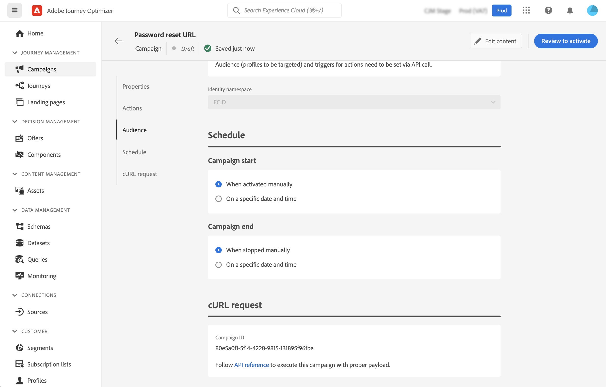

# Eseguire una campagna attivata da API {#execute}

Una volta attivata la campagna, devi recuperare la richiesta cURL di esempio generata e utilizzarla nell’API per generare il payload e attivare la campagna.

## Da leggere {#must-read}

* **Date di inizio/fine campagna** - Se hai configurato una data di inizio e/o fine specifica durante la creazione della campagna, questa non verrà eseguita oltre queste date e le chiamate API avranno esito negativo.

* **Timeout chiamata** - Il timeout della chiamata all&#39;API REST di esecuzione messaggi interattiva è di 60 secondi. Tuttavia, in caso di timeout imprevisti per garantire la consegna, sono presenti nuovi tentativi interni.

## Attivare la campagna {#trigger}

1. Apri la campagna, quindi copia e incolla la richiesta di payload dalla sezione **[!UICONTROL richiesta cURL]**. Questo payload include tutte le variabili di personalizzazione (profilo e contesto) utilizzate nel messaggio. È disponibile una volta che la campagna è in diretta.

   

   >[!IMPORTANT]
   >
   >Gli endpoint nella sezione cURL differiscono tra le campagne standard e le [campagne con throughput elevato](../campaigns/api-triggered-high-throughput.md).

1. Utilizza questa richiesta cURL nelle API per generare il payload e attivare la campagna. Per ulteriori informazioni, consulta la [documentazione dell&#39;API di esecuzione interattiva dei messaggi](https://developer.adobe.com/journey-optimizer-apis/references/messaging/#tag/execution), in cui sono elencati tutti gli endpoint per le campagne Standard e High Throughput.

   Gli esempi di chiamate API sono disponibili anche in [questa pagina](https://developer.adobe.com/journey-optimizer-apis/references/messaging-samples/).

## Risoluzione dei problemi {#troubleshooting}

### Ritardi nella consegna delle e-mail {#delivery-delays}

Se i tempi di consegna delle e-mail superano le aspettative, esamina potenziali interruzioni o problemi di prestazioni con i servizi esterni, come i provider di infrastrutture cloud o di servizi e-mail. I registri di Journey Optimizer registrano i timestamp di partenza del messaggio, che possono aiutare a determinare se si sono verificati ritardi a valle nella pipeline di consegna.

### Errori di autenticazione di Azure Cosmos DB (errore 500 del server interno) {#cosmosdb-auth-errors}

Se durante l&#39;attivazione di campagne attivate da API si verificano **500 errori interni del server** e i registri di sistema mostrano un errore **403 Forbidden** da Azure Cosmos DB con un messaggio di tipo:

_&quot;L&#39;accesso all&#39;account è attualmente revocato perché il servizio Azure Cosmos DB non è in grado di ottenere il token di autenticazione AAD per l&#39;identità predefinita dell&#39;account&quot;_

Questo errore si verifica in genere quando l’entità principale del servizio Azure richiesta per l’autenticazione Cosmos DB è stata disabilitata, eliminata o non configurata correttamente.

+++Come risolvere questo problema

1. **Verificare l&#39;entità servizio Azure**. Verificare che l&#39;entità servizio Azure o l&#39;identità gestita siano abilitate e non siano state disabilitate o eliminate in Azure Active Directory.

1. **Verifica autorizzazioni** - Verifica che l&#39;entità servizio disponga delle autorizzazioni necessarie per accedere alle risorse dell&#39;insieme di credenziali delle chiavi di Azure e Cosmos DB. L’entità servizio deve disporre delle assegnazioni di ruolo appropriate per l’autenticazione con Azure Cosmos DB.

1. **Rivedi la configurazione CMK di Azure Cosmos DB**. Se utilizzi le chiavi gestite dal cliente (CMK), consulta la [Guida alla risoluzione dei problemi CMK di Azure Cosmos DB](https://learn.microsoft.com/en-us/azure/cosmos-db/cmk-troubleshooting-guide#azure-active-directory-token-acquisition-error){target="_blank"} per i passaggi dettagliati per ripristinare l&#39;acquisizione del token AAD.

1. **Riattiva e verifica** - Dopo aver corretto la configurazione, riattiva l&#39;entità servizio, se è stata disabilitata, e verifica nuovamente le chiamate API della campagna transazionale per verificare che l&#39;autenticazione abbia esito positivo e che i messaggi vengano recapitati.

>[!NOTE]
>
>Questo problema è in genere causato da una configurazione errata o da una disabilitazione accidentale dell’entità del servizio Azure richiesta per l’autenticazione Cosmos DB. Se l&#39;entità servizio viene mantenuta abilitata e configurata correttamente, l&#39;errore non si verificherà più.

+++
