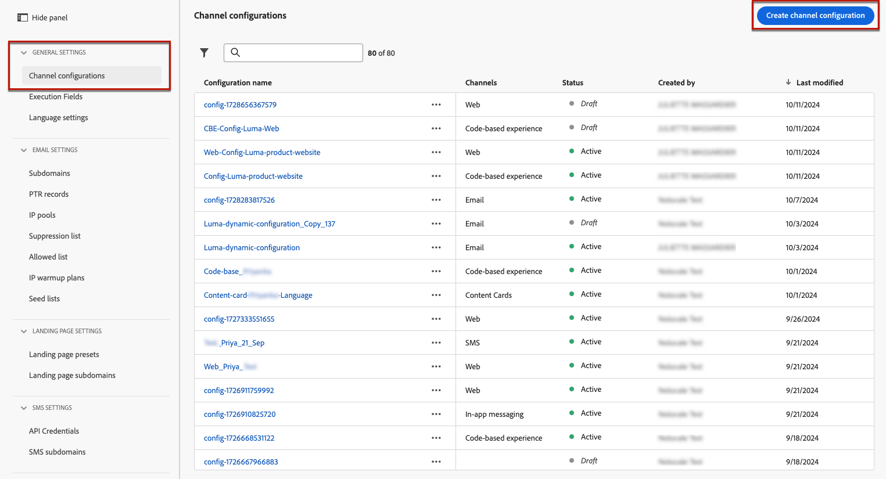
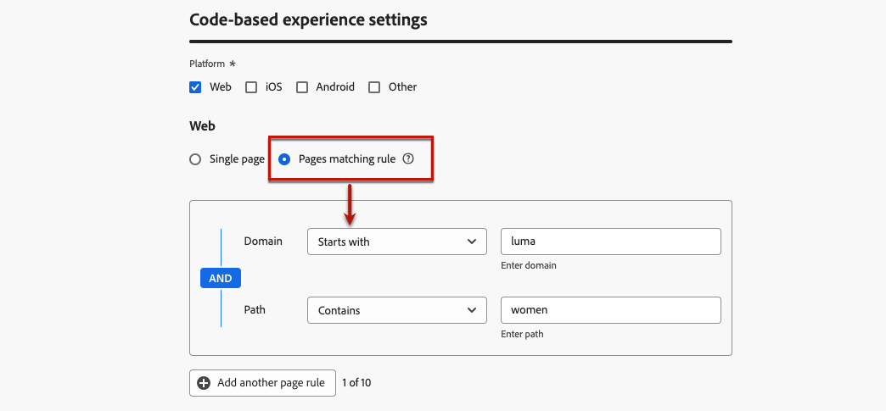

# Configurare l’esperienza basata su codice {#code-based-configuration}

>[!CONTEXTUALHELP]
>id="ajo_code_based_surface"
>title="Definire una configurazione di esperienza basata su codice"
>abstract="Una configurazione basata su codice definisce il percorso e la posizione all’interno dell’applicazione, identificati in modo univoco da un URI nell’implementazione dell’applicazione, in cui il contenuto verrà consegnato e utilizzato."

Prima di [creare la tua esperienza](create-code-based.md), devi creare una configurazione di esperienza basata su codice in cui definisci dove verranno consegnati e utilizzati i contenuti all&#39;interno dell&#39;applicazione.

Una configurazione di esperienza basata su codice deve fare riferimento alla superficie, che è fondamentalmente la posizione in cui desideri eseguire il rendering delle modifiche. A seconda della piattaforma selezionata, è necessario immettere una posizione o un percorso oppure l&#39;URI della superficie completa. [Ulteriori informazioni](code-based-surface.md)

>[!NOTE]
>
>Se più azioni di esperienza basate su codice utilizzano la stessa configurazione di canale (e quindi vengono eseguite sulla stessa superficie), il **[!UICONTROL Punteggio di priorità]** della campagna o del percorso determina ciò che viene consegnato all&#39;utente finale se è idoneo per più di un&#39;azione. [Ulteriori informazioni sui punteggi di priorità](../conflict-prioritization/priority-scores.md)

## Creare una configurazione di esperienza basata su codice {#create-code-based-configuration}

>[!CONTEXTUALHELP]
>id="ajo_admin_location"
>title="Indicare la posizione specifica all’interno della pagina o dell’app"
>abstract="Questo campo specifica la destinazione esatta all’interno di una pagina o dell’app a cui desideri che gli utenti accedano. Può trattarsi di una sezione particolare all’interno di una pagina web o di una pagina all’interno della struttura di navigazione dell’app."

>[!CONTEXTUALHELP]
>id="ajo_admin_default_mobile_url"
>title="Definire un URL per la creazione e l’anteprima dei contenuti"
>abstract="Questo campo assicura che le pagine generate o associate dalla regola abbiano un URL designato, essenziale sia per la creazione che per l’anteprima efficace del contenuto."

Per creare una configurazione del canale esperienza basata su codice, effettua le seguenti operazioni:

1. Accedi al menu **[!UICONTROL Canali]** > **[!UICONTROL Impostazioni generali]** > **[!UICONTROL Configurazioni canale]**, quindi fai clic su **[!UICONTROL Crea configurazione canale]**.

   

1. Immetti un nome e una descrizione (facoltativa) per la configurazione.

   >[!NOTE]
   >
   > I nomi devono iniziare con una lettera (A-Z). Può contenere solo caratteri alfanumerici. È inoltre possibile utilizzare i caratteri trattino basso `_`, punto `.` e trattino `-`.

1. Per assegnare etichette di utilizzo dei dati personalizzate o di base alla configurazione, è possibile selezionare **[!UICONTROL Gestisci accesso]**. [Ulteriori informazioni sul controllo degli accessi a livello di oggetto (OLAC)](../administration/object-based-access.md)

1. Seleziona **[!UICONTROL Azione di marketing]** per associare i criteri di consenso ai messaggi utilizzando questa configurazione. Tutti i criteri di consenso associati all’azione di marketing vengono utilizzati per rispettare le preferenze dei clienti. [Ulteriori informazioni](../action/consent.md#surface-marketing-actions)

1. Seleziona il canale **esperienza basata su codice**.

   

1. Seleziona la piattaforma per la quale verrà applicata l’esperienza basata su codice:

   * [Web](#web)
   * [iOS e/o Android](#mobile)
   * [Altro](#other)

   >[!NOTE]
   >
   >Puoi selezionare diverse piattaforme. Quando si selezionano più piattaforme, il contenuto viene distribuito a tutte le pagine o app selezionate.

1. Scegliere il formato previsto dall&#39;applicazione per questa posizione particolare. Verrà utilizzato per creare l’esperienza basata su codice in campagne e percorsi.

   

1. Fai clic su **[!UICONTROL Invia]** per salvare le modifiche.

Ora puoi selezionare questa configurazione durante [la creazione di un&#39;esperienza basata su codice](create-code-based.md) nelle campagne e nei percorsi.

>[!NOTE]
>
>Il team di implementazione dell’app è responsabile dell’esecuzione di chiamate API o SDK esplicite per recuperare il contenuto per le superfici definite nella configurazione di esperienza basata su codice selezionata. Ulteriori informazioni sulle diverse implementazioni del cliente in [questa sezione](code-based-implementation-samples.md).

### Piattaforme web {#web}

>[!CONTEXTUALHELP]
>id="ajo_admin_default_web_url"
>title="Definire un URL per l’authoring e l’anteprima dei contenuti"
>abstract="Questo campo assicura che le pagine generate o associate dalla regola abbiano un URL designato, essenziale sia per la creazione che per l’anteprima efficace del contenuto."

Per definire le impostazioni di configurazione dell’esperienza basata su codice per le piattaforme web, segui i passaggi indicati di seguito.

1. Selezionare una delle opzioni seguenti:

   * **[!UICONTROL Pagina singola]** - Se desideri applicare le modifiche esclusivamente a una singola pagina, immetti un **[!UICONTROL URL pagina]**.

     

   * **[!UICONTROL Regola di corrispondenza pagine]** - Per eseguire il targeting di più URL che corrispondono alla stessa regola, genera una o più regole. [Ulteriori informazioni](../web/web-configuration.md#web-page-matching-rule)

     <!--This could be used to apply changes universally across a website, such as updating a hero banner across all pages or adding a top image to display on every product page.-->

     Ad esempio, se desideri modificare gli elementi visualizzati in tutte le pagine del sito Web Luma relative alle donne, seleziona **[!UICONTROL Dominio]** > **[!UICONTROL Inizia con]** > `luma` e **[!UICONTROL Pagina]** > **[!UICONTROL Contiene]** > `women`.

     

1. Per l’URL di anteprima vale quanto segue:

   * Se viene immesso un URL di una singola pagina, questo verrà utilizzato per l’anteprima e non è necessario immettere un altro URL.
   * Se è selezionata una [regola corrispondente alle pagine](../web/web-configuration.md#web-page-matching-rule), è necessario immettere un **[!UICONTROL URL predefinito per l&#39;authoring e l&#39;anteprima]** che verrà utilizzato per visualizzare l&#39;anteprima dell&#39;esperienza in un browser. [Ulteriori informazioni](test-code-based.md#preview-on-device)

     

1. Il campo **[!UICONTROL Posizione nella pagina]** specifica la destinazione esatta all&#39;interno della pagina a cui si desidera che gli utenti accedano. Può essere una sezione particolare di una pagina all’interno della struttura di navigazione del sito, ad esempio &quot;hero-banner&quot; o &quot;product-rail&quot;.

   >[!CAUTION]
   >
   >La stringa o il percorso immesso in questo campo deve corrispondere a quello dichiarato nell’implementazione dell’app o della pagina. In questo modo il contenuto viene consegnato nella posizione desiderata all’interno dell’app o della pagina specificata. [Ulteriori informazioni](code-based-surface.md#uri-composition)

   

### Piattaforme mobili (iOS e Android) {#mobile}

>[!CONTEXTUALHELP]
>id="ajo_admin_app_id"
>title="Fornire l’ID dell’app"
>abstract="Inserisci l’ID dell’app per una corretta identificazione e configurazione nell’ambiente operativo dell’app, in modo da garantire integrazione e funzionalità dirette."

>[!CONTEXTUALHELP]
>id="ajo_admin_mobile_url_preview"
>title="Immettere l’URL per l’anteprima del contenuto"
>abstract="Questo campo è essenziale per abilitare la simulazione e l’anteprima del contenuto direttamente sul dispositivo all’interno dell’applicazione."

Per definire le impostazioni di configurazione dell’esperienza basata su codice per le piattaforme mobili, segui i passaggi indicati di seguito.

1. Immetti **[!UICONTROL ID app]**. Questo consente un’identificazione e una configurazione accurate all’interno dell’ambiente operativo dell’app e garantisce l’integrazione e la funzionalità senza interruzioni.

1. Specifica il percorso o la posizione **[!UICONTROL nell&#39;app]**. Questo campo specifica la destinazione esatta all’interno dell’app a cui desideri che gli utenti accedano. Può trattarsi di una sezione o di una pagina particolare all’interno della struttura di navigazione dell’app, ad esempio &quot;hero-banner&quot; o &quot;product-rail&quot;.

   

1. Compila il campo **[!UICONTROL URL anteprima]** per abilitare le anteprime su dispositivo. Questo URL informa il servizio di anteprima dell’URL specifico da utilizzare quando si attiva l’anteprima sul dispositivo. [Ulteriori informazioni](test-code-based.md#preview-on-device)

   L&#39;URL di anteprima è un collegamento profondo configurato dallo sviluppatore dell&#39;app all&#39;interno dell&#39;app. In questo modo, gli URL che corrispondono allo schema di collegamento profondo si apriranno all’interno dell’app anziché in un browser web per dispositivi mobili. Contatta il tuo sviluppatore di app per ottenere lo schema di collegamento profondo configurato per la tua app.

   +++  Le seguenti risorse possono essere utili per configurare collegamenti profondi per l’implementazione dell’app

   * Per Android:

      * [Creare deep link al contesto dell’app](https://developer.android.com/training/app-links/deep-linking)

   * Per iOS:

      * [Definizione di uno schema URL personalizzato per l’app](https://developer.apple.com/documentation/xcode/defining-a-custom-url-scheme-for-your-app)

      * [Supporto dei collegamenti universali nell’app](https://developer.apple.com/documentation/xcode/supporting-universal-links-in-your-app)

   +++

   >[!NOTE]
   >
   >In caso di problemi durante l&#39;anteprima dell&#39;esperienza, consulta [questa documentazione](https://experienceleague.adobe.com/en/docs/experience-platform/assurance/troubleshooting#app-does-not-open-link).

### Altre piattaforme {#other}

Per definire le impostazioni di configurazione dell’esperienza basata su codice per altre piattaforme (come console video, dispositivi collegati alla TV, smart TV, chioschi, sportelli bancomat, assistenti vocali, dispositivi IoT e così via), segui la procedura riportata di seguito.

1. Seleziona **[!UICONTROL Altro]** come piattaforma se la tua implementazione non è per Web, iOS o Android oppure se devi eseguire il targeting di URI specifici.

1. Immettere l&#39;**[!UICONTROL URI superficie]**. Un URI di superficie è un identificatore univoco corrispondente all’entità in cui desideri fornire l’esperienza. [Ulteriori informazioni](code-based-surface.md#surface-uri)

   

   >[!CAUTION]
   >
   >Assicurati di immettere un URI di superficie che corrisponda a quello utilizzato nella tua implementazione. In caso contrario, non sarà possibile consegnare le modifiche. [Ulteriori informazioni](code-based-surface.md#uri-composition)

1. **[!UICONTROL Se necessario, aggiungere un altro URI di superficie]**. Puoi aggiungere fino a 10 URI.

   >[!NOTE]
   >
   >Quando si aggiungono più URI, il contenuto viene distribuito a tutti i componenti elencati.
