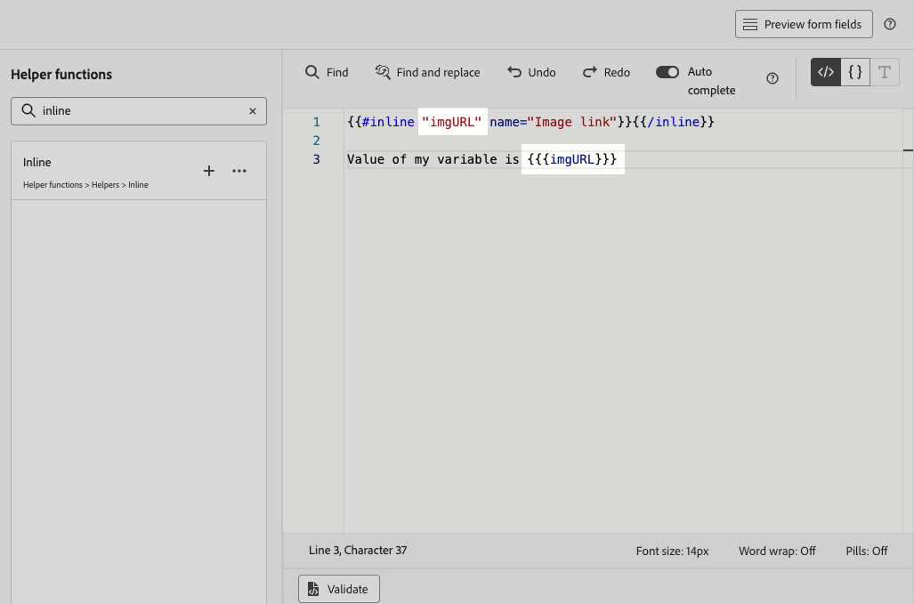

# Utilizzare campi modulo modificabili in esperienze basate su codice {#code-based-form-fields}

Per una maggiore flessibilità e un maggiore controllo sulle esperienze basate su codice, [!DNL Journey Optimizer] consente al team di sviluppo di creare modelli di contenuto JSON o HTML contenenti specifici campi modificabili predefiniti.

Durante la creazione di un’esperienza basata su codice, gli esperti di marketing non tecnici possono quindi modificare direttamente questi campi nell’interfaccia, senza dover nemmeno aprire l’editor di personalizzazione o toccare altri elementi di codice nel loro percorso o campagna.

Questa funzionalità offre un’esperienza semplificata per gli utenti di marketing, consentendo al contempo agli sviluppatori un maggiore controllo sul contenuto del codice, con conseguente minore spazio per gli errori.

## Comprendere la sintassi del campo modulo {#form-field-syntax}

Per rendere modificabili parti di un payload di codice HTML o JSON, è necessario utilizzare una sintassi specifica nell’editor di espressioni. Ciò comporta la dichiarazione di una **variabile** con un valore predefinito che gli utenti possono ignorare dopo aver applicato il modello di contenuto alla propria esperienza basata su codice.

Si supponga, ad esempio, di voler creare un modello di contenuto da applicare alle esperienze basate su codice e di consentire agli utenti di personalizzare un colore specifico utilizzato in posizioni diverse, ad esempio cornici o colori di sfondo dei pulsanti.

Quando crei il modello di contenuto, devi dichiarare una variabile con un **ID univoco**, ad esempio &quot;*color*&quot;, e chiamarla nelle posizioni desiderate nel contenuto in cui desideri applicare questo colore.

Quando si applica il modello di contenuto al proprio contenuto, gli utenti potranno personalizzare il colore utilizzato ovunque si faccia riferimento alla variabile.

## Aggiungere campi modificabili ai modelli di contenuto HTML o JSON {#add-editable-fields}

>[!CONTEXTUALHELP]
>id="ajo_cbe_preview_form_fields"
>title="Controllare il rendering dei campi modulo"
>abstract="Nei modelli di contenuto JSON o HTML, puoi definire campi specifici modificabili che consentiranno agli utenti non tecnici di modificare facilmente i contenuti delle esperienze basate su codice, senza intervenire sul codice stesso. Crea questi campi utilizzando la sintassi dedicata e visualizzali in anteprima utilizzando questo pulsante."

Per rendere modificabile parte del codice JSON o HTML, inizia creando un [modello di contenuto](../content-management/content-templates.md) esperienza basato su codice in cui puoi definire campi modulo specifici.

>[!NOTE]
>
>Questo passaggio viene in genere eseguito da un utente sviluppatore.

➡️ [Scopri come aggiungere campi modificabili ai modelli di esperienza basati su codice in questo video](#video)

1. Crea un modello di contenuto e seleziona il canale **[!UICONTROL esperienza basata su codice]**. [Scopri come creare i modelli](../content-management/create-content-templates.md)

1. Seleziona la modalità di authoring: HTML o JSON.

   >[!CAUTION]
   >
   >La modifica della modalità di authoring comporterà la perdita di tutto il codice corrente. Le esperienze basate su codice basate su questo modello devono utilizzare la stessa modalità di authoring.

1. Apri [l&#39;editor di personalizzazione](../personalization/personalization-build-expressions.md) per modificare il contenuto del codice.

1. Per definire un campo modulo modificabile<!--To declare the variable you want users to edit-->, passa al menu **[!UICONTROL Funzioni helper]** nel riquadro di navigazione a sinistra e aggiungi l&#39;attributo **inline**. La sintassi per dichiarare e chiamare la variabile viene aggiunta automaticamente nel contenuto.

   {width="85%"}

1. Sostituire `"name"` con un ID univoco per identificare il campo modificabile. Ad esempio, immetti &quot;imgURL&quot;.

   >[!NOTE]
   >
   >L’ID del campo deve essere univoco e non può contenere spazi. Questo ID deve essere utilizzato ovunque nel contenuto in cui desideri visualizzare il valore della variabile.

1. Adatta la sintassi in base alle tue esigenze aggiungendo i parametri descritti nella tabella seguente:

   | Azione | Parametro | Esempio |
   | ------- | ------- | ------- |
   | Dichiara un campo modificabile con un **valore predefinito**. Quando aggiungi il modello al contenuto, questo valore predefinito verrà utilizzato se non lo personalizzi. | Aggiungi il valore predefinito tra i tag in linea. | `{{#inline "editableFieldID"}}default_value{{/inline}}` |
   | Definisci una **etichetta** per il campo modificabile. Questa etichetta verrà visualizzata nell’editor di codice quando si modificano i campi del modello. | `name="title"` | `{{#inline "editableFieldID" name="title"}}default_value{{/inline}}` |

   <!--
    | Action | Parameter| Example |
    | ------- | ------- | ------- |
    |Declare an editable field containing an **image source** that needs to be published.|`assetType="image"`|`{{#inline "editableFieldID" assetType="image"}}default_value{{/inline}}`|
    |Declare an editable field containing an **URL** that needs to be tracked.br/>Note that out-of-the-box "Mirror page URL" and "Unsubscribe link" predefined blocks cannot become editable fields.>|`assetType="url"`|`{{#inline "editableFieldID" assetType="url"}}default_value{{/inline}}`|
    -->

1. Fai clic su **[!UICONTROL Anteprima campi modulo]** per verificare come verranno visualizzati i campi del modulo modificabili nelle esperienze basate su codice che applicano questo modello.

   {width="85%"}

1. Utilizza la sintassi `{{{name}}}` nel codice in ogni posizione in cui desideri visualizzare il valore del campo modificabile. Sostituisci `name` con l&#39;ID univoco del campo definito in precedenza.

   {width="85%"}

1. Procedi in modo simile per aggiungere altri campi modificabili, racchiudendoli ciascuno con i tag `{{#inline}}` e `{{/inline}}`.

1. Modifica il resto del codice in base alle esigenze, inclusi gli ID corrispondenti ai campi modificabili definiti. [Scopri come](create-code-based.md#edit-code)

   

1. Salva il modello.

### Utilizzare i criteri di decisione nei moduli campo modificabili {#decision-policy-in-form-fields}

Quando crei un modello di contenuto di esperienza basato su codice, puoi utilizzare un criterio decisionale per sfruttare le offerte nei campi modificabili del modulo.

1. Crea un modello di esperienza basato su codice come descritto [sopra](#add-editable-fields).

1. Fai clic su **[!UICONTROL Aggiungi criterio di decisione]** utilizzando l&#39;icona **[!UICONTROL Mostra criterio di decisione]** nella barra a destra della schermata dell&#39;edizione oppure nell&#39;editor espressioni dalla sezione **[!UICONTROL Criterio di decisione]** nel menu a sinistra.

   Scopri come creare un criterio di decisione in [questa sezione](../experience-decisioning/create-decision.md#add-decision).

1. Fare clic sul pulsante **[!UICONTROL Inserisci criterio]**. Viene aggiunto il codice corrispondente al criterio di decisione.

   

1. Dopo il tag `{{#each}}`, inserisci il codice corrispondente ai campi modulo modificabili che desideri aggiungere, utilizzando la sintassi **inline** descritta [sopra](#add-editable-fields). Sostituisci `"name"` con un ID univoco per identificare il campo modificabile. In questo esempio, utilizza &quot;title&quot;.

   {width="90%"}

1. Fai clic su **[!UICONTROL Anteprima campi modulo]** per verificare come verranno visualizzati i campi del modulo modificabili nelle esperienze basate su codice che applicano questo modello.

   {width="70%"}

1. Inserire il resto del codice sopra il tag `{{/each}}`. Utilizza la sintassi `{{{name}}}` nel codice in ogni posizione in cui desideri visualizzare il valore del campo modificabile. In questo esempio, sostituire `name` con &quot;title&quot;.

   {width="85%"}

1. Salva il modello.

### Esempi di codice {#code-examples}

Di seguito sono riportati alcuni esempi di modelli JSON e HTML, alcuni dei quali includono i criteri di decisione.

**Modello JSON:**

```
{{#inline "title" name="Title"}}Best gear for winter is here for you!{{/inline}} 
{{#inline "description" name="Description"}}Add description{{/inline}} 
{{#inline "imgURL" name="Image Link"}}Add link{{/inline}} 
{{#inline "number_of_items" name="Number of items"}}23{{/inline}}

{
  "title": "{{{title}}}",
  "description": "{{{description}}}",
  "imageUrl": "{{{imgURL}}}",
  "number_of_items": {{{number_of_items}}}, 
  "code": "DEFAULT"
}
```

>[!NOTE]
>
>Quando si fa riferimento ai campi in linea nel payload JSON:
>
>* I campi di tipo stringa devono essere racchiusi tra virgolette.
>* I numeri interi o i numeri booleani NON devono essere racchiusi tra virgolette doppie. (Vedi il campo `number_of_items` nell&#39;esempio precedente.)

**Modello JSON con decisioning:**

```
{ 
"offer": [ 
{{#each decisionPolicy.fff709b7-7fef-4e4e-83d7-594fbcf196c1.items as |item|}} 
{{#inline "title" name="Title"}}{{item._mobiledx.Title1}}{{/inline}} {{#inline "description" name="Description"}}{{item._mobiledx.Title2}}{{/inline}} {{#inline "imgURL" name="Image Link"}}https://luma.enablementadobe.com/content/luma/us/en/experience/warming-up/_jcr_content/root/hero_image.coreimg.jpeg{{/inline}} 

{ 
"title": "{{{title}}}", 
"description": "{{{description}}}", 
"imageUrl": "{{{imgURL}}}", 
"link": "https://lumaenablement.adobe.com/web/luma/home", "code": "DEFAULT" 
}, 
{{/each}}
] 
}
```

>[!NOTE]
>
>I campi in linea per i quali si desidera utilizzare elementi decisionali devono essere inseriti all&#39;interno del blocco dei criteri di decisione, tra i tag `{{#each}}` e `{{/each}}`.

**Modello HTML:**

```
{{#inline "title" name="Title"}}Please enter title here{{/inline}} 
{{#inline "imgSrc" name="Image link"}}{{/inline}} 

<div class="TopRibbon__content">{{{title}}}</div> 
<style> .theme-luma .TopRibbon { background-color: #200098; }</style>
```

**Modello HTML con decisioning:**

```
{{#each decisionPolicy.f112884a-5654-43ad-9d6d-dbd32ae23ee6.items as |item|}} 
{{#inline "title" name="Title"}}Title is: {{item._mobiledx.Title1}}{{/inline}} 

<div class="TopRibbon__content">{{{title}}}</div> 
<style> .theme-luma .TopRibbon { background-color: #200098; }</style> 

{{/each}}
```

## Modificare i campi modulo in un’esperienza basata su codice {#edit-form-fields}

>[!CONTEXTUALHELP]
>id="ajo_code_based_form_fields"
>title="Che cosa sono i campi modulo?"
>abstract="Questa esperienza basata su codice contiene campi modulo che puoi modificare facilmente senza intervenire sul codice stesso nell’editor di personalizzazione."

Dopo aver creato il modello di contenuto contenente campi modulo modificabili predefiniti, è possibile creare un’esperienza basata su codice utilizzando questo modello di contenuto.

Potrai modificare facilmente i campi modulo da un percorso di esperienza o da una campagna basata su codice, senza aprire l’editor di personalizzazione.

>[!NOTE]
>
>Questo passaggio viene in genere eseguito da un utente esperto di marketing.

1. Dall’attività di percorso o dalla schermata di edizione della campagna, seleziona il modello di contenuto contenente i campi del modulo modificabili. [Scopri come utilizzare i modelli di contenuto](../content-management/use-content-templates.md)

   {width="60%"}

   >[!CAUTION]
   >
   >I modelli disponibili per la scelta hanno l’ambito HTML o JSON in base alla configurazione del canale selezionata in precedenza. Vengono visualizzati solo i modelli compatibili.

1. I campi predefiniti nel modello di contenuto selezionato sono disponibili nel riquadro di destra. <!--The code preview is displayed with the rest of the code.-->

   

1. Dalla sezione **[!UICONTROL Campi modulo modificabili]** è possibile:

   * Modifica ogni valore direttamente all’interno dei campi modificabili, senza aprire l’editor di codice.

   {width="60%"}

   * Fai clic sull&#39;icona di personalizzazione per modificare ogni campo utilizzando l&#39;[editor di codice](../personalization/personalization-build-expressions.md).

   {width="70%"}

   >[!NOTE]
   >
   >In entrambi i casi, puoi modificare un solo campo alla volta e non il resto del contenuto dell’esperienza basato sul codice.

1. Se un criterio di [decisione è stato aggiunto](#decision-policy-in-form-fields) al modello di contenuto, include tutti gli attributi disponibili nello schema del catalogo [offerte](../experience-decisioning/catalogs.md). Puoi modificare l’elemento di decisione in linea o utilizzando l’editor di espressioni.

1. Per modificare il resto del codice, fai clic sul pulsante **[!UICONTROL Modifica codice]** e aggiorna il contenuto completo dell&#39;esperienza basata sul codice, inclusi i campi del modulo modificabili. [Ulteriori informazioni](create-code-based.md#edit-code)

## Video introduttivo {#video}

Scopri come aggiungere campi modificabili ai modelli di contenuto del canale di esperienza basati su codice.

>[!VIDEO](https://video.tv.adobe.com/v/3463990/?learn=on&#x26;enablevpops)
