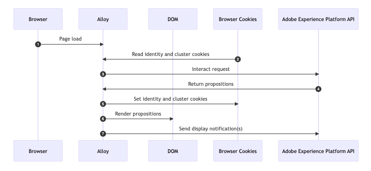
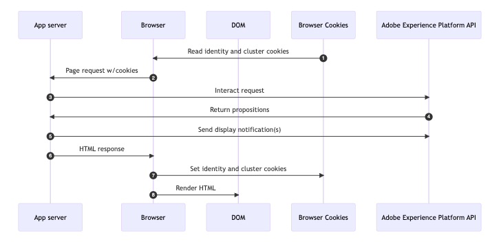

# Esempi di metodi di implementazione basati su codice {#implementation-samples}

L’esperienza basata su codice supporta qualsiasi tipo di implementazione del cliente. In questa pagina puoi trovare esempi per ciascun metodo di implementazione:

* [Lato client ](#client-side-implementation)
* [Lato server](#server-side-implementation)
* [Ibrido](#hybrid-implementation)

>[!IMPORTANT]
>
>Segui [questo collegamento](https://github.com/adobe/alloy-samples/tree/main/ajo){target="_blank"} per trovare implementazioni di esempio per diversi casi di utilizzo di personalizzazione e sperimentazione. Eseguile ed eseguili per comprendere meglio quali sono i passaggi di implementazione necessari e come funziona il flusso di personalizzazione end-to-end.

## Implementazione lato client {#client-side-implementation}

Se disponi di un’implementazione lato client, puoi utilizzare uno degli SDK client AEP: AEP Web SDK o AEP Mobile SDK. I passaggi seguenti descrivono il processo di recupero dei contenuti pubblicati sul server Edge dalle campagne di esperienza basate su codice in un esempio di implementazione Web SDK e visualizzazione dei contenuti personalizzati.

### Come funziona

1. [SDK per web](https://experienceleague.adobe.com/docs/experience-platform/edge/home.html?lang=it){target="_blank"} è incluso nella pagina.

1. È necessario utilizzare il `sendEvent` e specifica l’URI della superficie per recuperare il contenuto di personalizzazione.

   ```javascript
   alloy("sendEvent", {
   renderDecisions: true,
   personalization: {
       surfaces: ["#sample-json-content"],
   },
   }).then(applyPersonalization("#sample-json-content"));
   ```

1. Gli elementi di esperienza basati su codice devono essere applicati manualmente dal codice di implementazione (utilizzando [`applyPersonalization`](https://github.com/adobe/alloy-samples/blob/ac83b6927d007dc456caad2c6ce0b324c99c26c9/ajo/personalization-client-side/public/script.js){target="_blank"} DOM in base alla decisione.

1. Per le campagne basate su codice, gli eventi di visualizzazione devono essere inviati manualmente per indicare quando è stato visualizzato il contenuto. Questa operazione viene eseguita tramite `sendEvent` comando.

```javascript
function sendDisplayEvent(decision) {
  const { id, scope, scopeDetails = {} } = decision;

  alloy("sendEvent", {

    xdm: {
      eventType: "decisioning.propositionDisplay",
      _experience: {
        decisioning: {
          propositions: [
            {
              id: id,
              scope: scope,
              scopeDetails: scopeDetails,
            },
          ],
        },
      },
    },
  });
}
```

1. Per le campagne di esperienza basate su codice, gli eventi di interazione devono essere inviati manualmente per indicare quando un utente ha interagito con il contenuto. Questa operazione viene eseguita tramite `sendEvent` comando.

```javascript
function sendInteractEvent(label, proposition) {
  const { id, scope, scopeDetails = {} } = proposition;

  alloy("sendEvent", {
    
    xdm: {
      eventType: "decisioning.propositionInteract",
      _experience: {
        decisioning: {
          propositions: [
            {
              id: id,
              scope: scope,
              scopeDetails: scopeDetails,
            },
          ],
          propositionEventType: {
            interact: 1
          },
          propositionAction: {
            label: label
          },
        },
      },
    },
  });
}
```

### Osservazioni chiave

**Cookie**

I cookie vengono utilizzati per rendere persistenti l’identità dell’utente e le informazioni sul cluster. Quando si utilizza un’implementazione lato client, Web SDK gestisce automaticamente l’archiviazione e l’invio di questi cookie durante il ciclo di vita della richiesta.

| Cookie | Finalità | Archiviato da | Inviato da |
| ------------------------ | -------------------------------------------------------------------------- | --------- | ------- |
| kndctr_AdobeOrg_identity | Contiene i dettagli dell’identità utente | SDK per web | SDK per web |
| kndctr_AdobeOrg_cluster | Indica quale cluster di Experience Edge deve essere utilizzato per soddisfare le richieste | SDK per web | SDK per web |

**Posizionamento della richiesta**

Le richieste all’API di Adobe Experience Platform sono necessarie per ottenere proposte e inviare una notifica di visualizzazione. Quando si utilizza un’implementazione lato client, Web SDK effettua queste richieste quando `sendEvent` viene utilizzato il comando.

| Richiesta | Creato da |
| ---------------------------------------------- | ----------------------------------- |
| richiesta di interazione per ottenere proposte | Web SDK tramite il comando sendEvent |
| richiesta di interazione per inviare notifiche di visualizzazione | Web SDK tramite il comando sendEvent |

**Diagramma di flusso**



## Implementazione lato server {#server-side-implementation}

Se disponi di un’implementazione lato server, puoi utilizzare una delle API di AEP Edge Network. I passaggi seguenti descrivono il processo di recupero dei contenuti pubblicati sul server Edge dalle campagne di esperienza basate su codice in un esempio di implementazione API della rete Edge per una pagina web e di visualizzazione dei contenuti personalizzati.

### Come funziona

1. La pagina web viene richiesta ed eventuali cookie memorizzati in precedenza dal browser con prefisso `kndctr_` sono inclusi.
1. Quando la pagina viene richiesta dal server dell’app, viene inviato un evento al [endpoint di raccolta dati interattivo](https://experienceleague.adobe.com/docs/experience-platform/edge-network-server-api/data-collection/interactive-data-collection.html) per recuperare il contenuto di personalizzazione. Questa app di esempio utilizza alcuni metodi di supporto per semplificare la creazione e l’invio di richieste all’API (vedi [aepEdgeClient.js](https://github.com/adobe/alloy-samples/blob/ac83b6927d007dc456caad2c6ce0b324c99c26c9/common/aepEdgeClient.js){target="_blank"}). Ma la richiesta è semplicemente un `POST` con un payload che contiene un evento e una query. I cookie (se disponibili) della fase precedente sono inclusi nella richiesta nel `meta>state>entries` array.

   ```javascript
   fetch(
     "https://edge.adobedc.net/ee/v2/interact?dataStreamId=abc&requestId=123",
     {
       headers: {
         accept: "*/*",
         "accept-language": "en-US,en;q=0.9",
         "cache-control": "no-cache",
         "content-type": "text/plain; charset=UTF-8",
         pragma: "no-cache",
         "sec-fetch-dest": "empty",
         "sec-fetch-mode": "cors",
         "sec-fetch-site": "cross-site",
         "sec-gpc": "1",
         "Referrer-Policy": "strict-origin-when-cross-origin",
         Referer: "https://localhost/",
       },
       body: JSON.stringify({
         event: {
           xdm: {
             eventType: "decisioning.propositionFetch",
             web: {
               webPageDetails: {
                 URL: "https://localhost/",
               },
               webReferrer: {
                 URL: "",
               },
             },
             identityMap: {
               FPID: [
                 {
                   id: "xyz",
                   authenticatedState: "ambiguous",
                   primary: true,
                 },
               ],
             },
             timestamp: "2022-06-23T22:21:00.878Z",
           },
           data: {},
         },
         query: {
           identity: {
             fetch: ["ECID"],
           },
           personalization: {
             schemas: [
               "https://ns.adobe.com/personalization/default-content-item",
               "https://ns.adobe.com/personalization/html-content-item",
               "https://ns.adobe.com/personalization/json-content-item",
               "https://ns.adobe.com/personalization/redirect-item",
               "https://ns.adobe.com/personalization/dom-action",
             ],
             surfaces: ["web://localhost/","web://localhost/#sample-json-content"],
           },
         },
         meta: {
           state: {
             domain: "localhost",
             cookiesEnabled: true,
             entries: [
               {
                 key: "kndctr_XXX_AdobeOrg_identity",
                 value: "abc123",
               },
               {
                 key: "kndctr_XXX_AdobeOrg_cluster",
                 value: "or2",
               },
             ],
           },
         },
       }),
       method: "POST",
     }
   ).then((res) => res.json());
   ```

1. L’esperienza JSON della campagna di esperienza basata su codice viene letta dalla risposta e utilizzata durante la produzione della risposta del HTML.
1. Per le campagne di esperienza basate su codice, gli eventi di visualizzazione devono essere inviati manualmente nell’implementazione per indicare quando è stato visualizzato il contenuto della campagna. In questo esempio la notifica viene inviata lato server durante il ciclo di vita della richiesta.

   ```javascript
   function sendDisplayEvent(aepEdgeClient, req, propositions, cookieEntries) {
     const address = getAddress(req);
   
     aepEdgeClient.interact(
       {
         event: {
           xdm: {
             web: {
               webPageDetails: { URL: address },
               webReferrer: { URL: "" },
             },
             timestamp: new Date().toISOString(),
             eventType: "decisioning.propositionDisplay",
             _experience: {
               decisioning: {
                 propositions: propositions.map((proposition) => {
                   const { id, scope, scopeDetails } = proposition;
   
                   return {
                     id,
                     scope,
                     scopeDetails,
                   };
                 }),
               },
             },
           },
         },
         query: { identity: { fetch: ["ECID"] } },
         meta: {
           state: {
             domain: "",
             cookiesEnabled: true,
             entries: [...cookieEntries],
           },
         },
       },
       {
         Referer: address,
       }
     );
   }
   ```

1. Quando viene restituita la risposta del HTML, i cookie di identità e cluster vengono impostati nella risposta dal server applicazioni.

### Osservazioni chiave

**Cookie**

I cookie vengono utilizzati per rendere persistenti l’identità dell’utente e le informazioni sul cluster. Quando si utilizza un’implementazione lato server, il server applicazioni deve gestire l’archiviazione e l’invio di questi cookie durante il ciclo di vita della richiesta.

| Cookie | Finalità | Archiviato da | Inviato da |
| ------------------------ | -------------------------------------------------------------------------- | ------------------ | ------------------ |
| kndctr_AdobeOrg_identity | Contiene i dettagli dell’identità utente | server applicazioni | server applicazioni |
| kndctr_AdobeOrg_cluster | Indica quale cluster di Experience Edge deve essere utilizzato per soddisfare le richieste | server applicazioni | server applicazioni |

**Posizionamento della richiesta**

Le richieste all’API di Adobe Experience Platform sono necessarie per ottenere proposte e inviare una notifica di visualizzazione. Quando si utilizza un’implementazione lato client, Web SDK effettua queste richieste quando `sendEvent` viene utilizzato il comando.

| Richiesta | Creato da |
| ---------------------------------------------- | ------------------------------------------------------------ |
| richiesta di interazione per ottenere proposte | server applicazioni che chiama l&#39;API Adobe Experience Platform |
| richiesta di interazione per inviare notifiche di visualizzazione | server applicazioni che chiama l&#39;API Adobe Experience Platform |

**Diagramma di flusso**



## Implementazione ibrida {#hybrid-implementation}

Se disponi di un’implementazione ibrida, consulta i collegamenti riportati di seguito.

* Adobe di blog tecnico: [Personalizzazione ibrida in Adobe Experience Platform Web SDK](https://blog.developer.adobe.com/hybrid-personalization-in-the-adobe-experience-platform-web-sdk-6a1bb674bf41){target="_blank"}
* Documentazione SDK: [Personalizzazione ibrida tramite Web SDK e API del server di rete Edge](https://experienceleague.adobe.com/docs/experience-platform/edge/personalization/hybrid-personalization.html){target="_blank"}
