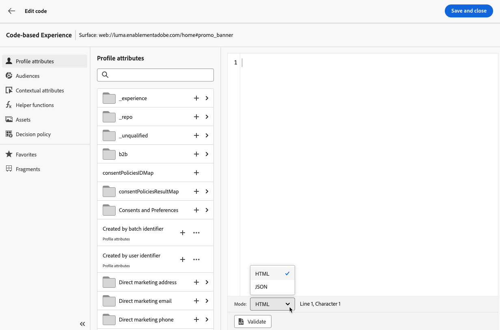
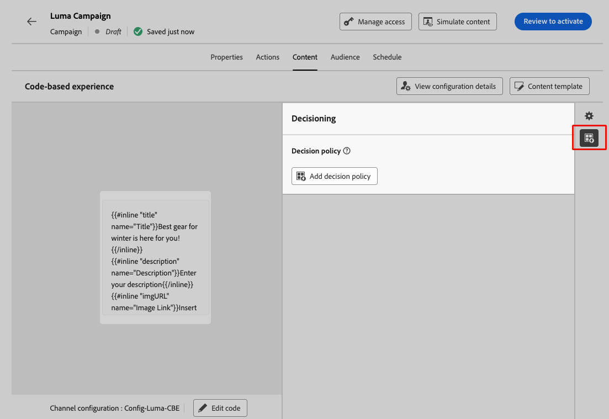

# Creare esperienze basate su codice {#create-code-based}

In [!DNL Journey Optimizer] è possibile creare esperienze basate su codice in un percorso o in una campagna.

## Aggiungere un’esperienza basata su codice tramite un percorso o una campagna {#create-code-based-experience}

Per iniziare a creare l’esperienza basata su codice tramite un percorso o una campagna, segui i passaggi seguenti.

>[!BEGINTABS]

>[!TAB Aggiungi un&#39;esperienza basata su codice a un percorso]

Per aggiungere un&#39;attività **esperienza basata su codice** a un percorso, eseguire la procedura seguente:

1. [Crea un percorso](../building-journeys/journey-gs.md).

1. Avvia il percorso con un&#39;attività [Event](../building-journeys/general-events.md) o [Read Audience](../building-journeys/read-audience.md).

1. Trascina e rilascia un&#39;attività **[!UICONTROL Esperienza basata su codice]** dalla sezione **[!UICONTROL Azioni]** della palette.

   

   >[!NOTE]
   >
   >Poiché **Esperienza basata su codice** è un&#39;attività esperienza in entrata, viene fornita con un&#39;attività **Wait** di 3 giorni. [Ulteriori informazioni](../building-journeys/wait-activity.md#auto-wait-node)

1. Immetti un **[!UICONTROL Etichetta]** e una **[!UICONTROL Descrizione]** per il messaggio.

1. Seleziona o crea la configurazione di esperienza basata su codice da utilizzare. [Ulteriori informazioni](code-based-configuration.md)

   

   >[!NOTE]
   >
   >Se più azioni di esperienza basate su codice utilizzano la stessa configurazione di canale, il **[!UICONTROL Punteggio di priorità]** del percorso determina ciò che viene consegnato all&#39;utente finale se sono idonee per più di un&#39;azione. [Ulteriori informazioni sui punteggi di priorità](../conflict-prioritization/priority-scores.md)

1. Seleziona il pulsante **[!UICONTROL Modifica contenuto]** e modifica il contenuto come desiderato utilizzando l&#39;editor di personalizzazione. [Ulteriori informazioni](#edit-code)

   È inoltre possibile utilizzare un modello di contenuto esistente come base per il contenuto del codice. I modelli disponibili per la scelta hanno l’ambito HTML o JSON in base alla configurazione del canale scelta in precedenza. [Scopri come utilizzare i modelli di contenuto](../content-management/use-content-templates.md)

1. Se necessario, completa il flusso di percorso trascinando altre azioni o eventi. [Ulteriori informazioni](../building-journeys/about-journey-activities.md)

1. Quando l&#39;esperienza basata su codice è pronta, finalizza la configurazione e pubblica il percorso per attivarla. [Ulteriori informazioni](../building-journeys/publishing-the-journey.md)

Per ulteriori informazioni su come configurare un percorso, consultare [questa pagina](../building-journeys/journey-gs.md).

>[!TAB Creare un’esperienza basata su codice campagna]

Per iniziare a creare la tua **esperienza basata su codice** tramite una campagna, segui la procedura riportata di seguito.

1. Creare una campagna. [Ulteriori informazioni](../campaigns/create-campaign.md)

1. Seleziona il tipo di campagna **Pianificato - Marketing**.

1. Completa i passaggi per creare una campagna, ad esempio le proprietà della campagna, [pubblico](../audience/about-audiences.md) e [pianificazione](../campaigns/create-campaign.md#schedule). Per ulteriori informazioni su come configurare una campagna, consulta [questa pagina](../campaigns/get-started-with-campaigns.md).

1. Seleziona l&#39;azione **[!UICONTROL Esperienza basata su codice]**.

1. Seleziona o crea la configurazione di esperienza basata su codice da utilizzare. [Ulteriori informazioni](code-based-configuration.md)

   

   >[!NOTE]
   >
   >Se hai più azioni di esperienza basate su codice che utilizzano la stessa configurazione di canale, il **[!UICONTROL Punteggio di priorità]** della campagna determina cosa viene consegnato all&#39;utente finale se questi è idoneo per più di un&#39;azione. [Ulteriori informazioni sui punteggi di priorità](../conflict-prioritization/priority-scores.md)

1. Modifica i contenuti come desideri utilizzando l’editor di personalizzazione. [Ulteriori informazioni](#edit-code)

   È inoltre possibile utilizzare un modello di contenuto esistente come base per il contenuto del codice. I modelli disponibili per la scelta hanno l’ambito HTML o JSON in base alla configurazione del canale scelta in precedenza. [Scopri come utilizzare i modelli di contenuto](../content-management/use-content-templates.md)

   <!---->

Per ulteriori informazioni su come configurare una campagna, consulta [questa pagina](../campaigns/get-started-with-campaigns.md).

➡️ [Scopri come creare una campagna di esperienza basata su codice in questo video](#video)

>[!ENDTABS]

## Modificare il contenuto del codice {#edit-code}

>[!CONTEXTUALHELP]
>id="ajo_code_based_experience"
>title="Utilizzare l’editor di personalizzazione"
>abstract="Inserisci e modifica il codice che desideri consegnare come parte di questa azione di esperienza basata su codice."
>additional-url="https://experienceleague.adobe.com/it/docs/journey-optimizer/using/content-management/personalization/personalization-build-expressions" text="Utilizzare l’editor di personalizzazione"

Per modificare il contenuto dell’esperienza basata su codice, segui i passaggi indicati di seguito.

1. Dall&#39;attività di percorso o dalla schermata dell&#39;edizione della campagna, selezionare **[!UICONTROL Modifica codice]**.

   

   >[!NOTE]
   >
   >Se utilizzi un modello di contenuto di esperienza basato su codice con campi di modulo modificabili predefiniti, puoi gestire il contenuto di tali campi senza aprire l’editor di personalizzazione. [Ulteriori informazioni](code-based-form-fields.md)

1. Verrà aperto l&#39;[editor di personalizzazione](../personalization/personalization-build-expressions.md). Si tratta di un’interfaccia non visiva per la creazione di esperienze che consente di creare il codice.

1. Puoi passare dalla modalità di authoring di HTML a JSON e viceversa.

   

   >[!CAUTION]
   >
   >La modifica della modalità di authoring comporterà la perdita di tutto il codice corrente; assicurati quindi di cambiare modalità prima di iniziare l’authoring.

1. Immetti il codice in base alle esigenze. Puoi sfruttare l&#39;editor di personalizzazione [!DNL Journey Optimizer] con tutte le sue funzionalità di personalizzazione e authoring. [Ulteriori informazioni](../personalization/personalization-build-expressions.md)

1. Se necessario, puoi aggiungere frammenti di espressione HTML o JSON. [Scopri come](../personalization/use-expression-fragments.md)

   Puoi anche salvare parte del contenuto del codice come frammento. [Scopri come](../content-management/fragments.md#save-as-expression-fragment)

1. Con esperienze basate su codice, puoi utilizzare la funzione Decisioning. Seleziona l&#39;icona **[!UICONTROL Criterio decisione]** dalla barra a sinistra e fai clic su **[!UICONTROL Aggiungi criterio decisione]**. [Ulteriori informazioni](../experience-decisioning/create-decision.md#add-decision)

   

   <!---->

   Dalla schermata di edizione del percorso o della campagna, puoi anche aggiungere direttamente un criterio di decisione senza aprire l’editor di personalizzazione. Utilizza l&#39;icona dedicata nella barra a destra per visualizzare la sezione **[!UICONTROL Decisioning]**.

   <!---->

   I passaggi dettagliati per creare un criterio di decisione sono descritti in [questa sezione](../experience-decisioning/create-decision.md#add-decision).

1. Fai clic su **[!UICONTROL Salva e chiudi]** per confermare le modifiche.

Ora, non appena lo sviluppatore effettua una chiamata API o SDK per recuperare il contenuto per la superficie definita nella configurazione del canale, le modifiche verranno applicate alla pagina web o all’app.

## Video dimostrativo{#video}

Il video seguente mostra come creare una campagna di esperienza basata su codice, configurarne le proprietà, testarla e pubblicarla.

>[!VIDEO](https://video.tv.adobe.com/v/3449461/?captions=ita&quality=12&learn=on)
