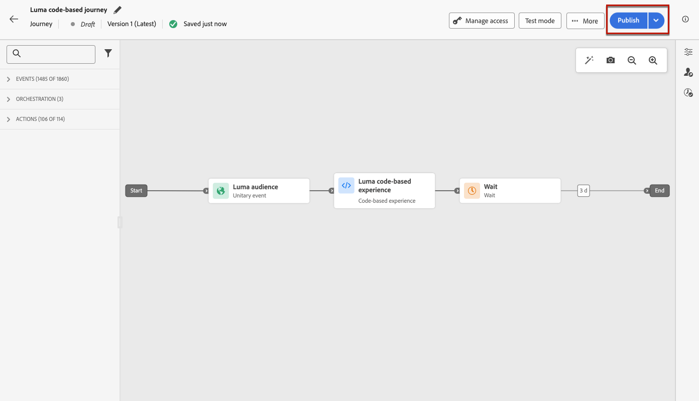

# Gestire le esperienze basate su codice {#publish-code-based}

## Rendi attiva l’esperienza basata su codice {#code-based-experience-live}

>[!IMPORTANT]
>
> Se la campagna è soggetta a un criterio di approvazione, dovrai richiedere l’approvazione per poter attivare le esperienze basate su codice. [Ulteriori informazioni](../test-approve/gs-approval.md)

Dopo aver definito l&#39;esperienza basata su codice e aver modificato il contenuto come desiderato utilizzando l&#39;[editor basato su codice](create-code-based.md#edit-code), puoi attivare il percorso o la campagna per rendere le modifiche visibili al pubblico.

Puoi anche visualizzare in anteprima il contenuto dell’esperienza basata su codice prima di renderlo live. [Ulteriori informazioni](test-code-based.md)

>[!NOTE]
>
>Se attivi un percorso o una campagna basati su codice che influisce sulle stesse pagine di un altro percorso o campagna già live, tutte le modifiche verranno applicate al contenuto.
>
>Se più percorsi o campagne basati su codice aggiornano gli stessi elementi del contenuto, il percorso o la campagna con priorità più elevata ha la precedenza. [Ulteriori informazioni sui punteggi di priorità](../conflict-prioritization/priority-scores.md)

Una volta che il percorso o la campagna basati su codice è attiva, il team di implementazione dell&#39;app è responsabile di effettuare chiamate API o SDK esplicite per recuperare il contenuto per le superfici definite nella [configurazione esperienza basata su codice](code-based-configuration.md) selezionata. Ulteriori informazioni sulle diverse implementazioni del cliente in [questa sezione](code-based-implementation-samples.md).

### Pubblicare un percorso basato su codice {#publish-code-based-journey}

Per rendere live le tue esperienze basate su codice da un percorso, segui i passaggi indicati di seguito.

1. Verifica che il percorso sia valido e che non ci siano errori. [Ulteriori informazioni](../building-journeys/troubleshooting.md#activity-errors)

1. Dal percorso, seleziona l&#39;opzione **[!UICONTROL Pubblica]**, che si trova nel menu a discesa in alto a destra.

   

   >[!NOTE]
   >
   >Ulteriori informazioni sulla pubblicazione di percorsi in [questa sezione](../building-journeys/publish-journey.md).

Il percorso basato su codice accetta lo stato **[!UICONTROL Live]** ed è ora visibile al pubblico selezionato. Ogni destinatario del percorso può visualizzare le modifiche.

>[!NOTE]
>
>Dopo aver fatto clic su **[!UICONTROL Pubblica]**, potrebbero essere necessari fino a 15 minuti perché le modifiche siano disponibili in tempo reale.

### Attivare una campagna basata su codice {#activate-code-based-campaign}

1. Dalla campagna basata su codice, seleziona **[!UICONTROL Verifica per attivare]**.

   

1. Se necessario, seleziona e modifica il contenuto, le proprietà, la configurazione, il pubblico e la pianificazione.

1. Seleziona **[!UICONTROL Attiva]**.

   

   >[!NOTE]
   >
   >Ulteriori informazioni sull&#39;attivazione delle campagne in [questa sezione](../campaigns/review-activate-campaign.md).

La campagna basata su codice accetta lo **[!UICONTROL Live]** [status](../campaigns/manage-campaigns.md#statuses) ed è ora visibile al pubblico selezionato. Ogni destinatario della campagna può visualizzare le modifiche aggiunte al contenuto.

>[!NOTE]
>
>Dopo aver fatto clic su **[!UICONTROL Attiva]**, potrebbero essere necessari fino a 15 minuti perché le modifiche siano disponibili in tempo reale.
>
>Se hai definito una pianificazione per la campagna basata su codice, questa avrà **[!UICONTROL Pianificato]** [stato](../campaigns/manage-campaigns.md#statuses) fino a raggiungere la data e l&#39;ora di inizio.

## Interrompere un percorso o una campagna basata su codice {#stop-code-based-experience}

Quando un’esperienza basata su codice è attiva, puoi interromperla per impedire al pubblico di visualizzare le modifiche. Segui i passaggi seguenti.

1. Seleziona un percorso o una campagna live dal rispettivo elenco.

1. Esegui l’azione pertinente in base al caso:

   * Dal menu principale della campagna, seleziona **[!UICONTROL Interrompi campagna]**.

     

   * Dal menu principale del percorso, fare clic sul pulsante **[!UICONTROL Altro]** e selezionare **[!UICONTROL Interrompi]**.

     

1. Le modifiche aggiunte non saranno più visibili al pubblico definito.

>[!NOTE]
>
>Una volta interrotto un percorso o una campagna basato su codice, non puoi più modificarlo o attivarlo. Puoi solo duplicarlo e attivare il percorso o la campagna duplicati.

<!--Reporting TBC

## Check the code-based experience reports {#check-code-based-reports}

Once your code-based experience is live, you can check the **[!UICONTROL Code-based]** tab of the  [Journey report](../reports/journey-global-report-cja.md#web-cja) and [Campaign report](../reports/campaign-global-report-cja.md#web) to compare elements such as the number of experiences delivered to your audience, and the number of engagements with your content.-->

<!--## Code-based reports

You can access code-based journey or campaign reports from the summary screen.

Global reports display events that occurred at least two hours ago and cover events over a selected time period. In comparison, Live reports focus on events that took place within the past 24 hours, with a minimum time interval of two minutes from the event occurrence.

### Code-based live report {#live-report-code-based}

From your campaign **[!UICONTROL Live report]**, the **[!UICONTROL Code-based experience]** tab details the main information relative to your apps or web pages. [Learn more about live report](../reports/campaign-live-report.md)

+++Learn more about the different metrics and widgets available for the Code-based experience report.

The **[!UICONTROL Code-based experience performance]** KPIs detail the main information relative to your visitors' engagement with your code-based experiences, such as:

* **[!UICONTROL Impressions]**: total number of experiences delivered to all users.

* **[!UICONTROL Interactions]**:  total number of engagements with your app/page. This includes any actions taken by the users, such as clicks or any other interactions.

The **[!UICONTROL Code-based experience summary]** graph shows the evolution of your experiences (impressions, unique impressions and interactions) for the last 24 hours.

TBC: The **[!UICONTROL Interactions by element]** table details the main information relative to your visitors' engagement with the various elements on your app/pages.
+++

### Code-based global report {#global-report-code-based}

Code-based campaign global report can be accessed directly from your journey or campaign with the **[!UICONTROL View report]** button. [Learn more about global report](../reports/campaign-global-report-cja.md)

From your Campaign **[!UICONTROL Global report]**, the **[!UICONTROL Code-based experience]** tab details the main information relative to your apps or web pages.

Add image TBC

+++Learn more about the different metrics and widgets available for the Code-based experience report.

The **[!UICONTROL Code-based experience performance]** KPIs detail the main information relative to your visitors' engagement with your experiences, such as:

* **[!UICONTROL Unique impressions]**: number of unique users to whom the experience was delivered.

* **[!UICONTROL Impressions]**: total number of experiences delivered to all users.

* **[!UICONTROL Interactions]**: percentage of engagements with your app/page. This includes any actions taken by the users, such as clicks or any other interactions.

The **[!UICONTROL Code-based experience summary]** graph shows the evolution of your experiences (unique impressions, impressions and interactions) for the concerned period.

TBC: The **[!UICONTROL Interactions by element]** table details the main information relative to your visitors' engagement with the various elements on your apps/pages.
+++

-->
