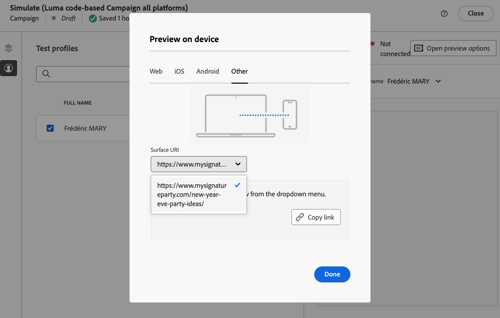

# Testare le esperienze basate su codice {#test-code-based}

## Visualizzare l’esperienza basata su codice in anteprima {#preview-code-based}

>[!CONTEXTUALHELP]
>id="ajo_code_based_preview"
>title="Visualizzare l’esperienza basata su codice in anteprima"
>abstract="Ottieni una simulazione dell’aspetto che avrà l’esperienza basata su codice."

Per visualizzare un’anteprima dell’esperienza basata su codice modificata, segui i passaggi indicati di seguito.

>[!CAUTION]
>
>Devi disporre di profili di test per simulare quali offerte verranno consegnate. Scopri come [creare profili di test](../audience/creating-test-profiles.md).

1. Nel percorso o nella campagna, dall&#39;editor di personalizzazione o dalla schermata Modifica contenuto, seleziona **[!UICONTROL Simula contenuto]**.

   

1. Fare clic su **[!UICONTROL Gestisci profili di test]** per selezionare uno o più profili di test.

1. Viene visualizzata un’anteprima dell’esperienza basata su codice modificata.

Informazioni dettagliate su come selezionare profili di test e visualizzare in anteprima il contenuto sono disponibili in [questa sezione](../content-management/preview.md).

>[!NOTE]
>
>Attualmente non è possibile simulare contenuti dall&#39;interfaccia utente in una campagna o in un percorso di esperienze basato su codice utilizzando [Decisioning](../experience-decisioning/gs-experience-decisioning.md). Una soluzione alternativa è disponibile in [questa sezione](../experience-decisioning/create-decision.md#test-and-publish).

## Anteprima su dispositivo {#preview-on-device}

>[!CONTEXTUALHELP]
>id="ajo_code_based_preview_device"
>title="Visualizzare in anteprima l’esperienza basata su codice su un dispositivo reale"
>abstract="Visualizza un’anteprima delle tue esperienze personalizzate direttamente sul browser o sui dispositivi mobili e scopri come si presentano su dispositivi reali."

>[!CONTEXTUALHELP]
>id="ajo_code_based_preview_device_web"
>title="Visualizzare l’esperienza web basata su codice in anteprima su un dispositivo"
>abstract="Scansiona il codice QR o copia il collegamento per visualizzare l’anteprima sul dispositivo."

>[!CONTEXTUALHELP]
>id="ajo_code_based_preview_device_mobile"
>title="Visualizzare l’esperienza mobile basata su codice in anteprima su un dispositivo"
>abstract="Scansiona il codice QR o copia il collegamento per visualizzare l’anteprima sul dispositivo. Una volta collegato, inserisci il PIN sul dispositivo. Per visualizzare le modifiche ogni volta che aggiorni i collegamenti di anteprima, potrebbe essere necessario riavviare l’app."

>[!CONTEXTUALHELP]
>id="ajo_code_based_preview_device_refresh"
>title="Aggiornare il collegamento di anteprima per riportare la vista corrente"
>abstract="L’anteprima sul dispositivo mostrerà il contenuto al momento della creazione o dell’aggiornamento del collegamento di anteprima. Se hai modificato il contenuto o selezionato un diverso trattamento o profilo di test, aggiorna l’anteprima in modo che riporti la vista corrente."

Quando crei esperienze basate su codice per pagine web o app mobili, puoi visualizzare in anteprima le tue esperienze personalizzate direttamente sul browser o sui dispositivi mobili, per vedere come si presentano su dispositivi reali.

>[!WARNING]
>
>Anteprima sul dispositivo non disponibile quando si utilizzano [criteri di decisione](../experience-decisioning/create-decision.md) o [personalizzazione](../personalization/personalization-build-expressions.md) attributi contestuali.

1. Dalla schermata **[!UICONTROL Simula]**, fai clic sul pulsante **[!UICONTROL Apri opzioni di anteprima]**. Le opzioni di anteprima dipendono dalla piattaforma selezionata nella [configurazione basata su codice](code-based-configuration.md#create-code-based-configuration).

1. Se si utilizza una [piattaforma Web](code-based-configuration.md#web) nella configurazione basata su codice, il campo di sola lettura **[!UICONTROL URL anteprima dispositivo]** contiene l&#39;URL immesso per la configurazione del canale corrente.

   

   Puoi effettuare le seguenti operazioni:

   * Seleziona il pulsante **[!UICONTROL Copia collegamento]** e incolla il collegamento in una scheda del browser. Puoi anche condividere il collegamento con il tuo team e le parti interessate, che possono visualizzare in anteprima la nuova esperienza in qualsiasi browser prima che le modifiche vengano pubblicate.

   * Fai clic su **[!UICONTROL Apri in una nuova scheda]** per aprire il collegamento nel browser corrente.

   * Esegui la scansione del codice QR con il tuo dispositivo mobile per aprire il collegamento di anteprima su un browser mobile.

1. Se utilizzi [Piattaforme mobili](code-based-configuration.md#mobile) (iOS / Android) nella configurazione basata su codice, il campo **[!UICONTROL Deeplink]** di sola lettura è precompilato con il valore **[!UICONTROL URL anteprima]** immesso nella configurazione del canale per la piattaforma selezionata.

   Passa dalle schede **[!UICONTROL iOS]** alle schede **[!DNL Android]** per visualizzare in anteprima la tua esperienza per la piattaforma che preferisci.

   

   Puoi effettuare le seguenti operazioni:

   * Seleziona il pulsante **[!UICONTROL Copia collegamento]** e condividi il collegamento con il tuo team e le parti interessate, che possono visualizzare in anteprima la nuova esperienza in qualsiasi browser mobile prima che le modifiche vengano pubblicate.

   * Esegui la scansione del codice QR con il tuo dispositivo mobile per aprire il collegamento di anteprima direttamente nell’app mobile. Per stabilire la sessione [Assurance](https://experienceleague.adobe.com/en/docs/experience-platform/assurance/tutorials/implement-assurance){target="_blank"} è necessario immettere il PIN sul dispositivo.

     >[!NOTE]
     >
     >**Adobe Experience Platform Assurance** è un prodotto di Adobe Experience Cloud che consente di verificare, verificare, simulare e convalidare le modalità di raccolta dei dati o di gestione delle esperienze nell&#39;app mobile. [Ulteriori informazioni](https://experienceleague.adobe.com/it/docs/experience-platform/assurance/home){target="_blank"}

1. Se utilizzi una [altra piattaforma](code-based-configuration.md#other) nella configurazione basata su codice, scegli l&#39;[URI di superficie](code-based-surface.md#surface-uri) che desideri visualizzare in anteprima dall&#39;elenco a discesa.

   

   * Seleziona il pulsante **[!UICONTROL Copia collegamento]** per incollare il collegamento in una scheda del browser o condividerlo con il team e le parti interessate.

   * Se hai aggiunto diversi URI alla configurazione (fino a 10), puoi selezionarne uno qualsiasi per l’anteprima.

1. Vengono generati collegamenti di anteprima per il profilo di test selezionato e, se utilizzi [Esperimento contenuti](../content-management/content-experiment.md) nel tuo percorso o campagna, per il trattamento selezionato.

   <!--If you have modified the content or selected a different treatment or test profile, scroll down to the bottom of the **[!UICONTROL Preview on device]** pop-up and click **[!UICONTROL Refresh preview link]** to reflect the current state.

   -->

   <!--When creating a content experiment, you need to select a given treatment and click the **[!UICONTROL Simulate content]** button to obtain the link corresponding to that treatment, then select another treatment, click the **[!UICONTROL Simulate content]** button to obtain a new preview link, and so on.-->

   Quando aggiorni il contenuto o selezioni un profilo di test o un trattamento diverso, il collegamento di anteprima viene aggiornato automaticamente. Puoi copiare il collegamento in diverse schede del browser e confrontare le esperienze.
