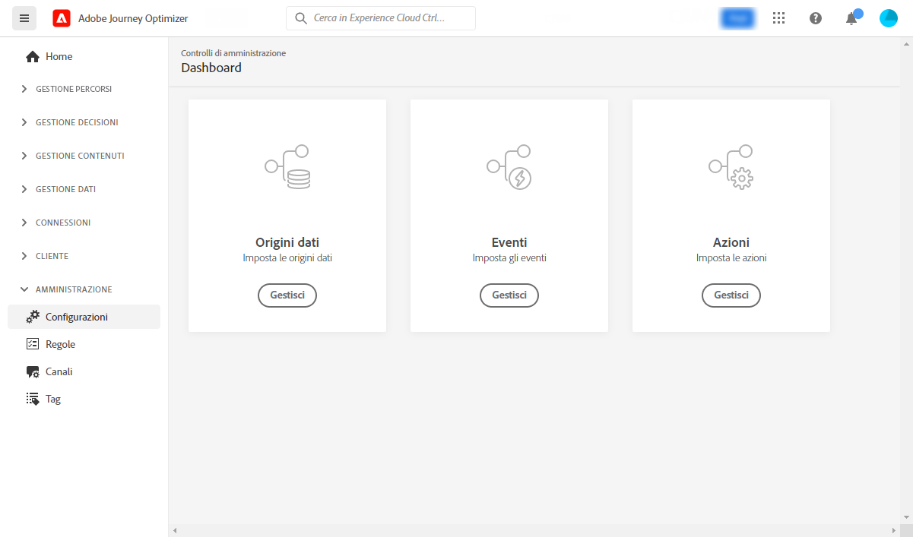
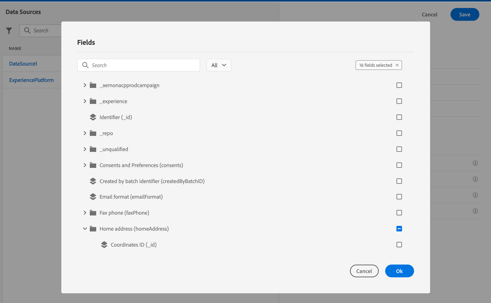

# Introduzione alla configurazione dei percorsi {#configure-journeys}

>[!CONTEXTUALHELP]
>id="ajo_journey_configuration_dashboard"
>title="Informazioni sulla configurazione dei percorsi"
>abstract="Per inviare messaggi con i percorsi, è necessario configurare origini dati, eventi e azioni. Le origini dati consentono di stabilire una connessione a un sistema per il recupero di informazioni aggiuntive che verranno utilizzate nei percorsi, ad esempio all’interno delle condizioni. Gli eventi consentono di attivare i percorsi quando viene ricevuto un evento. Le azioni personalizzate facilitano la connessione a un sistema di terze parti per l’invio dei messaggi. Se utilizzi le funzionalità di messaggistica incorporate di Journey Optimizer, non è necessario configurare un’azione."

Per inviare messaggi con percorsi, è necessario configurare **[!UICONTROL Origini dati]**, **[!UICONTROL Eventi]** e **[!UICONTROL Azioni]**. Le origini dati consentono di stabilire una connessione a un sistema per il recupero di informazioni aggiuntive che verranno utilizzate nei percorsi, ad esempio all’interno delle condizioni. Gli eventi consentono di attivare i percorsi quando viene ricevuto un evento. Le azioni personalizzate facilitano la connessione a un sistema di terze parti per l’invio dei messaggi. Se utilizzi le funzionalità di messaggistica incorporate di Journey Optimizer, non è necessario configurare un’azione.

Puoi anche configurare le connessioni a sistemi esterni tramite origini dati e azioni personalizzate. Ciò ti consente, ad esempio, di arricchire i tuoi percorsi con dati provenienti da un sistema di prenotazione esterno o di inviare messaggi utilizzando un sistema di terze parti come Epsilon o Facebook. Scopri come [integrare Journey Optimizer con sistemi esterni](external-systems.md).

## Origini dati {#data-sources}

La configurazione di Data Source consente di definire una connessione a un sistema per il recupero di informazioni aggiuntive, le quali verranno utilizzate nei percorsi. [Ulteriori informazioni](../../using/datasource/about-data-sources.md)

## Eventi {#events}

Eventi consente di attivare i percorsi in modo unitario per inviare messaggi in tempo reale all’utente che entra nel percorso.

Nella configurazione dell’evento, puoi configurare gli eventi previsti nei percorsi. I dati degli eventi in arrivo vengono normalizzati seguendo Adobe Experience Data Model (XDM). Gli eventi provengono dalle API di acquisizione in streaming per gli eventi autenticati e non autenticati, ad esempio gli eventi SDK di Adobe Mobile. [Ulteriori informazioni](../../using/event/about-events.md)

## Azioni {#actions}

Le funzionalità per i messaggi di Journey Optimizer sono integrate: devi solo aggiungere un’attività di azione sul canale al percorso. Se utilizzi un sistema di terze parti per l’invio dei messaggi, puoi creare un’azione personalizzata. [Ulteriori informazioni](../../using/action/action.md)

## Sfogliare i campi di Adobe Experience Platform {#friendly-names-display}

Quando si definisce il [payload dell’evento](../event/about-creating.md#define-the-payload-fields) e il [payload del gruppo di campi](../datasource/configure-data-sources.md#define-field-groups) e si selezionano i campi nell’[editor delle espressioni](../building-journeys/expression/expressionadvanced.md), oltre al nome del campo viene mostrato anche il nome visualizzato. Queste informazioni vengono recuperate dalla definizione dello schema di Experience Data Model.

Se durante la configurazione degli schemi vengono forniti descrittori come &quot;xdm:alternateDisplayInfo&quot;, i nomi descrittivi sostituiranno i nomi visualizzati. È particolarmente utile quando si lavora con &quot;eVar&quot; e campi generici. Puoi configurare descrittori di nomi descrittivi tramite una chiamata API. Per ulteriori informazioni, consulta la [Guida per gli sviluppatori del registro dello schema](https://experienceleague.adobe.com/docs/experience-platform/xdm/api/getting-started.html?lang=it){target="_blank"}.

Se è disponibile un nome descrittivo, il campo verrà visualizzato come `<friendly-name>(<name>)`. Se non è disponibile alcun nome descrittivo, verrà mostrato il nome visualizzato, ad esempio `<display-name>(<name>)`. Se non è definito nessuno dei due, verrà visualizzato solo il nome tecnico del campo `<name>`.

>[!NOTE]
>
>I nomi descrittivi non vengono recuperati quando si selezionano i campi da un’unione di schemi.
