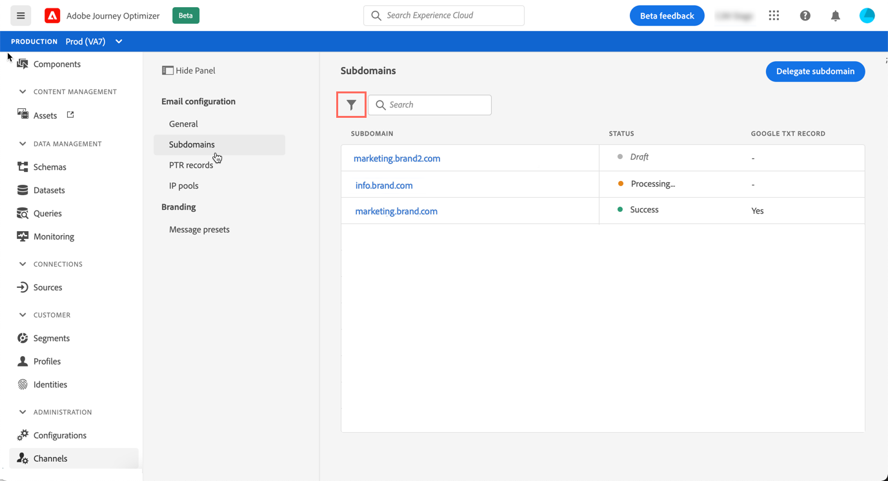

# Accedere ai sottodomini delegati

Tutti i sottodomini delegati vengono visualizzati nel menu **[!UICONTROL Channels]** / **[!UICONTROL Subdomains]** . Sono disponibili filtri per facilitare la definizione dell’elenco (data di delega, utente o stato).

La colonna **[!UICONTROL Status]** fornisce informazioni sul processo di delega del sottodominio:

* **[!UICONTROL Draft]**: La delega del sottodominio è stata salvata come bozza. Fai clic sul nome del sottodominio per riprendere il processo di delega,
* **[!UICONTROL Processing]**: Il sottodominio sta effettuando diversi controlli di configurazione prima di poter essere utilizzato,
* **[!UICONTROL Success]**: Il sottodominio ha superato i controlli con successo e può essere utilizzato per inviare messaggi,
* **[!UICONTROL Failed]**: Uno o più controlli non sono riusciti dopo l’invio della delega del sottodominio.

Per accedere a informazioni dettagliate su un sottodominio, aprilo dall’elenco. È possibile:

* Recupera il nome del sottodominio (sola lettura) configurato durante il processo di delega, nonché gli URL generati (risorse, pagine mirror, URL di tracciamento),

* Aggiungi un record TXT di Google per la verifica del sito al tuo sottodominio per assicurarti che sia verificato (consulta [Aggiungi un record TXT di Google a un sottodominio](google-txt.md)).

