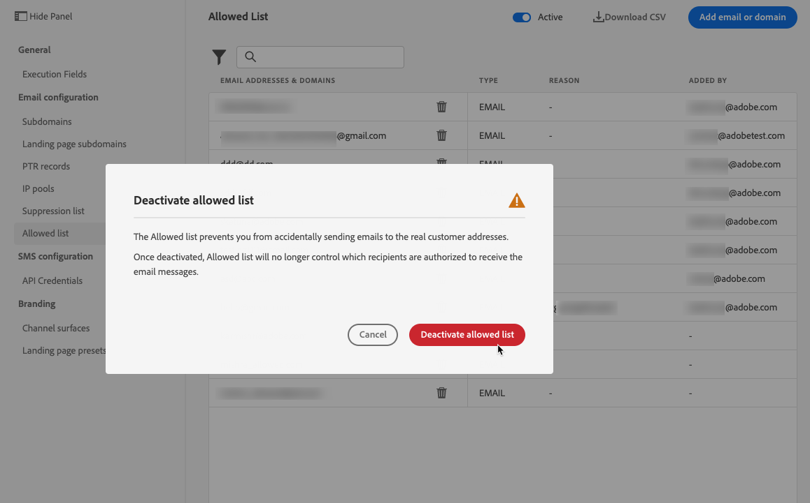
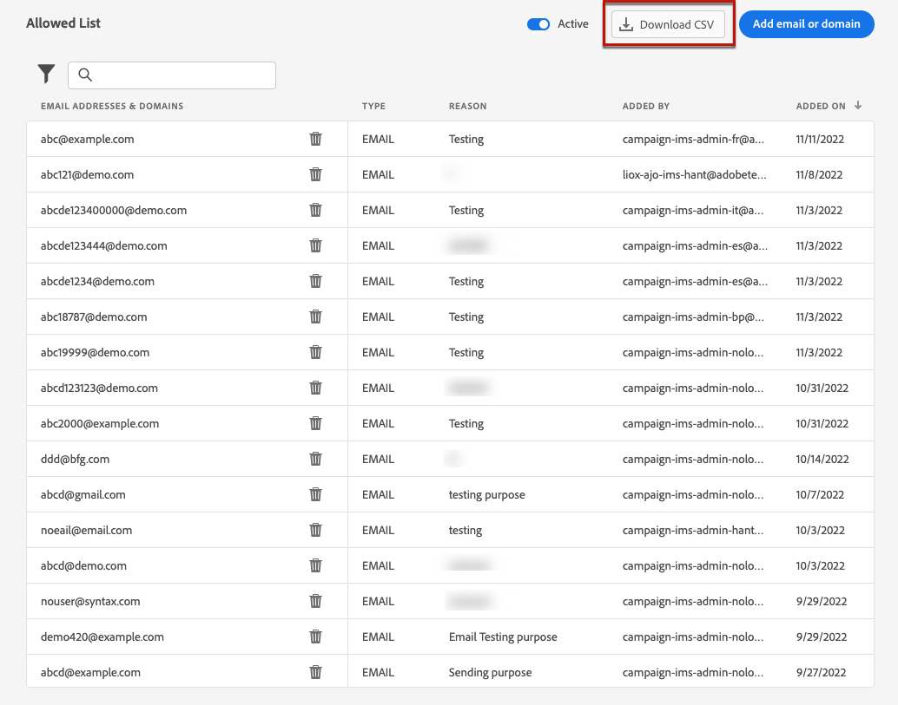

# Configurare un elenco Consentiti {#allow-list}

È possibile definire un elenco sicuro per l&#39;invio specifico al livello [sandbox](../administration/sandboxes.md).

Questo elenco Consentiti consente di specificare singoli indirizzi e-mail o domini che saranno gli unici destinatari o domini autorizzati a ricevere le e-mail che stai inviando da una sandbox specifica.

>[!CAUTION]
>
>Questa funzione si applica solo al canale e-mail. È disponibile su sandbox di produzione e non di produzione.

Ad esempio, in un’istanza non di produzione in cui possono verificarsi errori, l’elenco Consentiti ti assicura di non correre il rischio di inviare messaggi indesiderati a indirizzi reali dei clienti e fornisce quindi un ambiente protetto a scopo di test.

Inoltre, quando l’elenco Consentiti è attivo ma vuoto, non viene inviata alcuna e-mail. Pertanto, se si verifica un problema grave, è possibile utilizzare questa funzionalità per interrompere tutte le comunicazioni in uscita da [!DNL Journey Optimizer] fino alla risoluzione del problema. Ulteriori informazioni sulla [logica elenco Consentiti](#logic).

Inoltre, puoi sfruttare le **API REST di soppressione** di Journey Optimizer per controllare i messaggi in uscita utilizzando elenchi Consentiti e di soppressione. [Scopri come utilizzare l’API REST di soppressione](https://developer.adobe.com/journey-optimizer-apis/references/suppression/){target="_blank"}

## Accedere all’elenco Consentiti {#access-allowed-list}

Per accedere all&#39;elenco dettagliato degli indirizzi e dei domini e-mail consentiti, vai a **[!UICONTROL Amministrazione]** > **[!UICONTROL Canali]** > **[!UICONTROL Impostazioni e-mail]** e seleziona **[!UICONTROL Elenco Consentiti]**.


>[!CAUTION]
>
>Le autorizzazioni per visualizzare, esportare e gestire l&#39;elenco Consentiti sono limitate a [amministratori di Percorso](../administration/ootb-product-profiles.md#journey-administrator). Ulteriori informazioni sulla gestione dei diritti di accesso degli utenti [!DNL Journey Optimizer] in [questa sezione](../administration/permissions-overview.md).

Per esportare l&#39;elenco Consentiti come file CSV, selezionare il pulsante **[!UICONTROL Scarica CSV]**.

Utilizza il pulsante **[!UICONTROL Elimina]** per rimuovere definitivamente una voce.

Puoi eseguire ricerche negli indirizzi e-mail o nei domini e filtrare in base al **[!UICONTROL tipo di indirizzo]**. Una volta selezionato, puoi cancellare il filtro visualizzato sopra l’elenco.


## Attiva l’elenco Consentiti {#enable-allow-list}

Per attivare l’elenco Consentiti, segui la procedura riportata di seguito.

1. Accedi al menu **[!UICONTROL Canali]** > **[!UICONTROL Configurazione e-mail]** > **[!UICONTROL Elenco consentiti]**.

1. Seleziona l’interruttore.

   

1. Selezionare **[!UICONTROL Attiva elenco Consentiti]**. L’elenco Consentiti è ora attivo.

   

   >[!NOTE]
   >
   >Dopo l’attivazione dell’elenco Consentiti, trascorrono 10 minuti prima che diventi effettivo nei percorsi e nelle campagne. Analogamente, la visualizzazione degli aggiornamenti sia dell’elenco di elenco Consentiti che di eliminazione può richiedere fino a 10 minuti.

La logica di elenco Consentiti si applica quando la funzione è attiva. Ulteriori informazioni in [questa sezione](#logic).

>[!NOTE]
>
>Quando è attivata, la funzione di elenco Consentiti viene rispettata durante l&#39;esecuzione di percorsi, ma anche durante il test di messaggi con [bozze](../content-management/proofs.md) e il test di percorsi utilizzando la [modalità di test](../building-journeys/testing-the-journey.md).

## Disattivare l&#39;elenco Consentiti {#deactivate-allow-list}

Per disattivare l’elenco Consentiti, segui la procedura indicata di seguito.

1. Accedi al menu **[!UICONTROL Canali]** > **[!UICONTROL Configurazione e-mail]** > **[!UICONTROL Elenco consentiti]**.

1. Seleziona l’interruttore.

   

1. Selezionare **[!UICONTROL Disattiva elenco Consentiti]**. L’elenco Consentiti non è più attivo.

   

   >[!NOTE]
   >
   >Dopo aver disattivato l’elenco Consentiti, trascorrono 10 minuti prima che diventi effettivo nei percorsi e nelle campagne. Analogamente, la visualizzazione degli aggiornamenti sia dell’elenco di elenco Consentiti che di eliminazione può richiedere fino a 10 minuti.

La logica di elenco Consentiti non si applica quando la funzione viene disattivata. Ulteriori informazioni in [questa sezione](#logic).

## Aggiungere entità all’elenco Consentiti {#add-entities}

Per aggiungere nuovi indirizzi e-mail o domini all&#39;elenco Consentiti per una sandbox specifica, puoi [compilare manualmente l&#39;elenco](#manually-populate-list) o utilizzare una [chiamata API](#api-call-allowed-list).

>[!NOTE]
>
>L’elenco Consentiti può contenere fino a 1.000 voci.

### Compila manualmente l’elenco Consentiti {#manually-populate-list}

>[!CONTEXTUALHELP]
>id="ajo_admin_allowed_list_add_header"
>title="Aggiungere indirizzi o domini all’elenco Consentiti"
>abstract="Puoi aggiungere manualmente nuovi indirizzi e-mail o domini all’elenco Consentiti selezionandoli uno per uno."

>[!CONTEXTUALHELP]
>id="ajo_admin_allowed_list_add"
>title="Aggiungere indirizzi o domini all’elenco Consentiti"
>abstract="Puoi aggiungere manualmente nuovi indirizzi e-mail o domini all’elenco Consentiti selezionandoli uno per uno."

È possibile popolare manualmente l&#39;elenco Consentiti [!DNL Journey Optimizer] aggiungendo un indirizzo e-mail o un dominio tramite l&#39;interfaccia utente.

>[!NOTE]
>
>Puoi aggiungere un solo indirizzo e-mail o dominio alla volta.

Per farlo, segui la procedura indicata di seguito.

1. Selezionare il pulsante **[!UICONTROL Aggiungi e-mail o dominio]**.

   

1. Scegli il tipo di indirizzo: **[!UICONTROL Indirizzo e-mail]** o **[!UICONTROL Indirizzo di dominio]**.

1. Immetti l’indirizzo e-mail o il dominio a cui desideri inviare le e-mail.

   >[!NOTE]
   >
   >Assicurati di inserire un indirizzo e-mail valido (ad esempio abc@company.com) o un dominio (ad esempio abc.company.com).

1. Se necessario, specifica un motivo.

   

   >[!NOTE]
   >
   >Tutti i caratteri ASCII compresi tra 32 e 126 sono consentiti nel campo **[!UICONTROL Reason]**. L’elenco completo è disponibile su [questa pagina](https://en.wikipedia.org/wiki/ASCII#Printable_characters){target="_blank"} di esempio.

1. Fai clic su **[!UICONTROL Invia]**.

### Aggiungere entità utilizzando una chiamata API {#api-call-allowed-list}

Per popolare l’elenco Consentiti, puoi anche chiamare l’API di soppressione con il valore `ALLOWED` per l’attributo `listType`. Ad esempio:


Puoi eseguire le operazioni **Aggiungi**, **Elimina** e **Ottieni**.

Per ulteriori informazioni sull&#39;esecuzione di chiamate API, consulta la documentazione di riferimento sulle [API Adobe Experience Platform](https://experienceleague.adobe.com/docs/experience-platform/landing/platform-apis/api-guide.html?lang=it){target="_blank"}.

## Scarica l’elenco Consentiti {#download-allowed-list}

Per esportare l’elenco Consentiti come file CSV, effettua le seguenti operazioni:

1. Selezionare il pulsante **[!UICONTROL Scarica CSV]**.

   

1. Attendi che il file venga generato.

   

   >[!NOTE]
   >
   >Il tempo di download dipende dalla dimensione del file, ovvero dal numero di indirizzi presenti nell’elenco Consentiti.
   >
   >È possibile elaborare una richiesta di download alla volta per una determinata sandbox.

1. Una volta generato il file, riceverai una notifica. Fai clic sull’icona a forma di campana in alto a destra dello schermo per visualizzarla.

1. Fai clic sulla notifica stessa per scaricare il file.

   

   >[!NOTE]
   >
   >Il collegamento è valido per 24 ore.

## Logica dell’elenco Consentiti {#logic}

>[!CONTEXTUALHELP]
>id="ajo_admin_allowed_list_logic"
>title="Gestire l’elenco Consentiti"
>abstract="Quando l’elenco Consentiti viene attivato, solo i destinatari inclusi nell’elenco Consentiti riceveranno messaggi e-mail da questa sandbox. Quando è disattivato, tutti i destinatari riceveranno le e-mail."

Quando l&#39;elenco Consentiti è [attivo](#enable-allow-list), si applica la logica seguente:

* Se l&#39;elenco Consentiti è **vuoto**, non verrà inviata alcuna e-mail.

* Se un&#39;entità è **nell&#39;elenco Consentiti** e non nell&#39;elenco di soppressione, l&#39;e-mail viene inviata ai destinatari corrispondenti. Tuttavia, se l&#39;entità è presente anche nell&#39;[elenco di soppressione](../reports/suppression-list.md), i destinatari corrispondenti non riceveranno l&#39;e-mail, per il motivo **[!UICONTROL Eliminato]**.

* Se un&#39;entità è **non presente nell&#39;elenco Consentiti** (e non nell&#39;elenco di soppressione), i destinatari corrispondenti non riceveranno l&#39;e-mail. Motivo: **[!UICONTROL Non consentito]**.

>[!NOTE]
>
>I profili con stato **[!UICONTROL Non consentito]** sono esclusi durante il processo di invio dei messaggi. Pertanto, mentre nei **report Percorso** questi profili vengono visualizzati come spostati nel percorso ([Attività Read Audience](../building-journeys/read-audience.md) e [attività messaggio](../building-journeys/journeys-message.md)), i **report e-mail** non li includono nelle metriche **[!UICONTROL Inviati]** in quanto vengono filtrati prima dell&#39;invio di e-mail.
>
>Ulteriori informazioni sul [report live](../reports/live-report.md) e sul [report Customer Journey Analytics](../reports/report-gs-cja.md).

Quando l&#39;elenco Consentiti è [disattivato](#deactivate-allow-list), tutte le e-mail che invii dalla sandbox corrente vengono inviate a tutti i destinatari (purché non siano inclusi nell&#39;elenco di soppressione), inclusi gli indirizzi dei clienti reali.

## Generazione di rapporti di esclusione {#reporting}

Quando l’elenco Consentiti è attivo, puoi recuperare gli indirizzi e-mail o i domini esclusi da un invio perché non erano presenti nell’elenco Consentiti. A tale scopo, è possibile utilizzare [Adobe Experience Platform Query Service](https://experienceleague.adobe.com/docs/experience-platform/query/api/getting-started.html?lang=it){target="_blank"} per effettuare le seguenti chiamate API.

Per ottenere il **numero di e-mail** non inviate perché i destinatari non erano inclusi nell&#39;elenco Consentiti, utilizzare la query seguente:

```sql
SELECT count(distinct _id) from cjm_message_feedback_event_dataset WHERE
_experience.customerJourneyManagement.messageExecution.messageExecutionID = '<MESSAGE_EXECUTION_ID>' AND
_experience.customerJourneyManagement.messageDeliveryfeedback.feedbackStatus = 'exclude' AND
_experience.customerJourneyManagement.messageDeliveryfeedback.messageExclusion.reason = 'EmailNotAllowed'
```

Per ottenere l&#39;**elenco di indirizzi di posta elettronica** non inviati perché i destinatari non erano inclusi nell&#39;elenco Consentiti, utilizzare la query seguente:

```sql
SELECT distinct(_experience.customerJourneyManagement.emailChannelContext.address) from cjm_message_feedback_event_dataset WHERE
_experience.customerJourneyManagement.messageExecution.messageExecutionID IS NOT NULL AND
_experience.customerJourneyManagement.messageDeliveryfeedback.feedbackStatus = 'exclude' AND
_experience.customerJourneyManagement.messageDeliveryfeedback.messageExclusion.reason = 'EmailNotAllowed'
```
