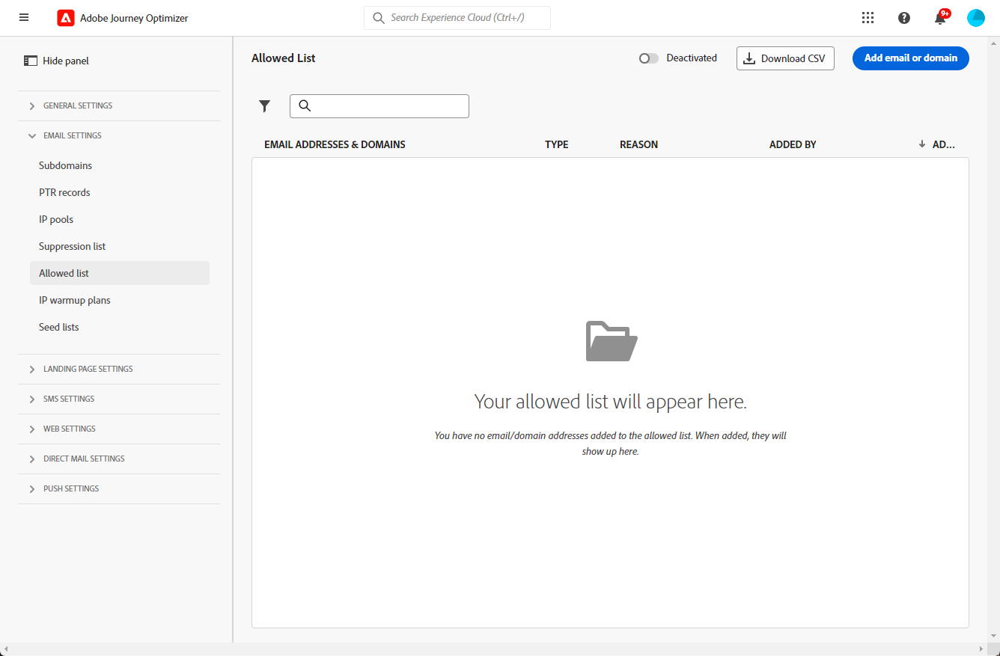

# Elenco Consentiti {#allow-list}

È possibile definire un elenco specifico di sicurezza per l’invio in [sandbox](../administration/sandboxes.md) livello.

Questo elenco Consentiti consente di specificare singoli indirizzi e-mail o domini che saranno gli unici destinatari o domini autorizzati a ricevere le e-mail che stai inviando da una sandbox specifica.

>[!CAUTION]
>
>Questa funzione si applica solo al canale E-mail. È disponibile su sandbox di produzione e non di produzione.

Ad esempio, in un’istanza non di produzione in cui possono verificarsi errori, l’elenco Consentiti ti assicura di non correre il rischio di inviare messaggi indesiderati a indirizzi reali dei clienti e fornisce quindi un ambiente protetto a scopo di test.

Inoltre, quando l’elenco Consentiti è attivo ma vuoto, non viene inviata alcuna e-mail. Pertanto, se riscontri problemi gravi, puoi utilizzare questa funzione per interrompere tutte le comunicazioni in uscita da [!DNL Journey Optimizer] fino a risolvere il problema. Ulteriori informazioni su [logica di elenco Consentiti](#logic).

Inoltre, puoi sfruttare Journey Optimizer **API REST di eliminazione** per controllare i messaggi in uscita utilizzando soppressione e elenchi consentiti. [Scopri come utilizzare l’API REST di soppressione](https://experienceleague.adobe.com/docs/journey-optimizer/using/configuration/monitor-reputation/manage-suppression-list.html?lang=it)

## Accedere all’elenco Consentiti {#access-allowed-list}

Per accedere all’elenco dettagliato degli indirizzi e-mail e dei domini consentiti, vai a **[!UICONTROL Amministrazione]** > **[!UICONTROL Canali]** > **[!UICONTROL Configurazione e-mail]**, e seleziona **[!UICONTROL Elenco Consentiti]**.



>[!CAUTION]
>
>Le autorizzazioni per visualizzare, esportare e gestire l’elenco Consentiti sono limitate a [Amministratori di percorso](../administration/ootb-product-profiles.md#journey-administrator). Ulteriori informazioni sulla gestione [!DNL Journey Optimizer] diritti di accesso degli utenti in [questa sezione](../administration/permissions-overview.md).

Per esportare l’elenco Consentiti come file CSV, seleziona la **[!UICONTROL Scarica CSV]** pulsante.

Utilizza il **[!UICONTROL Elimina]** per rimuovere definitivamente una voce.

Puoi eseguire ricerche negli indirizzi e-mail o nei domini e filtrare in base al **[!UICONTROL Tipo di indirizzo]**. Una volta selezionato, puoi cancellare il filtro visualizzato sopra l’elenco.


## Attiva l’elenco Consentiti {#enable-allow-list}

Per attivare l’elenco Consentiti, segui la procedura riportata di seguito.

1. Accedere a  **[!UICONTROL Canali]** > **[!UICONTROL Configurazione e-mail]** > **[!UICONTROL Elenco consentiti]** menu.

1. Seleziona l’interruttore.

   

1. Seleziona **[!UICONTROL Attiva elenco Consentiti]**. L’elenco Consentiti è ora attivo.

   

   >[!NOTE]
   >
   >Dopo aver attivato l’elenco Consentiti, nei percorsi e nelle campagne viene applicata una latenza di 5 minuti.

La logica di elenco Consentiti si applica quando la funzione è attiva. Ulteriori informazioni in [questa sezione](#logic).

>[!NOTE]
>
>Quando è attivata, la funzione di elenco Consentiti viene rispettata durante l’esecuzione di percorsi, ma anche durante il test dei messaggi con [bozze](../content-management/proofs.md) e percorsi di test che utilizzano [modalità di test](../building-journeys/testing-the-journey.md).

## Disattivare l&#39;elenco Consentiti {#deactivate-allow-list}

Per disattivare l’elenco Consentiti, segui la procedura indicata di seguito.

1. Accedere a  **[!UICONTROL Canali]** > **[!UICONTROL Configurazione e-mail]** > **[!UICONTROL Elenco consentiti]** menu.

1. Seleziona l’interruttore.

   

1. Seleziona **[!UICONTROL Disattiva elenco Consentiti]**. L’elenco Consentiti non è più attivo.

   

   >[!NOTE]
   >
   >Dopo aver disattivato l’elenco Consentiti, i percorsi e le campagne avranno una latenza di 5 minuti.

La logica di elenco Consentiti non si applica quando la funzione viene disattivata. Ulteriori informazioni in [questa sezione](#logic).

## Aggiungere entità all’elenco Consentiti {#add-entities}

Per aggiungere nuovi indirizzi e-mail o domini all’elenco Consentiti per una sandbox specifica, puoi: [compila manualmente l’elenco](#manually-populate-list), o utilizza un [Chiamata API](#api-call-allowed-list).

>[!NOTE]
>
>L’elenco Consentiti può contenere fino a 1.000 voci.

### Compila manualmente l’elenco Consentiti {#manually-populate-list}

>[!CONTEXTUALHELP]
>id="ajo_admin_allowed_list_add_header"
>title="Aggiungere indirizzi o domini all’elenco Consentiti"
>abstract="Puoi aggiungere manualmente nuovi indirizzi e-mail o domini all’elenco Consentiti selezionandoli uno per uno."

>[!CONTEXTUALHELP]
>id="ajo_admin_allowed_list_add"
>title="Aggiungere indirizzi o domini all’elenco Consentiti"
>abstract="Puoi aggiungere manualmente nuovi indirizzi e-mail o domini all’elenco Consentiti selezionandoli uno per uno."

È possibile popolare manualmente il [!DNL Journey Optimizer] elenco Consentiti aggiungendo un indirizzo e-mail o un dominio tramite l’interfaccia utente.

>[!NOTE]
>
>Puoi aggiungere un solo indirizzo e-mail o dominio alla volta.

Per farlo, segui la procedura indicata di seguito.

1. Seleziona la **[!UICONTROL Aggiungi e-mail o dominio]** pulsante.

   

1. Scegli il tipo di indirizzo: **[!UICONTROL Indirizzo e-mail]** o **[!UICONTROL Indirizzo di dominio]**.

1. Immetti l’indirizzo e-mail o il dominio a cui desideri inviare le e-mail.

   >[!NOTE]
   >
   >Assicurati di inserire un indirizzo e-mail valido (ad esempio abc@company.com) o un dominio (ad esempio abc.company.com).

1. Se necessario, specifica un motivo.

   

   >[!NOTE]
   >
   >Tutti i caratteri ASCII compresi tra 32 e 126 sono consentiti nel **[!UICONTROL Motivo]** campo. L&#39;elenco completo è disponibile su [questa pagina](https://en.wikipedia.org/wiki/Wikipedia:ASCII#ASCII_printable_characters){target="_blank"} di esempio.

1. Fai clic su **[!UICONTROL Invia]**.

### Aggiungere entità utilizzando una chiamata API {#api-call-allowed-list}

Per popolare l’elenco Consentiti, puoi anche chiamare l’API di soppressione con `ALLOWED` valore per `listType` attributo. Ad esempio:


È possibile eseguire la **Aggiungi**, **Elimina** e **Ottenere** operazioni.

Ulteriori informazioni sull’esecuzione di chiamate API in [API di Adobe Experience Platform](https://experienceleague.adobe.com/docs/experience-platform/landing/platform-apis/api-guide.html){target="_blank"} documentazione di riferimento.

## Scarica l’elenco Consentiti {#download-allowed-list}

Per esportare l’elenco Consentiti come file CSV, effettua le seguenti operazioni:

1. Seleziona la **[!UICONTROL Scarica CSV]** pulsante.

   

1. Attendi che il file venga generato.

   

   >[!NOTE]
   >
   >Il tempo di download dipende dalla dimensione del file, ovvero dal numero di indirizzi presenti nell’elenco Consentiti.
   >
   >È possibile elaborare una richiesta di download alla volta per una determinata sandbox.

1. Una volta generato il file, riceverai una notifica. Fai clic sull’icona a forma di campana in alto a destra dello schermo per visualizzarla.

1. Fai clic sulla notifica stessa per scaricare il file.

   

   >[!NOTE]
   >
   >Il collegamento è valido per 24 ore.

## Logica dell’elenco Consentiti {#logic}

>[!CONTEXTUALHELP]
>id="ajo_admin_allowed_list_logic"
>title="Gestire l’elenco Consentiti"
>abstract="Quando l’elenco Consentiti viene attivato, solo i destinatari inclusi nell’elenco Consentiti riceveranno messaggi e-mail da questa sandbox. Quando è disattivato, tutti i destinatari riceveranno le e-mail."

Quando l’elenco Consentiti è [attivo](#enable-allow-list), si applica la seguente logica:

* Se l’elenco Consentiti è **vuoto**, non verrà inviata alcuna e-mail.

* Se un’entità è **sull’elenco Consentiti** e non nell’elenco di soppressione, l’e-mail viene inviata ai destinatari corrispondenti. Tuttavia, se l’entità si trova anche sul [elenco di soppressione](../reports/suppression-list.md), i destinatari corrispondenti non riceveranno l’e-mail, poiché il motivo è **[!UICONTROL Soppresso]**.

* Se un’entità è **non sull’elenco Consentiti** (e non nell’elenco di soppressione), i destinatari corrispondenti non riceveranno l’e-mail, poiché il motivo è **[!UICONTROL Non consentito]**.

>[!NOTE]
>
>I profili con **[!UICONTROL Non consentito]** Lo stato è escluso durante il processo di invio del messaggio. Pertanto, mentre il **Rapporti percorso** mostra questi profili come spostati nel percorso ([Read Audience](../building-journeys/read-audience.md) e [attività messaggio](../building-journeys/journeys-message.md)), il **Report e-mail** non li includerà nella **[!UICONTROL Inviato]** metriche poiché vengono escluse prima dell’invio e-mail.
>
>Ulteriori informazioni su [Rapporto live](../reports/live-report.md) e [Rapporto globale](../reports/global-report.md).

Quando l’elenco Consentiti è [disattivato](#deactivate-allow-list), tutte le e-mail che invii dalla sandbox corrente vengono inviate a tutti i destinatari (purché non siano nell’elenco di soppressione), inclusi gli indirizzi reali dei clienti.

## Generazione di rapporti di esclusione {#reporting}

Quando l’elenco Consentiti è attivo, puoi recuperare gli indirizzi e-mail o i domini esclusi da un invio perché non erano presenti nell’elenco Consentiti. A questo scopo, puoi utilizzare [Servizio query Adobe Experience Platform](https://experienceleague.adobe.com/docs/experience-platform/query/api/getting-started.html){target="_blank"} per effettuare le chiamate API di seguito.

Per ottenere **numero di e-mail** che non sono stati inviati perché i destinatari non erano inclusi nell’elenco Consentiti, utilizza la seguente query:

```sql
SELECT count(distinct _id) from cjm_message_feedback_event_dataset WHERE
_experience.customerJourneyManagement.messageExecution.messageExecutionID = '<MESSAGE_EXECUTION_ID>' AND
_experience.customerJourneyManagement.messageDeliveryfeedback.feedbackStatus = 'exclude' AND
_experience.customerJourneyManagement.messageDeliveryfeedback.messageExclusion.reason = 'EmailNotAllowed'
```

Per ottenere **elenco di indirizzi e-mail** che non sono stati inviati perché i destinatari non erano inclusi nell’elenco Consentiti, utilizza la seguente query:

```sql
SELECT distinct(_experience.customerJourneyManagement.emailChannelContext.address) from cjm_message_feedback_event_dataset WHERE
_experience.customerJourneyManagement.messageExecution.messageExecutionID IS NOT NULL AND
_experience.customerJourneyManagement.messageDeliveryfeedback.feedbackStatus = 'exclude' AND
_experience.customerJourneyManagement.messageDeliveryfeedback.messageExclusion.reason = 'EmailNotAllowed'
```
