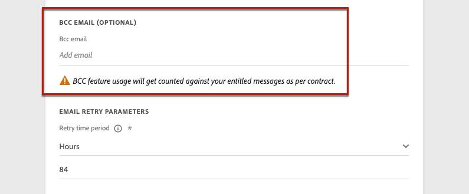
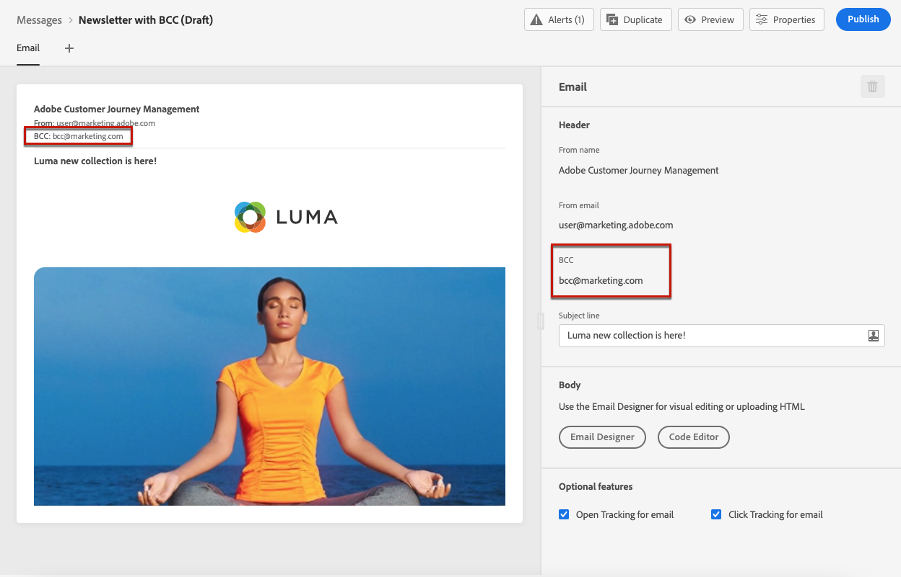
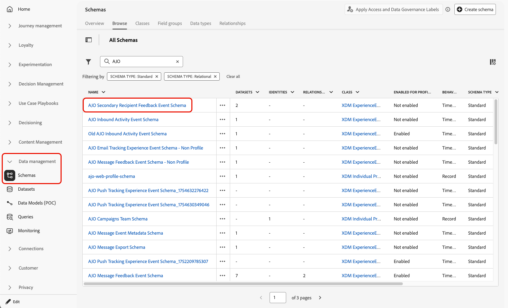
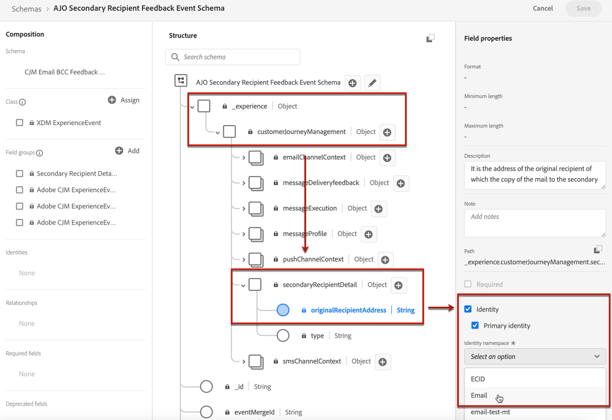
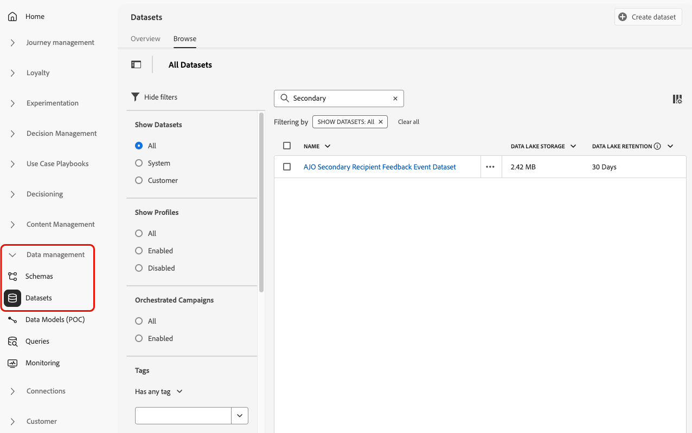
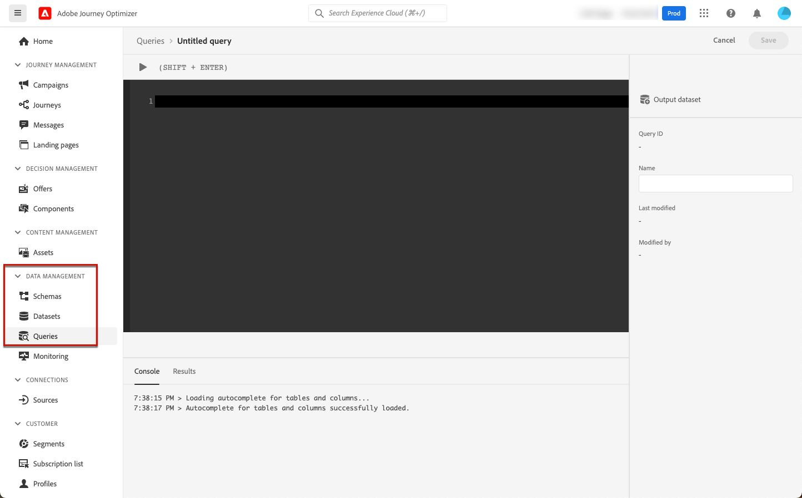
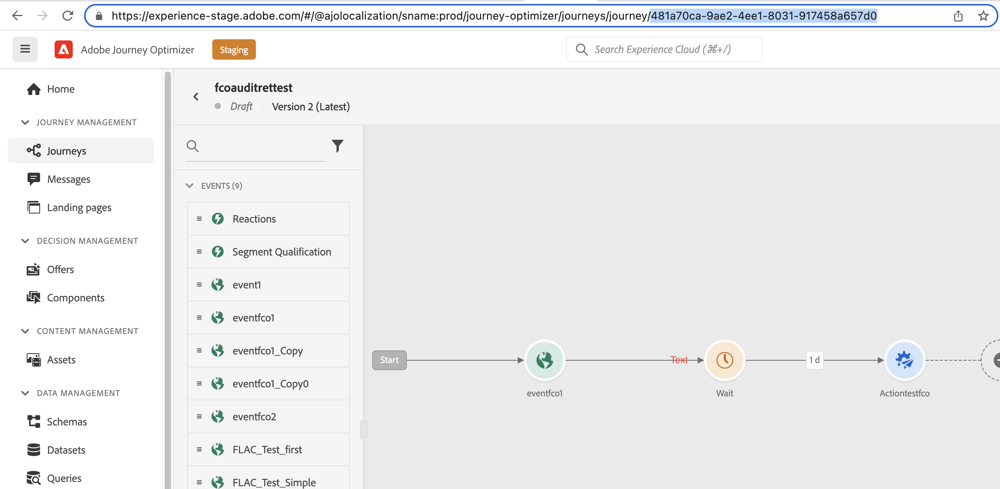

# Supporto per l’archiviazione {#archiving-support}

>[!BEGINSHADEBOX]

**In questa pagina:** scopri come archiviare i messaggi inviati con Adobe Journey Optimizer per motivi di conformità, inclusa la funzionalità e-mail in Ccn integrata per il canale e-mail e le opzioni basate su set di dati per altri canali.

>[!ENDSHADEBOX]

## Archiviare i messaggi {#about-archiving}

Normative come HIPAA richiedono che [!DNL Journey Optimizer] fornisca un modo per archiviare i messaggi inviati a singoli utenti. In effetti, se i clienti presentano una richiesta, devono avere la possibilità di ottenere una copia del messaggio inviato a scopo di verifica.

* Per il canale e-mail, [!DNL Journey Optimizer] fornisce una funzionalità e-mail Ccn incorporata. [Ulteriori informazioni](#bcc-email)

* Inoltre, per tutti i canali, è possibile utilizzare il campo &#39;Modello&#39; nel **Set di dati di entità**, che contiene i dettagli dei modelli di messaggio non personalizzati. Esporta il set di dati con questo campo per salvare metadati quali: chi ha inviato il messaggio, a chi e quando. Tieni presente che i dati personalizzati non vengono esportati, ma solo il modello (formato e struttura del messaggio). [Ulteriori informazioni](../data/datasets-query-examples.md#entity-dataset)

>[!NOTE]
>
>[!DNL Journey Optimizer] non è il proprietario del supporto per i requisiti di archiviazione SMS. Per il supporto di archiviazione dedicato, collabora con il fornitore del servizio SMS (Sinch, Infobip o Twilio).

Utilizza la tabella seguente per identificare l’opzione giusta per il tuo fabbisogno.

| Requisito | Opzione consigliata | Distinzione importante |
| --- | --- | --- |
| Mantieni una copia nascosta dei messaggi e-mail in uscita | E-mail Ccn | Invia una copia a una cassetta postale configurata; non espone un URL di pagina mirror né crea un campo Experience Platform interrogabile. |
| Esportare i contenuti e-mail o SMS inviati a un sistema esterno | [Esportazione messaggio](../configuration/message-export.md) | Scrive il contenuto e i metadati inviati al set di dati di esportazione del messaggio di AJO per l’esportazione a valle; non genera un URL di pagina mirror. |
| Visualizzare la versione online di un messaggio e-mail al destinatario | [Collegamento pagina mirror](../email/message-tracking.md#mirror-page) | Generato come parte dell’e-mail inviata; non è un’API di recupero URL post-invio supportata. |
| Memorizza il modello di messaggio non personalizzato o i metadati di consegna | Set di dati di entità | Non fornisce l’esatto contenuto personalizzato ricevuto da un individuo. |

## Come utilizzare Ccn per le e-mail {#bcc-email}

>[!CONTEXTUALHELP]
>id="ajo_admin_preset_bcc"
>title="Definire un indirizzo e-mail Ccn"
>abstract="Per conservare una copia delle e-mail inviate, puoi includere nell’invio un indirizzo e-mail in Ccn. Immetti l’indirizzo e-mail desiderato in modo che ogni e-mail venga inviata anche in copia per conoscenza nascosta a questo indirizzo Ccn. Il dominio dell’indirizzo Ccn non deve essere lo stesso di un sottodominio delegato ad Adobe. Questa funzione è facoltativa."

È possibile inviare una copia per conoscenza nascosta (CCN) di un&#39;e-mail inviata da [!DNL Journey Optimizer] a un indirizzo CCN dedicato. Questa funzione opzionale consente di conservare le copie delle comunicazioni e-mail inviate agli utenti per scopi di conformità e/o archiviazione. L&#39;indirizzo Ccn non è visibile agli altri destinatari del messaggio.

### Abilita e-mail Ccn {#enable-bcc}

Per abilitare l&#39;opzione **[!UICONTROL E-mail Ccn]**, immettere l&#39;indirizzo di posta elettronica desiderato nel campo dedicato della [configurazione canale](channel-surfaces.md). Puoi specificare qualsiasi indirizzo esterno nel formato corretto, ad eccezione di un indirizzo e-mail definito in un sottodominio delegato ad Adobe. Ad esempio, se hai delegato il sottodominio *marketing.luma.com* ad Adobe, qualsiasi indirizzo come *abc@marketing.luma.com* è vietato.

>[!CAUTION]
>
>* È possibile definire un solo indirizzo e-mail Ccn. Assicurati che abbia una capacità di ricezione sufficiente per archiviare tutte le e-mail inviate utilizzando la configurazione del canale corrente. Altri consigli sono elencati in [questa sezione](#bcc-recommendations-limitations).
>* Se hai acquistato il componente aggiuntivo Healthcare Shield, assicurati che l’ISP del tuo indirizzo Ccn supporti il protocollo TLS 1.2.



Al termine della configurazione, tutti i messaggi e-mail basati su questa configurazione vengono copiati in modalità nascosta nell&#39;indirizzo e-mail Ccn immesso. Da lì, i messaggi possono essere elaborati e archiviati utilizzando un sistema esterno.

>[!CAUTION]
>
>L’utilizzo della funzione Ccn viene conteggiato rispetto al numero di messaggi per i quali disponi della licenza. Pertanto, abilitalo solo nelle configurazioni utilizzate per le comunicazioni critiche che desideri archiviare. Verifica la disponibilità di volumi con licenza nel contratto.

L’impostazione dell’indirizzo e-mail Ccn viene immediatamente salvata ed elaborata a livello di configurazione. Quando si crea un nuovo messaggio utilizzando questa configurazione, l&#39;indirizzo e-mail Ccn viene visualizzato automaticamente.



Tuttavia, l&#39;indirizzo Ccn viene selezionato per l&#39;invio di comunicazioni in base alla logica descritta [qui](../email/email-settings.md).

### Raccomandazioni e limitazioni {#bcc-recommendations-limitations}

* Per garantire la conformità alla privacy, le e-mail in Ccn devono essere elaborate da un sistema di archiviazione in grado di memorizzare informazioni personali (PII, personally identifiable information) in modo sicuro.

* Poiché i messaggi possono contenere dati sensibili o privati, ad esempio informazioni personali (PII, personally identifiable information), accertati che l’indirizzo Ccn sia corretto e che l’accesso ai messaggi sia sicuro.

* La casella in entrata utilizzata per il campo Ccn deve essere gestita correttamente per quanto riguarda lo spazio e la consegna. Se la casella in entrata restituisce mancati recapiti, alcuni messaggi e-mail potrebbero non essere ricevuti e pertanto non verranno archiviati.

* I messaggi possono essere recapitati all’indirizzo e-mail Ccn prima dei destinatari target. I messaggi Ccn possono essere inviati anche se i messaggi originali contengono [messaggi non recapitati](../reports/suppression-list.md#delivery-failures).

  <!--OR: Only successfully sent emails are taken in account. [Bounces](../reports/suppression-list.md#delivery-failures) are not. TO CHECK -->

* Non aprire o scorrere le e-mail inviate all&#39;indirizzo Ccn in quanto è stato preso in considerazione nel totale delle aperture e dei clic dall&#39;analisi di invio, il che potrebbe causare alcuni errori di calcolo in [report](../reports/report-gs-cja.md).

* Non contrassegnare i messaggi come spam nella casella in entrata Ccn, in quanto influirà su tutte le altre e-mail inviate a questo indirizzo.

>[!CAUTION]
>
>Non fare clic sul collegamento per annullare l’abbonamento nelle e-mail inviate all’indirizzo in Ccn, in quanto l’abbonamento dei destinatari corrispondenti verrà immediatamente annullato.

### Conformità al RGPD {#gdpr-compliance}

Regolamenti come il RGPD stabiliscono che gli interessati devono essere in grado di modificare il loro consenso in qualsiasi momento. Poiché le e-mail in Ccn che stai inviando con Journey Optimizer includono informazioni personali protette (PII), devi modificare lo **[!UICONTROL Schema evento secondario feedback destinatario AJO]** per poter gestire queste PII in conformità con il RGPD e normative simili.

Per farlo, segui la procedura indicata di seguito.

1. Vai a **[!UICONTROL Gestione dati]** > **[!UICONTROL Schemi]** > **[!UICONTROL Sfoglia]** e seleziona **[!UICONTROL Schema evento feedback destinatario secondario AJO]**.

   {width="95%"}

1. Fai clic per espandere **[!UICONTROL _experience]**, **[!UICONTROL customerJourneyManagment]** e **[!UICONTROL secondaryRecipientDetail]**.

1. Selezionare **[!UICONTROL originalRecipientAddress]**.

1. Nella **[!UICONTROL Proprietà campo]** a destra, scorri verso il basso fino alla casella di controllo **[!UICONTROL Identità]**.

1. Selezionala e seleziona anche **[!UICONTROL Identità primaria]**.

1. Seleziona uno spazio dei nomi dall’elenco a discesa.

   {width="85%"}

1. Fare clic su **[!UICONTROL Applica]**.

>[!NOTE]
>
>Ulteriori informazioni sulla gestione della privacy e sulle normative applicabili sono disponibili nella [documentazione di Experience Platform](https://experienceleague.adobe.com/docs/experience-platform/privacy/home.html?lang=it){target="_blank"}.

### Dati di reporting Ccn {#bcc-reporting}

La generazione di rapporti in quanto tale in Ccn non è disponibile nei rapporti percorso e messaggio. Tuttavia, le informazioni sono memorizzate in un set di dati di sistema denominato **[!UICONTROL Set di dati evento di feedback secondario destinatario AJO]**. Puoi eseguire query su questo set di dati per trovare informazioni utili, ad esempio a scopo di debug.

Per accedere a questo set di dati tramite l&#39;interfaccia utente, selezionare **[!UICONTROL Gestione dati]** > **[!UICONTROL Set di dati]** > **[!UICONTROL Sfoglia]**. Ulteriori informazioni su come accedere ai set di dati in [questa sezione](../data/get-started-datasets.md#access-datasets).

{width="85%"}

Per eseguire query su questo set di dati, è possibile utilizzare l&#39;editor di query fornito da [Adobe Experience Platform Query Service](https://experienceleague.adobe.com/docs/experience-platform/query/api/getting-started.html?lang=it){target="_blank"}. Per accedervi, seleziona **[!UICONTROL Gestione dati]** > **[!UICONTROL Query]** e fai clic su **[!UICONTROL Crea query]**. [Ulteriori informazioni](../data/get-started-queries.md)

{width="100%"}

A seconda delle informazioni che stai cercando, puoi eseguire le seguenti query.

1. Per tutte le altre query seguenti, è necessario l’ID azione di percorso. Esegui questa query per recuperare tutti gli ID azione associati a un particolare ID versione percorso negli ultimi 2 giorni:

   ```
   SELECT
   DISTINCT
   CAST(TIMESTAMP AS DATE) AS EventTime,
   _experience.journeyOrchestration.stepEvents.journeyVersionID,
   _experience.journeyOrchestration.stepEvents.actionName, 
   _experience.journeyOrchestration.stepEvents.actionID 
   FROM journey_step_events 
   WHERE 
   _experience.journeyOrchestration.stepEvents.journeyVersionID = '<journey version id>' AND 
   _experience.journeyOrchestration.stepEvents.actionID is not NULL AND 
   TIMESTAMP > NOW() - INTERVAL '2' DAY 
   ORDER BY EventTime DESC;
   ```

   >[!NOTE]
   >
   >Per ottenere il parametro `<journey version id>`, selezionare la versione di percorso corrispondente dal menu **[!UICONTROL Gestione Percorsi]** > **[!UICONTROL Percorsi]**. L’ID della versione del percorso viene visualizzato alla fine dell’URL visualizzato nel browser web. [Ulteriori informazioni sulle versioni di percorso](../building-journeys/publish-journey.md#journey-versions)
   >
   >{width="85%"}

1. Esegui questa query per recuperare tutti gli eventi di feedback dei messaggi (in particolare lo stato di feedback) generati per un particolare messaggio destinato a un utente specifico negli ultimi 2 giorni:

   ```
   SELECT  
   _experience.customerJourneyManagement.messageExecution.journeyVersionID AS JourneyVersionID, 
   _experience.customerJourneyManagement.messageExecution.journeyActionID AS JourneyActionID, 
   timestamp AS EventTime, 
   _experience.customerJourneyManagement.emailChannelContext.address AS RecipientAddress, 
   _experience.customerjourneymanagement.messagedeliveryfeedback.feedbackStatus AS FeedbackStatus,
   CASE _experience.customerjourneymanagement.messagedeliveryfeedback.feedbackStatus
       WHEN 'sent' THEN 'Sent'
       WHEN 'delay' THEN 'Retry'
       WHEN 'out_of_band' THEN 'Bounce' 
       WHEN 'bounce' THEN 'Bounce'
   END AS FeedbackStatusCategory
   FROM cjm_message_feedback_event_dataset 
   WHERE  
       timestamp > now() - INTERVAL '2' day  AND
       _experience.customerJourneyManagement.messageExecution.journeyVersionID = '<journey version id>' AND 
       _experience.customerJourneyManagement.messageExecution.journeyActionID = '<journey action id>' AND  
       _experience.customerJourneyManagement.emailChannelContext.address = '<recipient email address>'
       ORDER BY EventTime DESC;
   ```

   >[!NOTE]
   >
   >Per ottenere il parametro `<journey action id>`, eseguire la prima query descritta in precedenza utilizzando l&#39;ID versione percorso. Il parametro `<recipient email address>` è l&#39;indirizzo e-mail del destinatario effettivo o di destinazione.

1. Esegui questa query per recuperare tutti gli eventi di feedback dei messaggi Ccn generati per un particolare messaggio destinato a un utente specifico negli ultimi 2 giorni:

   ```
   SELECT   
   _experience.customerJourneyManagement.messageExecution.journeyVersionID AS JourneyVersionID, 
   _experience.customerJourneyManagement.messageExecution.journeyActionID AS JourneyActionID, 
   _experience.customerJourneyManagement.emailChannelContext.address AS BccEmailAddress,
   timestamp AS EventTime, 
   _experience.customerJourneyManagement.secondaryRecipientDetail.originalRecipientAddress AS RecipientAddress, 
   _experience.customerjourneymanagement.messagedeliveryfeedback.feedbackStatus AS FeedbackStatus,
   CASE _experience.customerjourneymanagement.messagedeliveryfeedback.feedbackStatus
               WHEN 'sent' THEN 'Sent'
               WHEN 'delay' THEN 'Retry'
               WHEN 'out_of_band' THEN 'Bounce' 
               WHEN 'bounce' THEN 'Bounce'
           END AS FeedbackStatusCategory 
   FROM ajo_bcc_feedback_event_dataset  
   WHERE  
   timestamp > now() - INTERVAL '2' day  AND
   _experience.customerJourneyManagement.messageExecution.journeyVersionID = '<journey version id>' AND 
   _experience.customerJourneyManagement.messageExecution.journeyActionID = '<journeyaction id>' AND 
   _experience.customerJourneyManagement.secondaryRecipientDetail.originalRecipientAddress = '<recipient email address>'
   ORDER BY EventTime DESC;
   ```

1. Esegui questa query per recuperare tutti gli indirizzi dei destinatari che non hanno ricevuto il messaggio mentre la relativa voce Ccn esiste negli ultimi 30 giorni:

   ```
    SELECT
        DISTINCT 
    bcc._experience.customerJourneyManagement.secondaryRecipientDetail.originalRecipientAddress AS RecipientAddressesNotRecievedMessage
    FROM ajo_bcc_feedback_event_dataset bcc
    LEFT JOIN cjm_message_feedback_event_dataset mfe
    ON 
   bcc._experience.customerJourneyManagement.messageExecution.journeyVersionID =
            mfe._experience.customerJourneyManagement.messageExecution.journeyVersionID AND    bcc._experience.customerJourneyManagement.messageExecution.journeyActionID = mfe._experience.customerJourneyManagement.messageExecution.journeyActionID AND 
   bcc._experience.customerJourneyManagement.secondaryRecipientDetail.originalRecipientAddress = mfe._experience.customerJourneyManagement.emailChannelContext.address AND
   mfe._experience.customerJourneyManagement.messageExecution.journeyVersionID = '<journey version id>' AND 
   mfe._experience.customerJourneyManagement.messageExecution.journeyActionID = '<journey action id>' AND
   mfe.timestamp > now() - INTERVAL '30' DAY AND
   mfe._experience.customerjourneymanagement.messagedeliveryfeedback.feedbackstatus IN ('bounce', 'out_of_band') 
    WHERE bcc.timestamp > now() - INTERVAL '30' DAY;
   ```

### Utilizza l’intestazione del messaggio per riconciliare la copia in Ccn e le informazioni e-mail inviate {#bcc-header}

Ad esempio, quando le copie Ccn dell’e-mail vengono archiviate su un sistema esterno, puoi recuperare le informazioni sulle e-mail inviate corrispondenti utilizzando un’intestazione inclusa nel messaggio.

Ogni messaggio di posta elettronica contiene ora un&#39;intestazione denominata `x-message-profile-id`. Il valore di questa intestazione è diverso per ciascun profilo: è univoco per ogni e-mail inviata e per la corrispondente copia e-mail in Ccn.

L&#39;intestazione `x-message-profile-id` è archiviata anche nei seguenti set di dati di sistema: [Set di dati evento di feedback dei messaggi di AJO](../data/datasets-query-examples.md#message-feedback-event-dataset) (e-mail inviate) e [Set di dati evento di feedback dei destinatari secondari di AJO](#bcc-reporting) (copie in formato Ccn). Puoi eseguire una query su questi set di dati per riconciliare la copia in Ccn e l’e-mail effettiva corrispondente.

* Per accedere a questi set di dati tramite l&#39;interfaccia utente, selezionare **[!UICONTROL Gestione dati]** > **[!UICONTROL Set di dati]** > **[!UICONTROL Sfoglia]**. Ulteriori informazioni su come accedere ai set di dati in [questa sezione](../data/get-started-datasets.md#access-datasets).

* Utilizza l&#39;editor di query fornito da [Adobe Experience Platform Query Service](https://experienceleague.adobe.com/docs/experience-platform/query/api/getting-started.html?lang=it){target="_blank"}. Per accedervi, seleziona **[!UICONTROL Gestione dati]** > **[!UICONTROL Query]** e fai clic su **[!UICONTROL Crea query]**. [Ulteriori informazioni](../data/get-started-queries.md)

Di seguito sono riportate alcune query di esempio che è possibile eseguire per recuperare le informazioni corrispondenti alle copie in formato Ccn.

**Query 1**

Per ottenere l’unione dell’evento Ccn con l’evento di feedback corrispondente per l’e-mail effettiva con i dettagli dell’azione della campagna:

```
SELECT
  mfe.timestamp AS OriginalRecipientFeedbackEventTime,
  mfe._experience.customerJourneyManagement.emailChannelContext.address AS OriginalRecipientEmailAddress,
  bcc._experience.customerJourneyManagement.emailChannelContext.address AS BCCEmailAddress,
  mfe._experience.customerjourneymanagement.messagedeliveryfeedback.feedbackstatus AS OriginalRecipientMessageFeedbackStatus,
  mfe._experience.customerJourneyManagement.messageExecution.campaignID AS CampaignID,
  mfe._experience.customerJourneyManagement.messageExecution.campaignActionID AS CampaignActionID,
  mfe._experience.customerJourneyManagement.messageExecution.batchInstanceID AS BatchInstanceID,
  mfe._experience.customerJourneyManagement.messageExecution.messageID AS MessageID
FROM ajo_bcc_feedback_event_dataset bcc
LEFT JOIN ajo_message_feedback_event_dataset mfe
ON bcc._experience.customerJourneyManagement.messageProfile.messageProfileID =
    mfe._experience.customerJourneyManagement.messageProfile.messageProfileID AND 
    mfe.timestamp > now() - INTERVAL '30' day
WHERE 
  bcc.timestamp > now() - INTERVAL '30' DAY AND 
  bcc._experience.customerJourneyManagement.messageProfile.messageProfileID = '<x-message-profile-id>'
ORDER BY mfe.timestamp DESC;
```

**Query 2**

Per ottenere l’unione dell’evento Ccn con l’evento di feedback corrispondente per l’e-mail effettiva e i dettagli dell’azione di percorso:

```
SELECT
  mfe.timestamp AS OriginalRecipientFeedbackEventTime,
  mfe._experience.customerJourneyManagement.emailChannelContext.address AS OriginalRecipientEmailAddress,
  bcc._experience.customerJourneyManagement.emailChannelContext.address AS BCCEmailAddress,
  mfe._experience.customerjourneymanagement.messagedeliveryfeedback.feedbackstatus AS OriginalRecipientMessageFeedbackStatus,
  mfe._experience.customerJourneyManagement.messageExecution.journeyActionID AS journeyActionID,
  mfe._experience.customerJourneyManagement.messageExecution.journeyVersionID AS JourneyVersionID,
  mfe._experience.customerJourneyManagement.messageExecution.journeyVersionInstanceID AS JourneyVersionInstanceID,
  mfe._experience.customerJourneyManagement.messageExecution.batchInstanceID AS BatchInstanceID,
  mfe._experience.customerJourneyManagement.messageExecution.messageID AS MessageID
FROM ajo_bcc_feedback_event_dataset bcc
LEFT JOIN ajo_message_feedback_event_dataset mfe
ON bcc._experience.customerJourneyManagement.messageProfile.messageProfileID =
    mfe._experience.customerJourneyManagement.messageProfile.messageProfileID AND 
    mfe.timestamp > now() - INTERVAL '30' day
WHERE 
  bcc.timestamp > now() - INTERVAL '30' DAY AND 
  bcc._experience.customerJourneyManagement.messageProfile.messageProfileID = '<x-message-profile-id>'
ORDER BY mfe.timestamp DESC;
```

## Domande frequenti {#faq}

+++ È possibile recuperare un URL della pagina speculare dopo l’invio di un’e-mail?

Al momento non tramite un’API pubblica documentata o un campo di set di dati Adobe Experience Platform. L&#39;[URL pagina mirror](../email/message-tracking.md#mirror-page) è generato come parte del processo di consegna del messaggio. Se devi conservare o controllare il contenuto inviato, utilizza [Esportazione messaggi](message-export.md) o [Archiviazione Ccn](#bcc-email).

+++

+++ L’URL della pagina speculare è disponibile nel set di dati di entità o in altri set di dati di tracciamento?

No. Il [Set di dati di entità](../data/datasets-query-examples.md#entity-dataset) fornisce il modello di messaggio e le informazioni sui metadati, ma non deve essere utilizzato come origine per il contenuto personalizzato esatto ricevuto da un destinatario.

+++

+++ L’esportazione dei messaggi può essere utilizzata per ricostruire un URL di pagina mirror?

No. [Esportazione messaggi](message-export.md) fornisce il contenuto del messaggio inviato e i metadati per l&#39;esportazione a valle, l&#39;archiviazione, la conformità o l&#39;utilizzo da parte dell&#39;assistenza clienti. Non genera o restituisce un [URL della pagina mirror](../email/message-tracking.md#mirror-page).

+++

+++ Quale opzione devo utilizzare se devo visualizzare il messaggio esatto inviato a un cliente?

Utilizza [Esportazione messaggi](message-export.md) quando hai bisogno di contenuto e metadati strutturati per messaggi inviati in un sistema esterno. Utilizzare [CCN](#bcc-email) se è necessaria solo una copia nascosta di un&#39;e-mail in uscita conservata in una cassetta postale. Nessuna delle due opzioni recupera l’URL originale della pagina speculare.

+++
