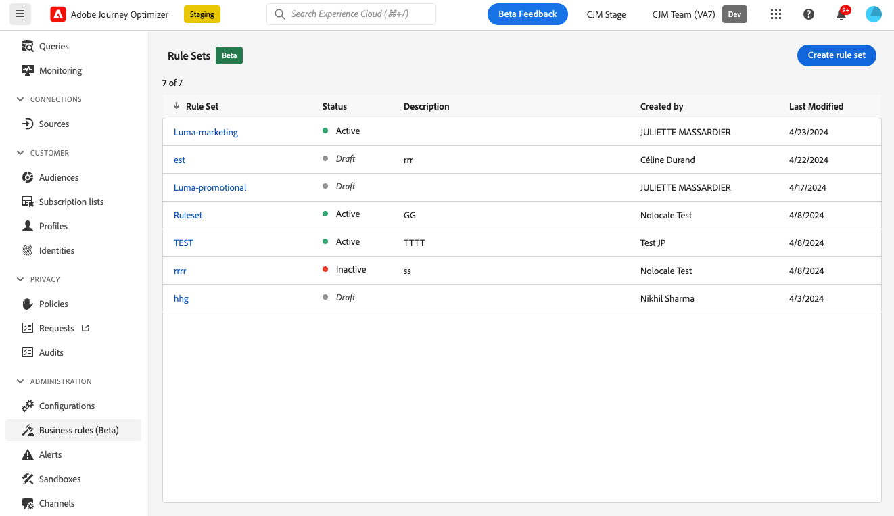
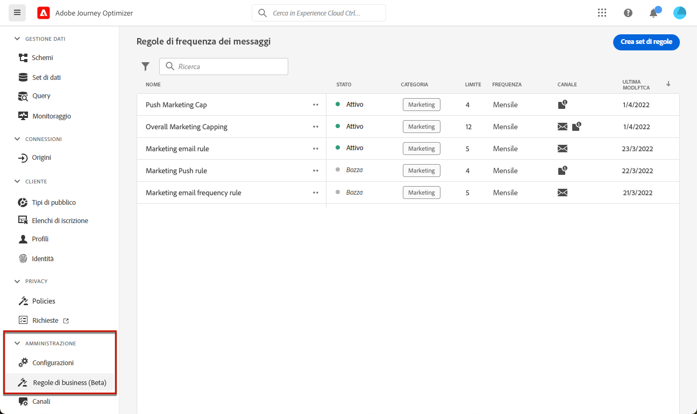
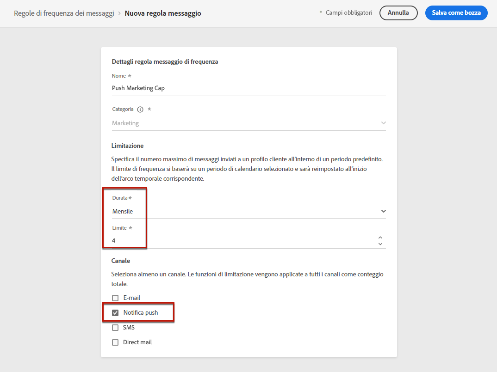
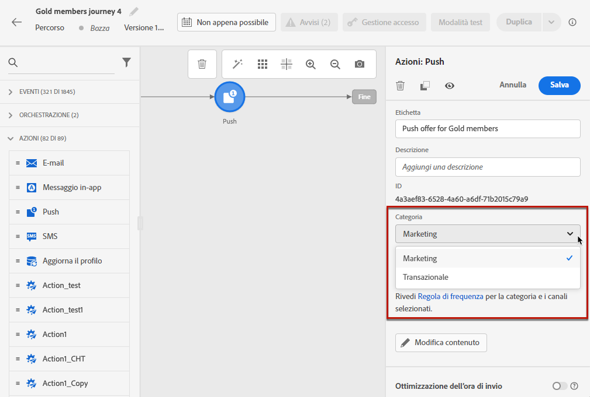

# Regole aziendali {#business-rules}

>[!AVAILABILITY]
>
>Le regole business sono attualmente disponibili come versione beta solo per alcuni utenti.

[!DNL Journey Optimizer] consente di controllare la frequenza con cui gli utenti riceveranno un messaggio impostando regole cross-channel che escluderanno automaticamente i profili sollecitati eccessivamente da messaggi e azioni.

Ad esempio, per un marchio, una regola potrebbe essere: inviare non più di 4 messaggi di marketing al mese ai loro clienti. Per farlo, puoi utilizzare una regola di frequenza che limiterà il numero di messaggi inviati in base a uno o più canali durante un periodo di un mese di calendario.

Attraverso la creazione di diversi set di regole per una maggiore granularità, [!DNL Journey Optimizer] consente di applicare un limite di frequenza a diversi tipi di comunicazioni di marketing. Ad esempio, puoi creare un set di regole per limitare il numero di **comunicazioni promozionali** inviato ai clienti e crea un altro set di regole per limitare il numero di **newsletter** inviati a loro.

>[!NOTE]
>
>Le regole aziendali sono diverse dalla gestione delle rinunce, che consente agli utenti di annullare l’abbonamento alla ricezione di comunicazioni da un marchio. [Ulteriori informazioni](../privacy/opt-out.md#opt-out-management)

## Set di regole di accesso {#access-rule-sets}

I set di regole sono disponibili da **[!UICONTROL Amministrazione]** > **[!UICONTROL Regole aziendali (Beta)]** menu. Vengono elencate tutte le regole, ordinate per data di creazione.

Fai clic sul nome di un set di regole per visualizzarne e modificarne il contenuto. Sono elencate tutte le regole incluse in tale set di regole.

Il menu contestuale in alto a destra consente di:

* Modifica il nome e la descrizione del set di regole
* Attiva il set di regole - [ulteriori informazioni](#activate-rule)
* Elimina il set di regole

Per ogni regola del set di regole, la proprietà **[!UICONTROL Altre azioni]** consente di:

* Modifica la regola
* Attiva la regola [ulteriori informazioni](#activate-rule)
* Elimina la regola

<!--### Permissions{#permissions-frequency-rules}

To access, create, edit or delete message frequency rules, you must have the **[!UICONTROL Manage frequency rules]** permission. 

Users with the **[!UICONTROL View frequency rules]** permission are able to view rules, but not to modify or delete them.

Learn more about permissions in [this section](../administration/high-low-permissions.md).-->

## Creare un set di regole {#create-rule-set}

Per creare un set di regole, segui la procedura riportata di seguito.

1. Accedere a **[!UICONTROL Set di regole]** , quindi fai clic su **[!UICONTROL Crea set di regole]**.

   

1. Definisci il nome del set di regole, aggiungi una descrizione se necessario e fai clic su **[!UICONTROL Salva]**.

   

   >[!NOTE]
   >
   >Il nome del set di regole deve essere univoco.

1. Ora puoi [definire le regole](#create-new-rule) desideri aggiungere a questo set di regole e [attivare](#activate-rule) ...

   >[!NOTE]
   >
   >Assicurati che tutte le regole che desideri applicare ai messaggi siano attivate anche nel set di regole.

## Creare una regola {#create-new-rule}

>[!CONTEXTUALHELP]
>id="ajo_rule_sets_category"
>title="Selezionare la categoria della regola del messaggio"
>abstract="Quando vengono attivate e applicate a un messaggio, tutte le regole di frequenza che corrispondono alla categoria selezionata verranno applicate automaticamente a questo messaggio. Attualmente è disponibile solo la categoria Marketing."

>[!CONTEXTUALHELP]
>id="ajo_rule_sets_capping"
>title="Impostare i limiti per la regola"
>abstract="Specifica il numero massimo di messaggi inviati a un profilo cliente nell’arco temporale definito. La quota limite si baserà sul periodo di calendario selezionato e verrà reimpostata all’inizio dell’arco temporale corrispondente."

>[!CONTEXTUALHELP]
>id="ajo_rule_sets_channel"
>title="Definire i canali a cui si applica la regola"
>abstract="Seleziona almeno un canale. I limiti vengo applicati a tutti i canali come conteggio totale."

Per aggiungere una regola a un set di regole, effettua le seguenti operazioni.

1. Dal set di regole appena creato, fai clic su **[!UICONTROL Aggiungi regola]**.

   

1. Definisci il nome della regola.

   >[!NOTE]
   >
   >Il nome del set di regole deve essere univoco.

1. Seleziona la categoria della regola del messaggio.

   >[!NOTE]
   >
   >Attualmente è disponibile solo la categoria **[!UICONTROL Marketing]**.

1. Dall’elenco a discesa **[!UICONTROL Durata]**, seleziona un arco temporale in cui applicare la limitazione. [Ulteriori informazioni](#frequency-cap)

1. Imposta il limite per la regola, ovvero il numero massimo di messaggi che possono essere inviati a un singolo profilo utente ogni mese, settimana o giorno, in base alla selezione precedente.

1. Seleziona il canale da utilizzare per questa regola: **[!UICONTROL E-mail]**, **[!UICONTROL SMS]**, **[!UICONTROL Notifica push]** o **[!UICONTROL Direct mail]**.

   

   >[!NOTE]
   >
   >Per poter creare il messaggio, devi selezionare almeno un canale.

1. Se desideri applicare il limite come conteggio totale su tutti i canali selezionati, seleziona diversi canali.

   Ad esempio, imposta il limite su 5 e seleziona sia il canale e-mail che quello sms. Se un profilo ha già ricevuto 3 e-mail di marketing e 2 sms di marketing per il periodo selezionato, verrà escluso dalla consegna successiva di eventuali e-mail di marketing o sms.

1. Clic **[!UICONTROL Salva]** per confermare la creazione della regola. Il messaggio viene aggiunto al set di regole, con **[!UICONTROL Bozza]** stato.

   

1. Ripeti i passaggi precedenti per aggiungere al set di regole tutte le regole necessarie.

Ora devi attivare ogni regola prima che possa essere applicata a qualsiasi messaggio. [Ulteriori informazioni](#activate-rule)

>[!NOTE]
>
>Assicurati che anche il set di regole sia attivato per poterlo selezionare nei messaggi.

### Quota limite {#frequency-cap}

>[!CONTEXTUALHELP]
>id="ajo_rule_sets_duration"
>title="Selezionare la categoria della regola del messaggio"
>abstract="Quando vengono attivate e applicate a un messaggio, tutte le regole di frequenza che corrispondono alla categoria selezionata verranno applicate automaticamente a questo messaggio. Attualmente è disponibile solo la categoria Marketing."

Dalla sezione **[!UICONTROL Durata]** , seleziona se desideri che il limite venga applicato mensilmente, settimanalmente o quotidianamente.

La quota limite si basa sul periodo di calendario selezionato. Viene reimpostato all’inizio dell’arco temporale corrispondente.

La scadenza del contatore per ciascun periodo è la seguente:

* **[!UICONTROL Mensile]**: la quota limite è valida fino all’ultimo giorno del mese alle 23:59:59 UTC. Ad esempio, la scadenza mensile di gennaio è il 31/01 alle 23:59:59 UTC.

* **[!UICONTROL Settimanale]**: la quota limite è valida fino alle 23:59:59 UTC del sabato di tale settimana, poiché la settimana di calendario inizia la domenica. La scadenza è indipendente dalla creazione della regola. Ad esempio, se la regola viene creata il giovedì, è valida fino a sabato alle 23:59:59.

* **[!UICONTROL Giornaliero]**: il limite di frequenza giornaliero è valido per il giorno fino al 23:59:59 UTC e viene reimpostato su 0 all&#39;inizio del giorno successivo.

### Quota limite giornaliera {#daily-frequency-cap}

>[!CAUTION]
>
>Per garantire l&#39;accuratezza delle regole relative ai limiti di frequenza giornalieri, l&#39;uso di [segmentazione in streaming](https://experienceleague.adobe.com/docs/experience-platform/segmentation/ui/streaming-segmentation.html?lang=it){target="_blank"} è obbligatorio. Ulteriori informazioni sui metodi di valutazione del pubblico sono disponibili in [questa sezione](../audience/about-audiences.md#evaluation-method-in-journey-optimizer).

Per qualsiasi dimensione di segmento fino al limite di 60 milioni di messaggi all’ora<!--not clear-->, assicurati che le campagne siano a distanza di almeno 2 ore.

<!-- Journey example:

* If customer sets a Daily rule under the Global Ruleset for email <= 2/day:
   * Journey 123 (scheduled for noon)
   * Journey 456 (scheduled for noon)
   * Journey 789 (scheduled for 1 pm)

   In this example, the Daily Frequency cap will not guarantee <= 2/day. The rule will only be guaranteed when Journeys are at least 2 hours apart:
   * Journey 123 (scheduled for noon)
   * Journey 456 (scheduled for 2 pm)
   * Journey 789 (scheduled for 4 pm)-->

Ad esempio, se imposti una regola giornaliera in un set di regole per il canale e-mail che è inferiore o uguale a 2 giorni e crei le seguenti campagne:
* Campagna A (pianificato per mezzogiorno)
* Campagna A (pianificata per le 15:00)
* Campagna B (pianificata per le 13:00)

Questa configurazione non funzionerà per due motivi:
* Il limite di frequenza giornaliero non è garantito, in quanto le campagne non distano tra loro 2 ore.
* Non è una best practice pianificare la stessa campagna più volte in un giorno per sfruttare il tetto giornaliero.

L’esempio seguente deve rispettare il limite di frequenza giornaliero:
* Campagna A (pianificato per mezzogiorno)
* Campagna B (pianificata per le 14:00)

<!--* To use the Daily Cap with a Journey, customers can use either an Event Triggered Journey or an Audience Qualified Journey. If customers wish to use the Daily Cap with a Read Audience Journey, they should use a Campaign instead and associate a Local Ruleset with the campaign, following the example given above.-->

## Attivare regole e set di regole {#activate-rule}

Una volta creata, una regola presenta **[!UICONTROL Bozza]** e non influisce ancora su alcun messaggio. Per abilitarlo, fai clic su **[!UICONTROL Altre azioni]** accanto alla regola e seleziona **[!UICONTROL Attiva]**.

Devi anche attivare il set di regole per potervi accedere in campagne/percorsi e applicarlo ai messaggi.

L’attivazione di un set di regole influisce su tutti i messaggi a cui si applica nella successiva esecuzione. Scopri come [applicare un set di regole a un messaggio](#apply-rule-set).

>[!NOTE]
>
>La completa attivazione di una regola o di un set di regole può richiedere fino a 10 minuti. Non è necessario modificare i messaggi o ripubblicare i percorsi per rendere effettiva una regola.

<!--Currently, once a rule set is activated, no more rules can be added to that rule set.-->

## Disattivare regole e set di regole {#deactivate-rule}

Per disattivare una regola o un set di regole, fare clic sul pulsante **[!UICONTROL Altre azioni]** accanto all&#39;elemento desiderato e selezionare **[!UICONTROL Disattiva]**.

Il suo stato cambierà in **[!UICONTROL Inattivo]** e la regola non si applicherà alle esecuzioni future dei messaggi. Eventuali messaggi attualmente in esecuzione non saranno interessati.

>[!NOTE]
>
>La disattivazione di una regola o di un set di regole non influisce né reimposta i conteggi sui singoli profili.

## Applicare una regola di frequenza a un messaggio {#apply-frequency-rule}

Per applicare una regola di frequenza a un messaggio, segui i passaggi riportati qui sotto.

1. Durante la creazione di un’ [campagna](../campaigns/create-campaign.md), seleziona uno dei canali definiti per il set di regole e modifica il contenuto del messaggio.

1. Nella schermata dell’edizione del contenuto, fai clic su **[!UICONTROL Aggiungi regola business]** pulsante.

1. Seleziona la [set di regole creato](#create-rule-set).

   

   >[!NOTE]
   >
   >Solo [attivato](#activate-rule) i set di regole vengono visualizzati nell’elenco.

   <!--Messages where the category selected is **[!UICONTROL Transactional]** will not be evaluated against business rules.-->

1. Puoi visualizzare il numero di profili esclusi dalla consegna in [Rapporto globale](../reports/global-report.md) e in [Rapporto live](../reports/live-report.md), in cui le regole di frequenza saranno elencate come possibile motivo per gli utenti esclusi dalla consegna.

>[!NOTE]
>
>Puoi applicare diverse regole allo stesso canale, ma una volta raggiunto il limite inferiore, il profilo verrà escluso dalle consegne successive.

<!--
## Example: combine several rules {#frequency-rule-example}

You can combine several message frequency rules, such as described in the example below.

1. [Create a rule](#create-new-rule) called *Overall Marketing Capping*:

   * Select all channels.
   * Set capping to 12 monthly.

   

1. To further restrict the number of marketing-based push notifications that a user is sent, create a second rule called *Push Marketing Cap*:

   * Select Push channel.
   * Set capping to 4 monthly.

   

1. Save and [activate](#activate-rule) the rule.

1. [Create a message](../building-journeys/journeys-message.md) for every channel you want to communicate through and select the **[!UICONTROL Marketing]** category for each message. [Learn how to apply a frequency rule](#apply-frequency-rule)

   

In this scenario, an individual profile:
* can receive up to 12 marketing messages per month;
* but will be excluded from marketing push notifications after they have received 4 push notifications.-->

Quando si esegue il test delle regole di frequenza, si consiglia di utilizzare una nuova [profilo di test](../audience/creating-test-profiles.md), perché una volta raggiunto il limite di frequenza di un profilo, non è possibile reimpostare il contatore fino al periodo successivo. La disattivazione di una regola consente ai profili con limiti di ricevere messaggi, ma non rimuove o elimina eventuali incrementi del contatore.

