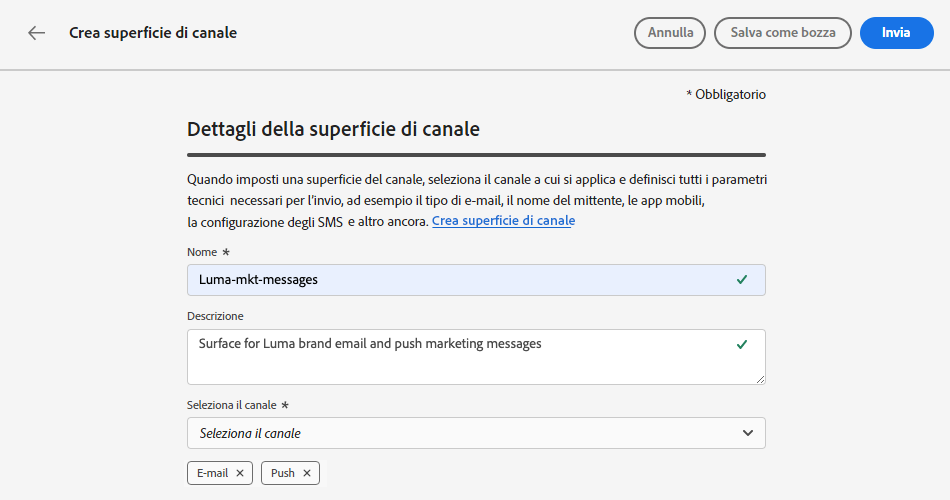
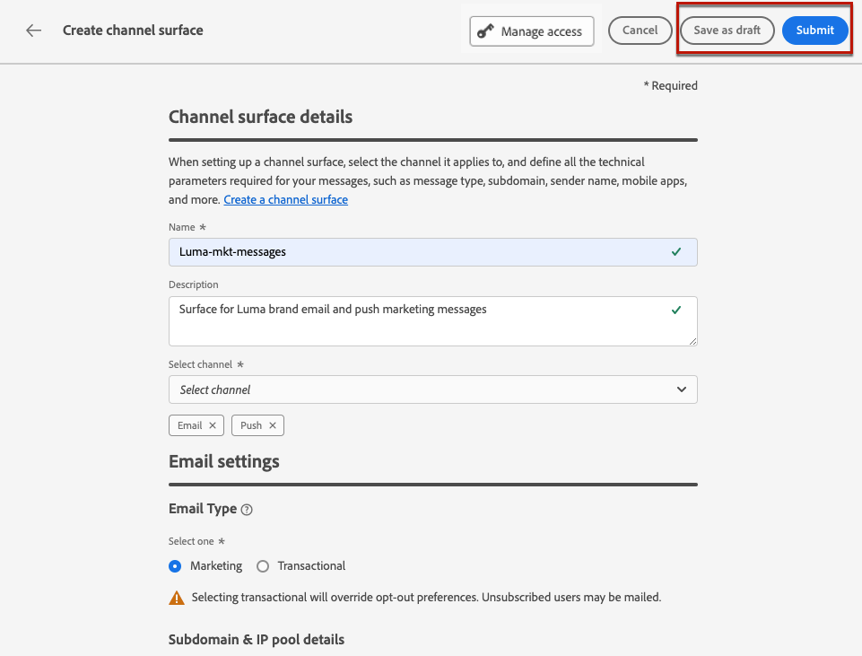

# Impostare le configurazioni dei canali {#set-up-channel-surfaces}

>[!CONTEXTUALHELP]
>id="ajo_admin_channel_surfaces"
>title="Configurazione dei canali"
>abstract="Una configurazione dei canali è una configurazione definita da un amministratore di sistema. Contiene tutti i parametri tecnici per l’invio del messaggio, ad esempio parametri di intestazione, sottodominio, app mobili e così via."

>[!CONTEXTUALHELP]
>id="ajo_admin_marketing_action"
>title="Azione di marketing"
>abstract="Scegli le azioni di marketing per collegare i criteri di consenso ai messaggi utilizzando questa configurazione. Tutti i criteri di consenso connessi all’azione di marketing verranno utilizzati per rispettare le preferenze della clientela."

Con [!DNL Journey Optimizer] è possibile impostare configurazioni di canale (ossia predefiniti per messaggi) che definiscano tutti i parametri tecnici richiesti per i messaggi: tipo di e-mail, e-mail e nome del mittente, app mobili, configurazione di SMS e altro ancora.

>[!CAUTION]
>
> * Per creare, modificare ed eliminare le configurazioni di canale, devi disporre dell&#39;autorizzazione [Gestione predefiniti messaggi](../administration/high-low-permissions.md#administration-permissions).
>
> * Prima di creare le configurazioni del canale, è necessario eseguire i passaggi [Configurazione e-mail](../email/get-started-email-config.md), [Configurazione push](../push/push-configuration.md), [Configurazione SMS](../sms/sms-configuration.md), [Configurazione in-app](../in-app/inapp-configuration.md), [Configurazione basata su codice](../code-based/code-based-configuration.md), [Configurazione Web](../web/web-configuration.md) e [Configurazione direct mailing](../direct-mail/direct-mail-configuration.md).

Una volta configurate le configurazioni del canale, potrai selezionarle durante la creazione di messaggi da un percorso o da una campagna.

Puoi anche utilizzare la configurazione guidata del canale per automatizzare e convalidare la configurazione del canale in un’esperienza unificata, velocizzando il processo di introduzione a Journey Optimizer. [Ulteriori informazioni](set-mobile-config.md)

<!--
➡️ [Learn how to create and use email configurations in this video](#video-presets)
-->

## Creare una configurazione dei canali {#create-channel-surface}

>[!CONTEXTUALHELP]
>id="ajo_admin_message_presets_header"
>title="Impostazioni della configurazione dei canali"
>abstract="Quando imposti la configurazione di un canale, seleziona il canale a cui si applica e definisci tutti i parametri tecnici necessari per l’invio, ad esempio il tipo di e-mail, il nome del mittente, le app mobili, la configurazione SMS e altro ancora."

>[!CONTEXTUALHELP]
>id="ajo_admin_message_presets"
>title="Impostazioni della configurazione dei canali"
>abstract="Per poter creare azioni quali e-mail da un percorso o da una campagna, devi innanzitutto creare una configurazione dei canali in cui sono definite tutte le impostazioni tecniche necessarie per i messaggi. Per creare, modificare ed eliminare le configurazioni dei canali, devi disporre dell’autorizzazione Gestisci predefiniti messaggi."

>[!CONTEXTUALHELP]
>id="ajo_surface_marketing_action"
>title="Selezionare un’azione di marketing"
>abstract="Scegli un’azione di marketing nella configurazione per associare al messaggio un criterio di consenso."

Per creare una configurazione di canale, effettua le seguenti operazioni:

1. Accedi al menu **[!UICONTROL Canali]** > **[!UICONTROL Impostazioni generali]** > **[!UICONTROL Configurazioni canale]**, quindi fai clic su **[!UICONTROL Crea configurazione canale]**.

   

1. Immetti un nome e una descrizione (facoltativa) per la configurazione, quindi seleziona il canale da configurare.

   

   >[!NOTE]
   >
   > I nomi devono iniziare con una lettera (A-Z). Può contenere solo caratteri alfanumerici. È inoltre possibile utilizzare i caratteri trattino basso `_`, punto `.` e trattino `-`.

1. Per assegnare etichette di utilizzo dei dati personalizzate o di base alla configurazione, è possibile selezionare **[!UICONTROL Gestisci accesso]**. [Ulteriori informazioni sul controllo degli accessi a livello di oggetto](../administration/object-based-access.md).

1. Seleziona il tuo canale.

1. Seleziona **[!UICONTROL Azione di marketing]** per associare i criteri di consenso ai messaggi utilizzando questa configurazione. Tutti i criteri di consenso associati all’azione di marketing vengono utilizzati per rispettare le preferenze dei clienti. [Ulteriori informazioni](../action/consent.md#surface-marketing-actions)

   >[!NOTE]
   >
   >I criteri di consenso sono attualmente disponibili solo per le organizzazioni che hanno acquistato i componenti aggiuntivi **Healthcare Shield** e **Privacy and Security Shield**.

   

1. Una volta configurati tutti i parametri, fai clic su **[!UICONTROL Invia]** per confermare. Puoi anche salvare la configurazione del canale come bozza e riprenderla in un secondo momento.

   

   >[!NOTE]
   >
   >Non è possibile procedere con la creazione della configurazione e-mail mentre il pool IP selezionato è in [edizione](ip-pools.md#edit-ip-pool) (**[!UICONTROL Elaborazione]** stato) e non è mai stato associato al sottodominio selezionato. [Ulteriori informazioni](#subdomains-and-ip-pools)
   >
   >Salva la configurazione come bozza e attendi che lo stato del pool IP **[!UICONTROL Riuscito]** riprenda la creazione della configurazione.

1. Una volta creata, la configurazione del canale viene visualizzata nell&#39;elenco con lo stato **[!UICONTROL Elaborazione]**.

   Durante questo passaggio, verranno eseguiti diversi controlli per verificare che sia stato configurato correttamente. <!--The processing time is around **48h-72h**, and can take up to **7-10 business days**.-->

   >[!NOTE]
   > Quando crei una configurazione e-mail per un sottodominio, il tempo di elaborazione varia come descritto di seguito:
   >
   > * Per **nuovi sottodomini**, il processo di creazione della configurazione del primo canale può richiedere da **10 minuti a 10 giorni**.
   > * Per **sandbox non di produzione** o se il sottodominio selezionato è **già utilizzato** in un&#39;altra configurazione di canale approvata, il processo richiede solo fino a **3 ore**.

   Questi controlli includono test tecnici e di configurazione eseguiti dal team Adobe:

   * Convalida SPF
   * Convalida DKIM
   * Convalida record MX
   * Controlla l’inserire nell&#39;elenco Bloccati degli IP in corso...
   * Verifica host Helo
   * Verifica del pool IP
   * Record A/PTR, verifica del sottodominio t/m/res
   * Registrazione FBL (questo controllo verrà eseguito solo la prima volta che viene creata una configurazione e-mail per un determinato sottodominio)

   >[!NOTE]
   >
   >Se i controlli non hanno esito positivo, ulteriori informazioni sui possibili motivi di errore in [questa sezione](#monitor-channel-surfaces).

1. Una volta completati i controlli, la configurazione del canale ottiene lo stato **[!UICONTROL Attivo]**. È pronto per essere utilizzato per inviare messaggi.

   

## Monitorare le configurazioni del canale {#monitor-channel-surfaces}

Tutte le configurazioni di canale vengono visualizzate nel menu **[!UICONTROL Canali]** > **[!UICONTROL Configurazioni canale]**. Sono disponibili filtri per aiutarti a sfogliare l’elenco (canale, utente, stato).

Una volta create, le configurazioni di canale possono avere i seguenti stati:

* **[!UICONTROL Bozza]**: la configurazione del canale è stata salvata come bozza e non è ancora stata inviata. Aprila per riprendere la configurazione.
* **[!UICONTROL Elaborazione]**: la configurazione del canale è stata inviata ed è in corso diversi passaggi di verifica.
* **[!UICONTROL Attivo]**: la configurazione del canale è stata verificata e può essere selezionata per la creazione di messaggi.
* **[!UICONTROL Non riuscito]**: uno o più controlli non sono riusciti durante la verifica della configurazione del canale.
* **[!UICONTROL Disattivato]**: la configurazione del canale è disattivata. Non può essere utilizzato per creare nuovi messaggi.

### Motivi di errore nella configurazione del canale {#channel-config-failure}

In caso di errore durante la creazione di una configurazione del canale, di seguito sono descritti i dettagli di ogni possibile motivo di errore.

Se si verifica uno di questi errori, contatta l&#39;[Assistenza clienti Adobe](https://helpx.adobe.com/it/enterprise/admin-guide.html/enterprise/using/support-for-experience-cloud.ug.html){target="_blank"} per ottenere assistenza.

* **Convalida SPF non riuscita**: SPF (Sender Policy Framework) è un protocollo di autenticazione e-mail che consente di specificare IP autorizzati in grado di inviare e-mail da un determinato sottodominio. In caso di errore di convalida SPF, gli indirizzi IP nel record SPF non corrispondono agli indirizzi IP utilizzati per l’invio di e-mail ai provider delle cassette postali.

* **Convalida di DKIM non riuscita**: DKIM (DomainKeys Identified Mail) consente al server destinatario di verificare che il messaggio ricevuto sia stato inviato dal mittente autentico del dominio associato e che il contenuto del messaggio originale non sia stato modificato durante la consegna. In caso di errore di convalida di DKIM, i server di posta riceventi non sono in grado di verificare l&#39;autenticità del contenuto del messaggio e la sua associazione al dominio di invio.

* **Convalida record MX non riuscita**: errore di convalida del record MX (Mail eXchange) indica che i server di posta responsabili dell&#39;accettazione delle e-mail in entrata per conto di un determinato sottodominio non sono configurati correttamente.

* **Configurazioni di recapito non riuscite**: le configurazioni di recapito non riuscite possono verificarsi per uno dei motivi seguenti:
   * Inserire nell&#39;elenco Bloccati gli IP assegnati
   * Nome `helo` non valido
   * Messaggi e-mail inviati da IP diversi da quelli specificati nel pool IP della configurazione corrispondente
   * Impossibile inviare e-mail alle caselle in entrata dei principali ISP

## Modificare una configurazione di canale {#edit-channel-surface}

Per modificare una configurazione di canale, segui la procedura riportata di seguito.

>[!NOTE]
>
>Impossibile modificare le **[!UICONTROL impostazioni notifiche push]**. Se una configurazione di canale è configurata solo per il canale di notifica push, non è modificabile.

1. Dall’elenco, fai clic sul nome di una configurazione di canale per aprirla.

   

1. Modificane le proprietà come desiderato.

   >[!NOTE]
   >
   >Se una configurazione di canale ha lo stato **[!UICONTROL Attivo]**, i campi **[!UICONTROL Nome]**, **[!UICONTROL Seleziona canale]** e **[!UICONTROL Sottodominio]** sono disattivati e non possono essere modificati.

1. Fai clic su **[!UICONTROL Invia]** per confermare le modifiche.

   >[!NOTE]
   >
   >Puoi anche salvare la configurazione del canale come bozza e riprendere l’aggiornamento in un secondo momento.

Una volta inviate le modifiche, la configurazione del canale verrà sottoposta a un ciclo di convalida simile a quello in uso durante la [creazione di una configurazione del canale](#create-channel-surface). Il tempo di elaborazione dell&#39;edizione può richiedere fino a **3 ore**.

>[!NOTE]
>
>Se modifichi solo i campi **[!UICONTROL Descrizione]**, **[!UICONTROL Tipo e-mail]** e/o **[!UICONTROL Parametri nuovi tentativi e-mail]**, l&#39;aggiornamento è istantaneo.

### Dettagli aggiornamento {#update-details}

Per le configurazioni di canale con stato **[!UICONTROL Attivo]**, puoi controllare i dettagli dell&#39;aggiornamento. Per eseguire questa operazione:

Fai clic sull&#39;icona **[!UICONTROL Aggiornamento recente]** visualizzata accanto al nome della configurazione attiva.

<!--You can also access the update details from an active channel configuration while update is in progress.-->

Nella schermata **[!UICONTROL Aggiornamento recente]** è possibile visualizzare informazioni quali lo stato di aggiornamento e l&#39;elenco delle modifiche richieste.

<!---->

### Aggiorna stati {#update-statuses}

Un aggiornamento della configurazione del canale può avere i seguenti stati:

* **[!UICONTROL Elaborazione]**: l&#39;aggiornamento della configurazione del canale è stato inviato ed è in corso diversi passaggi di verifica.
* **[!UICONTROL Operazione completata]**: la configurazione del canale aggiornata è stata verificata e può essere selezionata per la creazione di messaggi.
* **[!UICONTROL Non riuscito]**: uno o più controlli non sono riusciti durante la verifica dell&#39;aggiornamento della configurazione del canale.

Ciascuno stato è descritto di seguito.

#### Elaborazione {#surface-processing}

Verranno eseguiti diversi controlli di consegna per verificare che la configurazione sia stata aggiornata correttamente.

>[!NOTE]
>
>Se modifichi solo i campi **[!UICONTROL Descrizione]**, **[!UICONTROL Tipo e-mail]** e/o **[!UICONTROL Parametri nuovi tentativi e-mail]**, l&#39;aggiornamento è istantaneo.

Il tempo di elaborazione può richiedere fino a **3 ore**. Ulteriori informazioni sui controlli eseguiti durante il ciclo di convalida in [questa sezione](#create-channel-surface).

Se modifichi una configurazione già attiva:

* Lo stato rimane **[!UICONTROL Attivo]** mentre il processo di convalida è in corso.

* L&#39;icona **[!UICONTROL Aggiornamento recente]** viene visualizzata accanto al nome della configurazione nell&#39;elenco delle configurazioni del canale.

* Durante il processo di convalida, i messaggi configurati utilizzando questa configurazione utilizzano ancora la versione precedente della configurazione.

>[!NOTE]
>
>Non è possibile modificare una configurazione di canale mentre è in corso l’aggiornamento. Puoi comunque fare clic sul nome, ma tutti i campi sono disattivati. Le modifiche verranno applicate solo dopo il completamento dell&#39;aggiornamento.

#### Completato {#success}

Quando il processo di convalida ha esito positivo, la nuova versione della configurazione viene utilizzata automaticamente in tutti i messaggi che la utilizzano. Tuttavia, potrebbe essere necessario attendere:

* pochi minuti prima di essere utilizzato dai messaggi unitari,
* fino al batch successivo per rendere effettiva la configurazione nei messaggi batch.

#### Non riuscito {#failed}

Se il processo di convalida non riesce, verrà comunque utilizzata la versione precedente della configurazione.

Ulteriori informazioni sui possibili motivi di errore in [questa sezione](#monitor-channel-surfaces).

Se l’aggiornamento non riesce, la configurazione diventa nuovamente modificabile. Fai clic sul nome e aggiorna le impostazioni da correggere.

## Disattivare una configurazione di canale {#deactivate-a-surface}

Per rendere non disponibile una configurazione del canale **[!UICONTROL Active]** per la creazione di nuovi messaggi, è possibile disattivarla. <!--However, journeys' messages currently using this configuration will not be affected and will continue working.-->

Non è possibile disattivare una configurazione di canale nei seguenti casi:

* Se un percorso live vi fa riferimento. Se si tenta di disattivare una configurazione ancora in uso da un percorso live, viene generato un errore.

  Per disattivare una configurazione di canale, accertati che tutti i percorsi live che la utilizzano siano chiusi o interrotti. [Scopri come terminare un percorso](../building-journeys/end-journey.md)

* Durante l’elaborazione di un aggiornamento della configurazione del canale. È necessario attendere che l’aggiornamento abbia esito positivo o negativo. Ulteriori informazioni sulla [modifica delle configurazioni del canale](#edit-channel-surface) e sugli [stati di aggiornamento](#update-statuses).

Per disattivare una configurazione di canale, effettua le seguenti operazioni.

1. Accedi all’elenco delle configurazioni del canale.

1. Per la configurazione attiva scelta, fai clic sul pulsante **[!UICONTROL Altre azioni]**.

1. Selezionare **[!UICONTROL Disattiva]**.

   

>[!NOTE]
>
>Le configurazioni di canale disattivate non possono essere eliminate per evitare problemi nei percorsi che le utilizzano per inviare messaggi.

Non è possibile modificare direttamente una configurazione di canale disattivata. Tuttavia, puoi duplicarlo e modificarne la copia per creare una nuova versione da utilizzare per creare nuovi messaggi. Puoi anche attivarlo nuovamente e attendere che l’aggiornamento sia stato modificato correttamente.

## Aggiungere tag a una configurazione di canale {#channel-config-tags}

1. Accedi all’elenco delle configurazioni del canale.

1. Per la configurazione attiva scelta, fai clic sul pulsante **[!UICONTROL Altre azioni]**.

1. Fare clic su **[!UICONTROL Modifica tag]**.

1. Seleziona i tag Adobe Experience Platform dall’elenco per categorizzare la configurazione del canale in modo da migliorare la ricerca. [Scopri come utilizzare i tag unificati](../start/search-filter-categorize.md#tags)

   

1. Una volta assegnati i tag alle configurazioni dei canali, puoi [filtrarli](../start/search-filter-categorize.md#filter-on-tags) sui tag.

## Video dimostrativo{#video-presets}

Scopri che cosa sono le configurazioni dei canali e come vengono utilizzate in Adobe Journey Optimizer.

>[!VIDEO](https://video.tv.adobe.com/v/3433124/?learn=on)
