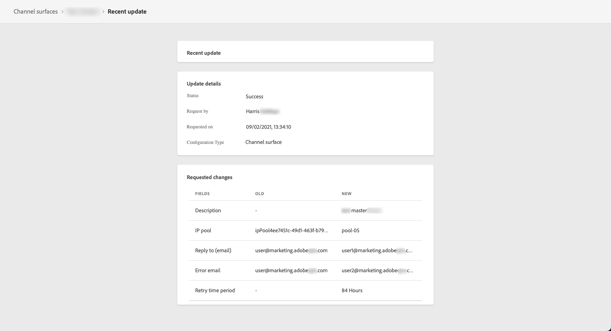

# Impostare le superfici di canale {#set-up-channel-surfaces}

>[!CONTEXTUALHELP]
>id="ajo_admin_channel_surfaces"
>title="Superficie di canale"
>abstract="Una superficie di canale è una configurazione definita da un amministratore di sistema. Contiene tutti i parametri tecnici per l’invio del messaggio, ad esempio parametri di intestazione, sottodominio, app mobili e così via."

Con [!DNL Journey Optimizer], puoi impostare le superfici di canale (ad esempio i predefiniti per messaggi) che definiscono tutti i parametri tecnici richiesti per i messaggi: tipo di e-mail, e-mail e nome del mittente, app mobili, configurazione di SMS e altro ancora.

>[!CAUTION]
>
> * Per creare, modificare ed eliminare superfici di canale, è necessario disporre del [Gestire i predefiniti per messaggi](../administration/high-low-permissions.md#administration-permissions) autorizzazione.
>
> * È necessario eseguire la [Configurazione e-mail](../email/get-started-email-config.md), [Configurazione push](../push/push-configuration.md), [Configurazione SMS](../sms/sms-configuration.md) e [Configurazione direct mail](../direct-mail/direct-mail-configuration.md) passi prima di creare superfici di canale.

Una volta configurate le superfici di canale, potrai selezionarle durante la creazione di messaggi da un percorso o da una campagna.

<!--
➡️ [Learn how to create and use email surfaces in this video](#video-presets)
-->

## Creare una superficie di canale {#create-channel-surface}

>[!CONTEXTUALHELP]
>id="ajo_admin_message_presets_header"
>title="Impostazioni della superficie del canale"
>abstract="Quando imposti una superficie del canale, seleziona il canale a cui si applica e definisci tutti i parametri tecnici necessari per l’invio, ad esempio il tipo di e-mail, il nome del mittente, le app mobili, la configurazione degli SMS e altro ancora."

>[!CONTEXTUALHELP]
>id="ajo_admin_message_presets"
>title="Impostazioni della superficie del canale"
>abstract="Per poter creare azioni quali e-mail da un percorso o da una campagna, devi innanzitutto creare una superficie del canale in cui sono definite tutte le impostazioni tecniche necessarie per i messaggi. Per creare, modificare ed eliminare le superfici del canale, devi disporre dell’autorizzazione Gestisci predefiniti messaggi."

Per creare una superficie di canale, effettuate le seguenti operazioni:

1. Accedere a **[!UICONTROL Canali]** > **[!UICONTROL Marchio]** > **[!UICONTROL Superfici di canale]** , quindi fai clic su **[!UICONTROL Crea superficie di canale]**.

   

1. Immettete un nome e una descrizione (facoltativa) per la superficie, quindi selezionate i canali da configurare.

   

   >[!NOTE]
   >
   > I nomi devono iniziare con una lettera (A-Z). Può contenere solo caratteri alfanumerici. È inoltre possibile utilizzare il carattere di sottolineatura `_`, punto`.` e trattino `-` caratteri.

1. Se hai selezionato **[!UICONTROL E-mail]** configurare le impostazioni come descritto in [questa sezione](../email/email-settings.md).

   

1. Per **[!UICONTROL Notifica push]** canale, seleziona almeno una piattaforma -  **iOS** e/o **Android** - e le applicazioni mobili da utilizzare per ogni piattaforma.

   

   >[!NOTE]
   >
   >Per ulteriori informazioni su come configurare l’ambiente per l’invio di notifiche push, consulta [questa sezione](../push/push-gs.md).

1. Per **[!UICONTROL SMS]** , definisci le impostazioni come descritto in [questa sezione](../sms/sms-configuration.md#message-preset-sms).

   

   >[!NOTE]
   >
   >Per ulteriori informazioni su come configurare l’ambiente per l’invio di messaggi SMS, consulta [questa sezione](../sms/sms-configuration.md).

1. Una volta configurati tutti i parametri, fai clic su **[!UICONTROL Invia]** per confermare. Potete anche salvare la superficie di canale come sformo e riprenderne la configurazione in un secondo momento.

   

   >[!NOTE]
   >
   >Impossibile procedere con la creazione della superficie mentre il pool IP selezionato si trova in [edizione](ip-pools.md#edit-ip-pool) (**[!UICONTROL Elaborazione]** stato) e non è mai stata associata al sottodominio selezionato. [Ulteriori informazioni](#subdomains-and-ip-pools)
   >
   >Salva la superficie come sformo e attendi che il pool IP abbia **[!UICONTROL Completato]** stato per riprendere la creazione della superficie.

1. Una volta creata la superficie di canale, questa viene visualizzata nell’elenco con **[!UICONTROL Elaborazione]** stato.

   Durante questo passaggio, verranno eseguiti diversi controlli per verificare che sia stato configurato correttamente. <!--The processing time is around **48h-72h**, and can take up to **7-10 business days**.-->

   >[!NOTE]
   > Quando crei una superficie e-mail per un sottodominio, il tempo di elaborazione varia come descritto di seguito:
   >
   > * Per **nuovi sottodomini**, il processo di creazione della prima superficie di canale può richiedere **Da 10 minuti a 10 giorni**.
   > * Per **sandbox non di produzione** o se il sottodominio selezionato è **già in uso** in un&#39;altra superficie di canale approvata, il processo richiede solo fino a **3 ore**.

   Questi controlli includono la configurazione e i test tecnici eseguiti dal team di Adobi:

   * Convalida SPF
   * Convalida DKIM
   * Convalida record MX
   * Controlla IPs inserisce nell&#39;elenco Bloccati
   * Verifica host Helo
   * Verifica del pool IP
   * Record A/PTR, verifica del sottodominio t/m/res
   * Registrazione FBL (questo controllo verrà eseguito solo la prima volta che viene creata una superficie e-mail per un determinato sottodominio)

   >[!NOTE]
   >
   >Se i controlli non hanno esito positivo, ulteriori informazioni sui possibili motivi dell’errore in [questa sezione](#monitor-channel-surfaces).

1. Quando i controlli hanno esito positivo, la superficie di canale riceve **[!UICONTROL Attivo]** stato. È pronto per essere utilizzato per inviare messaggi.

   

## Monitorare le superfici di canale {#monitor-channel-surfaces}

Tutte le superfici di canale vengono visualizzate nel **[!UICONTROL Canali]** > **[!UICONTROL Superfici di canale]** menu. Sono disponibili filtri per aiutarti a sfogliare l’elenco (canale, utente, stato).

Una volta create, le superfici di canale possono avere i seguenti stati:

* **[!UICONTROL Bozza]**: la superficie di canale è stata salvata come bozza e non è ancora stata inviata. Aprila per riprendere la configurazione.
* **[!UICONTROL Elaborazione]**: la superficie di canale è stata inviata e sta attraversando diversi passaggi di verifica.
* **[!UICONTROL Attivo]**: la superficie di canale è stata verificata e può essere selezionata per creare messaggi.
* **[!UICONTROL Non riuscito]**: uno o più controlli non sono riusciti durante la verifica della superficie di canale.
* **[!UICONTROL Disattivato]**: la superficie di canale è disattivata. Non può essere utilizzato per creare nuovi messaggi.

In caso di errore durante la creazione di una superficie di canale, di seguito vengono descritti i dettagli di ogni possibile motivo di errore.

Se si verifica uno di questi errori, contattare [Assistenza clienti Adobe](https://helpx.adobe.com/it/enterprise/admin-guide.html/enterprise/using/support-for-experience-cloud.ug.html){target="_blank"} per ottenere assistenza.

* **Convalida SPF non riuscita**: SPF (Sender Policy Framework) è un protocollo di autenticazione e-mail che consente di specificare IP autorizzati in grado di inviare e-mail da un determinato sottodominio. In caso di errore di convalida SPF, gli indirizzi IP nel record SPF non corrispondono agli indirizzi IP utilizzati per l’invio di e-mail ai provider delle cassette postali.

* **Convalida DKIM non riuscita**: DKIM (DomainKeys Identified Mail) consente al server destinatario di verificare che il messaggio ricevuto sia stato inviato dal mittente effettivo del dominio associato e che il contenuto del messaggio originale non sia stato modificato durante la ricezione. In caso di errore di convalida DKIM, i server di posta riceventi non sono in grado di verificare l&#39;autenticità del contenuto del messaggio e la sua associazione al dominio di invio.

* **Convalida del record MX non riuscita**: errore di convalida del record MX (Mail eXchange): i server di posta responsabili dell’accettazione delle e-mail in entrata per conto di un determinato sottodominio non sono configurati correttamente.

* **Configurazioni recapito messaggi non riuscite**: un errore nelle configurazioni di recapito messaggi può verificarsi per uno dei seguenti motivi:
   * Inserire nell&#39;elenco Bloccati gli IP allocati
   * Non valido `helo` nome
   * Messaggi e-mail inviati da IP diversi da quelli specificati nel pool IP della superficie corrispondente
   * Impossibile inviare e-mail alle caselle in entrata dei principali ISP

## Modificare una superficie di canale {#edit-channel-surface}

Per modificare una superficie di canale, effettuate le seguenti operazioni.

>[!NOTE]
>
>Impossibile modificare il **[!UICONTROL Impostazioni delle notifiche push]**. Se una superficie di canale è configurata solo per il canale di notifica push, non è modificabile.

1. Nell&#39;elenco, fate clic sul nome di una superficie di canale per aprirla.

   

1. Modificane le proprietà come desiderato.

   >[!NOTE]
   >
   >Se una superficie di canale ha **[!UICONTROL Attivo]** stato, il **[!UICONTROL Nome]**, **[!UICONTROL Seleziona canale]** e **[!UICONTROL Sottodominio]** I campi sono disattivati e non possono essere modificati.

1. Clic **[!UICONTROL Invia]** per confermare le modifiche.

   >[!NOTE]
   >
   >Potete anche salvare la superficie di canale come sformo e riprendere l&#39;aggiornamento in un secondo momento.

Dopo l’invio delle modifiche, la superficie di canale viene sottoposta a un ciclo di convalida simile a quello in atto quando [creazione di una superficie di canale](#create-channel-surface). Il tempo di elaborazione dell’edizione può richiedere fino a **3 ore**.

>[!NOTE]
>
>Se si modifica solo il **[!UICONTROL Descrizione]**, **[!UICONTROL Tipo di e-mail]** e/o **[!UICONTROL Parametri per nuovi tentativi e-mail]** , l&#39;aggiornamento è istantaneo.

### Dettagli aggiornamento {#update-details}

Per le superfici di canale con **[!UICONTROL Attivo]** stato, puoi controllare i dettagli dell’aggiornamento. Per eseguire questa operazione:

Fai clic su **[!UICONTROL Aggiornamento recente]** accanto al nome della superficie attiva.

<!--You can also access the update details from an active channel surface while update is in progress.-->

Il giorno **[!UICONTROL Aggiornamento recente]** , è possibile visualizzare informazioni quali lo stato di aggiornamento e l&#39;elenco delle modifiche richieste.

<!---->

### Aggiorna stati {#update-statuses}

Un aggiornamento della superficie di canale può avere i seguenti stati:

* **[!UICONTROL Elaborazione]**: l’aggiornamento della superficie di canale è stato inviato e sta attraversando diversi passaggi di verifica.
* **[!UICONTROL Completato]**: la superficie di canale aggiornata è stata verificata e può essere selezionata per creare messaggi.
* **[!UICONTROL Non riuscito]**: uno o più controlli non sono riusciti durante la verifica dell’aggiornamento della superficie di canale.

Ciascuno stato è descritto di seguito.

#### Elaborazione {#surface-processing}

Verranno eseguiti diversi controlli di consegna per verificare che la superficie sia stata aggiornata correttamente.

>[!NOTE]
>
>Se si modifica solo il **[!UICONTROL Descrizione]**, **[!UICONTROL Tipo di e-mail]** e/o **[!UICONTROL Parametri per nuovi tentativi e-mail]** , l&#39;aggiornamento è istantaneo.

Il tempo di elaborazione può richiedere fino **3 ore**. Ulteriori informazioni sui controlli eseguiti durante il ciclo di convalida in [questa sezione](#create-channel-surface).

Se modificate una superficie già attiva:

* Il suo status rimane **[!UICONTROL Attivo]** mentre il processo di convalida è in corso.

* Il **[!UICONTROL Aggiornamento recente]** viene visualizzata accanto al nome della superficie nell&#39;elenco delle superfici di canale.

* Durante il processo di convalida, i messaggi configurati utilizzando questa superficie utilizzano ancora la versione precedente della superficie.

>[!NOTE]
>
>Impossibile modificare una superficie di canale mentre è in corso l&#39;aggiornamento. Puoi comunque fare clic sul nome, ma tutti i campi sono disattivati. Le modifiche verranno applicate solo dopo il completamento dell&#39;aggiornamento.

#### Success (Operazione riuscita) {#success}

Quando il processo di convalida ha esito positivo, la nuova versione della superficie viene utilizzata automaticamente in tutti i messaggi che la utilizzano. Tuttavia, potrebbe essere necessario attendere:
* pochi minuti prima di essere utilizzato dai messaggi unitari,
* fino al batch successivo affinché la superficie sia efficace nei messaggi batch.

#### Non riuscito {#failed}

Se il processo di convalida non riesce, verrà comunque utilizzata la versione precedente della superficie.

Ulteriori informazioni sui possibili motivi di errore in [questa sezione](#monitor-channel-surfaces).

Se l&#39;aggiornamento non riesce, la superficie diventa nuovamente modificabile. Fai clic sul nome e aggiorna le impostazioni da correggere.

## Disattivare una superficie di canale {#deactivate-a-surface}

Per creare un **[!UICONTROL Attivo]** superficie di canale non disponibile per la creazione di nuovi messaggi, puoi disattivarla. Tuttavia, i messaggi dei percorsi che attualmente utilizzano questa superficie non saranno interessati e continueranno a funzionare.

>[!NOTE]
>
>Non è possibile disattivare una superficie di canale durante l&#39;elaborazione di un aggiornamento. È necessario attendere che l’aggiornamento abbia esito positivo o negativo. Ulteriori informazioni su [modifica delle superfici di canale](#edit-channel-surface) e il [aggiorna stati](#update-statuses).

1. Accedere all&#39;elenco delle superfici di canale.

1. Per la superficie attiva desiderata, fate clic sul pulsante **[!UICONTROL Altre azioni]** pulsante.

1. Seleziona **[!UICONTROL Disattiva]**.

   

>[!NOTE]
>
>Le superfici di canale disattivate non possono essere eliminate per evitare problemi nei percorsi che le utilizzano per inviare messaggi.

Non è possibile modificare direttamente una superficie di canale disattivata. Tuttavia, puoi duplicarlo e modificarne la copia per creare una nuova versione da utilizzare per creare nuovi messaggi. Puoi anche attivarlo nuovamente e attendere che l’aggiornamento sia stato modificato correttamente.

<!--
## How-to video{#video-presets}

Learn how to create channel surfaces, how to use them and how to delegate a subdomain and create an IP pool.

>[!VIDEO](https://video.tv.adobe.com/v/334343?quality=12)
-->
