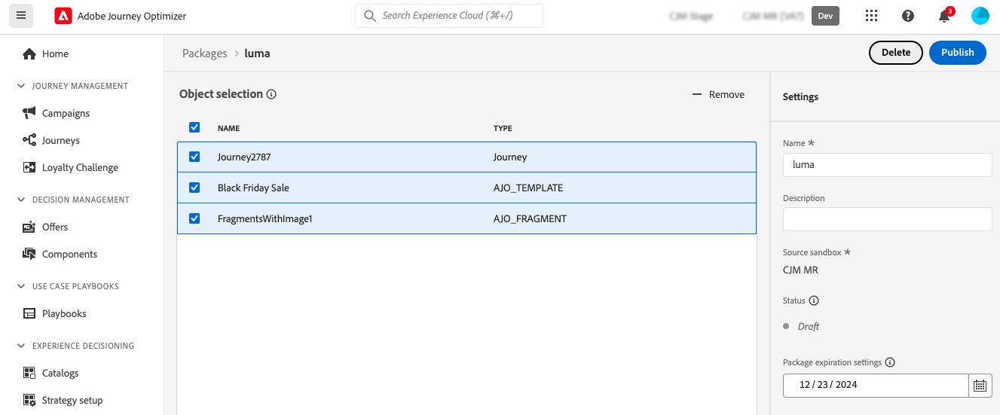

# Esportare oggetti in un’altra sandbox {#copy-to-sandbox}

Puoi copiare oggetti come percorsi, campagne, azioni personalizzate, modelli di contenuto o frammenti in più sandbox utilizzando le funzionalità di esportazione e importazione dei pacchetti. Un pacchetto può essere costituito da uno o più oggetti. Tutti gli oggetti inclusi in un pacchetto devono appartenere alla stessa sandbox.

Questa pagina descrive il caso di utilizzo degli strumenti Sandbox nel contesto di Journey Optimizer. Per ulteriori informazioni sulla funzione stessa, consulta la [Guida agli strumenti per le sandbox](https://experienceleague.adobe.com/docs/experience-platform/sandbox/ui/sandbox-tooling.html#abobe-journey-optimizer-objects){target="_blank"} di Adobe Experience Platform.

>[!NOTE]
>
>Questa funzione richiede le seguenti autorizzazioni dalla funzionalità **Amministrazione sandbox**: Gestisci sandbox (o Visualizza sandbox) e Gestisci pacchetti. [Ulteriori informazioni](../administration/ootb-permissions.md)

Il processo di copia viene eseguito tramite un’esportazione e un’importazione di pacchetti tra le sandbox di origine e di destinazione. Di seguito sono riportati i passaggi generali per copiare un percorso da una sandbox a un’altra:

1. [Aggiungi l&#39;oggetto da esportare come pacchetto nella sandbox di origine](#export)
1. [Pubblicare il pacchetto](#publish)
1. [Importare il pacchetto nella sandbox di destinazione](#import)

>[!NOTE]
>
>Per eseguire la migrazione degli oggetti di gestione delle decisioni a Decisioning, utilizza l&#39;API [Decisioning Migration](../experience-decisioning/decisioning-migration-api.md) dedicata che fornisce funzionalità automatizzate di risoluzione delle dipendenze e rollback progettate appositamente per la migrazione delle entità decisioning.

## Oggetti esportati e best practice {#objects}

Journey Optimizer consente di esportare percorsi, campagne (Azione, Attivate da API e Orchestrate), azioni personalizzate, modelli di contenuto, frammenti e altri oggetti in un’altra sandbox. Le sezioni seguenti forniscono informazioni e best practice per ogni tipo di oggetto.

### Best practice generali {#global}

* Durante la copia di un oggetto, tutte le dipendenze (come frammenti nidificati, pubblico di percorso o azioni) vengono aggiornate correttamente nell’oggetto principale, garantendo la mappatura corretta nella sandbox di destinazione.

* Se un oggetto esportato contiene la personalizzazione del profilo, accertati che nella sandbox di destinazione esista lo schema appropriato per evitare problemi di personalizzazione.

* Le pagine di destinazione non sono attualmente supportate per la migrazione tra sandbox. Quando copi un percorso in un’altra sandbox, tutti i riferimenti alle pagine di destinazione nel percorso o al contenuto dell’e-mail punteranno ancora agli ID originali della pagina di destinazione della sandbox (sorgente). Dopo la migrazione, devi aggiornare manualmente tutti i riferimenti a pagine di destinazione nel percorso e il contenuto dell’e-mail per utilizzare gli ID corretti delle pagine di destinazione dalla sandbox di destinazione (destinazione). Consulta [Creare e pubblicare pagine di destinazione](../landing-pages/create-lp.md).

+++ Percorsi

* **Dipendenze copiate** - Durante l&#39;esportazione di un percorso, oltre al percorso stesso, Journey Optimizer copia anche la maggior parte degli oggetti da cui dipende il percorso: tipi di pubblico, azioni personalizzate, schemi, eventi e azioni. Per ulteriori dettagli sugli oggetti copiati, consulta la [Guida agli strumenti Sandbox](https://experienceleague.adobe.com/docs/experience-platform/sandbox/ui/sandbox-tooling.html#abobe-journey-optimizer-objects){target="_blank"} di Adobe Experience Platform.

* **Convalida manuale consigliata** - Non è possibile garantire che tutti gli elementi collegati vengano copiati nella sandbox di destinazione. Si consiglia vivamente di eseguire un controllo approfondito, ad esempio prima di pubblicare un percorso. Questo consente di identificare eventuali oggetti mancanti.

* **Modalità bozza e univocità** - Gli oggetti copiati nella sandbox di destinazione sono univoci e non esiste alcun rischio di sovrascrittura degli elementi esistenti. Sia il percorso che i messaggi all&#39;interno del percorso vengono trasferiti in modalità bozza. Ciò ti consente di eseguire una convalida completa prima della pubblicazione sulla sandbox di destinazione.

* **Metadati** - Il processo di copia copia viene copiato solo sui metadati relativi al percorso e agli oggetti di tale Percorso. Non vengono copiati dati di profilo o set di dati come parte di questo processo.

* **Azioni personalizzate**

   * Durante l’esportazione di azioni personalizzate, la configurazione URL e i parametri di payload vengono copiati. Tuttavia, per motivi di sicurezza, i parametri di autenticazione non vengono copiati e vengono sostituiti da &quot;INSERT SECRET HERE&quot;. Anche i valori di intestazione di richiesta costante e parametro di query vengono sostituiti da &quot;INSERT SECRET HERE&quot;.

     Sono incluse le azioni personalizzate per scopi speciali ([!DNL Adobe Campaign Standard], [!DNL Campaign Classic], [!DNL Marketo Engage]).

   * Quando copi un percorso in un’altra sandbox, se selezioni &quot;usa esistente&quot; per un’azione personalizzata durante il processo di importazione, l’azione personalizzata esistente selezionata deve essere la stessa dell’azione personalizzata di origine (cioè la stessa configurazione, gli stessi parametri, ecc.). In caso contrario, la nuova copia di percorso presenterà errori che non possono essere risolti nell’area di lavoro.

* **Origini dati, gruppi di campi ed eventi** - Quando si copia un percorso che utilizza eventi, origini dati o gruppi di campi, il processo di importazione verifica automaticamente se nella sandbox di destinazione esistono già componenti con lo stesso nome e tipo. Ad esempio, un evento unitario verrà sostituito da un evento unitario nella sandbox di destinazione con lo stesso nome. Lo stesso vale per gli eventi di business, le origini dati personalizzate e i gruppi di campi basati su API e su schema utilizzati nei percorsi. Se un evento unitario della sandbox di origine ha lo stesso nome di una sandbox di destinazione di un evento business, non viene copiato né creato, e questo vale anche per tutti gli altri componenti.

+++

+++ Campagne attivate da azione e API

È possibile copiare **campagne Azione**, **campagne attivate da API** tra sandbox utilizzando le funzioni di esportazione e importazione dei pacchetti.

Questi tipi di campagne vengono copiati insieme a tutti gli elementi relativi al profilo, al pubblico, allo schema, ai messaggi in linea e agli oggetti dipendenti.

Tuttavia, i seguenti elementi non vengono copiati:

* varianti multilingue e impostazioni di lingua,
* Regole di business,
* Tag,
* Etichette DULE (Data Usage Labeling and Enforcement, etichettatura e applicazione dell’uso dei dati).

Durante la copia delle campagne **Action** o **API-triggered**, accertati che l&#39;oggetto elencato di seguito sia convalidato nella sandbox di destinazione per evitare errori di configurazione:

* **Configurazioni canale**: le configurazioni canale vengono copiate insieme alle campagne. Dopo aver copiato le campagne, le configurazioni del canale devono essere selezionate manualmente nella sandbox di destinazione.
* **Varianti e impostazioni della sperimentazione**: le varianti e le impostazioni dell&#39;esperimento sono incluse nel processo di copia della campagna. Convalida queste impostazioni nella sandbox di destinazione dopo l’importazione.
* **Unified decisioning**: i criteri di decisione e gli elementi di decisione sono supportati per l&#39;esportazione e l&#39;importazione. Assicurati che le dipendenze relative alle decisioni siano mappate correttamente nella sandbox di destinazione.

+++

+++Campagne orchestrate

Puoi copiare campagne orchestrate tra sandbox utilizzando le funzioni di esportazione e importazione dei pacchetti. Le campagne orchestrate seguono lo stesso pattern complessivo di altri oggetti, ma ciò che è incluso nel pacchetto e ciò che devi preparare nella sandbox di destinazione è diverso dalle campagne attivate da Azione o API.

Per esportare una campagna orchestrata, [aggiungerla a un pacchetto sandbox](#add-objects-as-a-package-export) nella sandbox di origine (indipendentemente dal suo stato), [pubblicare il pacchetto](#publish), quindi [importare il pacchetto](#import) nella sandbox di destinazione.

>[!IMPORTANT]
>
>Subito dopo l&#39;importazione, [duplica la campagna orchestrata](../campaigns/manage-campaigns.md#duplicate-a-campaign) nella sandbox di destinazione e utilizza tale duplicato per la configurazione, il test e l&#39;esecuzione. Se invece esegui o pubblichi la copia importata, i rapporti della campagna potrebbero non mostrare feedback e dati di tracciamento. Questa limitazione verrà rimossa in una versione futura.

Prima di importare in produzione, tieni presenti i seguenti comportamenti e limitazioni:

* **Copia bozza** - La campagna orchestrata importata viene sempre creata come bozza nella sandbox di destinazione, indipendentemente dallo stato della campagna orchestrata di origine.

* **Nuovo oggetto a ogni importazione**. L&#39;importazione di un pacchetto crea nuovamente una nuova campagna orchestrata. Non sovrascrive né aggiorna una campagna importata in precedenza.

* **La riesportazione dello stesso pacchetto non è supportata**. Se si pubblica lo stesso pacchetto una seconda volta dopo che è già stato esportato, le attività della campagna importata immetteranno uno stato di errore. In questo caso, devi eliminare le attività interessate e ricrearle manualmente. Questa limitazione verrà risolta in una versione futura.

* **Le dipendenze non vengono tutte copiate automaticamente**. L&#39;aggiunta di solo la campagna orchestrata a un pacchetto non include una catena di dipendenze completa. Le configurazioni dei canali, gli schemi dell’archivio relazionale, i set di dati e le regole business non sono inclusi a meno che non vengano esplicitamente indirizzati (per ulteriori dettagli, vedi il punto successivo).

  Durante l&#39;[importazione pacchetto](#import), Journey Optimizer elenca gli oggetti da risolvere nella sandbox di destinazione. Le seguenti regole si applicano agli oggetti più comuni:

   * **Campagna** — Seleziona sempre **Crea nuovo**.
   * **Tipi di pubblico** - Per i tipi di pubblico di Adobe Experience Platform, è possibile selezionare **Crea nuovo** o **Usa esistente**. Per i tipi di pubblico della campagna orchestrata, seleziona **Usa esistente** e mappalo sul pubblico corrispondente nella sandbox di destinazione.
   * **Criteri di unione** — Selezionare **Usa esistente** e mappare il criterio di unione appropriato oppure utilizzare quello predefinito nella sandbox di destinazione.

  Dopo l’importazione, utilizza gli avvisi nella campagna orchestrata per trovare le lacune rimanenti (ad esempio, un profilo o una risorsa di targeting che non esiste ancora nella sandbox di destinazione potrebbe lasciare un’attività con una destinazione vuota fino a quando non la correggi).

* **Cosa aggiungere o allineare separatamente** - I seguenti elementi non sono inclusi nell&#39;esportazione della campagna orchestrata:

   * **Configurazioni canale** - Non vengono esportate o importate con il pacchetto. Affinché le attività e-mail e di altro canale funzionino senza correzioni manuali, la sandbox di destinazione deve già avere una configurazione di canale il cui nome corrisponda esattamente all’origine (distinzione maiuscole/minuscole) e che utilizzi lo stesso canale. In caso contrario, verranno visualizzati avvisi sulle attività dopo l’importazione. Apri ogni attività interessata e seleziona o crea la configurazione di canale corretta.

   * **Schemi e set di dati dell&#39;archivio relazionale** - Se la campagna dipende da un determinato modello di dati, lo schema del piano e l&#39;ordine di esportazione/importazione del set di dati in modo che esistano dipendenze quando necessarie (l&#39;esportazione di un set di dati richiama in genere le esigenze dello schema correlate, l&#39;esportazione di uno schema da solo non include il relativo set di dati). I set di dati importati non vengono abilitati automaticamente per le campagne orchestrate, ma devono essere abilitati manualmente nella sandbox di destinazione dopo l’importazione.

   * **Regole di business e oggetti criteri simili**. Non sono inclusi nell&#39;esportazione della campagna orchestrata. Se la tua campagna dipende da loro, confermali nella sandbox di destinazione o ricreale.

   * **Dimensione di destinazione profilo** - La dimensione di destinazione profilo non è inclusa nell&#39;esportazione. Se non esiste nella sandbox di destinazione, le attività corrispondenti nella campagna orchestrata importata saranno vuote fino a quando non la configuri manualmente.

+++

+++ Funzione Decisioni

* Prima di copiare gli oggetti Decisioning, gli oggetti riportati di seguito devono essere presenti nella sandbox di destinazione:

   * Attributi di profilo utilizzati negli oggetti Decisioning,
   * Il gruppo di campi Attributi offerta personalizzati,
   * Gli schemi di flussi di dati utilizzati per gli attributi di contesto tra regole, classificazione o limite.

* La copia sandbox per la classificazione delle formule con modelli AI non è attualmente supportata.

* Durante la copia di una campagna, gli elementi di decisione (elementi di offerta) non vengono copiati automaticamente. Assicurati di copiarli singolarmente utilizzando l’opzione &quot;Aggiungi al pacchetto&quot;.

* Se un criterio di decisione dispone di una strategia di selezione, gli elementi di decisione devono essere aggiunti separatamente. Se dispone di elementi di decisione manuali/di fallback, vengono aggiunti automaticamente come dipendenze dirette.

* Durante la copia delle entità Decisioning, accertati di copiare gli elementi decisionali **prima** di qualsiasi altro oggetto. Ad esempio, se copi prima una raccolta e non sono presenti offerte nella nuova sandbox, la nuova raccolta rimarrà vuota.

* Quando copi entità con dipendenze (ad esempio, schema, segmenti), fai clic su &quot;Crea nuovo&quot; per deselezionarla e visualizzare l’opzione &quot;Usa esistente&quot; per gli artefatti dipendenti. Per dipendenze aggiuntive potrebbe essere necessario ripetere questo passaggio più in basso nella gerarchia.

  Esempio: durante l’importazione di una campagna, per riutilizzare uno schema di flusso di dati in una regola, fai clic su &quot;Crea nuovo&quot; per DECISIONING_STRATEGY, quindi di nuovo su DECISIONING_RULES, per visualizzare l’opzione &quot;Usa esistente&quot; per lo schema di flusso di dati.

* Per le entità dipendenti da uno schema di contesto dello stream di dati, accertati che lo stream di dati sia stato creato in precedenza e seleziona uno schema esistente per tale stream di dati.

* Se si fa clic direttamente su &quot;Fine&quot; durante l&#39;importazione, tutte le dipendenze verranno create di nuovo.

+++

+++ Modelli di contenuto

* Durante l’esportazione di un modello di contenuto, vengono copiati anche tutti i frammenti nidificati.

* Talvolta, l’esportazione di modelli di contenuto può causare la duplicazione dei frammenti. Ad esempio, se due modelli condividono lo stesso frammento e vengono copiati in pacchetti separati, entrambi i modelli dovranno riutilizzare lo stesso frammento nella sandbox di destinazione. Per evitare duplicazioni, selezionare l&#39;opzione &quot;Usa esistente&quot; durante il processo di importazione. [Scopri come importare un pacchetto](#import)

* Per evitare ulteriormente la duplicazione, si consiglia di esportare i modelli di contenuto in un singolo pacchetto. In questo modo il sistema gestisce la deduplicazione in modo efficiente.

+++

+++ Frammenti

* I frammenti possono avere più stati, ad esempio Live, Draft e Live con bozza in corso. Durante l’esportazione di un frammento, il suo ultimo stato Bozza viene copiato nella sandbox di destinazione.

* Durante l’esportazione di un frammento, vengono copiati anche tutti i frammenti nidificati.

+++

+++ Frammenti percorso

* [I frammenti di Percorso](../building-journeys/journey-fragments.md) (set riutilizzabili di nodi di percorso) sono supportati per gli strumenti Sandbox. Durante l’esportazione di un frammento di percorso, lo stato Bozza più recente viene copiato nella sandbox di destinazione.

+++

## Aggiungere oggetti come pacchetto {#export}

Per copiare gli oggetti in un’altra sandbox, devi innanzitutto aggiungerli come pacchetto nella sandbox sorgente. Segui questi passaggi:

1. Passare all&#39;inventario in cui è memorizzato il primo oggetto da copiare, ad esempio l&#39;elenco percorsi. Fai clic sull&#39;icona **Altre azioni** (i tre punti accanto al nome dell&#39;oggetto) e fai clic su **Aggiungi al pacchetto**.

   

1. Nella finestra **Aggiungi al pacchetto**, scegliere se si desidera aggiungere l&#39;oggetto a un pacchetto esistente o crearne uno nuovo:

   

   * **Pacchetto esistente**: selezionare il pacchetto dal menu a discesa.
   * **Creare un nuovo pacchetto**: digitare il nome del pacchetto. Puoi anche aggiungere una descrizione.

1. Ripetere questi passaggi per aggiungere al pacchetto tutti gli oggetti che si desidera esportare.

## Pubblica il pacchetto da esportare {#publish}

Una volta che il pacchetto è pronto per l’esportazione, segui questi passaggi per pubblicarlo:

1. Passa al menu **[!UICONTROL Amministrazione]** > **[!UICONTROL Sandbox]** e seleziona la scheda **Pacchetti**.

1. Aprire il pacchetto che si desidera esportare, selezionare gli oggetti da esportare e fare clic su **Pubblica**.

   In questo esempio, desideri esportare un percorso, un modello di contenuto e un frammento.

   

1. Per tenere traccia dello stato della pubblicazione del pacchetto dalla scheda **[!UICONTROL Processi]**. Per ulteriori dettagli su un processo, selezionarlo dall&#39;elenco e fare clic sul pulsante **[!UICONTROL Visualizza dettagli importazione]**.

   

## Importare il pacchetto nella sandbox di destinazione {#import}

Dopo la pubblicazione del pacchetto, è necessario importarlo nella sandbox di destinazione. Segui questi passaggi:

1. Passa al menu **[!UICONTROL Sandbox]** e seleziona la scheda **[!UICONTROL Sfoglia]**.

1. Cerca la sandbox in cui desideri importare il pacchetto, quindi fai clic sull’icona + accanto al nome.

   

   >[!NOTE]
   >
   >Sono disponibili solo le sandbox all’interno dell’organizzazione.

1. Nel campo **Sandbox di destinazione**, verifica che siano selezionate le sandbox di destinazione corrette e seleziona il pacchetto da importare dall&#39;elenco a discesa **[!UICONTROL Nome pacchetto]**. Fai clic su **Avanti**.

   

1. Esaminare gli oggetti pacchetto e le dipendenze. Questo è l’elenco degli oggetti che sono stati aggiunti al pacchetto, insieme ad altri oggetti da cui dipendono percorsi quali tipi di pubblico, schemi, eventi o azioni.

   Per ogni oggetto, puoi scegliere di crearne uno nuovo o utilizzarne uno esistente nella sandbox di destinazione. Ciò consente, ad esempio, di evitare la duplicazione dei frammenti che può verificarsi durante l’importazione di modelli di contenuto utilizzando frammenti comuni.

   

1. Fai clic sul pulsante **Fine** nell&#39;angolo in alto a destra per iniziare a copiare il pacchetto nella sandbox di destinazione. Il processo di copia varia in base alla complessità degli oggetti e al numero di oggetti da copiare.

1. Fare clic sul processo di importazione per esaminare il risultato della copia:

   * Fare clic sul pulsante **Visualizza oggetti importati** per visualizzare ogni singolo oggetto copiato.
   * Fare clic sul pulsante **Visualizza dettagli importazione** per verificare i risultati dell&#39;importazione per ogni oggetto.

   

1. Accedi alla sandbox di destinazione ed esegui un controllo completo di tutti gli oggetti copiati.
