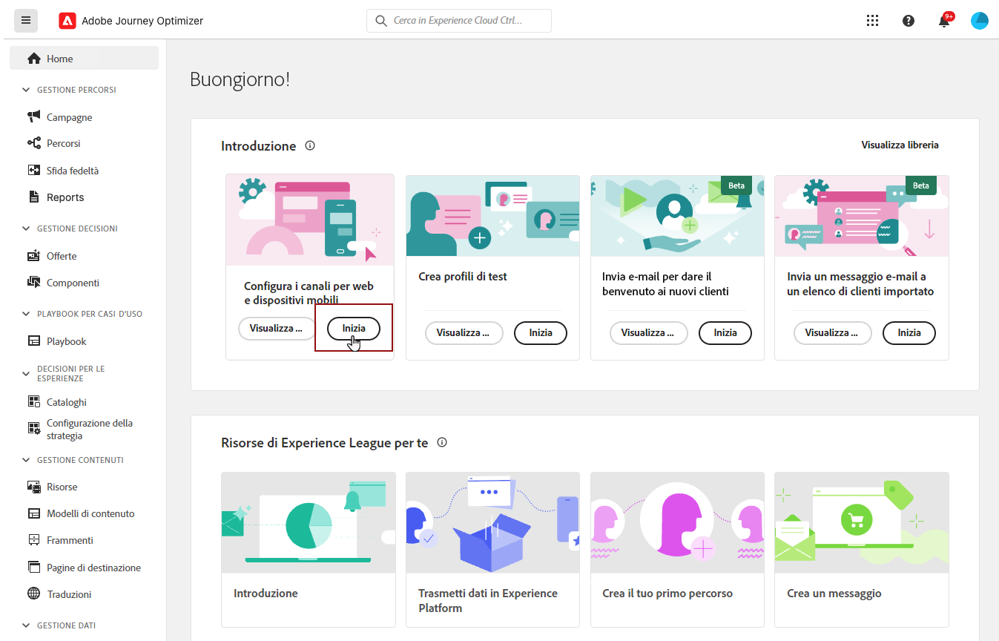
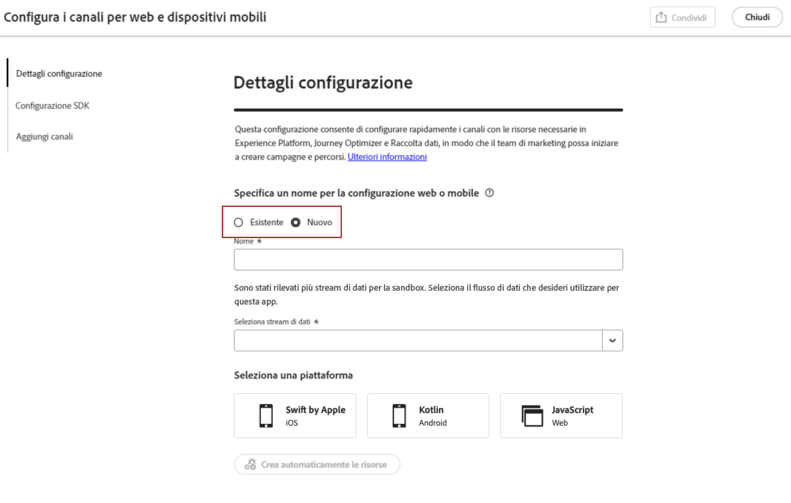
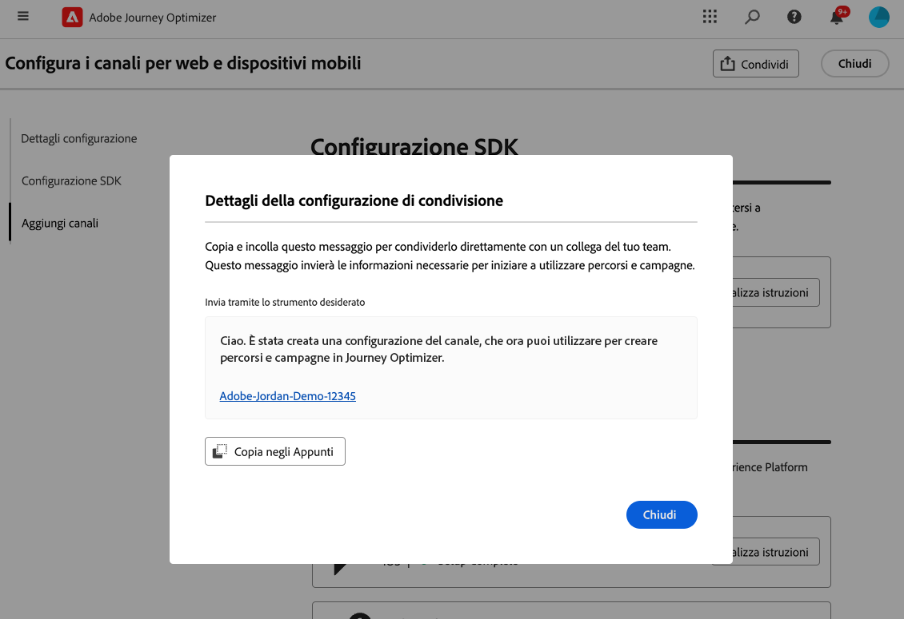
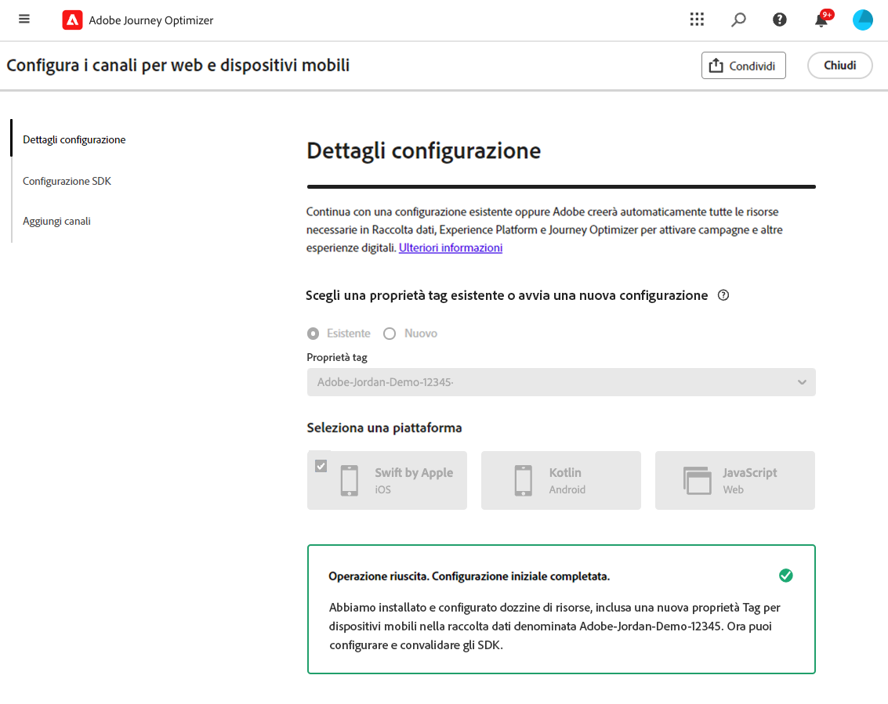
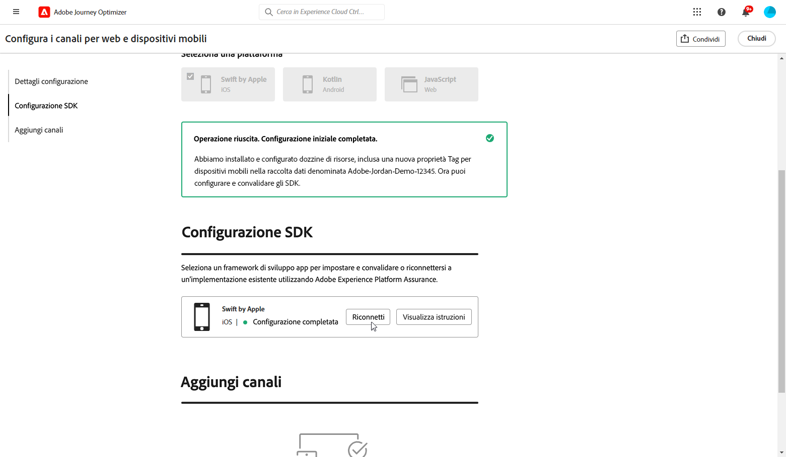

# Creare una configurazione di canale {#set-mobile-ios}

>[!CONTEXTUALHELP]
>id="ajo_mobile_web_setup_javascript_code"
>title="Codice JavaScript"
>abstract="Il tag head contiene metadati essenziali e risorse caricate prima del contenuto principale della pagina web. Il posizionamento del codice in questa sezione garantisce che sia inizializzato correttamente ed eseguito in anticipo, consentendo alla pagina web di caricarsi e di funzionare in modo efficiente. Aggiungendo codice alla sezione head, potrai migliorare la struttura, le prestazioni e l’esperienza utente complessiva del sito."

>[!CONTEXTUALHELP]
>id="ajo_mobile_web_setup_push_token"
>title="Recuperare il token del dispositivo"
>abstract="Per garantire la corretta sincronizzazione del token push del dispositivo con il profilo Adobe Experience Platform, è necessario incorporare il seguente codice nell’applicazione. Questa integrazione è essenziale per mantenere capacità di comunicazione aggiornate e garantire un&#39;esperienza utente fluida."

>[!CONTEXTUALHELP]
>id="ajo_mobile_web_setup_push_xcode"
>title="Avviare l’applicazione da Xcode"
>abstract="Per ottenere il token push, avvia innanzitutto l’applicazione utilizzando Xcode. Dopo l’avvio dell’applicazione, riavviala per assicurarti che il processo di convalida sia stato completato. Adobe fornirà quindi il token push come parte dei risultati della convalida. Questo token è essenziale per abilitare le notifiche push e verrà visualizzato una volta convalidata correttamente la configurazione."

>[!CONTEXTUALHELP]
>id="ajo_mobile_web_push_certificate_fcm"
>title="Fornire un certificato push"
>abstract="Trascina e rilascia il file della chiave privata .json. Questo file contiene le informazioni di autenticazione necessarie per l’integrazione sicura e la comunicazione tra l’applicazione e il server."

>[!CONTEXTUALHELP]
>id="ajo_mobile_web_setup_push_certificate"
>title="Fornire un certificato push"
>abstract="Il file della chiave .p8 contiene una chiave privata utilizzata per autenticare l’app con i server di Apple per notifiche push sicure. Puoi acquisire questa chiave dalla pagina Certificati, identificatori e profili dell’account sviluppatore."

>[!CONTEXTUALHELP]
>id="ajo_mobile_web_setup_push_key_id"
>title="ID chiave"
>abstract="L’ID chiave, una stringa di 10 caratteri assegnata durante la creazione della chiave di autenticazione p8, si trova nella scheda **Chiavi** della pagina Certificati, identificatori e profili dell’account sviluppatore."

>[!CONTEXTUALHELP]
>id="ajo_mobile_web_setup_push_team_id"
>title="ID team"
>abstract="L’ID team, un valore stringa utilizzato per identificare il team, si trova nella scheda **Membership** (Iscrizione) nell’account sviluppatore."

Questa configurazione semplifica la configurazione rapida dei canali di marketing, rendendo immediatamente disponibili tutte le risorse essenziali nelle app Experience Platform, Journey Optimizer e Data Collection. Questo consente al team di marketing di iniziare rapidamente a creare campagne e percorsi.

1. Nella pagina Home di Journey Optimizer, fai clic su **[!UICONTROL Inizia]** nella scheda **[!UICONTROL Configura i canali web e per dispositivi mobili]**.

   

1. Crea una **[!UICONTROL Nuova]** configurazione.

   Se disponi già di configurazioni esistenti, puoi sceglierne una o crearne una nuova.

   

1. Immetti un **[!UICONTROL Nome]** per la nuova configurazione e seleziona o crea lo **[!UICONTROL Stream di dati]**. Questo **[!UICONTROL Nome]** sarà utilizzato per ogni risorsa creata automaticamente.

1. Se la tua organizzazione dispone di più stream di dati, selezionane uno dalle opzioni esistenti. Se non disponi di uno stream di dati, ne verrà creato uno automaticamente.

1. Seleziona la piattaforma e fai clic su **[!UICONTROL Crea automaticamente le risorse]**.

1. Per semplificare il processo di configurazione, vengono create automaticamente le risorse necessarie per aiutarti a iniziare. Ciò include la creazione di una nuova **[!UICONTROL proprietà tag Mobile]** e l’installazione di estensioni.

[Informazioni sulle risorse generate automaticamente](set-mobile-config.md#auto-create-resources)

1. Al termine della generazione delle risorse, segui le istruzioni nell’interfaccia utente per configurare e convalidare gli SDK e i canali.

1. Al termine della configurazione, condividi la **[!UICONTROL Configurazione del canale]** generata automaticamente con i membri del team responsabile della creazione di percorsi e campagne.

   {zoomable="yes"}

1. Ora è possibile fare riferimento alla **[!UICONTROL Configurazione del canale]** nell’interfaccia Campagne o Percorsi, per una connessione diretta tra la configurazione e l’esecuzione di campagne e percorsi mirati per il tuo pubblico.

## Modificare una configurazione esistente per dispositivi mobili {#reconnect}

Dopo aver creato la configurazione, puoi rivederla in qualsiasi momento per aggiungere altri canali o apportare ulteriori modifiche in base alle tue esigenze

1. Nella pagina Home di Journey Optimizer, fai clic su **[!UICONTROL Inizia]** nella scheda **[!UICONTROL Configura i canali web e per dispositivi mobili]**.

   

1. Seleziona **[!UICONTROL Esistente]** e scegli la **[!UICONTROL Proprietà tag]** esistente dal menu a discesa.

   

1. Quando accedi alla configurazione esistente, devi riconnetterti ad Adobe Assurance. Nel menu di configurazione dell’SDK, fai clic su **[!UICONTROL Riconnetti]**.

   

1. Seleziona il tuo dispositivo dal menu a discesa **[!UICONTROL Dispositivi disponibili]** e fai clic su **[!UICONTROL Connetti]**.

   {zoomable="yes"}

1. Ora puoi aggiornare la configurazione in base alle tue esigenze.
