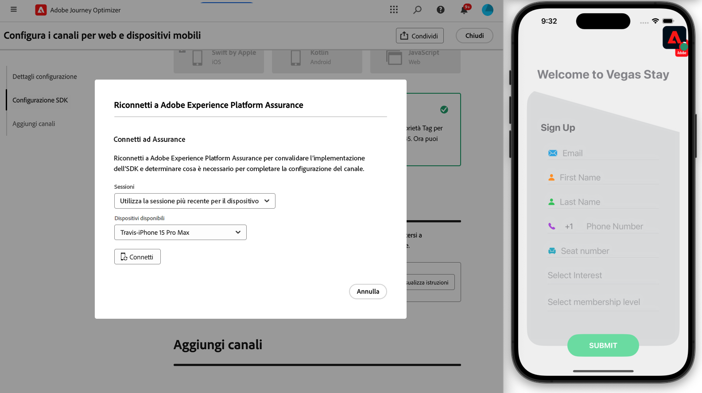

# Creare una configurazione di canale {#set-mobile-ios}

>[!CONTEXTUALHELP]
>id="ajo_mobile_web_setup_javascript_code"
>title="Codice JavaScript"
>abstract="Il tag head contiene metadati essenziali e risorse caricate prima del contenuto principale della pagina web. Il posizionamento del codice in questa sezione garantisce che sia inizializzato correttamente ed eseguito in anticipo, consentendo alla pagina web di caricarsi e funzionare in modo efficiente. Aggiungendo codice alla sezione head, potrai migliorare la struttura, le prestazioni e l’esperienza utente complessiva del sito."

>[!CONTEXTUALHELP]
>id="ajo_mobile_web_setup_push_token"
>title="Recuperare il token del dispositivo"
>abstract="Per garantire la corretta sincronizzazione del token push del dispositivo con il profilo Adobe Experience Platform, è necessario incorporare il seguente codice nell’applicazione. Questa integrazione è essenziale per mantenere capacità di comunicazione aggiornate e garantire un&#39;esperienza utente fluida."

>[!CONTEXTUALHELP]
>id="ajo_mobile_web_setup_push_xcode"
>title="Avviare l’applicazione da Xcode."
>abstract="Per ottenere il token push, avvia innanzitutto l’applicazione utilizzando Xcode. Dopo l&#39;avvio dell&#39;applicazione, riavviarla per assicurarsi che il processo di convalida sia stato completato. Adobe fornirà quindi il token push come parte dei risultati della convalida. Questo token è essenziale per abilitare le notifiche push e verrà visualizzato una volta convalidata correttamente la configurazione."

>[!CONTEXTUALHELP]
>id="ajo_mobile_web_push_certificate_fcm"
>title="Fornire un certificato push"
>abstract="Trascina e rilascia il file della chiave privata .json. Questo file contiene le informazioni di autenticazione necessarie per l&#39;integrazione sicura e la comunicazione tra l&#39;applicazione e il server."

>[!CONTEXTUALHELP]
>id="ajo_mobile_web_setup_push_certificate"
>title="Fornire un certificato push"
>abstract="Il file .p8 contiene una chiave privata utilizzata per autenticare l’app con i server di Apple per notifiche push sicure. Puoi acquisire questa chiave dalla pagina Certificati, Identificatori e Profili del tuo account sviluppatore."

>[!CONTEXTUALHELP]
>id="ajo_mobile_web_setup_push_key_id"
>title="ID chiave"
>abstract="L&#39;ID chiave, una stringa di 10 caratteri assegnata durante la creazione della chiave di autenticazione p8, si trova nella scheda **Chiavi** della pagina Certificati, identificatori e profili del tuo account sviluppatore."

>[!CONTEXTUALHELP]
>id="ajo_mobile_web_setup_push_team_id"
>title="ID team"
>abstract="L&#39;ID team, un valore stringa utilizzato per identificare il team, si trova nella scheda **Appartenenza** nell&#39;account sviluppatore."

Questa configurazione semplifica la configurazione rapida dei canali di marketing, rendendo immediatamente disponibili tutte le risorse essenziali nelle app Experience Platform, Journey Optimizer e Data Collection. Questo consente al team marketing di iniziare rapidamente a creare campagne e percorsi.

1. Dalla home page di Journey Optimizer, fai clic su **[!UICONTROL Inizia]** dalla scheda **[!UICONTROL Configura canali Web e mobili]**.

   

1. Crea una configurazione **[!UICONTROL New]**.

   Se disponi già di configurazioni esistenti, puoi sceglierne una o crearne una nuova.

   

1. Immetti un **[!UICONTROL Nome]** per la nuova configurazione e seleziona o crea il **[!UICONTROL Stream di dati]**. **[!UICONTROL Name]** verrà utilizzato per ogni risorsa creata automaticamente.

1. Se la tua organizzazione dispone di più flussi di dati, selezionane uno dalle opzioni esistenti. Se non disponi di uno stream di dati, ne verrà creato uno automaticamente.

1. Seleziona la piattaforma e fai clic su **[!UICONTROL Crea automaticamente risorse]**.

1. Per semplificare il processo di configurazione, vengono create automaticamente le risorse necessarie per iniziare. Ciò include la creazione di una nuova **[!UICONTROL proprietà tag mobile]** e l&#39;installazione di estensioni.

[Ulteriori informazioni sulle risorse generate automaticamente](set-mobile-config.md#auto-create-resources)

1. Al termine della generazione delle risorse, segui le istruzioni nell’interfaccia utente per configurare e convalidare gli SDK e i canali.

1. Al termine della configurazione, condividi la **[!UICONTROL Configurazione canale]** generata automaticamente con i membri del team responsabili della creazione di Percorsi e campagne.

   {zoomable="yes"}

1. È ora possibile fare riferimento alla **[!UICONTROL Configurazione canale]** nell&#39;interfaccia Campagne o Percorsi, consentendo una connessione perfetta tra la configurazione e l&#39;esecuzione di percorsi e campagne mirati per il pubblico.

## Modificare una configurazione esistente mobile {#reconnect}

Dopo aver creato la configurazione, è possibile rivisitarla in qualsiasi momento per aggiungere altri canali o apportare ulteriori modifiche in base alle proprie esigenze

1. Dalla home page di Journey Optimizer, fai clic su **[!UICONTROL Inizia]** dalla scheda **[!UICONTROL Configura canali Web e mobili]**.

   

1. Seleziona **[!UICONTROL Esistente]** e scegli la tua **[!UICONTROL proprietà tag]** esistente dal menu a discesa.

   

1. Quando accedi alla configurazione esistente, devi riconnetterti con Adobe Assurance. Dal menu di configurazione dell&#39;SDK, fare clic su **[!UICONTROL Riconnetti]**.

   

1. Seleziona il tuo dispositivo dal menu a discesa **[!UICONTROL Dispositivi disponibili]** e fai clic su **[!UICONTROL Connetti]**.

   {zoomable="yes"}

1. Ora puoi aggiornare la configurazione in base alle esigenze.

