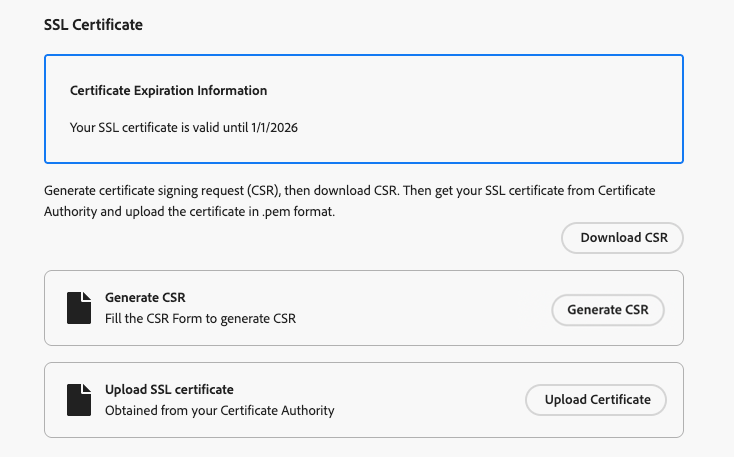

# Configurare un sottodominio personalizzato {#delegate-custom-subdomain}

>[!AVAILABILITY]
>
>Questa funzionalità è in disponibilità limitata. Per ottenere l’accesso, contatta il rappresentante Adobe.

In alternativa ai metodi [Completamente delegati](about-subdomain-delegation.md#full-subdomain-delegation) e [CNAME configurati](about-subdomain-delegation.md#cname-subdomain-delegation), il metodo **Delega personalizzata** ti consente di acquisire la proprietà dei sottodomini all&#39;interno di Journey Optimizer ans per avere il controllo completo sui certificati generati.

Come parte di questo processo, Adobe deve assicurarsi che il DNS sia configurato di conseguenza per la consegna, il rendering e il tracciamento dei messaggi. Per questo ti verrà richiesto di [caricare il certificato SSL](#upload-ssl-certificate) ottenuto dall&#39;autorità di certificazione e completare i [passaggi del ciclo di feedback](#feedback-loop-steps) verificando la proprietà del dominio e l&#39;indirizzo e-mail di reporting.

Per impostare un sottodominio personalizzato, segui la procedura riportata di seguito.

1. Accedi al menu **[!UICONTROL Amministrazione]** > **[!UICONTROL Canali]** > **[!UICONTROL Impostazioni e-mail]** > **[!UICONTROL Sottodomini]**.

1. Fare clic su **[!UICONTROL Configura sottodominio]**.

1. Dalla sezione **[!UICONTROL Configura metodo]**, selezionare **[!UICONTROL Delega personalizzata]**.

   {width=90%}

1. Specifica il nome del sottodominio da delegare.

   >[!CAUTION]
   >
   >Impossibile utilizzare lo stesso dominio di invio per inviare messaggi da [!DNL Adobe Journey Optimizer] e da un altro prodotto, ad esempio [!DNL Adobe Campaign] o [!DNL Adobe Marketo Engage].

## Creare i record DNS {#create-dns-records}

>[!CONTEXTUALHELP]
>id="ajo_admin_subdomain_custom_dns"
>title="Generare i record DNS corrispondenti"
>abstract="Per delegare un sottodominio personalizzato ad Adobe, devi copiare le informazioni del server dei nomi visualizzate nell’interfaccia di Journey Optimizer e incollarle nella soluzione di hosting del dominio per generare i record DNS corrispondenti."

1. Viene visualizzato l’elenco dei record da inserire nei server DNS. Copia questi record, uno alla volta o scaricando un file CSV.

1. Passa alla soluzione di hosting del dominio per generare i record DNS corrispondenti.

1. Assicurati che tutti i record DNS siano stati generati nella soluzione di hosting del tuo dominio.

1. Se tutto è configurato correttamente, seleziona la casella &quot;Confermo...&quot;.

   {width="75%"}

## Caricare il certificato SSL {#upload-ssl-certificate}

>[!CONTEXTUALHELP]
>id="ajo_admin_subdomain_custom-ssl"
>title="Generare la richiesta di firma del certificato"
>abstract="Durante la configurazione di un nuovo sottodominio personalizzato, è necessario generare la richiesta di firma del certificato (CSR, Certificate Signing Request), compilarla e inviarla all’autorità di certificazione per ottenere il certificato SSL necessario per il caricamento in Journey Optimizer."

>[!CONTEXTUALHELP]
>id="ajo_admin_subdomain_key_length"
>title="Selezionare una lunghezza della chiave"
>abstract="La lunghezza della chiave può essere solo 2048 o 4096 bit. Non può essere modificata dopo l’invio del sottodominio."

1. Nella sezione **[!UICONTROL Certificato SSL]**, fai clic su **[!UICONTROL Genera CSR]**.

   {width="85%"}

   >[!NOTE]
   >
   >Viene visualizzata la data di scadenza del certificato SSL. Una volta raggiunta la data, devi caricare un nuovo certificato.

1. Compila il modulo che visualizza e genera la richiesta di firma del certificato (CSR, Certificate Signing Request).

   {width="70%"}

   >[!NOTE]
   >
   >La lunghezza della chiave può essere solo 2048 o 4096 bit. Non può essere modificata dopo l’invio del sottodominio.

1. Fai clic su **[!UICONTROL Scarica CSR]** e salva il modulo nel computer locale.

1. Invialo all’autorità di certificazione (CA) per ottenere il certificato SSL. Prima di inviare questa CSR alla tua CA per la firma, ci sono alcuni punti importanti da considerare:

   * La CSR scaricata dal passaggio 3 è disponibile solo per data.subdomain.com.

   * Tuttavia, il certificato deve riguardare sia data.subdomain.com che cdn.subdomain.com come voci SAN (Subject Alternative Names) all&#39;interno di un singolo certificato. Ad esempio, se deleghi example.adobe.com, data.subdomain.com corrisponde a data.example.adobe.com e cdn.subdomain.com corrisponde a cdn.example.adobe.com.

   * I sottodomini Dati (data.example.adobe.com) e CDN (cdn.example.adobe.com) devono essere aggiunti come voci peer nello stesso certificato.

   * La maggior parte delle CA consente di aggiungere ulteriori SAN (ad esempio il sottodominio CDN) durante il processo di firma

      * Tramite il portale CA (scelta consigliata, se disponibile), oppure
      * Richiedendolo manualmente con il proprio team di supporto se l’opzione portale non è disponibile.

   * Una volta firmata, la CA rilascerà un singolo certificato che copre sia il dominio dati che il sottodominio CDN.

1. Una volta recuperato, fai clic su **[!UICONTROL Carica certificato SSL]** e carica il certificato in [!DNL Journey Optimizer] in formato .pem con la catena di certificati completa. Ecco un esempio di un formato di file .pem:

   ```
   -----BEGIN CERTIFICATE-----
   MIIDXTCCAkWgAwIBAgIJALc3... (base64 encoded data)
   -----END CERTIFICATE-----
   ```

<!--
>[!CAUTION]
>
>Both Data and CDN subdomains must be included in the same certificate.
-->

## Completare i passaggi del ciclo di feedback {#feedback-loop-steps}

>[!CONTEXTUALHELP]
>id="ajo_admin_subdomain_feedback-loop"
>title="Completare i passaggi del ciclo di feedback"
>abstract="Passa a Yahoo! Sender Hub e compila il modulo per verificare la proprietà del dominio. Inserisci l’indirizzo e-mail per la generazione di rapporti FBL elencato di seguito e utilizza l’OTP che ricevi per verificare la proprietà su Yahoo! Sender Hub."

1. Vai a [Yahoo! Sito Web dell&#39;hub del mittente &#x200B;](https://senders.yahooinc.com/) e compilare il modulo richiesto per verificare la proprietà del dominio.

1. Per verificare la proprietà del dominio, Yahoo! Sender Hub richiede di fornire un indirizzo e-mail. Immetti l&#39;indirizzo e-mail di reporting FBL elencato in **[!UICONTROL Valore]**. Questo è un indirizzo e-mail di proprietà di Adobe.

1. Quando Yahoo! L’hub mittente genera una password monouso (OTP), che verrà inviata a questo indirizzo Adobe.

1. Rivolgiti al team di recapito messaggi di Adobe che ti fornirà questo OTP. <!--Specify how to reach out + any information that customer should share in the request to deliverability team to get access to the right OTP-->

   >[!CAUTION]
   >
   >L’OTP è valido solo per 24 ore, quindi assicurati di contattare Adobe non appena viene generato l’OTP. <!--TBC?-->
   >
   >La richiesta OTP può essere effettuata solo nei giorni feriali. Non è disponibile alcun supporto durante il fine settimana. <!--Add times + timezone-->

1. Inserisci il OTP su Yahoo! Sender Hub.

1. Assicurati di aver completato tutti i passaggi del ciclo di feedback.

1. Se tutto è configurato correttamente, seleziona la casella &quot;Ho completato...&quot;.

   {width="85%"}

1. Fai clic su **[!UICONTROL Continua]** e attendi che Adobe verifichi che i record vengano generati senza errori nella soluzione di hosting. Questo processo può richiedere fino a 2 minuti.

   >[!NOTE]
   >
   >Prima di procedere, assicurati che tutti i record siano stati creati correttamente.

1. Adobe genera un record di convalida URL CDN SSL. Copia questo record di convalida nella piattaforma di hosting. Se hai creato correttamente questo record nella tua soluzione di hosting, seleziona la casella &quot;Confermo...&quot;.

1. Fai clic su **[!UICONTROL Invia]** per fare in modo che Adobe esegua i controlli richiesti. [Ulteriori informazioni](delegate-subdomain.md#submit-subdomain)

## Elenco di controllo per la risoluzione dei problemi {#check-list}

Se si verificano errori durante il tentativo di inviare il sottodominio personalizzato, esegui le azioni di risoluzione dei problemi elencate di seguito.

* Verificare che tutti i record DNS siano stati propagati correttamente utilizzando gli strumenti di ricerca DNS.

* Verifica che il certificato soddisfi tutti i requisiti tecnici prima di caricarlo.

* Assicurati che il certificato sia caricato nel formato corretto.
