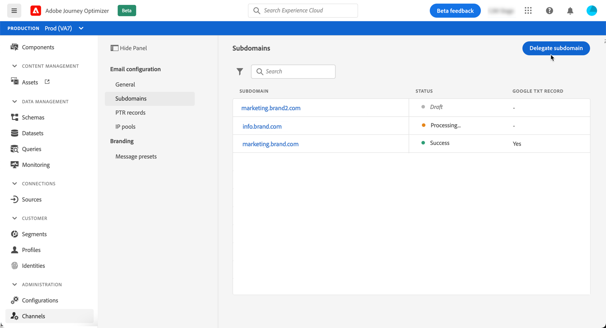

# Delegare un sottodominio

La delega del nome di dominio è un metodo che consente al proprietario di un nome di dominio (tecnicamente: una zona DNS) per delegare una sua suddivisione (tecnicamente: una zona DNS sotto di essa, che può essere chiamata sottozona) a un’altra entità. In sostanza, se un cliente gestisce la zona &quot;example.com&quot;, può delegare ad Adobe la sottozona &quot;marketing.example.com&quot; .

Delegando un sottodominio da utilizzare con [!DNL Journey Optimizer], i client possono contare su un Adobe per mantenere l’infrastruttura DNS necessaria per soddisfare i requisiti di recapito dei messaggi standard del settore per i propri domini di invio di e-mail marketing, mantenendo e controllando il DNS per i propri domini di posta elettronica interni.

[!DNL Journey Optimizer] ti consente di delegare completamente i sottodomini ad Adobe direttamente dall’interfaccia del prodotto. In questo modo, Adobe sarà in grado di inviare messaggi come servizio gestito controllando e mantenendo tutti gli aspetti del DNS necessari per la consegna, il rendering e il tracciamento delle campagne e-mail.

>[!NOTE]
>
>Per impostazione predefinita, il contratto di licenza [!DNL Journey Optimizer] ti consente di delegare fino a 10 sottodomini. Contatta il tuo contatto Adobe se desideri aumentare questa limitazione.
>
>L’utilizzo di CNAME per la delega dei sottodomini non è attualmente supportato da Journey Optimizer.

Per delegare un nuovo sottodominio, effettua le seguenti operazioni:

1. Accedi al menu **[!UICONTROL Channels]** / **[!UICONTROL Subdomains]**, quindi fai clic su **[!UICONTROL Delegate subdomain]**.

   

1. Specifica il nome del sottodominio da delegare.

   

   >[!CAUTION]
   >
   >Assicurati di aver inserito un sottodominio valido, ad esempio marketing.company.com. Delega di un sottodominio non valido ad Adobe non consentita.

1. Viene visualizzato l’elenco dei record da inserire nei server DNS. Copia questi record, uno per uno, o scaricando un file CSV, quindi accedi alla soluzione di hosting del tuo dominio per generare i record DNS corrispondenti.

   Assicurati che tutti i record DNS siano stati generati nella tua soluzione di hosting del dominio. Se tutto è configurato correttamente, seleziona la casella &quot;Confermo..&quot;, quindi fai clic su **[!UICONTROL Submit]**.

   

   >[!NOTE]
   >
   >Puoi creare i record e inviare la configurazione del sottodominio in un secondo momento utilizzando il pulsante **[!UICONTROL Save as draft]** . Potrai quindi riprendere la delega del sottodominio aprendola dall’elenco dei sottodomini.

1. Una volta inviata la delega del sottodominio, il sottodominio viene visualizzato nell’elenco con lo stato **[!UICONTROL Processing]** . Per ulteriori informazioni sugli stati dei sottodomini, consulta [questa sezione](access-subdomains.md).

   I controlli e le azioni seguenti vengono eseguiti fino a quando il sottodominio non viene verificato e possono essere utilizzati per inviare messaggi.

   Questo passaggio viene eseguito per Adobe e può richiedere fino a 3 ore.

   1. Controllare se il sottodominio è stato delegato ad Adobe DNS (record NS, record SOA, configurazione zona, record di proprietà),
   1. Configura il DNS per il dominio,
   1. Creare URL di tracciamento e mirror,
   1. Provisioning di CDN Cloud Front,
   1. Creare, convalidare e allegare il certificato SSL CDN,
   1. Crea DNS avanti,
   1. Crea record PTR.

   

1. Una volta eseguiti i controlli, il sottodominio ottiene lo stato **[!UICONTROL Success]** . È pronto per essere utilizzato per inviare messaggi.

   <!-- later on, users will be notified in Pulse -->

   

