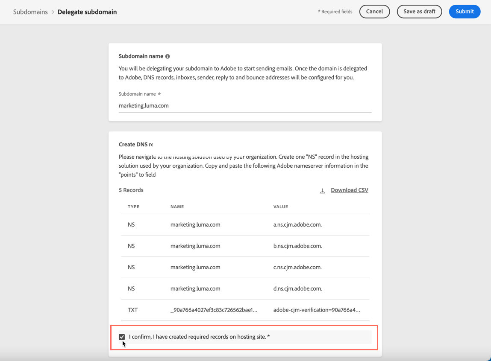

# Delegare un sottodominio {#delegate-subdomain}

>[!CONTEXTUALHELP]
>id="ajo_admin_subdomainname"
>title="Delega dei sottodomini"
>abstract="Journey Optimizer consente di delegare ad Adobe i sottodomini. Puoi delegare completamente un sottodominio ad Adobe, che è il metodo consigliato.  Puoi anche creare un sottodominio utilizzando i CNAME per puntare a record specifici di Adobe; tuttavia questo approccio richiede di mantenere e gestire i record DNS in autonomia."
>additional-url="https://experienceleague.adobe.com/it/docs/journey-optimizer/using/configuration/delegate-subdomains/about-subdomain-delegation#subdomain-delegation-methods" text="Metodi di configurazione dei sottodomini"

>[!CONTEXTUALHELP]
>id="ajo_admin_subdomainname_header"
>title="Delega dei sottodomini"
>abstract="Per iniziare a inviare e-mail, devi delegare ad Adobe il tuo sottodominio. I record DNS, le caselle in entrata, il mittente, gli indirizzi per la risposta e per il mancato recapitato verranno quindi configurati per te."

La delega del nome di dominio è un metodo che consente al proprietario di un nome di dominio (tecnicamente: una zona DNS) di delegare una sua suddivisione (tecnicamente: una zona DNS al di sotto di essa, che può essere definita sottozona) a un’altra entità. In sostanza, come cliente, se gestisci la zona &quot;example.com&quot;, puoi delegare la sottozona &quot;marketing.example.com&quot; ad Adobe.

>[!NOTE]
>
>Ulteriori informazioni sulla delega dei sottodomini e sui diversi metodi disponibili con [!DNL Journey Optimizer] in [questa sezione](about-subdomain-delegation.md).

Puoi effettuare le seguenti operazioni:

* Delega completa di un sottodominio - [Scopri come](#set-up-subdomain)
* Crea un sottodominio utilizzando i CNAME per puntare a record specifici di Adobe - [Scopri come](#set-up-subdomain)

Il metodo consigliato è la **delega completa del sottodominio**. Ulteriori informazioni sulle differenze tra i diversi metodi di configurazione dei sottodomini in [questa sezione](about-subdomain-delegation.md#subdomain-delegation-methods).

## Guardrail {#guardrails}

Durante la configurazione dei sottodomini in [!DNL Journey Optimizer], segui i guardrail e le raccomandazioni descritti di seguito.

* Per impostazione predefinita, [!DNL Journey Optimizer] ti consente di delegare **un massimo di 10 sottodomini**. Tuttavia, a seconda del contratto di licenza, puoi delegare fino a 100 sottodomini. Per ulteriori informazioni sul numero di sottodomini a cui hai diritto, rivolgiti al tuo referente Adobe.

* L&#39;invio parallelo di sottodomini non è supportato in [!DNL Journey Optimizer]. Se tenti di inviare un sottodominio per la delega quando un altro è nello stato **[!UICONTROL Elaborazione]**, viene visualizzato un messaggio di errore.

* Non è consentito delegare un sottodominio non valido ad Adobe. Assicurati di immettere un sottodominio valido di proprietà della tua organizzazione, ad esempio marketing.yourcompany.com.

* Impossibile utilizzare lo stesso dominio di invio per inviare messaggi da [!DNL Adobe Journey Optimizer] e da un altro prodotto, ad esempio [!DNL Adobe Campaign] o [!DNL Adobe Marketo Engage].

* La delega di un dominio principale e di un sottodominio non è supportata. Ad esempio, se hai delegato subdomain.domain.com, non puoi delegare email.subdomain.domain.com. Allo stesso modo, se hai delegato email.subdomain.domain.com, non puoi delegare subdomain.domain.com.

## Accedere ai sottodomini delegati {#access-delegated-subdomains}

Tutti i sottodomini delegati vengono visualizzati nel menu **[!UICONTROL Amministrazione]** > **[!UICONTROL Canali]** > **[!UICONTROL Sottodomini]**. Sono disponibili dei filtri per aiutarti a perfezionare l’elenco (data di delega, utente o stato).

<!---->

La colonna **[!UICONTROL Stato]** fornisce informazioni sul processo di delega del sottodominio:

* **[!UICONTROL Bozza]**: la delega del sottodominio è stata salvata come bozza. Fai clic sul nome del sottodominio per riprendere il processo di delega,
* **[!UICONTROL Elaborazione]**: il sottodominio è sottoposto a diversi controlli di configurazione prima di poter essere utilizzato,
* **[!UICONTROL Operazione completata]**: il sottodominio ha superato i controlli e può essere utilizzato per recapitare i messaggi.
* **[!UICONTROL Non riuscito]**: uno o più controlli non sono riusciti dopo l&#39;invio della delega del sottodominio.

Per accedere alle informazioni dettagliate su un sottodominio con lo stato **[!UICONTROL Operazione riuscita]**, aprilo dall&#39;elenco.

Puoi eseguire le seguenti operazioni:

* Recupera il nome del sottodominio (sola lettura) configurato durante il processo di delega, nonché gli URL generati (risorse, pagine mirror, URL di tracciamento).

* Aggiungi un record TXT di Google per la verifica del sito al tuo sottodominio per assicurarti che sia verificato (vedi [Aggiungere un record TXT di Google a un sottodominio](google-txt.md)).

>[!CAUTION]
>
>La configurazione del sottodominio è **comune a tutti gli ambienti**. Pertanto, qualsiasi modifica a un sottodominio influirà anche sulle sandbox di produzione.

## Configurare un sottodominio in Journey Optimizer {#set-up-subdomain}

>[!CONTEXTUALHELP]
>id="ajo_admin_subdomain_dns"
>title="Generare i record DNS corrispondenti"
>abstract="Per delegare completamente un nuovo sottodominio ad Adobe, devi copiare e incollare le informazioni del server dei nomi di Adobe visualizzate nell’interfaccia di Journey Optimizer nella soluzione di hosting del dominio per generare i record DNS corrispondenti. Per delegare un sottodominio utilizzando i CNAME, devi anche copiare e incollare il record di convalida dell’URL CDN SSL. Una volta eseguiti i controlli, il sottodominio è pronto per essere utilizzato per consegnare i messaggi."

Per impostare un nuovo sottodominio in [!DNL Journey Optimizer], eseguire la procedura seguente.
<!--
>[!NOTE]
>
>This section describes how to set up a subdomain using the full delegation. The custom delegation method is detailed in [this section](#setup-custom-subdomain).-->

1. Accedi al menu **[!UICONTROL Amministrazione]** > **[!UICONTROL Canali]** > **[!UICONTROL Impostazioni e-mail]** > **[!UICONTROL Sottodomini]**, quindi fai clic su **[!UICONTROL Configura sottodominio]**.

   <!---->

1. Dalla sezione **[!UICONTROL Configura metodo]**, selezionare:

   * Completamente delegato - [Ulteriori informazioni](about-subdomain-delegation.md#full-subdomain-delegation)
   * Configurazione CNAME - [Ulteriori informazioni](about-subdomain-delegation.md#cname-subdomain-setup)

     Scopri come impostare i sottodomini con CNAME in questa [sezione dedicata](#cname-subdomain-setup)

   * Delega personalizzata - [Ulteriori informazioni](about-subdomain-delegation.md#custom-subdomain-delegation)

     Scopri come impostare i sottodomini personalizzati in questa [sezione dedicata](delegate-custom-subdomain.md)

   <!---->

1. Specifica il nome del sottodominio da delegare.

   

<!-- >[!CAUTION]
    >
    >Delegating an invalid subdomain to Adobe is not allowed. Make sure you enter a valid subdomain which is owned by your organization, such as marketing.yourcompany.com.
    >
    >You cannot use the same sending domain to send out messages from [!DNL Adobe Journey Optimizer] and from another product, such as [!DNL Adobe Campaign] or [!DNL Adobe Marketo Engage].

    Capital letters are not allowed in subdomains. TBC by PM
-->

1. Configura **[!UICONTROL record DMARC]** nella sezione dedicata. Se il sottodominio ha un [record DMARC](dmarc-record.md) esistente e viene recuperato da [!DNL Journey Optimizer], puoi utilizzare gli stessi valori o modificarli in base alle esigenze. Se non aggiungi alcun valore, verranno utilizzati i valori predefiniti. [Scopri come gestire il record DMARC](dmarc-record.md#set-up-dmarc)

   

1. Nella sezione **[!UICONTROL Record DNS]** viene visualizzato l&#39;elenco dei record da inserire nei server DNS. Copia questi record, uno per uno, o scaricando un file CSV, quindi accedi alla soluzione di hosting del tuo dominio per generare i record DNS corrispondenti.

1. Assicurati che tutti i record DNS siano stati generati nella soluzione di hosting del tuo dominio. Se tutto è configurato correttamente, seleziona la casella &quot;Confermo...&quot;.

   

1. Se stai configurando un sottodominio con **CNAME**, passa a [questa sezione](#cname-subdomain-setup).

1. Fai clic su **[!UICONTROL Invia]** per fare in modo che Adobe esegua i controlli richiesti. [Ulteriori informazioni](#submit-subdomain)

## Configurare un sottodominio con CNAME {#cname-subdomain-setup}

>[!CONTEXTUALHELP]
>id="ajo_admin_subdomain_dns_cname"
>title="Generare i record DNS e di convalida corrispondenti"
>abstract="Per delegare un sottodominio utilizzando i CNAME, devi copiare e incollare le informazioni del server dei nomi di Adobe e il record di convalida dell’URL CDN SSL visualizzato nell’interfaccia di Journey Optimizer nella piattaforma di hosting. Una volta eseguiti i controlli, il sottodominio è pronto per essere utilizzato per consegnare i messaggi."

>[!CONTEXTUALHELP]
>id="ajo_admin_subdomain_cdn_cname"
>title="Copiare il record di convalida"
>abstract="Adobe genera un record di convalida. Devi creare il record corrispondente sulla piattaforma di hosting per la convalida degli URL CDN."

Quando imposti un sottodominio, puoi utilizzare i CNAME per puntare a record specifici di Adobe. Utilizzando questa configurazione, tu e Adobe condividete la responsabilità di mantenere il DNS.

>[!CAUTION]
>
>Il metodo CNAME è consigliato se i criteri dell’organizzazione limitano il metodo di delega del sottodominio completo. Questo approccio richiede di gestire e mantenere i record DNS autonomamente.
>
>Adobe non sarà in grado di fornire assistenza per la modifica, la manutenzione o la gestione del DNS per un sottodominio configurato tramite il metodo CNAME.

Per impostare un sottodominio utilizzando i CNAME, segui i passaggi indicati di seguito.

1. Eseguire tutti i passaggi descritti in [questa sezione](#set-up-subdomain).

1. Prima di inviare la configurazione del sottodominio, devi completare un altro passaggio: fai clic su **[!UICONTROL Continua]**. Attendi che Adobe verifichi che i record vengano generati senza errori nella soluzione di hosting. Questo processo può richiedere fino a 2 minuti.

   >[!NOTE]
   >
   >Prima di procedere, assicurati che tutti i record siano stati creati correttamente.

1. Adobe genera un record di convalida URL CDN SSL. Copia questo record di convalida nella piattaforma di hosting. Se hai creato correttamente questo record nella tua soluzione di hosting, seleziona la casella &quot;Confermo...&quot;.

1. Fai clic su **[!UICONTROL Invia]** per fare in modo che Adobe esegua i controlli richiesti. [Ulteriori informazioni](#submit-subdomain)

➡️ [Scopri come creare un sottodominio utilizzando CNAME per puntare a record specifici di Adobe in questo video](#video)

## Invia la configurazione del sottodominio {#submit-subdomain}

Per completare la delega del sottodominio, segui i passaggi indicati di seguito.

1. Fai clic su **[!UICONTROL Invia]**.
<!--
    >[!NOTE]
    >
    >If an error occurs while trying to submit a custom subdomain, refer to [this section](delegate-custom-subdomain.md#check-list).-->

1. Puoi creare i record e inviare la configurazione del sottodominio in seguito utilizzando il pulsante **[!UICONTROL Salva come bozza]**.

   >[!NOTE]
   >
   >Potrai quindi riprendere la delega del sottodominio aprendola dall’elenco dei sottodomini.

1. Il sottodominio viene visualizzato nell&#39;elenco con lo stato **[!UICONTROL Elaborazione]**. Per ulteriori informazioni sugli stati dei sottodomini, consulta [questa sezione](#access-delegated-subdomains).

   <!---->

1. Prima di poter utilizzare tale sottodominio per inviare messaggi, devi attendere che Adobe esegua i controlli richiesti, che possono richiedere fino a 3 ore. [Ulteriori informazioni](#subdomain-validation).

   >[!NOTE]
   >
   >Prima di procedere, assicurati che tutti i record siano stati creati correttamente.

### Convalida del sottodominio {#subdomain-validation}

I controlli e le azioni di seguito vengono eseguiti fino alla verifica del sottodominio e possono essere utilizzati per inviare messaggi.

Questi passaggi vengono eseguiti da Adobe e possono richiedere **fino a 3 ore**.

1. **Pre-convalida**: Adobe controlla se il sottodominio è stato delegato ad Adobe DNS (record NS, record SOA, configurazione zona, record di proprietà). Se il passaggio di pre-convalida non riesce, viene restituito un errore insieme al motivo corrispondente, altrimenti Adobe procede al passaggio successivo.

1. **Configura DNS per il dominio**:

   * **Record MX**: record Mail eXchange - Record del server di posta che elabora le e-mail in entrata inviate al sottodominio.
   * **Record SPF**: record Framework criteri mittente - Elenca gli IP dei server di posta che possono inviare e-mail dal sottodominio.
   * **Record DKIM**: record standard DomainKeys Identified Mail - Utilizza la crittografia a chiave pubblica-privata per autenticare il messaggio ed evitare spoofing.
   * **A**: mapping IP predefinito.
   * **CNAME**: un record Canonical Name o CNAME è un tipo di record DNS che associa un nome alias a un nome di dominio vero o canonico.

1. **Crea URL di tracciamento e mirror**: se il dominio è email.example.com, il dominio di tracciamento/mirroring sarà data.email.example.com. Viene protetto installando il certificato SSL.

1. **Provisioning CDN CloudFront**: se CDN non è già configurato, Adobe esegue il provisioning per l&#39;ID della tua organizzazione.

1. **Crea dominio CDN**: se il dominio è email.example.com, il dominio CDN sarà cdn.email.example.com.

1. **Crea e allega certificato SSL CDN**: Adobe crea il certificato CDN per il dominio CDN e lo allega al dominio CDN.

1. **Crea DNS di inoltro**: se si tratta del primo sottodominio che si sta delegando, Adobe creerà il DNS di inoltro necessario per creare i record PTR, ovvero uno per ogni IP.

1. **Crea record PTR**: il record PTR, noto anche come record DNS inverso, è richiesto dagli ISP in modo che non contrassegni le e-mail come spam. Gmail consiglia inoltre di disporre di record PTR per ogni IP. Adobe crea record PTR solo quando deleghi un sottodominio per la prima volta, uno per ogni IP, tutti gli IP che puntano a quel sottodominio. Ad esempio, se l&#39;IP è *192.1.2.1* e il sottodominio è *email.example.com*, il record PTR sarà: *192.1.2.1PTR r1.email.example.com*. Puoi aggiornare il record PTR in seguito per puntare al nuovo dominio delegato. [Ulteriori informazioni sui record PTR](ptr-records.md)

Una volta completati i controlli, il sottodominio ottiene lo stato **[!UICONTROL Completato]**. È pronto per essere utilizzato per inviare messaggi.

Se non riesci a creare il record di convalida nella soluzione di hosting, il sottodominio verrà contrassegnato come **[!UICONTROL Non riuscito]**.

Al momento della convalida del record, Adobe crea automaticamente il record PTR per il sottodominio. [Ulteriori informazioni](ptr-records.md)

## Annullare la delega di un sottodominio {#undelegate-subdomain}

Se desideri annullare la delega di un sottodominio, contatta il rappresentante Adobe.

Tuttavia, prima di contattare Adobe, devi eseguire diversi passaggi nell’interfaccia utente.

>[!NOTE]
>
>È possibile annullare la delega solo dei sottodomini con lo stato **[!UICONTROL Operazione riuscita]**. I sottodomini con stato **[!UICONTROL Bozza]** e **[!UICONTROL Non riuscito]** possono essere semplicemente eliminati dall&#39;interfaccia utente.

Eseguire innanzitutto i passaggi seguenti in [!DNL Journey Optimizer]:

1. Disattiva tutte le configurazioni di canale associate al sottodominio. [Scopri come](../configuration/channel-surfaces.md#deactivate-a-surface)

1. Annulla la delega dei sottodomini della pagina di destinazione, dei sottodomini SMS e dei sottodomini web associati a questo sottodominio.

   Devi inoltrare una richiesta dedicata per ogni [pagina di destinazione](../landing-pages/lp-subdomains.md#undelegate-subdomain), [SMS](../sms/sms-subdomains.md#undelegate-subdomain) o [sottodominio Web](../web/web-delegated-subdomains.md#undelegate-subdomain).

1. Arresta le campagne attive associate ai sottodomini. [Scopri come](../campaigns/manage-campaigns.md#stop)

1. Arresta i percorsi attivi associati ai sottodomini. [Scopri come](../building-journeys/end-journey.md#stop-journey)

1. Puntare i [record PTR](ptr-records.md#edit-ptr-record) collegati al sottodominio a un altro sottodominio.

   Se questo è l’unico sottodominio delegato, puoi saltare questo passaggio.

Al termine, rivolgiti al tuo rappresentante Adobe con il sottodominio da annullare la delega.

Dopo che la richiesta è gestita da Adobe, il dominio non delegato non viene più visualizzato nella pagina di inventario del sottodominio.

>[!CAUTION]
>
>Dopo l’annullamento della delega di un sottodominio, si applica quanto segue:
>
>* Non è possibile riattivare le configurazioni del canale che utilizzavano quel sottodominio.
>* Non puoi delegare nuovamente lo stesso sottodominio tramite l’interfaccia utente. Se lo desideri, contatta il tuo rappresentante Adobe.

## Video dimostrativo{#video}

Scopri come creare un sottodominio utilizzando CNAME per puntare a record specifici di Adobe.

>[!VIDEO](https://video.tv.adobe.com/v/342233?captions=ita&quality=12)
