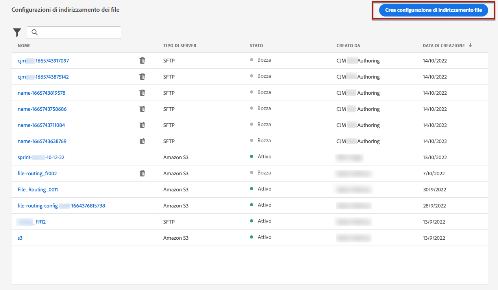
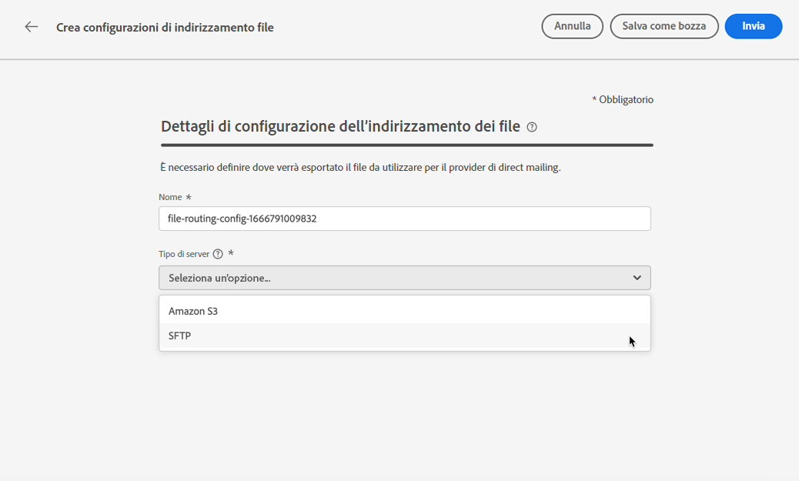
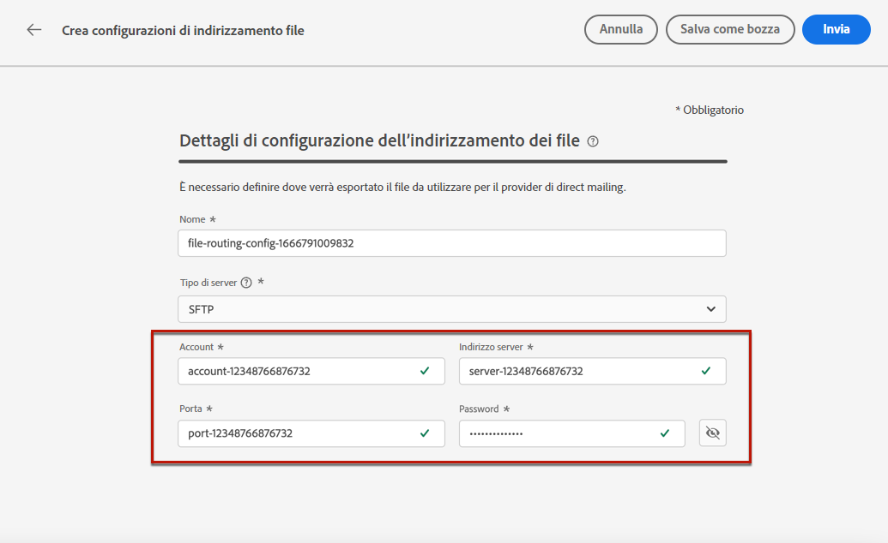
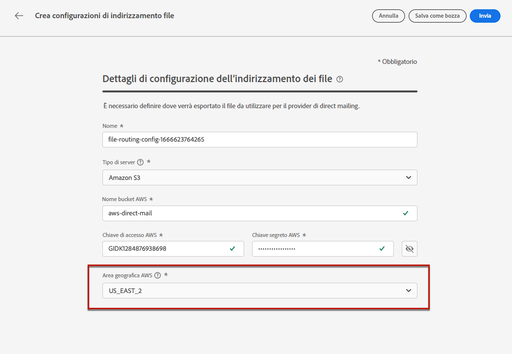
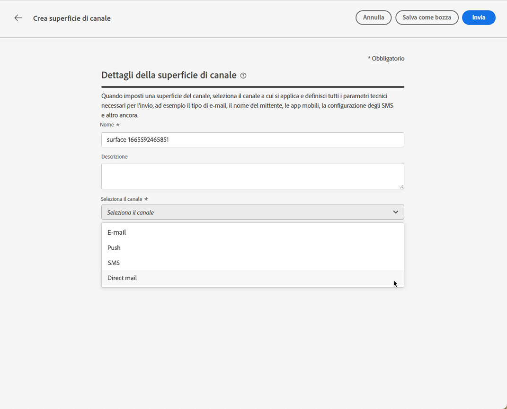
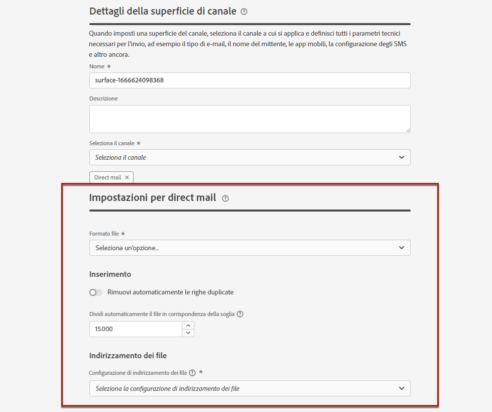
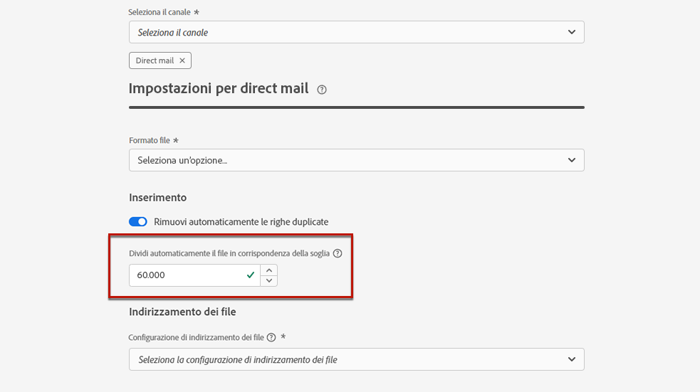
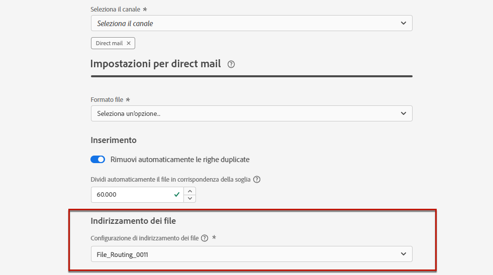

# Configurazione direct mailing {#direct-mail-configuration}

[!DNL Journey Optimizer] ti consente di personalizzare e generare i file richiesti dai provider di direct mailing per inviare messaggi ai clienti.

Quando [creazione di un messaggio di direct mailing](../messages/create-direct-mail.md), definisci i dati del pubblico di destinazione, comprese le informazioni di contatto scelte (ad esempio, l’indirizzo postale). Un file contenente questi dati verrà quindi generato ed esportato automaticamente in un server, dove il provider di direct mailing sarà in grado di recuperarlo e prendersi cura dell’invio effettivo.

Prima di poter generare questo file, devi creare:

1. A [configurazione del routing dei file](#file-routing-configuration) per specificare il server in cui verrà esportato il file.

1. A [superficie della direct mailing](#direct-mail-surface) che fa riferimento alla configurazione del routing dei file.

>[!CAUTION]
>
>Se non hai configurato alcuna opzione di routing dei file, non potrai creare una superficie di direct mailing.

## Configurare il routing dei file {#file-routing-configuration}

>[!CONTEXTUALHELP]
>id="ajo_dm_file_routing_details"
>title="Definire la configurazione del routing dei file"
>abstract="Dopo aver creato un messaggio di direct mailing, il file contenente i dati del pubblico di destinazione verrà generato ed esportato in un server. È necessario specificare i dettagli del server in modo che il provider di direct mailing possa accedere e utilizzare tale file per la consegna della direct mailing."
>additional-url="https://experienceleague.adobe.com/docs/journey-optimizer/using/messages/create-direct-mail.html" text="Creare un messaggio di direct mailing"

>[!CONTEXTUALHELP]
>id="ajo_dm_file_routing_details_header"
>title="Definire la configurazione del routing dei file"
>abstract="È necessario definire dove verrà esportato il file da utilizzare per il provider di direct mailing."

>[!CONTEXTUALHELP]
>id="ajo_dm_select_file_routing"
>title="Configurazione dell’indirizzamento dei file"
>abstract="Seleziona la configurazione di routing dei file desiderata, che definisce dove verrà esportato il file per il provider di direct mailing da utilizzare."

>[!CONTEXTUALHELP]
>id="ajo_dm_file_routing_type"
>title="Selezionare il tipo di server per il file"
>abstract="Scegliere il tipo di server che si desidera utilizzare per esportare i file di direct mailing. Attualmente solo Amazon S3 e SFTP sono supportati da Journey Optimizer."

>[!CONTEXTUALHELP]
>id="ajo_dm_file_routing_aws_region"
>title="Scegli l’area geografica di AWS"
>abstract="Seleziona l’area geografica del server AWS in cui desideri esportare i file di direct mailing. Come procedura generale, è preferibile scegliere l’area più vicina alla posizione del provider di direct mailing."

Per inviare un messaggio di direct mailing, [!DNL Journey Optimizer] genera ed esporta il file contenente i dati del pubblico di destinazione in un server.

È necessario specificare i dettagli del server in modo che il provider di direct mailing possa accedere e utilizzare tale file per la consegna della posta.

Per configurare il routing dei file, segui i passaggi seguenti.

1. Accedere al **[!UICONTROL Amministrazione]** > **[!UICONTROL Canali]** > **[!UICONTROL Configurazione dell’indirizzamento dei file]** > **[!UICONTROL Indirizzamento file]** menu, quindi fai clic su **[!UICONTROL Creare la configurazione di indirizzamento]**.

   

1. Imposta un nome per la configurazione.

1. Seleziona la **[!UICONTROL Tipo di server]** che si desidera utilizzare per esportare i file di direct mailing.

   

   >[!NOTE]
   >
   >Attualmente sono supportati solo Amazon S3 e SFTP in [!DNL Journey Optimizer].

1. Inserisci i dettagli e le credenziali del server, ad esempio l’indirizzo del server, la chiave di accesso, ecc.

   

1. Se hai selezionato **[!UICONTROL Amazon S3]**, scegli **[!UICONTROL Area geografica AWS]** dove sarà situata l&#39;infrastruttura del server.

   

   >[!NOTE]
   >
   >Le aree geografiche di AWS sono aree geografiche utilizzate da AWS per ospitare le proprie infrastrutture cloud. Come procedura generale, è preferibile scegliere la regione più vicina alla posizione del provider di direct mailing.

1. Seleziona **[!UICONTROL Invia]**. La configurazione di routing dei file viene creata con **[!UICONTROL Attivo]** stato. È ora pronto per essere utilizzato in un [superficie della direct mailing](#direct-mail-surface).

   >[!NOTE]
   >
   >Puoi anche selezionare **[!UICONTROL Salva come bozza]** per creare la configurazione di routing dei file, ma non sarà possibile selezionarla in una superficie finché non sarà **[!UICONTROL Attivo]**.

## Creare una superficie direct mailing {#direct-mail-surface}

>[!CONTEXTUALHELP]
>id="ajo_dm_surface_settings"
>title="Definire le impostazioni della direct mailing"
>abstract="Una superficie direct mailing contiene le impostazioni per la formattazione del file che contiene i dati di pubblico con targeting e viene utilizzata dal provider di posta. È inoltre necessario definire la posizione in cui il file verrà esportato selezionando la configurazione di routing del file."
>additional-url="https://experienceleague.adobe.com/docs/journey-optimizer/using/configuration/configuration-message/direct-mail-configuration.html#file-routing-configuration" text="Configurare il routing dei file"

<!--
>[!CONTEXTUALHELP]
>id="ajo_dm_surface_sort"
>title="Define the sort order"
>abstract="If you select this option, the sort will be by profile ID, ascending or descending. If you unselect it, the sorting configuration defined when creating the direct mail message within a journey or a campaign."-->

>[!CONTEXTUALHELP]
>id="ajo_dm_surface_split"
>title="Definire la soglia di suddivisione del file"
>abstract="Devi impostare il numero massimo di record per ogni file contenente i dati sul pubblico. È possibile selezionare un numero qualsiasi compreso tra 1 e 200.000 record. Una volta raggiunta la soglia specificata, verrà creato un altro file per i record rimanenti."

Per poter consegnare direct mailing con [!DNL Journey Optimizer], è necessario creare una superficie del canale per definire le impostazioni per la formattazione del file che verrà utilizzato dal provider di posta.

Una superficie direct mailing deve includere anche la configurazione di indirizzamento dei file che definisce il server in cui verrà esportato il file di direct mailing.

1. Create una superficie del canale. [Ulteriori informazioni](channel-surfaces.md)

1. Seleziona la **[!UICONTROL Direct mail]** canale.

   

1. Definisci le impostazioni di direct mailing nella sezione dedicata della configurazione della superficie del canale.

   

1. Selezionare il formato del file: **[!UICONTROL CSV]** o **[!UICONTROL Testo delimitato]**.

1. In **[!UICONTROL Inserimento]** è possibile scegliere di rimuovere automaticamente le righe duplicate.

1. Definisci il numero massimo di record (righe) per ciascun file contenente i dati del profilo. Una volta raggiunta la soglia specificata, verrà creato un altro file per i record rimanenti.

   

   Ad esempio, se nel file sono presenti 100.000 record e il limite di soglia è impostato su 60.000, i record verranno suddivisi in due file. Il primo file conterrà 60.000 righe e il secondo file conterrà le restanti 40.000 righe.

   >[!NOTE]
   >
   >È possibile impostare un numero qualsiasi compreso tra 1 e 200.000 record, il che significa che ogni file deve contenere almeno 1 riga e non più di 200.000 righe.

1. Infine, seleziona la **[!UICONTROL Configurazione dell’indirizzamento dei file]** tra quelli creati. Questo definisce dove verrà esportato il file da utilizzare per il provider di direct mailing.

   >[!CAUTION]
   >
   >Se non hai configurato alcuna opzione di routing dei file, non potrai creare una superficie di direct mailing. [Ulteriori informazioni](#file-routing-configuration)

   

1. Invia l&#39;area direct mailing.

Ora puoi [creare un messaggio di direct mailing](../messages/create-direct-mail.md) all’interno di una campagna. Una volta avviata la campagna, il file contenente i dati del pubblico di destinazione viene automaticamente esportato sul server definito. Il provider di direct mailing sarà quindi in grado di recuperare tale file e procedere con la consegna direct mailing.