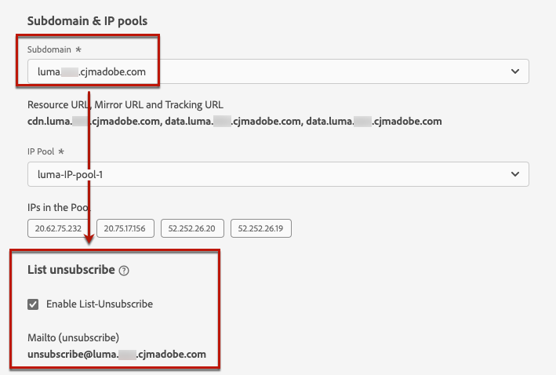

# Configurare le impostazioni e-mail {#email-settings}

Definisci le impostazioni e-mail nella sezione dedicata della configurazione della superficie del canale (ad esempio, messaggio preimpostato). Scopri come creare superfici in [questa sezione](channel-surfaces.md).

## Tipo di e-mail {#email-type}

>[!CONTEXTUALHELP]
>id="ajo_admin_presets_emailtype"
>title="Definire la categoria e-mail"
>abstract="Seleziona il tipo di e-mail da inviare quando utilizzi questa superficie: Marketing per e-mail promozionali, che richiedono il consenso dell’utente, o transazionali per e-mail non commerciali, che possono anche essere inviate a profili non abbonati in contesti specifici."

In **TIPO E-MAIL** selezionate il tipo di messaggio da inviare con la superficie: **Marketing** o **Transazionale**.

* Scegli **Marketing** per e-mail promozionale: questi messaggi richiedono il consenso dell’utente.

* Scegli **Transazionale** per le e-mail non commerciali, ad esempio la conferma dell’ordine, le notifiche di reimpostazione della password o le informazioni di consegna.

>[!CAUTION]
>
>**Transazionale** Le e-mail possono essere inviate ai profili che hanno annullato l’abbonamento alle comunicazioni di marketing. Questi messaggi possono essere inviati solo in contesti specifici.

Quando [creazione di un messaggio](../messages/get-started-content.md), devi scegliere una superficie del canale valida corrispondente alla categoria selezionata per l’e-mail.

## Sottodominio e pool IP {#subdomains-and-ip-pools}

In **Sottodominio e pool IP** sezione , devi:

1. Seleziona il sottodominio da utilizzare per inviare le e-mail. [Ulteriori informazioni](about-subdomain-delegation.md)

1. Selezionare il pool IP da associare alla superficie. [Ulteriori informazioni](ip-pools.md)

Impossibile procedere con la creazione della superficie mentre il pool IP selezionato è in uso [edizione](ip-pools.md#edit-ip-pool) (**[!UICONTROL Elaborazione]** e non è mai stato associato al sottodominio selezionato. In caso contrario, verrà comunque utilizzata la versione più vecchia dell’associazione pool/sottodominio IP. In questo caso, salva la superficie come bozza e riprova una volta che il pool IP dispone del **[!UICONTROL Completato]** stato.

>[!NOTE]
>
>Per gli ambienti non di produzione, Adobe non crea sottodomini di test preconfigurati né concede l’accesso a un pool IP di invio condiviso. Devi [delegare i tuoi sottodomini](delegate-subdomain.md) e utilizza gli IP del pool assegnato alla tua organizzazione.

## Annulla sottoscrizione elenco {#list-unsubscribe}

Su [selezione di un sottodominio](#subdomains-and-ip-pools) dall&#39;elenco, **[!UICONTROL Abilita sottoscrizione a elenco]** viene visualizzata l&#39;opzione .

Questa opzione è attivata per impostazione predefinita.

Se lo lasci abilitato, nell’intestazione dell’e-mail verrà automaticamente incluso un collegamento per l’annullamento dell’abbonamento, ad esempio:

Se disattivi questa opzione, nell’intestazione dell’e-mail non verrà visualizzato alcun collegamento di annullamento all’abbonamento.

Il collegamento per l’annullamento dell’abbonamento è costituito da due elementi:

* Un **cancella indirizzo e-mail**, a cui vengono inviate tutte le richieste di annullamento dell’abbonamento.

   In [!DNL Journey Optimizer], l’indirizzo e-mail per l’annullamento dell’abbonamento è quello predefinito **[!UICONTROL Mailto (annulla sottoscrizione)]** indirizzo visualizzato nella superficie del canale, in base alla [sottodominio selezionato](#subdomains-and-ip-pools).

   

* La **annulla sottoscrizione URL**, URL della pagina di destinazione in cui l’utente verrà reindirizzato una volta annullato l’abbonamento.

   Se aggiungi una [collegamento di rinuncia con un clic](../messages/consent.md#one-click-opt-out) per un messaggio creato con questa superficie, l’URL di annullamento della sottoscrizione sarà l’URL definito per il collegamento di rinuncia con un solo clic.

   

   >[!NOTE]
   >
   >Se non aggiungi un collegamento di rinuncia con un solo clic al contenuto del messaggio, all’utente non verrà visualizzata alcuna pagina di destinazione.

Ulteriori informazioni sull’aggiunta di un collegamento di annullamento dell’abbonamento dell’intestazione ai messaggi in [questa sezione](../messages/consent.md#unsubscribe-header).

<!--Select the **[!UICONTROL Custom List-Unsubscribe]** option to enter your own Unsubscribe URL and/or your own Unsubscribe email address.(to add later)-->

## Parametri di intestazione{#email-header}

In **[!UICONTROL Parametri di intestazione]** , inserisci i nomi del mittente e gli indirizzi e-mail associati al tipo di e-mail inviate utilizzando tale superficie.

>[!CAUTION]
>
>Gli indirizzi e-mail devono utilizzare il [sottodominio delegato](about-subdomain-delegation.md).

* **[!UICONTROL Nome mittente]**: Nome del mittente, ad esempio il nome del brand.

* **[!UICONTROL Invia e-mail]**: L&#39;indirizzo e-mail che desideri utilizzare per le tue comunicazioni. Ad esempio, se il sottodominio delegato è *marketing.luma.com*, puoi utilizzare *contact@marketing.luma.com*.

* **[!UICONTROL Risposta a (nome)]**: Nome che verrà utilizzato quando il destinatario fa clic sul pulsante **Rispondi** nel loro software client e-mail.

* **[!UICONTROL Rispondi a (e-mail)]**: L’indirizzo e-mail che verrà utilizzato quando il destinatario fa clic sul pulsante **Rispondi** nel loro software client e-mail. È necessario utilizzare un indirizzo definito nel sottodominio delegato (ad esempio, *reply@marketing.luma.com*), altrimenti le e-mail verranno eliminate.

* **[!UICONTROL E-mail di errore]**: Tutti gli errori generati dagli ISP dopo alcuni giorni di consegna della posta (mancati recapiti asincroni) vengono ricevuti su questo indirizzo.

>[!NOTE]
>
>Gli indirizzi devono iniziare con una lettera (A-Z) e possono contenere solo caratteri alfanumerici. È inoltre possibile utilizzare il carattere di sottolineatura `_`, punto`.` e trattino `-` caratteri.

### Invia e-mail {#forward-email}

Se desideri inoltrare a un indirizzo e-mail specifico tutte le e-mail ricevute da [!DNL Journey Optimizer] per il sottodominio delegato, contatta l’Assistenza clienti Adobe. Dovrai fornire:

* Indirizzo e-mail di tua scelta. Il dominio dell’indirizzo e-mail di inoltro non può corrispondere ad alcun sottodominio delegato ad Adobe.
* Il nome della sandbox.
* Nome della superficie per la quale verrà utilizzato l’indirizzo e-mail di inoltro.
* La corrente **[!UICONTROL Rispondi a (e-mail)]** indirizzo impostato a livello della superficie del canale.

>[!NOTE]
>
>Può essere presente un solo indirizzo e-mail per sottodominio. Di conseguenza, se più superfici utilizzano lo stesso sottodominio, lo stesso indirizzo e-mail deve essere utilizzato per tutte.

L’indirizzo e-mail successivo verrà impostato per Adobe. Questo può richiedere da 3 a 4 giorni.

## E-mail CCN {#bcc-email}

Puoi inviare una copia identica (o copia cieca in carbonio) delle e-mail inviate da [!DNL Journey Optimizer] in una casella in entrata CCN in cui verranno archiviate a fini di conformità o archiviazione.

A questo scopo, abilita la **[!UICONTROL E-mail CCN]** funzione opzionale a livello della superficie del canale. [Ulteriori informazioni](archiving-support.md#bcc-email)

## Parametri di esecuzione di un nuovo tentativo e-mail {#email-retry}

>[!CONTEXTUALHELP]
>id="ajo_admin_presets_retryperiod"
>title="Regolare il periodo di tempo per l’esecuzione dei nuovi tentativi"
>abstract="I tentativi vengono eseguiti per 3,5 giorni (84 ore) quando una consegna e-mail non riesce a causa di un errore temporaneo di mancato recapito messaggi. È possibile regolare questo periodo di tempo predefinito per l&#39;esecuzione di un nuovo tentativo in base alle proprie esigenze."
>additional-url="https://experienceleague.adobe.com/docs/journey-optimizer/using/configuration/configuration-message/email-configuration/monitor-reputation/retries.html" text="Informazioni sui nuovi tentativi"

Puoi configurare le **Parametri di esecuzione di un nuovo tentativo e-mail**.

Per impostazione predefinita, la [periodo di tempo di nuovo](retries.md#retry-duration) è impostato su 84 ore, ma è possibile regolare questa impostazione in base alle proprie esigenze.

È necessario immettere un valore intero (in ore o minuti) entro il seguente intervallo:

* Per le e-mail di marketing, il periodo minimo di esecuzione dei nuovi tentativi è di 6 ore.
* Per le e-mail transazionali, il periodo minimo di esecuzione dei tentativi è di 10 minuti.
* Per entrambi i tipi di e-mail, il periodo massimo di esecuzione dei nuovi tentativi è di 84 ore (o 5040 minuti).

Ulteriori informazioni sui nuovi tentativi in [questa sezione](retries.md).

## Tracciamento URL {#url-tracking}

>[!CONTEXTUALHELP]
>id="ajo_admin_preset_utm"
>title="Definire i parametri di tracciamento URL"
>abstract="Usa questa sezione per aggiungere automaticamente i parametri di tracciamento agli URL presenti nel contenuto dell’e-mail. Questa funzione è facoltativa."

>[!CONTEXTUALHELP]
>id="ajo_admin_preset_url_preview"
>title="Anteprima parametri di tracciamento URL"
>abstract="Controlla in che modo i parametri di tracciamento verranno aggiunti agli URL presenti nel contenuto dell’e-mail."

È possibile utilizzare **[!UICONTROL Parametri di tracciamento URL]** per misurare l’efficacia delle attività di marketing su tutti i canali. Questa funzione è facoltativa.

I parametri definiti in questa sezione verranno aggiunti alla fine degli URL inclusi nel contenuto del messaggio e-mail. Puoi quindi acquisire questi parametri in strumenti di analisi web come Adobe Analytics o Google Analytics e creare vari rapporti sulle prestazioni.

<!--Three URL tracking parameters are auto-populated as an example when you create a channel surface. You can edit these and add up to 10 tracking parameters using the **[!UICONTROL Add new parameter]** button.-->

Puoi aggiungere fino a 10 parametri di tracciamento utilizzando **[!UICONTROL Aggiungi nuovo parametro]** pulsante .

Per configurare un parametro di tracciamento URL, puoi immettere direttamente i valori desiderati nel **[!UICONTROL Nome]** e **[!UICONTROL Valore]** campi.

<!--You can also choose from a list of predefined values by navigating to the following objects:
* Journey attributes: **Source id**, **Source name**, **Source version id**
* Action attributes: **Action id**, **Action name**
* Offer decisioning attributes: **Offer id**, **Offer name**

>[!CAUTION]
>
>Do not select a folder: make sure to browse to the necessary folder and select a profile attribute to use as a tracking parameter value.-->

È inoltre possibile modificare **[!UICONTROL Valore]** utilizzando [Editor espressioni](../personalization/personalization-build-expressions.md). Fai clic sull’icona dell’edizione per aprire l’editor. Da qui puoi selezionare gli attributi contestuali desiderati e/o modificare direttamente il testo.

>[!NOTE]
>
>È possibile combinare la digitazione di valori di testo e l’utilizzo di attributi contestuali dall’Editor espressioni. Ogni **[!UICONTROL Valore]** Il campo può contenere fino a 255 caratteri in totale.

<!--You can drag and drop the parameters to reorder them.-->

Di seguito sono riportati alcuni esempi di URL compatibili con Adobe Analytics e Google Analytics.

* URL compatibile con Adobe Analytics: `www.YourLandingURL.com?cid=email_AJO_{{context.system.source.id}}_image_{{context.system.source.name}}`

* Google Analytics URL compatibile: `www.YourLandingURL.com?utm_medium=email&utm_source=AJO&utm_campaign={{context.system.source.id}}&utm_content=image`

Puoi visualizzare in anteprima dinamica l’URL di tracciamento risultante. Ogni volta che aggiungi, modifichi o rimuovi un parametro, l’anteprima viene aggiornata automaticamente.

