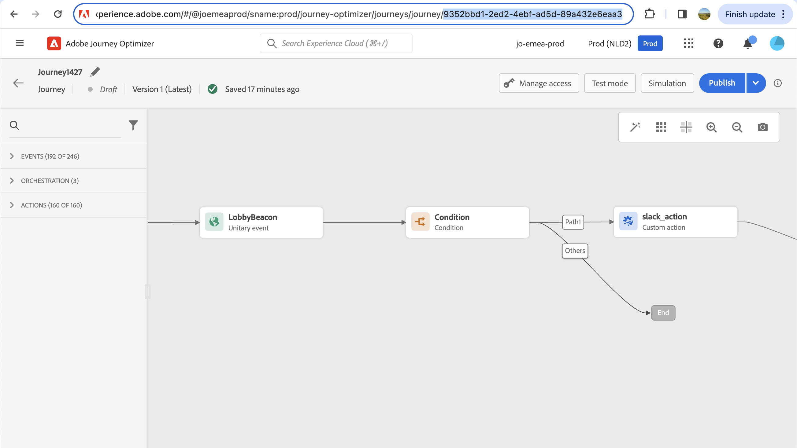

# Configurare le impostazioni e-mail {#email-settings}

Definisci le impostazioni e-mail nella sezione dedicata della configurazione del predefinito del messaggio. Scopri come creare i predefiniti per i messaggi in [questa sezione](message-presets.md).


## Tipo di e-mail {#email-type}

>[!CONTEXTUALHELP]
>id="ajo_admin_presets_emailtype"
>title="Definire la categoria e-mail"
>abstract="Seleziona il tipo di messaggi che verranno inviati quando utilizzi questo predefinito: Marketing per i messaggi promozionali, che richiedono il consenso dell’utente, o transazionali per i messaggi non commerciali, che possono anche essere inviati a profili non abbonati in contesti specifici."

In **TIPO E-MAIL** seleziona il tipo di messaggio da inviare con il predefinito: **Marketing** o **Transazionale**.

* Scegli **Marketing** per messaggi promozionali: questi messaggi richiedono il consenso dell’utente.

* Scegli **Transazionale** per messaggi non commerciali, ad esempio conferma dell’ordine, notifiche di reimpostazione della password o informazioni di consegna.

>[!CAUTION]
>
>**Transazionale** I messaggi possono essere inviati a profili che hanno annullato l’abbonamento a comunicazioni di marketing. Questi messaggi possono essere inviati solo in contesti specifici.

Quando [creazione di un messaggio](../messages/get-started-content.md#create-new-message), devi scegliere un predefinito di messaggio valido corrispondente alla categoria selezionata per il messaggio.

## Sottodominio e pool IP {#subdomains-and-ip-pools}

In **DETTAGLI DEL SOTTODOMINIO E DEL POOL IP** sezione , devi:

1. Seleziona il sottodominio da utilizzare per inviare le e-mail. [Ulteriori informazioni](about-subdomain-delegation.md)

1. Seleziona il pool IP da associare al predefinito. [Ulteriori informazioni](ip-pools.md)


Impossibile procedere con la creazione dei predefiniti mentre il pool IP selezionato è in [edizione](ip-pools.md#edit-ip-pool) (**[!UICONTROL Processing]** e non è mai stato associato al sottodominio selezionato. In caso contrario, verrà comunque utilizzata la versione più vecchia dell’associazione pool/sottodominio IP. In questo caso, salva il predefinito come bozza e riprova una volta che il pool IP dispone del **[!UICONTROL Success]** stato.

>[!NOTE]
>
>Per gli ambienti non di produzione, Adobe non crea sottodomini di test preconfigurati né concede l’accesso a un pool IP di invio condiviso. Devi [delegare i tuoi sottodomini](delegate-subdomain.md) e utilizza gli IP del pool assegnato alla tua organizzazione.

## Annulla sottoscrizione elenco {#list-unsubscribe}

Su [selezione di un sottodominio](#subdomains-and-ip-pools) dall&#39;elenco, **[!UICONTROL Enable List-Unsubscribe]** viene visualizzata l&#39;opzione .


Questa opzione è attivata per impostazione predefinita.

Se lo lasci abilitato, nell’intestazione dell’e-mail verrà automaticamente incluso un collegamento per l’annullamento dell’abbonamento, ad esempio:


Se disattivi questa opzione, nell’intestazione dell’e-mail non verrà visualizzato alcun collegamento di annullamento all’abbonamento.

Il collegamento per l’annullamento dell’abbonamento è costituito da due elementi:

* Un **cancella indirizzo e-mail**, a cui vengono inviate tutte le richieste di annullamento dell’abbonamento.

   In [!DNL Journey Optimizer], l’indirizzo e-mail per l’annullamento dell’abbonamento è quello predefinito **[!UICONTROL Mailto (unsubscribe)]** l&#39;indirizzo visualizzato nel predefinito del messaggio, in base al [sottodominio selezionato](#subdomains-and-ip-pools).

   

* La **annulla sottoscrizione URL**, URL della pagina di destinazione in cui l’utente verrà reindirizzato una volta annullato l’abbonamento.

   Se aggiungi una [collegamento di rinuncia con un clic](../messages/consent.md#one-click-opt-out) per un messaggio creato utilizzando questo predefinito, l’URL di annullamento della sottoscrizione sarà l’URL definito per il collegamento di rinuncia con un solo clic.

   

   >[!NOTE]
   >
   >Se non aggiungi un collegamento di rinuncia con un solo clic al contenuto del messaggio, all’utente non verrà visualizzata alcuna pagina di destinazione.

Ulteriori informazioni sull’aggiunta di un collegamento di annullamento dell’abbonamento dell’intestazione ai messaggi in [questa sezione](../messages/consent.md#unsubscribe-header).

<!--Select the **[!UICONTROL Custom List-Unsubscribe]** option to enter your own Unsubscribe URL and/or your own Unsubscribe email address.(to add later)-->

## Parametri di intestazione{#email-header}

In **[!UICONTROL HEADER PARAMETERS]** , inserisci i nomi del mittente e gli indirizzi e-mail associati al tipo di messaggi inviati utilizzando tale predefinito.

>[!CAUTION]
>
>Gli indirizzi e-mail devono utilizzare il [sottodominio delegato](about-subdomain-delegation.md).

* **[!UICONTROL Sender name]**: Nome del mittente, ad esempio il nome del brand.

* **[!UICONTROL Sender email]**: L&#39;indirizzo e-mail che desideri utilizzare per le tue comunicazioni. Ad esempio, se il sottodominio delegato è *marketing.luma.com*, puoi utilizzare *contact@marketing.luma.com*.

* **[!UICONTROL Reply to (name)]**: Nome che verrà utilizzato quando il destinatario fa clic sul pulsante **Rispondi** nel loro software client e-mail.

* **[!UICONTROL Reply to (email)]**: L’indirizzo e-mail che verrà utilizzato quando il destinatario fa clic sul pulsante **Rispondi** nel loro software client e-mail. È necessario utilizzare un indirizzo definito nel sottodominio delegato (ad esempio, *reply@marketing.luma.com*), altrimenti le e-mail verranno eliminate.

* **[!UICONTROL Error email]**: Tutti gli errori generati dagli ISP dopo alcuni giorni di consegna della posta (mancati recapiti asincroni) vengono ricevuti su questo indirizzo.


>[!NOTE]
>
>Gli indirizzi devono iniziare con una lettera (A-Z) e possono contenere solo caratteri alfanumerici. È inoltre possibile utilizzare il carattere di sottolineatura `_`, punto`.` e trattino `-` caratteri.

### Invia e-mail {#forward-email}

Se desideri inoltrare a un indirizzo e-mail specifico tutte le e-mail ricevute da [!DNL Journey Optimizer] per il sottodominio delegato, contatta l’Assistenza clienti Adobe. Dovrai fornire:

* Indirizzo e-mail di tua scelta. Il dominio dell’indirizzo e-mail di inoltro non può corrispondere ad alcun sottodominio delegato ad Adobe.
* Il nome della sandbox.
* Nome predefinito per il quale verrà utilizzato l’indirizzo e-mail successivo (o &quot;risposta a&quot;).
* La corrente **[!UICONTROL Reply to (email)]** indirizzo impostato a livello di predefinito.

>[!NOTE]
>
>Può essere presente un solo indirizzo e-mail per sottodominio. Di conseguenza, se più predefiniti utilizzano lo stesso sottodominio, lo stesso indirizzo e-mail deve essere utilizzato per tutti.

L’indirizzo e-mail successivo verrà impostato per Adobe. Questo può richiedere da 3 a 4 giorni.

## E-mail CCN {#bcc-email}

>[!CONTEXTUALHELP]
>id="ajo_admin_preset_bcc"
>title="Definire un indirizzo e-mail CCN"
>abstract="Puoi conservare una copia delle e-mail inviate inviandole a una casella in entrata CCN. Inserisci l’indirizzo e-mail desiderato in modo che ogni e-mail inviata venga copiata in modalità cieca in questo indirizzo CCN. Questa funzione è facoltativa."

Puoi inviare una copia identica (o copia cieca in carbonio) di un’e-mail inviata da [!DNL Journey Optimizer] a una casella in entrata CCN. Questa funzione opzionale ti consente di conservare copie delle comunicazioni e-mail inviate agli utenti per scopi di conformità e/o archiviazione. Questo sarà invisibile ai destinatari della consegna.

>[!CAUTION]
>
>Questa funzionalità sarà disponibile a partire da **31 maggio**.

### Abilita e-mail CCN {#enable-bcc}

Per abilitare **[!UICONTROL BCC email]** inserisci l’indirizzo e-mail desiderato nel campo dedicato. Puoi specificare qualsiasi indirizzo esterno nel formato corretto, ad eccezione di un indirizzo e-mail definito nel sottodominio delegato. Ad esempio, se il sottodominio delegato è *marketing.luma.com*, qualsiasi indirizzo come *abc@marketing.luma.com* è vietato.

>[!NOTE]
>
>Puoi definire un solo indirizzo e-mail CCN. Assicurati che l’indirizzo CCN abbia una capacità di ricezione sufficiente per memorizzare tutte le e-mail inviate utilizzando il predefinito corrente.
>
>Ulteriori raccomandazioni sono elencate in [questa sezione](#bcc-recommendations-limitations).


Tutti i messaggi e-mail che utilizzano questo predefinito verranno copiati in modalità cieca nell’indirizzo e-mail CCN inserito. Da lì, possono essere elaborati e archiviati utilizzando un sistema esterno.

>[!CAUTION]
>
>L’utilizzo delle funzioni CCN verrà conteggiato in base al numero di messaggi per i quali si dispone della licenza. Quindi, abilitalo solo nei predefiniti utilizzati per le comunicazioni critiche che desideri archiviare. Controlla il tuo contratto per i volumi con licenza.

L’impostazione dell’indirizzo e-mail CCN viene immediatamente salvata ed elaborata a livello di predefinito. Quando [creare un nuovo messaggio](../messages/get-started-content.md#create-new-message) utilizzando questo predefinito, l’indirizzo e-mail CCN viene visualizzato automaticamente.


Tuttavia, l’indirizzo CCN viene selezionato per l’invio di comunicazioni secondo la logica seguente:

* Per i percorsi batch e burst, non si applica all&#39;esecuzione batch o burst che era già iniziato prima dell&#39;impostazione CCN. La modifica verrà rilevata alla ricorrenza successiva o alla nuova esecuzione.

* Per i messaggi transazionali, la modifica viene selezionata immediatamente per la comunicazione successiva (fino a un minuto di ritardo).

>[!NOTE]
>
>Non è necessario ripubblicare un messaggio o un percorso per selezionare l’impostazione CCN.

### Recommendations e limitazioni {#bcc-recommendations-limitations}

* Per garantire la conformità ai requisiti di privacy, le e-mail CCN devono essere elaborate da un sistema di archiviazione in grado di memorizzare informazioni personali (PII) sicure.

* Poiché i messaggi possono contenere dati riservati o privati, ad esempio informazioni personali identificabili (PII), assicurati che l’indirizzo CCN sia corretto e proteggi l’accesso ai messaggi.

* La casella in entrata utilizzata per CCN deve essere gestita correttamente per lo spazio e la consegna. Se la casella in entrata restituisce messaggi non recapitati, è possibile che alcune e-mail non vengano ricevute e quindi che non vengano archiviate.

* I messaggi possono essere inviati all’indirizzo e-mail CCN prima dei destinatari. I messaggi CCN possono anche essere inviati anche se i messaggi originali possono avere [rimbalzato](../reports/suppression-list.md#delivery-failures).

   <!--OR: Only successfully sent emails are taken in account. [Bounces](../reports/suppression-list.md#delivery-failures) are not. TO CHECK -->

* Non aprire o fare clic sulle e-mail inviate all’indirizzo CCN in quanto vengono prese in considerazione nelle aperture totali e nei clic dall’analisi di invio, il che potrebbe causare alcuni calcoli errati in [rapporti](../reports/message-monitoring.md).

* Non contrassegnare i messaggi come spam nella casella in entrata CCN, in quanto avranno effetto su tutte le altre e-mail inviate a questo indirizzo.


>[!CAUTION]
>
>Non fare clic sul collegamento di annullamento dell’abbonamento nelle e-mail inviate all’indirizzo CCN, in quanto cancellerai immediatamente l’abbonamento ai destinatari corrispondenti.

### Conformità ai requisiti RGPD {#gdpr-compliance}

Regolamenti come il RGPD stabiliscono che gli interessati devono poter modificare il loro consenso in qualsiasi momento. Poiché le e-mail CCN che invii con Journey Optimizer includono informazioni personali (PII, Security Personally Identifiable Information), devi modificare il **[!UICONTROL CJM Email BCC Feedback Event Schema]** essere in grado di gestire questi PII in conformità con il RGPD e con normative simili.

Per farlo, segui la procedura indicata di seguito.

1. Vai a **[!UICONTROL Data management]** > **[!UICONTROL Schemas]** > **[!UICONTROL Browse]** e seleziona **[!UICONTROL CJM Email BCC Feedback Event Schema]**.

   

1. Fare clic per espandere **[!UICONTROL _experience]**, **[!UICONTROL customerJourneyManagment]** then **[!UICONTROL secondaryRecipientDetail]**.

1. Seleziona **[!UICONTROL originalRecipientAddress]**.

1. In **[!UICONTROL Field properties]** a destra, scorri verso il basso fino al **[!UICONTROL Identity]** casella di controllo.

1. Selezionalo e seleziona anche **[!UICONTROL Primary identity]**.

1. Seleziona uno spazio dei nomi dall’elenco a discesa.

   

1. Fai clic su **[!UICONTROL Apply]**.

>[!NOTE]
>
>Per ulteriori informazioni sulla gestione della privacy e sulle normative applicabili, consulta la [documentazione di Experience Platform](https://experienceleague.adobe.com/docs/experience-platform/privacy/home.html?lang=it){target=&quot;_blank&quot;}.

### Dati di reporting per CCN {#bcc-reporting}

La generazione di rapporti in quanto tale su CCN non è disponibile nei rapporti sul percorso e sui messaggi. Tuttavia, le informazioni vengono memorizzate in un set di dati di sistema denominato **[!UICONTROL AJO BCC Feedback Event Dataset]**. È possibile eseguire query su questo set di dati per trovare informazioni utili, ad esempio, a scopo di debug.

Puoi accedere a questo set di dati tramite l’interfaccia utente di . Seleziona **[!UICONTROL Data management]** > **[!UICONTROL Datasets]** > **[!UICONTROL Browse]** e **[!UICONTROL Show system datasets]** attiva/disattiva il filtro per visualizzare i set di dati generati dal sistema. Ulteriori informazioni su come accedere ai set di dati in [questa sezione](../start/get-started-datasets.md#access-datasets).


Per eseguire query su questo set di dati, puoi utilizzare l’Editor query fornito da [Servizio query Adobe Experience Platform](https://experienceleague.adobe.com/docs/experience-platform/query/api/getting-started.html){target=&quot;_blank&quot;}. Per accedervi, seleziona **[!UICONTROL Data management]** > **[!UICONTROL Queries]** e fai clic su **[!UICONTROL Create query]**. [Ulteriori informazioni](../start/get-started-queries.md)


A seconda delle informazioni che stai cercando, puoi eseguire le seguenti query.

1. Per tutte le altre query riportate di seguito, è necessario l’ID azione percorso. Esegui questa query per recuperare tutti gli ID azione associati a un particolare ID di versione del percorso negli ultimi 2 giorni:

       &quot;
       SELEZIONA
       DISTINTO
       CAST(TIMESTAMP AS DATE) AS EventTime,
       _experience.journeyOrchestration.stepEvents.journeyVersionID,
       _experience.journeyOrchestration.stepEvents.actionName,
       _experience.journeyOrchestration.stepEvents.actionID
       FROM percorso_step_events
       DOVE
       _experience.journeyOrchestration.stepEvents.journeyVersionID = &#39;&lt;journey version=&quot;&quot; id=&quot;&quot;>&#39; E
       _experience.journeyOrchestration.stepEvents.actionID non è NULL AND
       TIMESTAMP > NOW() - INTERVALLO &#39;2&#39; GIORNO
       ORDER BY EventTime DESC;
       &quot;
   
   >[!NOTE]
   >
   >Per ottenere `<journey version id>`, seleziona il corrispondente [Versione percorso](../building-journeys/journey-versions.md) dal **[!UICONTROL Journey management]** > **[!UICONTROL Journeys]** menu. L’ID della versione del percorso viene visualizzato alla fine dell’URL visualizzato nel browser web.
   >
   >

1. Esegui questa query per recuperare tutti gli eventi di feedback dei messaggi (in particolare lo stato di feedback) generati per un particolare messaggio destinato a un utente specifico negli ultimi 2 giorni:

       &quot;
       SELEZIONA
       _experience.customerJourneyManagement.messageExecution.journeyVersionID AS JourneyVersionID,
       _experience.customerJourneyManagement.messageExecution.journeyActionID AS JourneyActionID,
       timestamp AS EventTime,
       _experience.customerJourneyManagement.emailChannelContext.address AS RecipientAddress,
       _experience.customervarineymanagement.messagedeliveryfeedback.feedbackStatus AS FeedbackStatus,
       CASE _experience.customervarineymanagement.messagedeliveryfeedback.feedbackStatus
       QUANDO &#39;inviato&#39; ALLORA &#39;Inviato&#39;
       QUANDO &#39;delay&#39; ALLORA &#39;Retry&#39;
       QUANDO &#39;out_of_band&#39; THEN &#39;Bounce&#39;
       QUANDO &#39;rimbalzo&#39; ALLORA &#39;rimbalzo&#39;
       END AS FeedbackStatusCategory
       FROM cjm_message_feedback_event_dataset
       DOVE
       timestamp > now() - INTERVAL &#39;2&#39; day AND
       _experience.customerJourneyManagement.messageExecution.journeyVersionID = &#39;&lt;journey version=&quot;&quot; id=&quot;&quot;>&#39; E
       _experience.customerJourneyManagement.messageExecution.journeyActionID = &#39;&lt;journey action=&quot;&quot; id=&quot;&quot;>&#39; E
       _experience.customerJourneyManagement.emailChannelContext.address = &#39;&lt;recipient email=&quot;&quot; address=&quot;&quot;>&#39;
       ORDER BY EventTime DESC;
       &quot;
   
   >[!NOTE]
   >
   >Per ottenere `<journey action id>` , esegui la prima query descritta sopra utilizzando l&#39;ID versione percorso. La `<recipient email address>` è l&#39;indirizzo e-mail del destinatario di destinazione o effettivo.

1. Esegui questa query per recuperare tutti gli eventi di feedback dei messaggi CCN generati per un particolare messaggio destinato a un utente specifico negli ultimi 2 giorni:

   ```
   SELECT   
   _experience.customerJourneyManagement.messageExecution.journeyVersionID AS JourneyVersionID, 
   _experience.customerJourneyManagement.messageExecution.journeyActionID AS JourneyActionID, 
   _experience.customerJourneyManagement.emailChannelContext.address AS BccEmailAddress,
   timestamp AS EventTime, 
   _experience.customerJourneyManagement.secondaryRecipientDetail.originalRecipientAddress AS RecipientAddress, 
   _experience.customerjourneymanagement.messagedeliveryfeedback.feedbackStatus AS FeedbackStatus,
   CASE _experience.customerjourneymanagement.messagedeliveryfeedback.feedbackStatus
               WHEN 'sent' THEN 'Sent'
               WHEN 'delay' THEN 'Retry'
               WHEN 'out_of_band' THEN 'Bounce' 
               WHEN 'bounce' THEN 'Bounce'
           END AS FeedbackStatusCategory 
   FROM ajo_bcc_feedback_event_dataset  
   WHERE  
   timestamp > now() - INTERVAL '2' day  AND
   _experience.customerJourneyManagement.messageExecution.journeyVersionID = '<journey version id>' AND 
   _experience.customerJourneyManagement.messageExecution.journeyActionID = '<journeyaction id>' AND 
   _experience.customerJourneyManagement.secondaryRecipientDetail.originalRecipientAddress = '<recipient email address>'
   ORDER BY EventTime DESC;
   ```

1. Esegui questa query per recuperare tutti gli indirizzi dei destinatari che non hanno ricevuto il messaggio, mentre la relativa voce CCN esiste negli ultimi 30 giorni:

   ```
   SELECT
       DISTINCT 
   bcc._experience.customerJourneyManagement.secondaryRecipientDetail.originalRecipientAddress AS RecipientAddressesNotRecievedMessage
   FROM ajo_bcc_feedback_event_dataset bcc
   LEFT JOIN cjm_message_feedback_event_dataset mfe
   ON 
   bcc._experience.customerJourneyManagement.messageExecution.journeyVersionID =
           mfe._experience.customerJourneyManagement.messageExecution.journeyVersionID AND    bcc._experience.customerJourneyManagement.messageExecution.journeyActionID = mfe._experience.customerJourneyManagement.messageExecution.journeyActionID AND 
   bcc._experience.customerJourneyManagement.secondaryRecipientDetail.originalRecipientAddress = mfe._experience.customerJourneyManagement.emailChannelContext.address AND
   mfe._experience.customerJourneyManagement.messageExecution.journeyVersionID = '<journey version id>' AND 
   mfe._experience.customerJourneyManagement.messageExecution.journeyActionID = '<journey action id>' AND
   mfe.timestamp > now() - INTERVAL '30' DAY AND
   mfe._experience.customerjourneymanagement.messagedeliveryfeedback.feedbackstatus IN ('bounce', 'out_of_band') 
   WHERE bcc.timestamp > now() - INTERVAL '30' DAY;
   ```

## Parametri di esecuzione di un nuovo tentativo e-mail {#email-retry}

>[!CONTEXTUALHELP]
>id="ajo_admin_presets_retryperiod"
>title="Regolare il periodo di tempo per l’esecuzione dei nuovi tentativi"
>abstract="I tentativi vengono eseguiti per 3,5 giorni (84 ore) quando un messaggio e-mail non riesce a causa di un errore temporaneo di messaggio non recapitato. È possibile regolare questo periodo di tempo predefinito per l&#39;esecuzione di un nuovo tentativo in base alle proprie esigenze."
>additional-url="https://experienceleague.adobe.com/docs/journey-optimizer/using/configuration/configuration-message/email-configuration/monitor-reputation/retries.html" text="Informazioni sui nuovi tentativi"

Puoi configurare le **Parametri di esecuzione di un nuovo tentativo e-mail**.


Per impostazione predefinita, la [periodo di tempo di nuovo](retries.md#retry-duration) è impostato su 84 ore, ma è possibile regolare questa impostazione in base alle proprie esigenze.

È necessario immettere un valore intero (in ore o minuti) entro il seguente intervallo:

* Per le e-mail di marketing, il periodo minimo di esecuzione dei nuovi tentativi è di 6 ore.
* Per le e-mail transazionali, il periodo minimo di esecuzione dei tentativi è di 10 minuti.
* Per entrambi i tipi di e-mail, il periodo massimo di esecuzione dei nuovi tentativi è di 84 ore (o 5040 minuti).

Ulteriori informazioni sui nuovi tentativi in [questa sezione](retries.md).

## Tracciamento URL {#url-tracking}

>[!CONTEXTUALHELP]
>id="ajo_admin_preset_utm"
>title="Parametri di tracciamento URL"
>abstract="Usa questa sezione per aggiungere automaticamente i parametri di tracciamento agli URL della campagna presenti nel contenuto dell’e-mail."

È possibile utilizzare **[!UICONTROL URL Tracking Parameters]** per misurare l’efficacia delle attività di marketing su tutti i canali. Questa funzione è facoltativa.

I parametri definiti in questa sezione verranno aggiunti alla fine degli URL inclusi nel contenuto del messaggio e-mail. Puoi quindi acquisire questi parametri in strumenti di analisi web come Adobe Analytics o Google Analytics e creare vari rapporti sulle prestazioni.


Tre parametri di tracciamento URL vengono compilati automaticamente come esempio quando crei un predefinito per messaggi. Puoi modificarli e aggiungere fino a 10 parametri di tracciamento utilizzando **[!UICONTROL Add new parameter]** pulsante .

Per configurare un parametro di tracciamento URL, puoi immettere direttamente i valori desiderati nel **[!UICONTROL Name]** e **[!UICONTROL Value]** oppure scegliere da un elenco di valori predefiniti passando ai seguenti oggetti:

* Attributi del percorso: **ID sorgente**, **Nome origine**, **ID versione sorgente**
* Attributi azione: **ID azione**, **Nome azione**
* Attributi di Offer decisioning: **ID offerta**, **Nome offerta**


>[!CAUTION]
>
>Non selezionare una cartella: assicurati di passare alla cartella necessaria e seleziona un attributo di profilo da utilizzare come valore del parametro di tracciamento.

Di seguito sono riportati alcuni esempi di URL compatibili con Adobe Analytics e Google Analytics.

* URL compatibile con Adobe Analytics: `www.YourLandingURL.com?cid=email_AJO_{{context.system.source.id}}_image_{{context.system.source.name}}`

* Google Analytics URL compatibile: `www.YourLandingURL.com?utm_medium=email&utm_source=AJO&utm_campaign={{context.system.source.id}}&utm_content=image`

>[!NOTE]
>
>È possibile combinare la digitazione di valori di testo e la selezione di valori predefiniti. Ogni **[!UICONTROL Value]** Il campo può contenere fino a 255 caratteri in totale.
