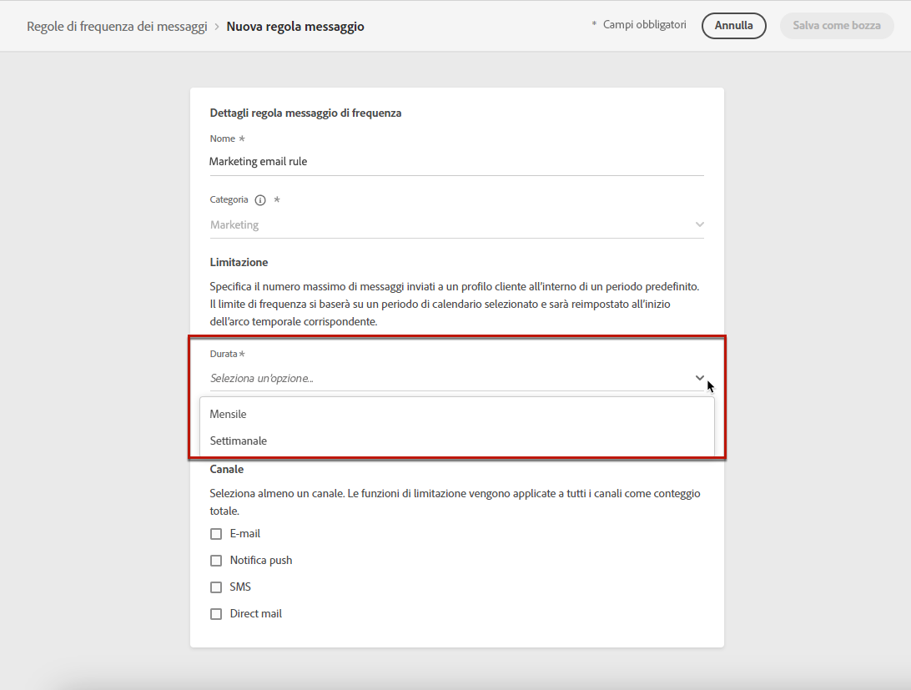

# Regole aziendali {#frequency-rules}

>[!CONTEXTUALHELP]
>id="ajo_business_rules_message_frequency_rules"
>title="Regole aziendali"
>abstract="Le regole di frequenza dei messaggi sono un tipo di regola business che limita il numero di volte in cui gli utenti ricevono messaggi o immettono in percorsi su uno o più canali. Queste regole cross-channel escludono automaticamente i profili sollecitati eccessivamente da messaggi e azioni."

[!DNL Journey Optimizer] consente di controllare la frequenza con cui gli utenti riceveranno un messaggio o entreranno in un percorso attraverso uno o più canali. Regole di frequenza dei messaggi che escludono automaticamente i profili sollecitati eccessivamente da messaggi e azioni.

Ad esempio, per un brand, una regola potrebbe essere di non inviare più di 4 messaggi di marketing al mese alla clientela. A questo scopo, puoi utilizzare una regola business che limiterà il numero di messaggi inviati in base a uno o più canali durante un periodo di calendario mensile.

>[!NOTE]
>
>Le regole aziendali sono diverse dalla gestione delle rinunce, che consente agli utenti di annullare l’abbonamento alla ricezione di comunicazioni da un marchio. [Ulteriori informazioni](../privacy/opt-out.md#opt-out-management)

➡️ [Scopri questa funzione nel video](#video)

## Accedere alle regole business {#access-rules}

Le regole business sono disponibili nella sezione **[!UICONTROL Amministrazione]** > **[!UICONTROL Regole aziendali]** menu. Vengono elencate tutte le regole, ordinate per data di modifica. Utilizza l’icona del filtro per filtrare in base alla categoria, allo stato e/o al canale. Puoi anche eseguire ricerche sull’etichetta del messaggio.

### Autorizzazioni{#permissions-frequency-rules}

Per accedere, creare, modificare o eliminare le regole business, è necessario disporre del **[!UICONTROL Gestire le regole di frequenza]** autorizzazione.

Chi possiede l’autorizzazione per **[!UICONTROL Visualizzare le regole di frequenza]**, può visualizzare le regole, ma non modificarle o eliminarle.

Ulteriori informazioni sulle autorizzazioni sono disponibili in [questa sezione](../administration/high-low-permissions.md).

## Creare una regola business {#create-new-rule}

>[!CONTEXTUALHELP]
>id="ajo_rules_category"
>title="Seleziona la categoria della regola del messaggio"
>abstract="Quando vengono attivate e applicate a un messaggio, tutte le regole business che corrispondono alla categoria selezionata verranno applicate automaticamente a questo messaggio. Attualmente è disponibile solo la categoria Marketing."

>[!CONTEXTUALHELP]
>id="ajo_rules_capping"
>title="Impostare il limite per la regola business"
>abstract="Specifica il numero massimo di messaggi inviati a un profilo cliente nell’arco temporale definito. La quota limite si baserà sul periodo di calendario selezionato e verrà reimpostata all’inizio dell’arco temporale corrispondente."

>[!CONTEXTUALHELP]
>id="ajo_rules_channel"
>title="Definire i canali a cui si applica la regola business"
>abstract="Seleziona almeno un canale. Le funzioni di limitazione vengono applicate a tutti i canali come conteggio totale."

Per creare una nuova regola business, attenersi alla procedura descritta di seguito.

1. Accedere a **[!UICONTROL Regole aziendali]** , quindi fai clic su **[!UICONTROL Crea regola]**.

   

1. Definisci il nome della regola e seleziona la categoria della regola del messaggio.

   >[!NOTE]
   >
   >È disponibile solo la categoria **[!UICONTROL Marketing]**.

   

1. Dall’elenco a discesa **[!UICONTROL Durata]**, seleziona un arco temporale in cui applicare la limitazione. [Ulteriori informazioni](#frequency-cap)

1. Imposta il limite per la regola, ovvero il numero massimo di messaggi che possono essere inviati a un singolo profilo utente ogni mese o settimana <!--or day-->, in base alla selezione precedente.

   <!---->

1. Seleziona il canale da utilizzare per questa regola: **[!UICONTROL E-mail]**, **[!UICONTROL Notifica push]**, **[!UICONTROL SMS]** o **[!UICONTROL Direct mail]**.

   

   >[!NOTE]
   >
   >Per poter creare il messaggio, devi selezionare almeno un canale.

1. Se desideri applicare il limite come conteggio totale su tutti i canali selezionati, seleziona diversi canali.

   Ad esempio, imposta il limite su 15 e seleziona sia il canale e-mail che quello push. Se un profilo ha già ricevuto 10 e-mail marketing e 5 notifiche push di marketing nel periodo selezionato, verrà escluso dalla consegna successiva di eventuali e-mail marketing o notifiche push.

1. Fai clic su **[!UICONTROL Salva come bozza]** per confermare la creazione della regola. Il messaggio viene aggiunto all’elenco dei messaggi nello stato **[!UICONTROL Bozza]**.

   

### Quota limite {#frequency-cap}

Dall’elenco a discesa **[!UICONTROL Durata]**, seleziona se desideri che il limite venga applicato su base mensile o settimanale.

>[!NOTE]
>
>Su richiesta, è disponibile anche l’opzione di durata giornaliera. [Ulteriori informazioni](#daily-frequency-cap)

La quota limite si basa sul periodo di calendario selezionato. Viene reimpostato all’inizio dell’arco temporale corrispondente.

La scadenza del contatore per ciascun periodo è la seguente:

* **[!UICONTROL Mensile]**: la quota limite è valida fino all’ultimo giorno del mese alle 23:59:59 UTC. Ad esempio, la scadenza mensile di gennaio è il 31/01 alle 23:59:59 UTC.

* **[!UICONTROL Settimanale]**: la quota limite è valida fino alle 23:59:59 UTC del sabato di tale settimana, poiché la settimana di calendario inizia la domenica. La scadenza è indipendente dalla creazione della regola. Ad esempio, se la regola viene creata il giovedì, è valida fino a sabato alle 23:59:59.

### Quota limite giornaliera {#daily-frequency-cap}

Oltre alle opzioni Mensile e Settimanale, su richiesta è anche disponibile l’opzione Giornaliera. Per ulteriori informazioni, contatta il tuo rappresentante Adobe.

La quota limite giornaliera è valido per il giorno corrente fino alle 23:59:59 UTC e viene reimpostata su 0 all’inizio del giorno successivo.

>[!NOTE]
>
>Per garantire l’accuratezza delle regole relative ai limiti di frequenza giornalieri, è consigliato l’uso di [segmentazione in streaming](https://experienceleague.adobe.com/docs/experience-platform/segmentation/ui/streaming-segmentation.html?lang=it){target="_blank"}. Ulteriori informazioni sui metodi di valutazione del pubblico sono disponibili in [questa sezione](../audience/about-audiences.md#evaluation-method-in-journey-optimizer).

## Attivare una regola business {#activate-rule}

Una volta creata, una regola business ha **[!UICONTROL Bozza]** e non influisce ancora su alcun messaggio. Per abilitarla, fai clic sui puntini di sospensione accanto alla regola e seleziona **[!UICONTROL Attiva]**.

L’attivazione di una regola influisce su tutti i messaggi a cui si applica nella successiva esecuzione. Scopri come [applicare una regola business a un messaggio](#apply-frequency-rule).

>[!NOTE]
>
>La completa attivazione di una regola può richiedere fino a 10 minuti. Non è necessario modificare i messaggi o ripubblicare i percorsi per rendere effettiva una regola.

Per disattivare una regola business, fare clic sui puntini di sospensione accanto alla regola e selezionare **[!UICONTROL Disattiva]**.

Lo stato della regola verrà modificato in **[!UICONTROL Inattivo]** e la regola non si applicherà alle esecuzioni future dei messaggi. Eventuali messaggi attualmente in esecuzione non saranno interessati.

>[!NOTE]
>
>La disattivazione di una regola non influisce né reimposta i conteggi sui singoli profili.

## Applicare una regola business a un messaggio {#apply-frequency-rule}

Per applicare una regola business a un messaggio, attieniti alla procedura seguente.

1. Durante la creazione di un [percorso](../building-journeys/journey-gs.md), aggiungi un messaggio selezionando uno dei canali definiti per la regola.

1. Seleziona la categoria definita per la [regola creata](#create-new-rule).

   

   >[!NOTE]
   >
   >Attualmente solo il **[!UICONTROL Marketing]** La categoria è disponibile per le regole business.

1. Puoi fare clic sul collegamento **[!UICONTROL Regola di frequenza]** per visualizzare la schermata delle regole di frequenza in una nuova scheda. [Ulteriori informazioni](#access-rules)

   Tutte le regole che corrispondono alla categoria e ai canali selezionati verranno applicate automaticamente a questo messaggio.

   >[!NOTE]
   >
   >I messaggi in cui è selezionata la categoria **[!UICONTROL Transazionale]** non verranno valutati in base alle regole di frequenza.

1. Puoi visualizzare il numero di profili esclusi dalla consegna in [Rapporto globale](../reports/global-report.md), e nella [Rapporto live](../reports/live-report.md), in cui le regole business verranno elencate come possibile motivo per l’esclusione degli utenti dalla consegna.

>[!NOTE]
>
>Puoi applicare diverse regole allo stesso canale, ma una volta raggiunto il limite inferiore, il profilo verrà escluso dalle consegne successive.

## Esempio: combinare più regole {#frequency-rule-example}

Puoi combinare diverse regole aziendali, come descritto nell’esempio seguente.

1. [Creare una regola business](#create-new-rule) ha chiamato *Limiti di marketing complessivi*:

   * Seleziona tutti i canali.
   * Imposta il limite su 12 al mese.

   

1. Per limitare ulteriormente il numero di notifiche push basate sul marketing inviate a un utente, crea una seconda regola denominata *Limite marketing push*:

   * Seleziona Canale push.
   * Imposta il limite su 4 al mese.

   

1. Salva e [attiva](#activate-rule) la regola.

1. [Crea un messaggio](../building-journeys/journeys-message.md) per ogni canale attraverso cui desideri comunicare e seleziona la categoria **[!UICONTROL Marketing]** per ogni messaggio. [Scopri come applicare una regola di business](#apply-frequency-rule)

   

<!--
Learn how to create a message for the different channels in the following sections:
* [Create an email](../email/create-email.md)
* [Create a push notification](../push/create-push.md)
* [Create an SMS](../sms/create-sms.md)
* [Create a direct mail](../direct-mail/create-direct-mail.md)

Create an email and select the **[!UICONTROL Marketing]** category for that message. [Learn more](../email/create-email.md)

Create a push notification and select the **[!UICONTROL Marketing]** category for that message. [Learn more](../push/create-push.md)

Create an SMS and select the **[!UICONTROL Marketing]** category for that message. [Learn more](../sms/create-sms.md)

Create a direct mail and select the **[!UICONTROL Marketing]** category for that message. [Learn more](../direct-mail/create-direct-mail.md)
-->

In questo scenario, un singolo profilo:
* può ricevere fino a 12 messaggi di marketing al mese;
* ma sarà escluso dalle notifiche push di marketing dopo averne ricevute 4.

>[!NOTE]
>
>Durante il test delle regole business, si consiglia di utilizzare una [profilo di test](../audience/creating-test-profiles.md), poiché una volta raggiunto il limite di frequenza di un profilo, non è possibile reimpostare il contatore fino al mese successivo. La disattivazione di una regola consente ai profili con limiti di ricevere messaggi, ma non rimuove o elimina eventuali incrementi del contatore.

## Video introduttivo {#video}

Scopri come creare, attivare, testare e creare rapporti sulle regole business.

>[!VIDEO](https://video.tv.adobe.com/v/344451?quality=12)
